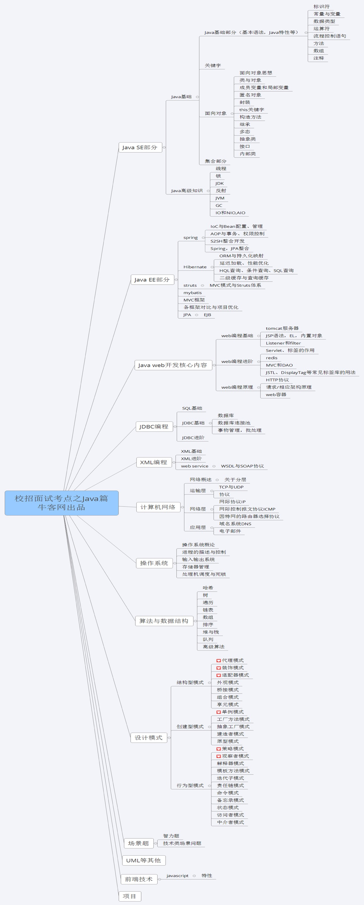
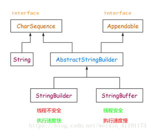

# java面试结构

# 1.为什么重写equals还要重写hashcode
```java
public native int hashcode();
public boolean equals(Object paramObject){
    return (this == paramObject);
}   
```
Object默认的equals方法就是比较这俩个对象的内存地址。   
Object的hashcode是本地方法，也就是用c语言或c++实现的，该方法直接返回对象的内存地址。   
hashcode是根据对象的内存地址经哈希算法得来的,不同的对象可能有相同的hashcode值。   
如果equals相同，则说明对象内存地址相同，则hashcode。一定相同。   
相反，如果hashcode相同，Object内存地址不一定相同。   
总结：   
俩个对象相等，hashcode一定相等。   
俩个对象不相等，hashcode可能相等。   
hashcode相等，俩个对象不一定相等。   
hashcode不相等，俩个对象一定不等。   
# 2.说一下map的分类和常见的情况
java为数据结构找那个的映射定义了一个接口，java.util.Map.   它有4个实现类：HashMap，Hashtable，LinkedHashMap和TreeMap。   
Map主要用于存储键值对，根据键得到值，因此不允许键重复(如果重复就覆盖),但允许值重复。   
Hashmap是一个最常用的Map，他根据键的HashCode值存储数据，根据键可以直接获取数据，访问速度快，遍历时，取的的数据的顺序是随机的。HashMap最多只允许一条记录的键为null。HashMap不支持线程的同步，如果需要同步，可以用Collection的synchronizedMap方法使HashMap具有同步的能力，或者使用ConcurrentHashMap。   
Hashtable继承自Dictionary类，它不允许记录的键或者值为null，它支持线程的同步。这导致Hashtable在写入时会比较慢。   
LinkedHashMap是HashMap的一个子类，保存了记录的插入顺序，在用Iterator遍历LinkedHashMap时，先得到的记录肯定是先插入的。也可以在构造时带参数，按照应用次数排序。遍历的时候会比HashMap慢，LinkedHashMap的遍历速度之和实际数据有关，和容量无关，而HashMap的遍历速度和容量有关。有一种特例：所以当HashMap容量很大时，遍历速度回避LinkedHashMap慢。   
TreeMap实现SortMap接口，能够把它保存的记录按键排序，默认是按键值的升序排列，也可以指定排序的比较器，当用Iterator遍历TreeMap时，得到的记录就是排过序的。   
在Map中插入，删除和定位元素，选择HashMap。按自然顺序或自定义顺序遍历键，选择TreeMap。需要输出的顺序和输入的顺序相同，选择LinkedHashMap。   
# 3.Object若不重写hashCode()的话，hashCode()如何计算出来的？
Object的hashcode是本地方法，也就是用c语言或c++实现的，该方法直接返回对象的内存地址。
# 4.==比较的是什么？
==操作符专门用来比较两个变量的值是否相等，也就是用于比较变量所对应的内存中所存储的数值是否相同，要比较两个基本类型的数据或两个引用变量是否相等，只能用==操作符。   
equals 方法是用于比较两个独立对象的内容是否相同，就好比去比较两个人的长相是否相同，它比较的两个对象是独立的。例如，对于下面的代码：两条new 语句创建了两个对象，然后用a,b这两个变量分别指向了其中一个对象，这是两个不同的对象，它们的首地址是不同的，即a和b中存储的数值是不相同的，所以，表达式 a==b 将返回false，而这两个对象中的内容是相同的，所以，表达式a.equals(b)将返回 true。   
# 5.若对一个类不重写，它的equals()方法是如何比较的？
如果没有对equals方法进行重写，则比较的是引用类型的变量所指向的对象的地址；   
诸如String、Date等类对equals方法进行了重写的话，比较的是所指向的对象的内容。
# 6.java8新特性
- Lambda表达式
- 接口的默认方法与静态方法。我们可以在接口中定义默认方法，使用default关键字，并提供默认的实现。我们还可以在接口中定义静态方法，使用static关键字，也可以提供实现。
- 方法引用。通常与lambda表达式联合使用，可以直接引用已有的java类与对象的方法。一般有四种不同的方法引用。
    1. 构造器引用。语法是Class::new，或者更一般的Class<T>::new，要求构造器方法没有参数
    2. 静态方法引用。语法是Class::static_method，要求接收一个Class类型的参数
    3. 特定类的任意对象方法引用。他的语法是Class::method。要求方法没有参数
    4. 特定对象的方法引用，他的语法是instance::method。要求方法接收一个参数，与3)不同的地方在于，3)是在列表元素上分别调用方法，而4)是在某个对象上调用方法，将列表元素作为参数传入。
- 重复注解。在Java 5中使用注解有一个限制，即相同的注解在同一位置只能声明一次。Java 8引入重复注解，这样相同的注解在同一地方也可以声明多次。重复注解机制本身需要用@Repeatable注解。Java 8在编译器层做了优化，相同注解会以集合的方式保存，因此底层的原理并没有变化。
- 扩展注解的支持。Java 8扩展了注解的上下文，几乎可以为任何东西添加注解，包括局部变量、泛型类、父类与接口的实现，连方法的异常也能添加注解。
- Optional。Java 8引入Optional类来防止空指针异常，Optional类最先是由Google的Guava项目引入的。Optional类实际上是个容器：它可以保存类型T的值，或者保存null。使用Optional类我们就不用显式进行空指针检查了。
- Stream。Stream API是把真正的函数式编程风格引入到Java中。其实简单来说可以把Stream理解为MapReduce，当然Google的MapReduce的灵感也是来自函数式编程。她其实是一连串支持连续、并行聚集操作的元素。从语法上看，也很像linux的管道、或者链式编程，代码写起来简洁明了，非常酷帅！
- Date/Time API(JSR 310)。Java 8新的Date-Time API (JSR 310)受Joda-Time的影响，提供了新的java.time包，可以用来替代 java.util.Date和java.util.Calendar。一般会用到Clock、LocaleDate、LocalTime、LocaleDateTime、ZonedDateTime、Duration这些类，对于时间日期的改进还是非常不错的。
- JavaScript引擎Nashorn。Nashorn允许在JVM上开发运行JavaScript应用，允许Java与JavaScript相互调用。
- Base64。在Java 8中，Base64编码成为了Java类库的标准。Base64类同时还提供了对URL、MIME友好的编码器与解码器。
** 除了这十大新特性之外，还有另外的一些新特性： **  
更好的类型推测机制：Java    8在类型推测方面有了很大的提高，这就使代码更整洁，不需要太多的强制类型转换了。   
编译器优化：Java    8将方法的参数名加入了字节码中，这样在运行时通过反射就能获取到参数名，只需要在编译时使用-parameters参数。   
并行（parallel）数组：支持对数组进行并行处理，主要是parallelSort()   方法，它可以在多核机器上极大提高数组排序的速度。    
并发（Concurrency）：在新增Stream机制与Lambda的基础之上，加入了一些新方法来支持聚集操作。
Nashorn引擎jjs：基于Nashorn引擎的命令行工具。它接受一些JavaScript源代码为参数，并且执行这些源代码。    
类依赖分析器jdeps：可以显示Java类的包级别或类级别的依赖。   
JVM的PermGen空间被移除：取代它的是Metaspace（JEP 122）。   
# 7.说说Lamda表达式的优缺点。 
优点：简洁，非常容易计算，可能代表未来的变成趋势。   
缺点：若不用并行计算，很多时候计算速度没有比传统的for循环快(并行调试有时需要预热才显示出效率优势)。不容易调试。
# 8.一个十进制的数在内存中是怎么存的？
二进制补码。
补码的好处在于:利用补数和移除的原理，减法变成了加法,符号位不在是作为符号位了，而是作为一个普通的二进制位，参与运算了。
# 9.为啥有时会出现4.0-3.6=0.40000001这种现象？
2进制的小数无法精确的表达10进制小数，计算机在计算10进制小数的过程中要先转换为2进制进行计算，这个过程中出现了误差。
# 10.Java支持的数据类型有哪些？什么是自动拆装箱？ 
 8种基本数据类型：byte(1字节),short(2字节),int(4字节),long(8字节),char(2字节),Boolean(不确定，取值是true或false),float(4字节),double(8字节)。   
引用类型:类类型，接口类型和数组。<br>
自动拆装箱就是指基本数据类型可以和其对应包装类之间自动转换。   
# 11.什么是值传递和引用传递？
值传递：在方法的调用过程中，实参把它的实际值传递给形参，此传递过程就是将实参的值复制一份传递到函数中，这样如果在函数中对该值(形参的值)进行了操作将不会影响实参的值。因为是直接复制，所以这种方式在传递大量数据时，运行效率会特别低下。   
引用传递: 引用传递弥补了值传递的不足，如果传递的数据量很大，直接复过去的话，会占用大量的内存空间，而引用传递就是将对象的地址值传递过去，函数接收的是原始值的首地址值。在方法的执行过程中，形参和实参的内容相同，指向同一块内存地址，也就是说操作的其实都是源数据，所以方法的执行将会影响到实际对象。   
总结:    
1. 基本数据类型传值，对形参的修改不会影响实参。   
2. 引用类型传引用，形参和实参指向同一个内存地址(同一个对象),所以对参数的修改会影响到实际的对象。   
3. String，Integer，Double等immutable的类型特殊处理，可以理解为传值，最后的操作不会修改实参对象。
#12. 数组(Array)和列表(ArrayList)有什么区别？什么时候应该使用Array而不是ArrayList？
**存储内容比较： **  
            Array数组可以包含基本类型和对象类型   
            ArrayList只能包含对象类型   
            Array数组在存放的时候一定是同种类型的元素。ArrayList就不一定。   
**空间大小比较：  **   
            Array数组的空间大小是固定的，所以需要事前确定合适的空间大小    
            ArrayList的空间是动态增长的，而且，每次添加新的元素的时候都会   
            检查内部数组的空间是否足够。   
ArrayList构造方法：   
            1.执行完构造方法时，还是一个空数组，等到add方法执行的时候回初始化容量为10   
```java
    public ArrayList() {
        this.elementData = DEFAULTCAPACITY_EMPTY_ELEMENTDATA;
    }
```
2.自己传入想要的容量参数，对容量进行判断，如果容量小于0，则
                    会抛出异常，否则会创建一个容量为initialCapacity的空ArrayList
```java
public ArrayList(int initialCapacity) {
        if (initialCapacity > 0) {
            this.elementData = new Object[initialCapacity];
        } else if (initialCapacity == 0) {
            this.elementData = EMPTY_ELEMENTDATA;
        } else {
            throw new IllegalArgumentException("Illegal Capacity: "+
                                               initialCapacity);
        }
    }
```
3.构造一个包含指定collection的元素的列表，这些元素是按照该
                    collection的迭代器返回他们的顺序排列的。
```java
    public ArrayList(Collection<? extends E> c) {
        elementData = c.toArray();
        if ((size = elementData.length) != 0) {
            // c.toArray might (incorrectly) not return Object[] (see 6260652)
            if (elementData.getClass() != Object[].class)
                elementData = Arrays.copyOf(elementData, size, Object[].class);
        } else {
            // replace with empty array.
            this.elementData = EMPTY_ELEMENTDATA;
        }
    }
```
扩容机制：   
首先add方法会调用ensureCapacityInternal (size + 1)方法，
```java
   public void ensureCapacity(int minCapacity) {
        if(elementData ==  DEFAULTCAPACITY_EMPTY_ELEMENTDATA){
            minCapacity = Math.max(DEFAULT_CAPATY,minCapacity);
        }
            ensureExplicitCapacity(minCapacity);
    }
```
ensureCapacityInternal (size + 1)进行容量检查，界定扩容的想要的最
                    小容量。ensureCapacityInternal (size + 1)传入的参数小于默认参数，把
                    默认参数当做想要的最小容量，如果大于默认参数就把你想要的参数
                    当做想要的最小容量。
```java     
    private void ensureExplicitCapacity(int minCapacity) {
        modCount++;
        // overflow-conscious code
        if (minCapacity - elementData.length > 0)
            grow(minCapacity);
    }
```
这个方法用来判断是否扩容，如果你想要的最小容量大于数组长度则
                    会调用grow方法进行扩容。   

```java
    private void grow(int minCapacity) {
        // overflow-conscious code
        int oldCapacity = elementData.length;
        int newCapacity = oldCapacity + (oldCapacity >> 1);
        if (newCapacity - minCapacity < 0)
            newCapacity = minCapacity;
        if (newCapacity - MAX_ARRAY_SIZE > 0)
            newCapacity = hugeCapacity(minCapacity);
        // minCapacity is usually close to size, so this is a win:
        elementData = Arrays.copyOf(elementData, newCapacity);
    }
``` 
真正实现扩容其实是Arrays.copyof()方法，就是复制数组实现扩容，
                    新增加的容量为原来容量的1.5倍。   
方法上的比较： ArrayList方法上比Array更多样化，比如添加全部addAll()，删除全部
                    remove()，返回迭代器iterator()等。   
适用场景:   
如果想要保存一些在整个程序运行期间都会存在而且不变的数据，我们可以将它们放进一个全局数组里，
如果我们单纯只是想要以数组的形式保存数据，而不对数据进行增加等操作，只是方便我们进行查找的话，那么，我们就选择 ArrayList。   
如果我们需要对元素进行频繁的移动或删除，或者是处理的是超大量的数据，那么，使用 ArrayList 就真的不是一个好的选择，因为它的效率很低，使用数组进行这样的动作就很麻烦，那么，我们可以考虑选择 LinkedList。    
# 13.你了解大O符号(big-O notation)么？你能给出不同数据结构的例子么？
大O符号描述了当数据结构里面的元素增加的时候，算法的规模或者是一个渐进上界 。大O符号也可用来描述其他的行为，比如：内存消耗。因为集合类实际上是数据结构，我们一般使用大O符号基于时间，内存和性能来选择最好的实现。大O符号可以对大量数据的性能给出一个很好的说明。   
O：大O是上界   
Θ：大Θ是平均值   
Ω：大Ω是下界   
O表示算法的时间或者空间复杂度上界。比如数组的插入时间复杂度为O(N),空间复杂度为O(1),链表的插入时间复杂度为O(1),空间复杂度为O(1).   
# 14.String是最基本的数据类型吗? 
不是，String是类代表字符串，是引用类型，所谓引用类型包括类，接口，数组…   
# 15.int 和 Integer 有什么区别?
Integer是int的包装类，int是八大基本数据类型之一。   
    Integer是类，默认值为null，int是基本数据结构，默认值为0   
    Integer表示的是对象，用一个引用指向这个对象，而int是基本数据类型，直接存储数值 
# 16.String 和StringBuffer的区别 以及StringBuilder
String，StringBuffer以及StringBuilder的继承结构：   
   
三者的区别：   
1.字符修改上的区别   
String：不可变字符串。   
StringBuffer：可变字符串，效率低，线程安全。   
StringBuilder：可变字符串序列，效率高，线程不安全。   
2.初始化上的区别String可以赋空值，后者不行，报错    
小结：   
    如果要操作少量的数据用String    
    多线程操作字符串缓冲区下操作大量数据用StringBuffer    
    单线程操作字符串缓冲区下操作大量数据用StringBuilder   
<table>
<tr>
    <td>String</td>
    <td>StringBuffer</td>
    <td>StringBuilder</td>
</tr>
<tr>
    <td>String的值是不可变的，这就导致每次对String的操作都会生成新的String对象，不仅效率低下，而且浪费大量优先的内存空间</td>
    <td>StringBuffer是可变类，和线程安全的字符串操作类，任何对它指向的字符串的操作都不会产生新的对象。每个StringBuffer对象都有一定的缓冲区容量，当字符串大小没有超过容量时，不会分配新的容量，当字符串大小超过容量时，会自动增加容量</td>
    <td>可变类，速度快</td>
</tr>
<tr>
    <td>不可变</td>
    <td>可变</td>
    <td>可变</td>
</tr>
<tr>
    <td></td>
    <td>线程安全</td>
    <td>线程不安全</td>
</tr>
<tr>
    <td></td>
    <td>多线程操作字符串</td>
    <td>单线程操作字符串</td>
</tr>
</table>
# 17.我们在web应用开发过程中经常遇到输出某种编码的字符，如iso8859-1等，如何输出一个某种编码的字符串？ 
```java
    public String translate(String str){
        String tempStr="";
        try{
            tempStr = new String(str.getBytes("ISO-8859-1"),"GBK");
            tempStr = tempStr.trim();
        }catch(Exception e){
            System.out.println(e);
        }
        return tempStr;
    } 
```
# 18.&和&&的区别？
&(与)，&&(短路与)   
&：不管怎么样,都会执行“&”符号左右俩边的程序   
&&：只有当符号“&&”左边程序为真(true)后，才会执行符号“&&”右边的程序   
运算规则:   
&：只要左右俩边有一个为false，则为false，只有全部都为true的时候，结果为true    
&&：只要符号左边为false，则结果为false，当左边为true，看符号右边是否为true。   
# 19.在Java中，如何跳出当前的多重嵌套循环？
1.标号方式   
在java中，要想跳出多重循环，可以在外面的循环语句前定义一个标号，然后在里面层循环体的代码中使用带有标号break语句，即可跳出外层循环。例如：   
```java
ok:
for(int i=0;i<10;i++){
    for(int j=0;j<10;j++){
    if(j==5) break ok;
  }
}
```
2.通过内部跳出条件控制跳出外部循环   
```java
int array[][]={
    {1,2,3,4},
    {5,6,7,8},
    {9,10,11,12},
    {13,14,15,16}
}
boolean found = false;
for( int i = 0 ;i < 10 && !found; i++){
    for(int j = 0; j< 10 ;j++){
        if(array[i][j]==5){
            found = true;
            break;
        }
    }
}
```
# 20.你能比较一下Java和JavaSciprt吗？
基于对象和面向对象：Java是一种真正的面向对象的语言，即使是开发简单的程序，必须设计对象；JavaScript是种脚本语言，它可以用来制作与网络无关的，与用户交互作用的复杂软件。它是一种基于对象（Object-Based）和事件驱动（Event-Driven）的编程语言，因而它本身提供了非常丰富的内部对象供设计人员使用。   
解释和编译：Java的源代码在执行之前，必须经过编译。JavaScript是一种解释性编程语言，其源代码不需经过编译，由浏览器解释执行。（目前的浏览器几乎都使用了JIT（即时编译）技术来提升JavaScript的运行效率）   
强类型变量和类型弱变量：Java采用强类型变量检查，即所有变量在编译之前必须作声明；JavaScript中变量是弱类型的，甚至在使用变量前可以不作声明，JavaScript的解释器在运行时检查推断其数据类型。   
代码格式不一样。   
Java和JavaScript最重要的区别是一个是静态语言，一个是动态语言。目前的编程语言的发展趋势是函数式语言和动态语言。在Java中类（class）是一等公民，而JavaScript中函数（function）是一等公民，因此JavaScript支持函数式编程，可以使用Lambda函数和闭包（closure），当然Java 8也开始支持函数式编程，提供了对Lambda表达式以及函数式接口的支持。
# 21.简述正则表达式及其用途。
在编写处理字符串的程序时，经常会有查找符合某些复杂规则的字符串的需要。正则表达式就是用于描述这些规则的工具。换句话说，正则表达式就是记录文本规则的代码。   
作用：   
1. 测试字符串的某个模式。例如，可以输入一个字符串进行测试看该字符串中是否存在一个电话号码模式或者一个信用卡模式，这成为数据的有效性检验。   
2. 替换文本。可以再文档中使用一个正则表达式来表示特定文字，然后可以将其全部删除或者替换成别的文字。   
3. 根据模式匹配从字符串中提取一个子字符串。可以用来在文本或者输入字段中查找特定的文字。   
# 22.Java中是如何支持正则表达式操作的？
ava中的String类提供了支持正则表达式操作的方法，包括：matches()、replaceAll()、replaceFirst()、split()。此外，Java中可以用Pattern类表示正则表达式对象，它提供了丰富的API进行各种正则表达式操作。例如:
```java
import java.util.regex.Matcher
import java.util.regex.Pattern
class RegExpTest{
    public static void main(String[] args){
    String str="南京市(栖霞区)(玄武区)(江宁区)"；
    Pattern p = Pattern.compile(".*?(?=\\()");
    Matcher m = p.matcher(str);
    if(m.find()){
    System.out.println(m.group());
    }
  }
}
```