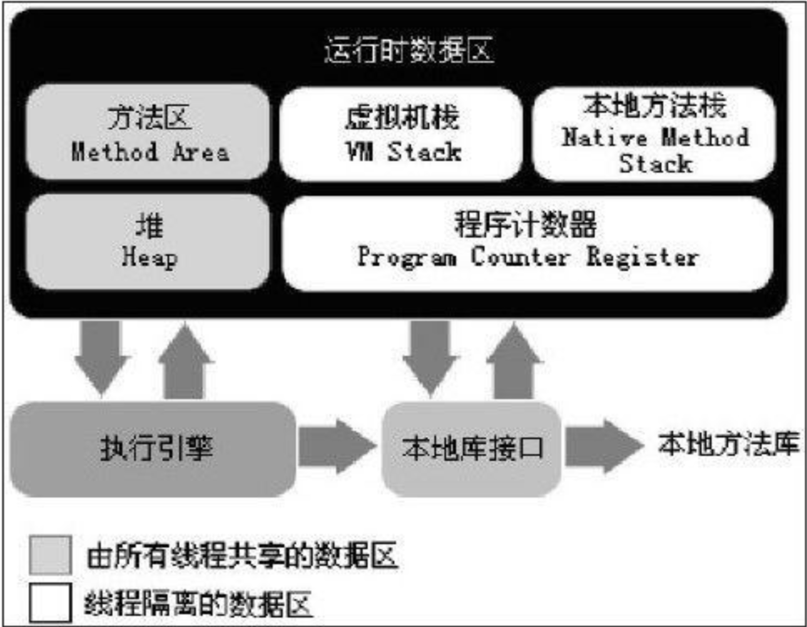
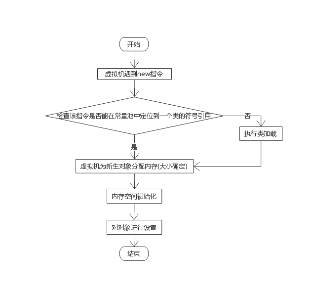
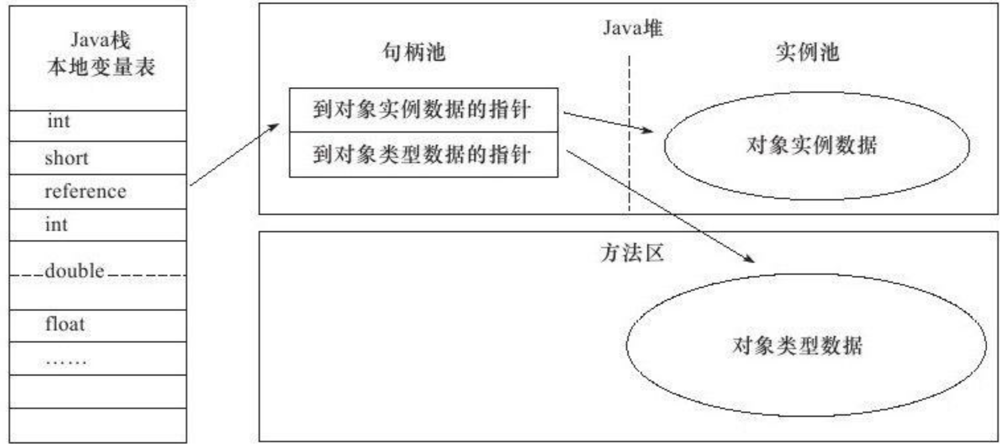
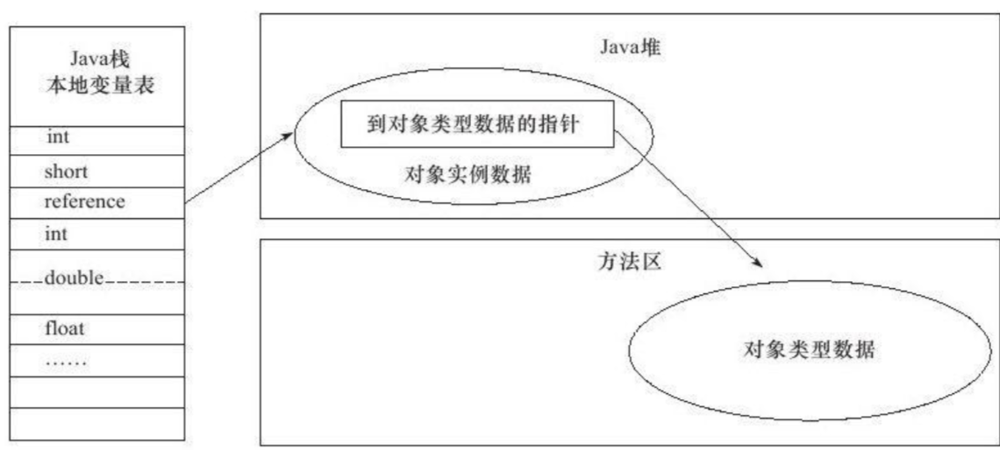

<!-- MarkdownTOC -->

- [JAVA内存区域与内存溢出异常](#java内存区域与内存溢出异常)
    - [运行时数据区域](#运行时数据区域)
    - [Hotspot虚拟机对象探秘](#hotspot虚拟机对象探秘)
        - [对象的创建](#对象的创建)
        - [对象的内存布局](#对象的内存布局)
            - [对象头](#对象头)
            - [实例数据](#实例数据)
            - [对齐填充](#对齐填充)
        - [对象的定位访问](#对象的定位访问)

<!-- /MarkdownTOC -->

# JAVA内存区域与内存溢出异常
## 运行时数据区域
JAVA虚拟机所管理的内存将包括以下几个运行时数据区域

- 程序计数器：当前线程所执行的字节码的行号指示器
- 虚拟机栈：虚拟机描述的是java方法执行的内存模型。每个方法在执行的同时都会创建一个栈帧用于存储局部变量表，操作数栈，动态链接，方法出口等信息，每个方法从调用到直至执行完成的过程，就对应着一个栈帧在虚拟机栈中入栈到出栈的过程，虚拟机栈也是通常所说的栈内存。
- 本地方法栈：本地方法栈为虚拟机使用到的Native方法服务
- 堆：此内存区域的唯一目的就是存放对象实例。java虚拟机规范中描述：所有的对象实例以及数组都要在堆上分配且堆可以处于物理上不连续的内存空间中，只要逻辑上是连续的即可
- 方法区：用于存储已被虚拟机加载的类信息、常量、静态变量、即时编译器编译后的代码等数据
- 运行时常量池：运行时常量池是方法区的一部分 。Class文件中出了有类的版本、字段、方法、接口等描述信息外，还有一项信息是常量池，用于存放编译期生成的各种字面量和符号引用，这部分内容将在类加载后进入方法区的运行时常量池中存放
- 直接内存：在jdk1.4中新加入NIO类，引入一种基于通道与缓冲区的I/O方式，它可以是使用Native函数库直接分配堆外内存，然后通过一个存储在JAVA堆中的DirectByteBuffer对象作为这块内存的引用进行操作，这样能在一些场景中提高性能，因为避免了在JAVA堆和Native堆中来回复制数据

## Hotspot虚拟机对象探秘
### 对象的创建

以上分配主要有俩种方法:

1. 指针碰撞：指针p，p的一边是已用空间，p的另一边是空闲空间，分配内存时，将p向空闲空间移动所需大小。
2. 空闲列表：堆中内存不完整，零零散散，虚拟机维护一条列表记录那些内存块可以使用，分配时从列表中找出一块足够大内存划分给对象实例，并更新表上记录。

注：对象创建在虚拟机上是一种频繁行为，且线程不安全，需要考虑同步

1. CAS
2. 将内存分配动作按照线程划分在不同的空间中进行。即每个线程在JAVA堆中预先分配一小块内存称为本地线程分配缓冲(Thread Local Alocation Buffer,TLAB)

以上工作完成之后，从虚拟机角度来看，一个新的对象已经产生，但从JAVA程序视角来看，对象创建才刚开始，<init\>方法还没有执行，多有字段都还为0，多以，一般来说，执行new指令之后会接着执行<init\>方法，把对象按照程序员意愿进行初始化(该流程由字节码是否跟随invoke special指令所决定)

### 对象的内存布局
#### 对象头
- 用于存储对象自身的运行时数据：如哈希码、GC分代年龄、锁状态标志、线程持有的锁、偏向线程ID、偏向时间戳等
- 类型指针：即对象指向它的类元数据的指针。虚拟机通过这个指针来确定这个对象是哪个类的示例

HotSpot虚拟机对象头Mark Word

|存储内容|标志位|状态|
|--|--|--|
|对象哈希码、对象分代年龄|01|未锁定|
|指向锁记录的指针|00|轻量级锁定|
|指向重量级锁的指针|10|膨胀(重量级锁定)|
|空，不需要记录信息|11|GC标记|
|偏向线程ID、偏向时间戳、对象分代年龄|01|可偏向|

以上是对象头的组成部分，但如果对象是一个JAVA数组，对象头中还必须有一块用于记录数组长度的数据。
#### 实例数据
示例数据是对象真正存储的有效信息，也是在程序代码中所定义的各种类型的字段内容
#### 对齐填充
(不是必须存在)Hotspot JVM的自动内存管理要求对象起始地址必须是8字节的整数倍
### 对象的定位访问
建立对象是为了使用对象。我们的java程序需要通过栈上的reference数据来操作堆上的具体对象。通过reference引用对象有俩种方式:

- 句柄方式。在JAVA堆中划分出一块内存来作为句柄池，reference中存储的就是对象的句柄地址，句柄中包含对象实例数据与类型数据各自的具体地址信息。

- 直接指针访问。reference中存储的直接就是对象地址

