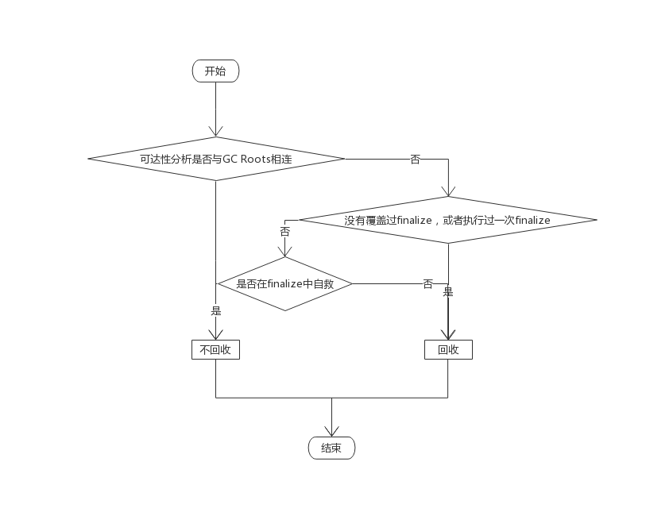
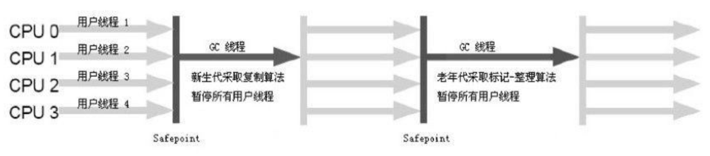
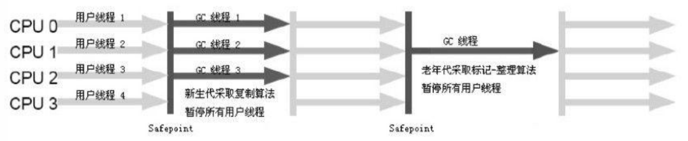
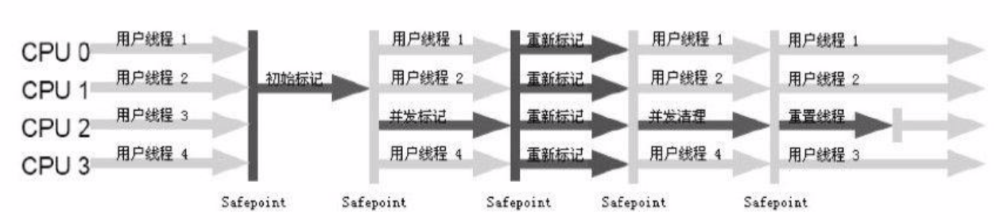
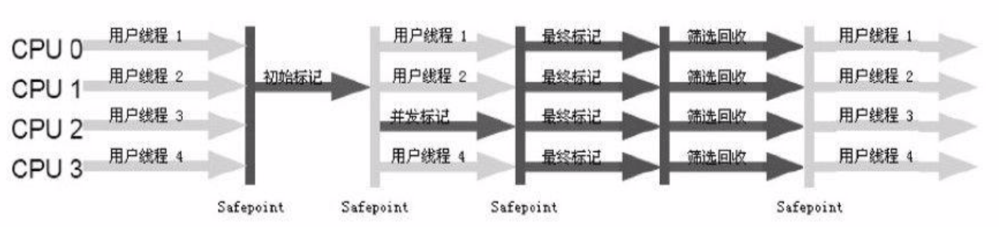
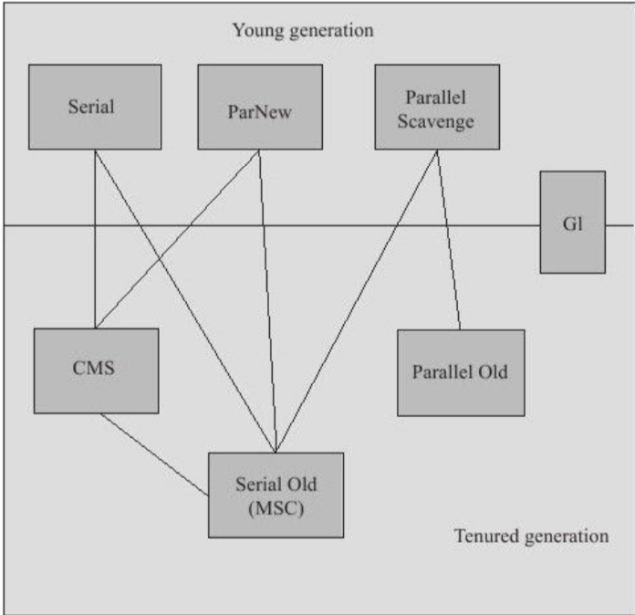

<!-- MarkdownTOC -->

- [JAVA内存区域与内存溢出异常](#java内存区域与内存溢出异常)
    - [运行时数据区域](#运行时数据区域)
    - [Hotspot虚拟机对象探秘](#hotspot虚拟机对象探秘)
        - [对象的创建](#对象的创建)
        - [对象的内存布局](#对象的内存布局)
            - [对象头](#对象头)
            - [实例数据](#实例数据)
            - [对齐填充](#对齐填充)
        - [对象的定位访问](#对象的定位访问)
- [垃圾收集器与内存分配策略](#垃圾收集器与内存分配策略)
    - [如何判断对象为垃圾对象](#如何判断对象为垃圾对象)
    - [java中，可达对象的构成](#java中，可达对象的构成)
    - [引用的一些概念](#引用的一些概念)
    - [垃圾收集算法](#垃圾收集算法)
    - [垃圾收集器](#垃圾收集器)
        - [1. Serial收集器](#1-serial收集器)
        - [2. ParNew收集器](#2-parnew收集器)
        - [3. Parallel Scaverage收集器](#3-parallel-scaverage收集器)
        - [4. Serial Old收集器](#4-serial-old收集器)
        - [5. Paral Old收集器](#5-paral-old收集器)
        - [6. CMS收集器](#6-cms收集器)
        - [7. G1收集器](#7-g1收集器)
    - [各个收集器之间的关系](#各个收集器之间的关系)
    - [内存分配与回收策略](#内存分配与回收策略)

<!-- /MarkdownTOC -->

# JAVA内存区域与内存溢出异常
## 运行时数据区域
JAVA虚拟机所管理的内存将包括以下几个运行时数据区域

- 程序计数器：当前线程所执行的字节码的行号指示器
- 虚拟机栈：虚拟机描述的是java方法执行的内存模型。每个方法在执行的同时都会创建一个栈帧用于存储局部变量表，操作数栈，动态链接，方法出口等信息，每个方法从调用到直至执行完成的过程，就对应着一个栈帧在虚拟机栈中入栈到出栈的过程，虚拟机栈也是通常所说的栈内存。
- 本地方法栈：本地方法栈为虚拟机使用到的Native方法服务
- 堆：此内存区域的唯一目的就是存放对象实例。java虚拟机规范中描述：所有的对象实例以及数组都要在堆上分配且堆可以处于物理上不连续的内存空间中，只要逻辑上是连续的即可
- 方法区：用于存储已被虚拟机加载的类信息、常量、静态变量、即时编译器编译后的代码等数据
- 运行时常量池：运行时常量池是方法区的一部分 。Class文件中出了有类的版本、字段、方法、接口等描述信息外，还有一项信息是常量池，用于存放编译期生成的各种字面量和符号引用，这部分内容将在类加载后进入方法区的运行时常量池中存放
- 直接内存：在jdk1.4中新加入NIO类，引入一种基于通道与缓冲区的I/O方式，它可以是使用Native函数库直接分配堆外内存，然后通过一个存储在JAVA堆中的DirectByteBuffer对象作为这块内存的引用进行操作，这样能在一些场景中提高性能，因为避免了在JAVA堆和Native堆中来回复制数据

## Hotspot虚拟机对象探秘
### 对象的创建

以上分配主要有俩种方法:

1. 指针碰撞：指针p，p的一边是已用空间，p的另一边是空闲空间，分配内存时，将p向空闲空间移动所需大小。
2. 空闲列表：堆中内存不完整，零零散散，虚拟机维护一条列表记录那些内存块可以使用，分配时从列表中找出一块足够大内存划分给对象实例，并更新表上记录。

注：对象创建在虚拟机上是一种频繁行为，且线程不安全，需要考虑同步

1. CAS
2. 将内存分配动作按照线程划分在不同的空间中进行。即每个线程在JAVA堆中预先分配一小块内存称为本地线程分配缓冲(Thread Local Alocation Buffer,TLAB)

以上工作完成之后，从虚拟机角度来看，一个新的对象已经产生，但从JAVA程序视角来看，对象创建才刚开始，<init\>方法还没有执行，多有字段都还为0，多以，一般来说，执行new指令之后会接着执行<init\>方法，把对象按照程序员意愿进行初始化(该流程由字节码是否跟随invoke special指令所决定)

### 对象的内存布局
#### 对象头
- 用于存储对象自身的运行时数据：如哈希码、GC分代年龄、锁状态标志、线程持有的锁、偏向线程ID、偏向时间戳等
- 类型指针：即对象指向它的类元数据的指针。虚拟机通过这个指针来确定这个对象是哪个类的示例

HotSpot虚拟机对象头Mark Word

|存储内容|标志位|状态|
|--|--|--|
|对象哈希码、对象分代年龄|01|未锁定|
|指向锁记录的指针|00|轻量级锁定|
|指向重量级锁的指针|10|膨胀(重量级锁定)|
|空，不需要记录信息|11|GC标记|
|偏向线程ID、偏向时间戳、对象分代年龄|01|可偏向|

以上是对象头的组成部分，但如果对象是一个JAVA数组，对象头中还必须有一块用于记录数组长度的数据。
#### 实例数据
示例数据是对象真正存储的有效信息，也是在程序代码中所定义的各种类型的字段内容
#### 对齐填充
(不是必须存在)Hotspot JVM的自动内存管理要求对象起始地址必须是8字节的整数倍
### 对象的定位访问
建立对象是为了使用对象。我们的java程序需要通过栈上的reference数据来操作堆上的具体对象。通过reference引用对象有俩种方式:

- 句柄方式。在JAVA堆中划分出一块内存来作为句柄池，reference中存储的就是对象的句柄地址，句柄中包含对象实例数据与类型数据各自的具体地址信息。

- 直接指针访问。reference中存储的直接就是对象地址

# 垃圾收集器与内存分配策略
## 如何判断对象为垃圾对象
- 引用计数法:给对象中添加一个引用计数器，每当有一个地方引用它时，计数器值加1，当引用失效时，计数器值减1。缺点：很难解决对象之间相互循环引用的问题。
- 可达性分析法:通过一系列的称为"GC Roots"的对象作为起点，从这些节点开始向下搜索，搜索所走过的路径称为引用链，当一个对象到GC Roots没有任何引用链相连，则证明此对象不可达。

## java中，可达对象的构成
- 虚拟机栈(栈帧中的本地变量表)中引用的对象
- 方法区中类静态属性引用的对象
- 方法区中常量引用的对象
- 本地方法栈中JNI(即一般说的Native方法)引用的对象

## 引用的一些概念
- 强引用:永远不会被回收掉
- 软引用:内存够，不回收，内存不够，进行第二次回收
- 弱引用:被引用关联的对象只能生存到下一次垃圾收集发生之前
- 虚引用:一个对象是否有虚引用的存在，完全不会对其生存时间构成影响，也无法通过虚引用来取得一个对象实例

真正宣告一个对象的死亡，至少要经过俩次标记过程

任何一个对象的finalize()方法只会被系统自动调用一次
## 垃圾收集算法
- 标记——清除算法
- 复制算法
- 标记——整理算法
- 分代收集算法(新生代用复制，老年代用标记——清除或者标记——整理)

## 垃圾收集器
### 1. Serial收集器
一个单线程的收集器

只会使用一个CPU或一掉收集线程去完成垃圾收集工作且在它进行垃圾收集时，必须暂停其他所有的工作线程，知道它收集结束。

### 2. ParNew收集器
Serial收集器的多线程版本

### 3. Parallel Scaverage收集器
达到一个可控制的吞吐量

吞吐量 = 用户运行代码时间/(用户运行代码时间+垃圾收集时间)
### 4. Serial Old收集器
是Serial收集器的老年代版本

### 5. Paral Old收集器
是ParNew收集器的老年代版本

### 6. CMS收集器
以获取最短回收停顿时间为目标的收集器，基于标记——清除算法实现

整个过程分为4个步骤

1. 初始标记:标记一个GC Roots能直接关联到的对象，速度很快
2. 并发标记:进行GC Roots Tracing的过程
3. 重新标记:修正并发标记期间因用户程序继续运作而导致标记产生变动的那一部分对象的标记记录
4. 并发清除

缺点:

1. 对资源非常敏感，默认启动的回收线程数量是(CPU数量+3)/4
2. 无法处理浮动垃圾
3. 使用标记——清除算法导致内存产生碎片

### 7. G1收集器
特点：

1. 并行与并发
2. 分代收集
3. 空间整合(整体来看:标记——整理算法。局部来看:复制算法)
4. 可预见的停顿

使用G1收集器，JAVA对的布局就与其他收集器有很大的差别，他将整个JAVA堆分成多个大小相等的独立区域，虽然还保留着新生代和老生代的概念。但新生代和老生代不在是物理隔离，他们都是独立区域的集合。G1跟踪各个Region里面的垃圾堆积的价值大小(回收所获得的空间大小以及回收所需时间的经验值)，在后台维护一个优先列表，每次根据允许的时间，优先回收价值最大的Region。

一个对象分配在某个Region中，他并非只能被本Region中的其他对象引用，而是可以与整个JAVA堆任意对象发生引用关系。在做可达性分析时，如何保证准确性呢？

在G1收集器中，Region之间的对象引用以及其他收集器中的新生代和老生代之间的对象引用，虚拟机都是使用Remembered Set之间来避免全堆扫描，G1中每个Region都有一个与之对应的Remembered Set，虚拟机发现程序对引用类型的数据进行写操作时，会产生一个Writer Barrier暂时中断写操作，检查Reference引用的对象是否处于不同的Region中，如果是，便通过CardTable把相关引用信息记录到被引用对象所属的Region的Remembered Set中，当进行内存回收时，在GC Roots的枚举范围中加入Remembered Set即可保证不扫描全堆也不遗漏。

不算Remembered Set的操作，G1收集器的运作大致可分为以下几个步骤：

1. 初始标记:标记GC Roots能直接关联的对象并修改TAMS(Next Top Marked Start)的值，让下一阶段用户程序并发运行时，能在正确可用的Region中创建新对象
2. 并发标记:从GC Root进行可达性分析，找出存活对象
3. 最终标记:修正并发标记期间因用户程序运作而导致标记产生变动的那部分标记记录，并将记录的变化记录在Remembered Set Log中，最后将Remembered Set logs数据合并到Remembered Set中
4. 筛选回收:对各个Region的回收价值和成本进行排序，根据用户所期望的GC停顿时间来制定回收计划。

## 各个收集器之间的关系

## 内存分配与回收策略
1. 对象优先分配在Eden区分配
2. 大对象直接进入老年代:最典型的大对象就是那种很长的字符串以及数组
3. 长期存活的对象进入老年代
    - 超过一定岁数，默认15岁
    - 按比例:如果Survior空间中相同年龄所有对象大小的总和大于Survior空间的一半，年龄大于等于概年龄的对象可以直接进入老年代 

