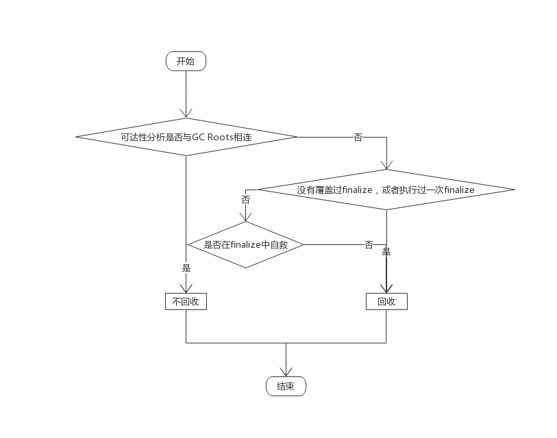
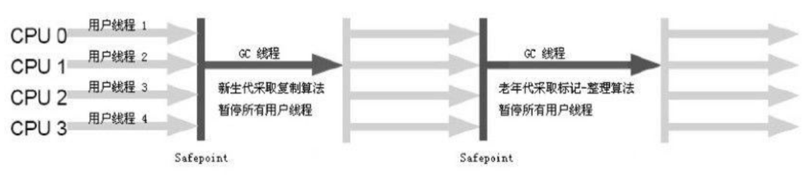
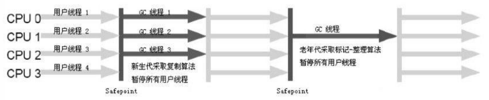
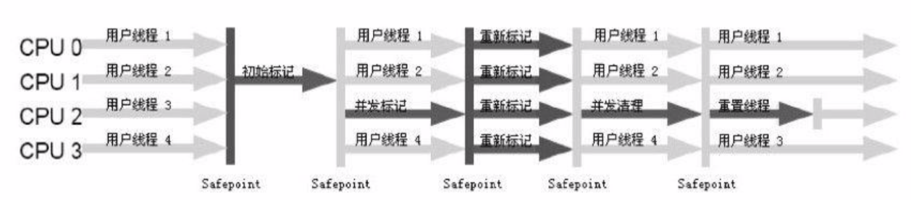
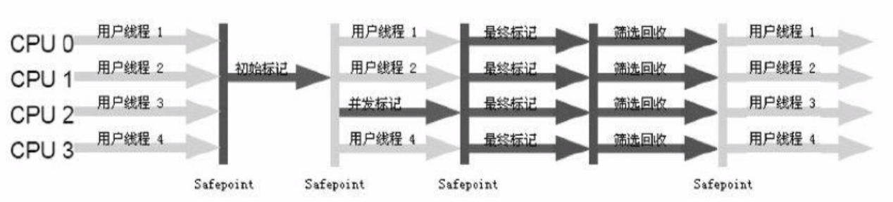
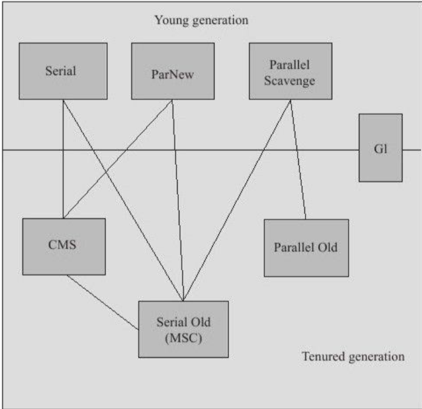
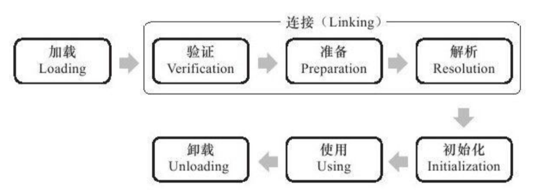

<!-- MarkdownTOC -->

- [JAVA内存区域与内存溢出异常](#java内存区域与内存溢出异常)
    - [运行时数据区域](#运行时数据区域)
    - [Hotspot虚拟机对象探秘](#hotspot虚拟机对象探秘)
        - [对象的创建](#对象的创建)
        - [对象的内存布局](#对象的内存布局)
            - [对象头](#对象头)
            - [实例数据](#实例数据)
            - [对齐填充](#对齐填充)
        - [对象的定位访问](#对象的定位访问)
- [垃圾收集器与内存分配策略](#垃圾收集器与内存分配策略)
    - [如何判断对象为垃圾对象](#如何判断对象为垃圾对象)
    - [java中，可达对象的构成](#java中，可达对象的构成)
    - [引用的一些概念](#引用的一些概念)
    - [垃圾收集算法](#垃圾收集算法)
    - [垃圾收集器](#垃圾收集器)
        - [1. Serial收集器](#1-serial收集器)
        - [2. ParNew收集器](#2-parnew收集器)
        - [3. Parallel Scaverage收集器](#3-parallel-scaverage收集器)
        - [4. Serial Old收集器](#4-serial-old收集器)
        - [5. Paral Old收集器](#5-paral-old收集器)
        - [6. CMS收集器](#6-cms收集器)
        - [7. G1收集器](#7-g1收集器)
    - [各个收集器之间的关系](#各个收集器之间的关系)
    - [内存分配与回收策略](#内存分配与回收策略)
- [虚拟机类加载机制](#虚拟机类加载机制)
    - [类的生命周期](#类的生命周期)
    - [类加载器](#类加载器)
        - [双亲委派模型](#双亲委派模型)
        - [双亲委派模型的工作过程](#双亲委派模型的工作过程)
        - [破坏双亲委派模型](#破坏双亲委派模型)
- [JAVA并发机制的底层实现原理](#java并发机制的底层实现原理)
    - [锁的状态](#锁的状态)
    - [偏向锁](#偏向锁)
    - [轻量级锁](#轻量级锁)
    - [锁的优缺点对比](#锁的优缺点对比)
    - [处理器如何实现原子操作](#处理器如何实现原子操作)
    - [JAVA如何实现原子操作](#java如何实现原子操作)
    - [CAS实现原子操作的三大问题](#cas实现原子操作的三大问题)

<!-- /MarkdownTOC -->


# JAVA内存区域与内存溢出异常
## 运行时数据区域
JAVA虚拟机所管理的内存将包括以下几个运行时数据区域


- 程序计数器：当前线程所执行的字节码的行号指示器
- 虚拟机栈：虚拟机描述的是java方法执行的内存模型。每个方法在执行的同时都会创建一个栈帧用于存储局部变量表，操作数栈，动态链接，方法出口等信息，每个方法从调用到直至执行完成的过程，就对应着一个栈帧在虚拟机栈中入栈到出栈的过程，虚拟机栈也是通常所说的栈内存。
- 本地方法栈：本地方法栈为虚拟机使用到的Native方法服务
- 堆：此内存区域的唯一目的就是存放对象实例。java虚拟机规范中描述：所有的对象实例以及数组都要在堆上分配且堆可以处于物理上不连续的内存空间中，只要逻辑上是连续的即可
- 方法区：用于存储已被虚拟机加载的类信息、常量、静态变量、即时编译器编译后的代码等数据
- 运行时常量池：<font color = "red">运行时常量池是方法区的一部分 </font>。Class文件中出了有类的版本、字段、方法、接口等描述信息外，还有一项信息是常量池，用于存放编译期生成的各种字面量和符号引用，这部分内容将在类加载后进入方法区的运行时常量池中存放
- 直接内存：在jdk1.4中新加入NIO类，引入一种基于通道与缓冲区的I/O方式，它可以是使用Native函数库直接分配堆外内存，然后通过一个存储在JAVA堆中的DirectByteBuffer对象作为这块内存的引用进行操作，这样能在一些场景中提高性能，因为避免了在JAVA堆和Native堆中来回复制数据

## Hotspot虚拟机对象探秘
### 对象的创建


以上分配主要有俩种方法:

1. 指针碰撞：指针p，p的一边是已用空间，p的另一边是空闲空间，分配内存时，将p向空闲空间移动所需大小。
2. 空闲列表：堆中内存不完整，零零散散，虚拟机维护一条列表记录那些内存块可以使用，分配时从列表中找出一块足够大内存划分给对象实例，并更新表上记录。

注：对象创建在虚拟机上是一种频繁行为，且线程不安全，需要考虑同步

1. CAS
2. 将内存分配动作按照线程划分在不同的空间中进行。即每个线程在JAVA堆中预先分配一小块内存称为本地线程分配缓冲(Thread Local Alocation Buffer,TLAB)

以上工作完成之后，从虚拟机角度来看，一个新的对象已经产生，但从JAVA程序视角来看，对象创建才刚开始，<init\>方法还没有执行，多有字段都还为0，多以，一般来说，执行new指令之后会接着执行<init\>方法，把对象按照程序员意愿进行初始化(该流程由字节码是否跟随invoke special指令所决定)

### 对象的内存布局
#### 对象头
- 用于存储对象自身的运行时数据：如哈希码、GC分代年龄、锁状态标志、线程持有的锁、偏向线程ID、偏向时间戳等
- 类型指针：即对象指向它的类元数据的指针。虚拟机通过这个指针来确定这个对象是哪个类的示例

HotSpot虚拟机对象头Mark Word

|存储内容|标志位|状态|
|--|--|--|
|对象哈希码、对象分代年龄|01|未锁定|
|指向锁记录的指针|00|轻量级锁定|
|指向重量级锁的指针|10|膨胀(重量级锁定)|
|空，不需要记录信息|11|GC标记|
|偏向线程ID、偏向时间戳、对象分代年龄|01|可偏向|

以上是对象头的组成部分，但如果对象是一个JAVA数组，对象头中还必须有一块用于记录数组长度的数据。
#### 实例数据
示例数据是对象真正存储的有效信息，也是在程序代码中所定义的各种类型的字段内容
#### 对齐填充
(不是必须存在)Hotspot JVM的自动内存管理要求对象起始地址必须是8字节的整数倍
### 对象的定位访问
建立对象是为了使用对象。我们的java程序需要通过栈上的reference数据来操作堆上的具体对象。通过reference引用对象有俩种方式:

- 句柄方式。在JAVA堆中划分出一块内存来作为句柄池，reference中存储的就是对象的句柄地址，句柄中包含对象实例数据与类型数据各自的具体地址信息。

- 直接指针访问。reference中存储的直接就是对象地址


# 垃圾收集器与内存分配策略
## 如何判断对象为垃圾对象
- 引用计数法:给对象中添加一个引用计数器，每当有一个地方引用它时，计数器值加1，当引用失效时，计数器值减1。缺点：很难解决对象之间相互循环引用的问题。
- 可达性分析法:通过一系列的称为"GC Roots"的对象作为起点，从这些节点开始向下搜索，搜索所走过的路径称为引用链，当一个对象到GC Roots没有任何引用链相连，则证明此对象不可达。

## java中，可达对象的构成
- 虚拟机栈(栈帧中的本地变量表)中引用的对象
- 方法区中类静态属性引用的对象
- 方法区中常量引用的对象
- 本地方法栈中JNI(即一般说的Native方法)引用的对象

## 引用的一些概念
- 强引用:永远不会被回收掉
- 软引用:内存够，不回收，内存不够，进行第二次回收
- 弱引用:被引用关联的对象只能生存到下一次垃圾收集发生之前
- 虚引用:一个对象是否有虚引用的存在，完全不会对其生存时间构成影响，也无法通过虚引用来取得一个对象实例

真正宣告一个对象的死亡，至少要经过俩次标记过程



<font color="red">任何一个对象的finalize()方法只会被系统自动调用一次</font>
## 垃圾收集算法
- 标记——清除算法
- 复制算法
- 标记——整理算法
- 分代收集算法(新生代用复制，老年代用标记——清除或者标记——整理)

## 垃圾收集器
### 1. Serial收集器
一个单线程的收集器

只会使用一个CPU或一掉收集线程去完成垃圾收集工作且在它进行垃圾收集时，必须暂停其他所有的工作线程，知道它收集结束。

### 2. ParNew收集器
Serial收集器的多线程版本

### 3. Parallel Scaverage收集器
达到一个可控制的吞吐量

吞吐量 = 用户运行代码时间/(用户运行代码时间+垃圾收集时间)
### 4. Serial Old收集器
是Serial收集器的老年代版本

### 5. Paral Old收集器
是ParNew收集器的老年代版本

### 6. CMS收集器
以获取最短回收停顿时间为目标的收集器，基于标记——清除算法实现

整个过程分为4个步骤

1. 初始标记:标记一个GC Roots能直接关联到的对象，速度很快
2. 并发标记:进行GC Roots Tracing的过程
3. 重新标记:修正并发标记期间因用户程序继续运作而导致标记产生变动的那一部分对象的标记记录
4. 并发清除



缺点:

1. 对资源非常敏感，默认启动的回收线程数量是(CPU数量+3)/4
2. 无法处理浮动垃圾
3. 使用标记——清除算法导致内存产生碎片

### 7. G1收集器
特点：

1. 并行与并发
2. 分代收集
3. 空间整合(整体来看:标记——整理算法。局部来看:复制算法)
4. 可预见的停顿

使用G1收集器，JAVA对的布局就与其他收集器有很大的差别，他将整个JAVA堆分成多个大小相等的独立区域，虽然还保留着新生代和老生代的概念。但新生代和老生代不在是物理隔离，他们都是独立区域的集合。G1跟踪各个Region里面的垃圾堆积的价值大小(回收所获得的空间大小以及回收所需时间的经验值)，在后台维护一个优先列表，每次根据允许的时间，优先回收价值最大的Region。

一个对象分配在某个Region中，他并非只能被本Region中的其他对象引用，而是可以与整个JAVA堆任意对象发生引用关系。在做可达性分析时，如何保证准确性呢？

在G1收集器中，Region之间的对象引用以及其他收集器中的新生代和老生代之间的对象引用，虚拟机都是使用Remembered Set之间来避免全堆扫描，G1中每个Region都有一个与之对应的Remembered Set，虚拟机发现程序对引用类型的数据进行写操作时，会产生一个Writer Barrier暂时中断写操作，检查Reference引用的对象是否处于不同的Region中，如果是，便通过CardTable把相关引用信息记录到被引用对象所属的Region的Remembered Set中，当进行内存回收时，在GC Roots的枚举范围中加入Remembered Set即可保证不扫描全堆也不遗漏。

不算Remembered Set的操作，G1收集器的运作大致可分为以下几个步骤：

1. 初始标记:标记GC Roots能直接关联的对象并修改TAMS(Next Top Marked Start)的值，让下一阶段用户程序并发运行时，能在正确可用的Region中创建新对象
2. 并发标记:从GC Root进行可达性分析，找出存活对象
3. 最终标记:修正并发标记期间因用户程序运作而导致标记产生变动的那部分标记记录，并将记录的变化记录在Remembered Set Log中，最后将Remembered Set logs数据合并到Remembered Set中
4. 筛选回收:对各个Region的回收价值和成本进行排序，根据用户所期望的GC停顿时间来制定回收计划。



## 各个收集器之间的关系

## 内存分配与回收策略
1. 对象优先分配在Eden区分配
2. 大对象直接进入老年代:最典型的大对象就是那种很长的字符串以及数组
3. 长期存活的对象进入老年代
    - 超过一定岁数，默认15岁
    - 按比例:如果Survior空间中相同年龄所有对象大小的总和大于Survior空间的一半，年龄大于等于概年龄的对象可以直接进入老年代

# 虚拟机类加载机制
类从被加载到虚拟机内存中开始，到卸载出内存为止，它的整个生命周期包括:加载、验证、准备、解析、初始化、使用和卸载7个阶段。

## 类的生命周期


以下五种情况必须对类进行初始化：

1. 遇到new,getstatic,putstatic或invokestatic，生成这4条指令最常规的JAVA场景是:使用new关键字实例化对象时，读取或设置一个类的静态字段时(被final修饰，已在编译期把结果放入常量池的静态除外)的时候，以调用一个类的静态方法时
2. 使用反射包的方法对类反射调用时
3. 初始化一个类，如果其父类还未进行过初始化，则需要先触发其父类的初始化
4. 虚拟机启动时，用户需要指定一个一个主类(包含main方法的那个类)，虚拟机会先初始化这个主类
5. 当使用jdk1.7动态语言支持时，如果一个java.lang.invoke.MethodHandle实例最后的解析结果是REF_getstatic,REF_putstatic,REF_invokestatic的方法句柄，并且这个方法句柄对应的类没有进行过初始化，则需要先进行其初始化。

## 类加载器
对于任意一个类，都需要由加载它的类加载器和这个类本身一同确立其在JAVA虚拟机中的唯一性，每一个类加载器都拥有一个类名空间。即:<font color="red">比较这俩个类是否相等，只有在这俩个类是由同一个类加载器加载的前提下才有意义，否则，即使这俩个类来源于同一个Class文件，被同一个虚拟机加载，只要加载他们的类加载器不同，那这俩个类就必定不等。</font>

### 双亲委派模型
1. 启动类加载器:这个类负责将存放在<JAVA_HOME\>/lib目录中的或者被-xbootclasspath参数指定的并且被虚拟机识别的类库加载到虚拟机内存中
2. 扩展类加载器:这个加载器负责加载<JAVA_HOME\>/lib/ext目录中的或者被java.ext.dirs系统变量所指定的路径中的所有类库，开发者可以直接使用扩展类加载器。
3. 应用程序类加载器:负责加载用户类路径上所指定的类库


<font color="red">这里类加载器之间的父子关系一般不会以继承的关系来实现，而是都使用组合关系来复用父加载器的代码</font>

### 双亲委派模型的工作过程
如果一个类加载器收到了类加载的请求，它首先不会自己去尝试加载这个类，而是把这个请求委派给父类加载器去完成，每一个层次的类加载器都是如此，因此，所有的加载请求最终都应该传送到顶层的启动类加载器中，只有当父加载器反馈自己无法完成这个请求时，子加载器才会尝试自己去加载
```java
protected synchronized Class<?> loadClass(String name,boolean resolve) throws ClassNotFoundException{
    //首先检查请求的类是否被加载过了
    Class c = findLoadedClass(name);
    if(c == null){
        try{
            if(parent != null){
                c = parent.loadClass(name,false);
            }else{
                c = findBootstrapClassOrNull(name);
            }
        }catch(ClassNotFoundException e){
            //如果父类加载器抛出ClassNotFoundException
            //说明父类加载器无法完成加载请求
        }
        if(c == null){
            //在父类加载器无法加载的时候
            //在调用本身的findClass方法来进行类加载
            c = findClass(name);
        }
        if(resolve){
            resolveClass(c);
        }
        return c;
    }
}
```
### 破坏双亲委派模型
1. JDK1.2之后的ClassLoader添加了一个新的protected方法findClass()，在此之前，用户去继承java.lang.ClassLoader的唯一目的是为了重写loadClass()方法，因此虚拟器加进行类加载的时候会调用加载器的私有方法loadClassInternal()，而这个方法的唯一逻辑就是去调用自己的loadClass()。双亲委派模型的具体逻辑就实现在loadClass()方法中，JDK1.2之后已经不提倡用户再去覆盖loadClass()方法，而应当把自己的类加载逻辑写到findClass()方法中，在loadClass()方法的逻辑里如果父类加载失败，则会调用自己的findClass()方法来完成加载
2. 线程上下文加载器。这个类加载器可以通过java.lang.Thread类的setContextClassLoader()方法进行设置，如果创建线程时还未设置，它将会从父线程中复制一个，如果在应用程序全局范围内都没有设置的话，那这个类加载器默认就是应用程序类加载器。
3. OSGI。在OSGI环境下，类加载器不再是双亲委派模型中的树状结构，而是进一步发展为更加复杂的网状结构，当收到类加载请求时，OSGI将按照下面的顺序进行类搜索：
    - 将以java.*开头的类委派给父类加载器加载
    - 否则，将委派列表名单内的类委派给父类加载器加载
    - 否则，将Import列表中的类委派给Export这个类的Bundle的类加载器加载
    - 否则，查找当前Bundle的ClassPath，使用自己的类加载器加载
    - 否则，查找类是否在自己的Fragment Bundle中，如果在，则委派给Fragment Bundle的类加载器加载
    - 否则，查找Dynamic Import列表的Bundle，委派给对应Bundle的类加载器加载
    - 否则，类查找失败

上面的查找顺序中只有开头俩点仍然符合双亲委派规则，其余的类查找都是在评级的类加载器中进行的。
# JAVA并发机制的底层实现原理
代码----->字节码----->JVM----->汇编指令----->CPU   
    编译        加载  执行字节码 转化

JAVA中每个对象都可以作为锁，具体表现为以下3种形式：

1. 对于普通方法，锁是当前实例对象
2. 对于静态方法，锁是当前类的class对象
3. 对于同步方法块，锁是Synchronized括号里配置的对象

## 锁的状态
锁一共有四种状级别，从低到高是:无锁状态，偏向锁状态，轻量级锁状态和重量级锁状态，<font color="red">锁可以升级，但不能降级 </font>

## 偏向锁
大多数情况下，锁不仅不存在多线程竞争，而且总是由统一线程多次获得，为了让获得锁的代价更低而引入了偏向锁

当一个线程访问同步块并获取锁时，会在对象头和栈帧中的锁记录里存储锁偏向的线程ID，以后该线程在进入和退出同步块时不需要进行CAS操作来加锁和解锁，只需要简单地测试一下对象头的Mark Word里是否存储着指向当前线程的偏向锁。如果测试成功，表示线程已经获得了锁。如果测试失败，则需要在测试一下Mark World中，偏向锁的标志是否设置成1(表示当前是偏向锁).如果没有设置，则使用CAS竞争锁，如果设置了，则尝试使用CAS将对象头的偏向锁指向当前线程。

## 轻量级锁
线程执行同步块之前，JVM会先在当前线程的栈帧中创建用于存储锁记录的空间，并将对象头中的Mark Word复制到锁记录中，官方称为Displaced MarkWord,然后线程尝试使用CAS将对象头中的Mark Word替换为指向锁记录的指针。如果成功，当前线程获得锁，如果失败，表示其他线程竞争失败，当前线程便尝试使用自旋锁来获取锁。

## 锁的优缺点对比
|锁|优点|缺点|适用场景|
|--|--|--|--|
|偏向锁|加锁和解锁不需要额外的消耗，和执行非同步方法相比，仅存在纳秒级别的差距|如果线程间存在锁竞争，会带来额外的锁撤销的消耗|使用只有一个线程访问同步块的场景|
|轻量级锁|竞争的线程不会被阻塞，提高了程序的响应速度|如果始终得不到锁竞争的线程，使用自旋会消耗CPU|追求响应时间，同步块执行的时间非常快|
|重量级锁|线程竞争不使用自旋不会消耗CPU|线程阻塞，响应时间慢|追求吞吐量，同步块执行时间较长|
## 处理器如何实现原子操作
1. 使用总线锁保证原子性
2. 使用缓存锁保证原子性

## JAVA如何实现原子操作
在JAVA中可以通过锁和循环CAS来实现原子操作

## CAS实现原子操作的三大问题
1. __ABA问题:__CAS需要在操作值得时候，检查值有没有发生变化，如果没有发生变化则更新，但是如果一个值原来是A，变成了B，又变成了A，那么使用CAS进行检查时会发现它的值没有变化，但实际上已经变化了。__解决思路：__使用版本号，在变量前加上版本号，每次变量更新的时候把版本号加1，那么A->B->A，就会变成1A->2B->3A。
2. __循环时间长，开销大__
3. __只能保证一个共享变量的原子操作__
