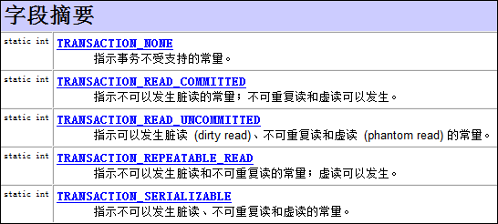

<!-- MarkdownTOC -->

- [1.请对以下在J2EE中常用的名词进行解释\(或简单描述\)](#1请对以下在j2ee中常用的名词进行解释或简单描述)
    - [web 容器](#web-容器)
    - [Web container](#web-container)
    - [EJB容器](#ejb容器)
    - [JNDI\(Java Naming & Directory Interface\)JAVA命名目录服务](#jndijava-naming--directory-interfacejava命名目录服务)
    - [JMS\(ava Message Service\)JAVA消息服务](#jmsava-message-servicejava消息服务)
    - [JTA\(Java Transaction API\)JAVA事务服务](#jtajava-transaction-apijava事务服务)
    - [JAF\(Java Action FrameWork\)JAVA安全认证框架](#jafjava-action-frameworkjava安全认证框架)
    - [RMI/IIOP\(Remote Method Invocation/internet对象请求中介协议\)](#rmiiiopremote-method-invocationinternet对象请求中介协议)
- [2.数据库水平切分,垂直切分](#2数据库水平切分垂直切分)
    - [水平分割](#水平分割)
    - [垂直分割](#垂直分割)
- [3.数据库索引介绍一下.介绍一下什么时候用Innodb什么时候用MyISAM](#3数据库索引介绍一下介绍一下什么时候用innodb什么时候用myisam)
- [4.索引了解嘛,底层怎么实现的,什么时候会失效](#4索引了解嘛底层怎么实现的什么时候会失效)
- [5.数据库的隔离级别](#5数据库的隔离级别)
- [6.数据库乐观锁和悲观锁](#6数据库乐观锁和悲观锁)
- [7.数据库的三范式](#7数据库的三范式)
- [8.mysql主从复制](#8mysql主从复制)
- [9.leftjoin和rightjoin的区别](#9leftjoin和rightjoin的区别)
- [10.数据库优化方法](#10数据库优化方法)
- [11.谈一下你对继承映射的理解](#11谈一下你对继承映射的理解)
- [12.说出数据连接池的工作机制是什么](#12说出数据连接池的工作机制是什么)
- [13.JDBC中如何进行事务处理](#13jdbc中如何进行事务处理)
- [14.JDBC的反射,反射都是什么](#14jdbc的反射反射都是什么)
- [15.Jdo是什么](#15jdo是什么)
- [16.Statement和PreparedStatement有什么区别,哪个性能更好](#16statement和preparedstatement有什么区别哪个性能更好)
- [17.使用JDBC操作数据库时,如何提升读取数据的性能？如何提升更新数据的性能](#17使用jdbc操作数据库时如何提升读取数据的性能？如何提升更新数据的性能)
- [18.XML文档定义有几种形式,它们之间有何本质区别,解析XML文档有哪几种方式](#18xml文档定义有几种形式它们之间有何本质区别解析xml文档有哪几种方式)
- [19.WEB SERVICE名词解释,JSWDL开发包的介绍,JAXP,JAXM的解释.SOAP,UDDI,WSDL解释](#19web-service名词解释jswdl开发包的介绍jaxpjaxm的解释soapuddiwsdl解释)
- [20.请你谈谈对SOAP,WSDL,UDDI的了解](#20请你谈谈对soapwsdluddi的了解)
- [21.谈谈Java规范中和Web Service相关的规范有哪些](#21谈谈java规范中和web-service相关的规范有哪些)
- [22.TCP协议在哪一层,IP协议在那一层,HTTP在哪一层](#22tcp协议在哪一层ip协议在那一层http在哪一层)

<!-- /MarkdownTOC -->


# 1.请对以下在J2EE中常用的名词进行解释(或简单描述)
## web 容器
给处于其中的应用程序组件（JSP，SERVLET）提供一个环境，使JSP,SERVLET直接和容器中的环境变量接接口互，不必关注其它系统问题。主要有WEB服务器来实现。例如：TOMCAT,WEBLOGIC,WEBSPHERE等。该容器提供的接口严格遵守J2EE规范中的WEBAPPLICATION 标准。我们把遵守以上标准的WEB服务器就叫做J2EE中的WEB容器。
## Web container
实现J2EE体系结构中Web组件协议的容器。这个协议规定了一个Web组件运行时的环境，包括安全，一致性，生命周期管理，事务，配置和其它的服务。一个提供和JSP和J2EE平台APIs界面相同服务的容器。一个Web container 由Web服务器或者J2EE服务器提供。
## EJB容器
Enterprise java bean 容器。更具有行业领域特色。他提供给运行在其中的组件EJB各种管理功能。只要满足J2EE规范的EJB放入该容器，马上就会被容器进行高效率的管理。并且可以通过现成的接口来获得系统级别的服务。例如邮件服务、事务管理。一个实现了J2EE体系结构中EJB组件规范的容器。这个规范指定了一个Enterprise bean的运行时环境，包括安全，一致性，生命周期，事务，配置，和其他的服务。
## JNDI(Java Naming & Directory Interface)JAVA命名目录服务
主要提供的功能是：提供一个目录系统，让其它各地的应用程序在其上面留下自己的索引，从而满足快速查找和定位分布式应用程序的功能。
## JMS(ava Message Service)JAVA消息服务
主要实现各个应用程序之间的通讯。包括点对点和广播。
## JTA(Java Transaction API)JAVA事务服务
提供各种分布式事务服务。应用程序只需调用其提供的接口即可。
## JAF(Java Action FrameWork)JAVA安全认证框架
提供一些安全控制方面的框架。让开发者通过各种部署和自定义实现自己的个性安全控制策略。
## RMI/IIOP(Remote Method Invocation/internet对象请求中介协议)
他们主要用于通过远程调用服务。例如，远程有一台计算机上运行一个程序，它提供股票分析服务，我们可以在本地计算机上实现对其直接调用。当然这是要通过一定的规范才能在异构的系统之间进行通信。RMI是JAVA特有的。RMI-IIOP出现以前，只有RMI和 CORBA两种选择来进行分布式程序设计。RMI-IIOP综合了RMI和CORBA的优点，克服了他们的缺点，使得程序员能更方便的编写分布式程序设计，实现分布式计算。首先，RMI-IIOP综合了RMI的简单性和CORBA的多语言性（兼容性），其次RMI-IIOP克服了RMI只能用于Java 的缺点和CORBA的复杂性。

# 2.数据库水平切分,垂直切分
## 水平分割
按记录进分分割，不同的记录可以分开保存，每个子表的列数相同。

水平分割通常在下面的情况下使用：

A 表很大，分割后可以降低在查询时需要读的数据和索引的页数，同时也降低了索引的层数，提高查询速度。

B 表中的数据本来就有独立性，例如表中分别记录各个地区的数据或不同时期的数据，特别是有些数据常用，而另外一些数据不常用。

C需要把数据存放到多个介质上。

例如法规表law就可以分成两个表active－law和 inactive－law。activea－authors表中的内容是正生效的法规，是经常使用的，而inactive－law表则使已经作废的法规，不常被查询。水平分割会给应用增加复杂度，它通常在查询时需要多个表名，查询所有数据需要union操作。在许多数据库应用中，这种复杂性会超过它带来的优点，因为只要索引关键字不大，则在索引用于查询时，表中增加两到三倍数据量，查询时也就增加读一个索引层的磁盘次数。

水平拆分，上面谈到垂直切分只是把表按模块划分到不同数据库，但没有解决单表大数据量的问题，而水平切分就是要把一个表按照某种规则把数据划分到不同表或数据库里。例如像计费系统，通过按时间来划分表就比较合适，因为系统都是处理某一时间段的数据。而像SaaS应用，通过按用户维度来划分数据比较合适，因为用户与用户之间的隔离的，一般不存在处理多个用户数据的情况，简单的按user_id范围来水平切分。

优点：

1. 不存在单库大数据，高并发的性能瓶颈。
2. 对应用透明，应用端改造较少。     
3. 按照合理拆分规则拆分，join操作基本避免跨库。
4. 提高了系统的稳定性跟负载能力。

缺点：

1. 拆分规则难以抽象。
2. 分片事务一致性难以解决。
3. 数据多次扩展难度跟维护量极大。
4. 跨库join性能较差。

## 垂直分割
按列进行分割，即把一条记录分开多个地方保存，每个子表的行数相同。

把主码和一些列放到一个表，然后把主码和另外的列放到另一个表中。如果一个表中某些列常用，而另外一些列不常用，则可以采用垂直分割，另外垂直分割可以使得数据行变小，一个数据页就能存放更多的数据，在查询时就会减少I/O 次数。其缺点是需要管理冗余列，查询所有数据需要join操作。　

垂直拆分就是要把表按模块划分到不同数据库表中（当然原则还是不破坏第三范式），这种拆分在大型网站的演变过程中是很常见的。当一个网站还在很小的时候，只有小量的人来开发和维护，各模块和表都在一起，当网站不断丰富和壮大的时候，也会变成多个子系统来支撑，这时就有按模块和功能把表划分出来的需求。其实，相对于垂直切分更进一步的是服务化改造，说得简单就是要把原来强耦合的系统拆分成多个弱耦合的服务，通过服务间的调用来满足业务需求看，因此表拆出来后要通过服务的形式暴露出去，而不是直接调用不同模块的表，淘宝在架构不断演变过程，最重要的一环就是服务化改造，把用户、交易、店铺、宝贝这些核心的概念抽取成独立的服务，也非常有利于进行局部的优化和治理，保障核心模块的稳定性。

例如有表T1

|id|name|qty|
|--|--|--|
|1|p1|10|
|2|p2|20|
|3|p3|30|
|4|p4|40|

垂直分割就是按列进行分割，即把一条记录分开多个地方保存，每个子表的行数相同。

例如表T1，可以把id和name放到数据文件p1，把qty放到数据文件p2。

水平分割就是按记录进分分割，不同的记录可以分开保存，每个子表的列数相同。

像表T1，可以把id为单数的放到数据文件P1，双数的放到数据文件P2。

表散列与水平分割相似，但没有水平分割那样的明显分割界限，它由哈希函数和键值决定一条记录的保存文件，这样是为了IO更加均衡。

优点：

1. 拆分后业务清晰，拆分规则明确。
2. 系统之间整合或扩展容易。
3. 数据维护简单。

缺点：

1. 部分业务表无法join，只能通过接口方式解决，提高了系统复杂度。
2. 受每种业务不同的限制存在单库性能瓶颈，不易数据扩展跟性能提高。
3. 事务处理复杂。

# 3.数据库索引介绍一下.介绍一下什么时候用Innodb什么时候用MyISAM
索引是对数据库表中一列或多列的值进行排序的一种结构，使用索引可快速访问数据库表中的特定信息。如果想按特定职员的姓来查找他或她，则与在表中搜索所有的行相比，索引有助于更快地获取信息。索引的一个主要目的就是加快检索表中数据的方法，亦即能协助信息搜索者尽快的找到符合限制条件的记录ID的辅助数据结构。

MyISAM和InnoDB是MySQL提供的两种搜索引擎

MyISAM和InnoDB的区别

1. InnoDB支持事务与外键和行级锁,MyISAM不支持(最主要的差别)
2. MyISAM读性能要优于InnoDB,除了针对索引的update操作,MyISAM的写性能可能低于InnoDB,其他操作MyISAM的写性能也是优于InnoDB的,而且可以通过分库分表来提高MyISAM写操作的速度
3. MyISAM的索引和数据是分开的,而且索引是压缩的,而InnoDB的索引和数据是紧密捆绑的,没有使用压缩,所以InnoDB的体积比MyISAM庞大
4. InnoDB 中不保存表的具体行数，也就是说，执行select count(*) from table时，InnoDB要扫描一遍整个表来计算有多少行，但是MyISAM只要简单的读出保存好的行数即可。注意的是，当count(*)语句包含 where条件时，两种表的操作是一样的。
5. DELETE FROM table时，InnoDB不会重新建立表，而是一行一行的删除。
6. InnoDB表的行锁也不是绝对的，假如在执行一个SQL语句时MySQL不能确定要扫描的范围，InnoDB表同样会锁全表，例如update table set num=1 where name like “%aaa%”。在where条件没有主键时,InnoDB照样会锁全表

MyISAM引擎索引结构的叶子节点的数据域，存放的并不是实际的数据记录，而是数据记录的地址。索引文件与数据文件分离，这样的索引称为“非聚簇索引”。其检索算法：先按照B+Tree的检索算法检索，找到指定关键字，则取出对应数据域的值，作为地址取出数据记录。

InnoDB引擎索引结构的叶子节点的数据域，存放的就是实际的数据记录。这样的索引被称为“聚簇索引”，一个表只能有一个聚簇索引。

选择哪种搜索引擎,应视具体应用而定

1. 如果是读多写少的项目,可以考虑使用MyISAM,MYISAM索引和数据是分开的，而且其索引是压缩的，可以更好地利用内存。所以它的查询性能明显优于INNODB。压缩后的索引也能节约一些磁盘空间。MYISAM拥有全文索引的功能，这可以极大地优化LIKE查询的效率。
2. 如果你的应用程序一定要使用事务，毫无疑问你要选择INNODB引擎
3. 如果是用MyISAM的话，merge引擎可以大大加快应用部门的开发速度，他们只要对这个merge表做一些select count(\*)操作，非常适合大项目总量约几亿的rows某一类型(如日志，调查统计)的业务表。

# 4.索引了解嘛,底层怎么实现的,什么时候会失效
B+树实现的。

没有遵循最左匹配原则。

一些关键字会导致索引失效，例如 or， ！= ， not in，is null ,is not unll

like查询是以%开头

隐式转换会导致索引失效。

对索引应用内部函数，索引字段进行了运算。

# 5.数据库的隔离级别
如果一个数据库声称支持事务的操作，那么该数据库必须要具备以下四个特性(ACID)：

1. 原子性（Atomicity）:原子性是指事务包含的所有操作要么全部成功，要么全部失败回滚，这和前面两篇博客介绍事务的功能是一样的概念，因此事务的操作如果成功就必须要完全应用到数据库，如果操作失败则不能对数据库有任何影响。
2. 一致性（Consistency）:一致性是指事务必须使数据库从一个一致性状态变换到另一个一致性状态，也就是说一个事务执行之前和执行之后都必须处于一致性状态。拿转账来说，假设用户A和用户B两者的钱加起来一共是5000，那么不管A和B之间如何转账，转几次账，事务结束后两个用户的钱相加起来应该还得是5000，这就是事务的一致性。
3. 隔离性（Isolation）:隔离性是当多个用户并发访问数据库时，比如操作同一张表时，数据库为每一个用户开启的事务，不能被其他事务的操作所干扰，多个并发事务之间要相互隔离。即要达到这么一种效果：对于任意两个并发的事务T1和T2，在事务T1看来，T2要么在T1开始之前就已经结束，要么在T1结束之后才开始，这样每个事务都感觉不到有其他事务在并发地执行。
4. 持久性（Durability）:持久性是指一个事务一旦被提交了，那么对数据库中的数据的改变就是永久性的，即便是在数据库系统遇到故障的情况下也不会丢失提交事务的操作。例如我们在使用JDBC操作数据库时，在提交事务方法后，提示用户事务操作完成，当我们程序执行完成直到看到提示后，就可以认定事务以及正确提交，即使这时候数据库出现了问题，也必须要将我们的事务完全执行完成，否则就会造成我们看到提示事务处理完毕，但是数据库因为故障而没有执行事务的重大错误。

以上介绍完事务的四大特性(简称ACID)，现在重点来说明下事务的隔离性，当多个线程都开启事务操作数据库中的数据时，数据库系统要能进行隔离操作，以保证各个线程获取数据的准确性，在介绍数据库提供的各种隔离级别之前，我们先看看如果不考虑事务的隔离性，会发生的几种问题：

- 脏读:脏读是指在一个事务处理过程里读取了另一个未提交的事务中的数据。
当一个事务正在多次修改某个数据，而在这个事务中这多次的修改都还未提交，这时一个并发的事务来访问该数据，就会造成两个事务得到的数据不一致。例如：用户A向用户B转账100元，对应SQL命令如下:
```SQL
update account set money=money+100 where name=’B’;  (此时A通知B)

update account set money=money - 100 where name=’A’;
```
当只执行第一条SQL时，A通知B查看账户，B发现确实钱已到账（此时即发生了脏读），而之后无论第二条SQL是否执行，只要该事务不提交，则所有操作都将回滚，那么当B以后再次查看账户时就会发现钱其实并没有转。
- 不可重复读
不可重复读是指在对于数据库中的某个数据，一个事务范围内多次查询却返回了不同的数据值，这是由于在查询间隔，被另一个事务修改并提交了。

例如事务T1在读取某一数据，而事务T2立马修改了这个数据并且提交事务给数据库，事务T1再次读取该数据就得到了不同的结果，发送了不可重复读。

不可重复读和脏读的区别是，脏读是某一事务读取了另一个事务未提交的脏数据，而不可重复读则是读取了前一事务提交的数据。

在某些情况下，不可重复读并不是问题，比如我们多次查询某个数据当然以最后查询得到的结果为主。但在另一些情况下就有可能发生问题，例如对于同一个数据A和B依次查询就可能不同，A和B就可能打起来了……

- 虚读(幻读)
幻读是事务非独立执行时发生的一种现象。例如事务T1对一个表中所有的行的某个数据项做了从“1”修改为“2”的操作，这时事务T2又对这个表中插入了一行数据项，而这个数据项的数值还是为“1”并且提交给数据库。而操作事务T1的用户如果再查看刚刚修改的数据，会发现还有一行没有修改，其实这行是从事务T2中添加的，就好像产生幻觉一样，这就是发生了幻读。

幻读和不可重复读都是读取了另一条已经提交的事务（这点就脏读不同），所不同的是不可重复读查询的都是同一个数据项，而幻读针对的是一批数据整体（比如数据的个数）。

|隔离级别|脏读(Dirty Read)|不可重复读(NonRepeatable Read)|幻读(Phantom Read)|
|------------|--------------------------|-------------------------------------------------|-------------------------------|
|未提交读(Read uncommitted)|可能|可能|可能|
|已提交读(Read committed)|不可能|可能|可能|
|可重复读(Repeatable read)|不可能|不可能|可能|
|可串行化(Serializable )|不可能|不可能|不可能|

1. 未提交读(Read Uncommitted)：允许脏读，也就是可能读取到其他会话中未提交事务修改的数据。
2. 提交读(Read Committed)：只能读取到已经提交的数据。Oracle等多数数据库默认都是该级别 (不重复读)。
3. 可重复读(Repeated Read)：可重复读。在同一个事务内的查询都是事务开始时刻一致的，InnoDB默认级别。在SQL标准中，该隔离级别消除了不可重复读，但是还存在幻象读。
4. 串行读(Serializable)：完全串行化的读，每次读都需要获得表级共享锁，读写相互都会阻塞。

在MySQL数据库中查看当前事务的隔离级别：
```SQL
select @@tx_isolation;
```

在MySQL数据库中设置事务的隔离 级别：
```SQL
set  [glogal | session]  transaction isolation level 隔离级别名称;

set tx_isolation=’隔离级别名称;’
```

<font color="red">设置数据库的隔离级别一定要是在开启事务之前！</font>

如果是使用JDBC对数据库的事务设置隔离级别的话，也应该是在调用Connection对象的setAutoCommit(false)方法之前。调用Connection对象的setTransactionIsolation(level)即可设置当前链接的隔离级别，至于参数level，可以使用Connection对象的字段：


>https://www.cnblogs.com/fjdingsd/p/5273008.html

# 6.数据库乐观锁和悲观锁
悲观锁

悲观锁（Pessimistic Lock），顾名思义，就是很悲观，每次去拿数据的时候都认为别人会修改，所以每次在拿数据的时候都会上锁，这样别人想拿这个数据就会block直到它拿到锁。悲观锁：假定会发生并发冲突，屏蔽一切可能违反数据完整性的操作。

Java synchronized 就属于悲观锁的一种实现，每次线程要修改数据时都先获得锁，保证同一时刻只有一个线程能操作数据，其他线程则会被block。

乐观锁

乐观锁（Optimistic Lock），顾名思义，就是很乐观，每次去拿数据的时候都认为别人不会修改，所以不会上锁，但是在提交更新的时候会判断一下在此期间别人有没有去更新这个数据。乐观锁适用于读多写少的应用场景，这样可以提高吞吐量。

乐观锁：假设不会发生并发冲突，只在提交操作时检查是否违反数据完整性。

乐观锁一般来说有以下2种方式：

使用数据版本（Version）记录机制实现，这是乐观锁最常用的一种实现方式。何谓数据版本？即为数据增加一个版本标识，一般是通过为数据库表增加一个数字类型的 “version” 字段来实现。当读取数据时，将version字段的值一同读出，数据每更新一次，对此version值加一。当我们提交更新的时候，判断数据库表对应记录的当前版本信息与第一次取出来的version值进行比对，如果数据库表当前版本号与第一次取出来的version值相等，则予以更新，否则认为是过期数据。

使用时间戳（timestamp）。乐观锁定的第二种实现方式和第一种差不多，同样是在需要乐观锁控制的table中增加一个字段，名称无所谓，字段类型使用时间戳（timestamp）, 和上面的version类似，也是在更新提交的时候检查当前数据库中数据的时间戳和自己更新前取到的时间戳进行对比，如果一致则OK，否则就是版本冲突。

# 7.数据库的三范式
第一范式（1NF）
强调的是列的原子性，即列不能够再分成其他几列。
第二范式（2NF）
首先是 1NF，另外包含两部分内容，一是表必须有一个主键；二是没有包含在主键中的列必须完全依赖于主键，而不能只依赖于主键的一部分。
在1NF基础上，任何非主属性不依赖于其它非主属性[在2NF基础上消除传递依赖]。
第三范式（3NF）
第三范式（3NF）是第二范式（2NF）的一个子集，即满足第三范式（3NF）必须满足第二范式（2NF）。
首先是 2NF，另外非主键列必须直接依赖于主键，不能存在传递依赖。即不能存在：非主键列 A 依赖于非主键列 B，非主键列 B 依赖于主键的情况。

# 8.mysql主从复制
MySQL主从复制是其最重要的功能之一。主从复制是指一台服务器充当主数据库服务器，另一台或多台服务器充当从数据库服务器，主服务器中的数据自动复制到从服务器之中。对于多级复制，数据库服务器即可充当主机，也可充当从机。MySQL主从复制的基础是主服务器对数据库修改记录二进制日志，从服务器通过主服务器的二进制日志自动执行更新。

MySQL主从复制的两种情况：同步复制和异步复制，实际复制架构中大部分为异步复制。

复制的基本过程如下：

Slave上面的IO进程连接上Master，并请求从指定日志文件的指定位置（或者从最开始的日志）之后的日志内容。

Master接收到来自Slave的IO进程的请求后，负责复制的IO进程会根据请求信息读取日志指定位置之后的日志信息，返回给Slave的IO进程。返回信息中除了日志所包含的信息之外，还包括本次返回的信息已经到Master端的bin-log文件的名称以及bin-log的位置。

Slave的IO进程接收到信息后，将接收到的日志内容依次添加到Slave端的relay-log文件的最末端，并将读取到的Master端的 bin-log的文件名和位置记录到master-info文件中，以便在下一次读取的时候能够清楚的告诉Master“我需要从某个bin-log的哪个位置开始往后的日志内容，请发给我”。

Slave的Sql进程检测到relay-log中新增加了内容后，会马上解析relay-log的内容成为在Master端真实执行时候的那些可执行的内容，并在自身执行。

# 9.leftjoin和rightjoin的区别
left join(左联接) 返回包括左表中的所有记录和右表中联结字段相等的记录

right join(右联接) 返回包括右表中的所有记录和左表中联结字段相等的记录

inner join(等值连接) 只返回两个表中联结字段相等的行


# 10.数据库优化方法
- 选取最适用的字段属性

MySQL可以很好的支持大数据量的存取，但是一般说来，数据库中的表越小，在它上面执行的查询也就会越快。因此，在创建表的时候，为了获得更好的性能，我们可以将表中字段的宽度设得尽可能小。

例如，在定义邮政编码这个字段时，如果将其设置为CHAR(255),显然给数据库增加了不必要的空间，甚至使用VARCHAR这种类型也是多余的，因为CHAR(6)就可以很好的完成任务了。同样的，如果可以的话，我们应该使用MEDIUMINT而不是BIGIN来定义整型字段。

另外一个提高效率的方法是在可能的情况下，应该尽量把字段设置为NOTNULL，这样在将来执行查询的时候，数据库不用去比较NULL值。
对于某些文本字段，例如“省份”或者“性别”，我们可以将它们定义为ENUM类型。因为在MySQL中，ENUM类型被当作数值型数据来处理，而数值型数据被处理起来的速度要比文本类型快得多。这样，我们又可以提高数据库的性能。

- 使用连接（JOIN）来代替子查询(Sub-Queries)

MySQL从4.1开始支持SQL的子查询。这个技术可以使用SELECT语句来创建一个单列的查询结果，然后把这个结果作为过滤条件用在另一个查询中。例如，我们要将客户基本信息表中没有任何订单的客户删除掉，就可以利用子查询先从销售信息表中将所有发出订单的客户ID取出来，然后将结果传递给主查询

- 使用联合(UNION)来代替手动创建的临时表

MySQL从4.0的版本开始支持union查询，它可以把需要使用临时表的两条或更多的select查询合并的一个查询中。在客户端的查询会话结束的时候，临时表会被自动删除，从而保证数据库整齐、高效。使用union来创建查询的时候，我们只需要用UNION作为关键字把多个select语句连接起来就可以了，要注意的是所有select语句中的字段数目要想同。下面的例子就演示了一个使用UNION的查询。

- 事务

尽管我们可以使用子查询（Sub-Queries）、连接（JOIN）和联合（UNION）来创建各种各样的查询，但不是所有的数据库操作都可以只用一条或少数几条SQL语句就可以完成的。更多的时候是需要用到一系列的语句来完成某种工作。但是在这种情况下，当这个语句块中的某一条语句运行出错的时候，整个语句块的操作就会变得不确定起来。设想一下，要把某个数据同时插入两个相关联的表中，可能会出现这样的情况：第一个表中成功更新后，数据库突然出现意外状况，造成第二个表中的操作没有完成，这样，就会造成数据的不完整，甚至会破坏数据库中的数据。要避免这种情况，就应该使用事务，它的作用是：要么语句块中每条语句都操作成功，要么都失败。换句话说，就是可以保持数据库中数据的一致性和完整性。事物以BEGIN关键字开始，COMMIT关键字结束。在这之间的一条SQL操作失败，那么，ROLLBACK命令就可以把数据库恢复到BEGIN开始之前的状态。

# 11.谈一下你对继承映射的理解
继承关系的映射策略有三种：

1. 每个继承结构一张表（table per class hierarchy），不管多少个子类都用一张表。
2. 每个子类一张表（table per subclass），公共信息放一张表，特有信息放单独的表。
3. 每个具体类一张表（table per concrete class），有多少个子类就有多少张表。

第一种方式属于单表策略，其优点在于查询子类对象的时候无需表连接，查询速度快，适合多态查询；缺点是可能导致表很大。后两种方式属于多表策略，其优点在于数据存储紧凑，其缺点是需要进行连接查询，不适合多态查询。

# 12.说出数据连接池的工作机制是什么
J2EE 服务器启动时会建立一定数量的池连接，并一直维持不少于此数目的池连接。客户端程序需要连接时，池驱动程序会返回一个未使用的池连接并将其表记为忙。如果当前没有空闲连接，池驱动程序就新建一定数量的连接，新建连接的数量由配置参数决定。当使用的池连接调用完成后，池驱动程序将此连接表记为空闲，其他调用就可以使用这个连接。

实现方式，返回的Connection是原始Connection的代理，代理Connection的close方法不是真正关连接，而是把它代理的Connection对象还回到连接池中。

# 13.JDBC中如何进行事务处理
在JDBC中处理事务，都是通过Connection完成的。

同一事务中所有的操作，都在使用同一个Connection对象。

Connection的三个方法与事务有关：

1. setAutoCommit（boolean）:设置是否为自动提交事务，如果true（默认值为true）表示自动提交，也就是每条执行的SQL语句都是一个单独的事务，如果设置为false，那么相当于开启了事务了；con.setAutoCommit(false) 表示开启事务。
2. commit（）：提交结束事务。
3. rollback（）：回滚结束事务。

JDBC处理事务的代码格式：
```JAVA
try{
     con.setAutoCommit(false);//开启事务
     ......
     con.commit();//try的最后提交事务      
} catch（） {
    con.rollback();//回滚事务
}
```

```JAVA
public class AccountDao {
    /*
    * 修改指定用户的余额
    * */
    public void updateBalance(Connection con, String name,double balance) {
        try {
            String sql = "UPDATE account SET balance=balance+? WHERE name=?";
            PreparedStatement pstmt = con.prepareStatement(sql);
            pstmt.setDouble(1,balance);
            pstmt.setString(2,name);
            pstmt.executeUpdate();
        }catch (Exception e) {
            throw new RuntimeException(e);
        }
    }
}
```

```JAVA
import cn.itcast.jdbc.JdbcUtils;
import org.junit.Test;
import java.sql.Connection;
import java.sql.SQLException;

public class Demo1 {
    /*
    * 演示转账方法
    * 所有对Connect的操作都在Service层进行的处理
    * 把所有connection的操作隐藏起来，这需要使用自定义的小工具（day19_1）
    * */
    public void transferAccounts(String from,String to,double money) {
        //对事务的操作
        Connection con = null;
        try{
            con = JdbcUtils.getConnection();
            con.setAutoCommit(false);
            AccountDao dao = new AccountDao();
            dao.updateBalance(con,from,-money);//给from减去相应金额
            if (true){
                throw new RuntimeException("不好意思，转账失败");
            }
            dao.updateBalance(con,to,+money);//给to加上相应金额
            //提交事务
            con.commit();

        } catch (Exception e) {
            try {
                con.rollback();
            } catch (SQLException e1) {
                e.printStackTrace();
            }
            throw new RuntimeException(e);
        }
    }
    @Test
    public void fun1() {
        transferAccounts("zs","ls",100);
    }
}
```

# 14.JDBC的反射,反射都是什么
通过反射com.mysql.jdbc.Driver类，实例化该类的时候会执行该类内部的静态代码块，该代码块会在Java实现的DriverManager类中注册自己,DriverManager管理所有已经注册的驱动类，当调用DriverManager.geConnection方法时会遍历这些驱动类，并尝试去连接数据库，只要有一个能连接成功，就返回Connection对象，否则则报异常。


# 15.Jdo是什么
JDO 是Java对象持久化的新的规范，为java data object的简称,也是一个用于存取某种数据仓库中的对象的标准化API。JDO提供了透明的对象存储，因此对开发人员来说，存储数据对象完全不需要额外的代码（如JDBC API的使用）。这些繁琐的例行工作已经转移到JDO产品提供商身上，使开发人员解脱出来，从而集中时间和精力在业务逻辑上。另外，JDO很灵活，因为它可以在任何数据底层上运行。JDBC只是面向关系数据库（RDBMS）JDO更通用，提供到任何数据底层的存储功能，比如关系数据库、文件、XML以及对象数据库（ODBMS）等等，使得应用可移植性更强。

# 16.Statement和PreparedStatement有什么区别,哪个性能更好
与Statement相比:

1. PreparedStatement接口代表预编译的语句，它主要的优势在于可以减少SQL的编译错误并增加SQL的安全性（减少SQL注射攻击的可能性）；
2. PreparedStatement中的SQL语句是可以带参数的，避免了用字符串连接拼接SQL语句的麻烦和不安全；
3. 当批量处理SQL或频繁执行相同的查询时，PreparedStatement有明显的性能上的优势，由于数据库可以将编译优化后的SQL语句缓存起来，下次执行相同结构的语句时就会很快（不用再次编译和生成执行计划）。

为了提供对存储过程的调用，JDBC API中还提供了CallableStatement接口。存储过程（Stored Procedure）是数据库中一组为了完成特定功能的SQL语句的集合，经编译后存储在数据库中，用户通过指定存储过程的名字并给出参数（如果该存储过程带有参数）来执行它。虽然调用存储过程会在网络开销、安全性、性能上获得很多好处，但是存在如果底层数据库发生迁移时就会有很多麻烦，因为每种数据库的存储过程在书写上存在不少的差别。

# 17.使用JDBC操作数据库时,如何提升读取数据的性能？如何提升更新数据的性能
要提升读取数据的性能，可以指定通过结果集（ResultSet）对象的setFetchSize()方法指定每次抓取的记录数（典型的空间换时间策略）；要提升更新数据的性能可以使用PreparedStatement语句构建批处理，将若干SQL语句置于一个批处理中执行。

# 18.XML文档定义有几种形式,它们之间有何本质区别,解析XML文档有哪几种方式
**XML文档定义方式**：有两种定义形式，dtd文档类型定义和schema模式  
schema本身是xml的，可以被XML解析器解析(这也是从DTD上发展schema的根本目的)

**普通区别**
1. schema是内容开发模型，可扩展，功能性强，而DTD可扩展性差。
2. shema支持丰富的数据类型，而DTD不支持元素的数据类型，对属性的类型定义也很有限
3. schema支持命名空间机制，而DTD不支持
4. scchema可针对不同情况对整个XML文档或文档局部进行验证；而DTD缺乏这种灵活性
5. schema完全遵循XML规范，符合XML语法，可以和DOM结合使用，功能强大；而DTD语法本身有自身的语法和要求，难以学习

**解析XML文档方式**
1. DOM解析:DOM的全称是Document Object Model，即文档对象类型。在应用程序中，给予DOM的XML分析器将一个XML文档转换成一个对象模型的集合(通常称DOM树)，应用程序正是通过对这个对象模型的操作，来实现对XML文档数据的操作。通过DOM接口，应用程序可以在任何时候访问XML文档中的任何一部分数据，因此，这种利用DOM接口的机制也被称作随机访问机制
2. SAX解析：SAX的全称是SImplt APIs for XML. 即XML简单应用程序接口。与DOM不同，SAX提供的访问模式是一种顺序模式，这是一种快速读写XML数据的方式。当使用SAX分析器对XML文档进行分析时，会触发一系列事件，并激活相应的事件处理函数，应用程序通过这些事件处理函数实现对XML文档的访问，因而SAX接口也被称作事件驱动接口
3. JDOM解析：JDOM采用了Java中的Collection架构来封装集合，是java爱好者更加熟悉的模式
4. DOM4J解析：XML解析器一次性把整个XML文档加载进内存，然后在内存中构建一颗Document的对象树，通过Document对象，得到书上的节点对象，通过节点对象访问(操作)到XML文档的内容

# 19.WEB SERVICE名词解释,JSWDL开发包的介绍,JAXP,JAXM的解释.SOAP,UDDI,WSDL解释
**Web Service:** 是基于网络的、分布式的模块化组件，它执行特定的任务，遵守具体的技术规范，这些规范使得WebService能与其他兼容的组件进行互操作。

**JAXP(Java API for XML Parsing):** 定义了在Java中使用DOM, SAX, XSLT的通用的接口。这样在你的程序中你只要使用这些通用的接口，当你需要改变具体的实现时候也不需要修改代码。

**JAXM(Java API for XML Messaging):** 是为SOAP通信提供访问方法和传输机制的API

**WSDL** 是一种XML格式，用于将网络服务描述为一组端点，这些端点对包含面向文档信息或面向过程信息的消息进行操作。这种格式首先对操作和消息进行抽象描述，然后将其绑定到具体的网络协议和消息格式上以定义端点。相关的具体端点即组合成为抽象端点（服务）。

**SOAP** 即简单对象访问协议(Simple Object Access Protocol)，它是用于交换XML编码信息的轻量级协议。soap是web service最关键的技术，是web service中数据和方法调传输的介质。WSDL（web service definition language）描述了web service的接口和功能。

**UDDI** 的目的是为电子商务建立标准；UDDI是一套基于Web的、分布式的、为Web Service提供的、信息注册中心的实现标准规范，同时也包含一组使企业能将自身提供的Web Service注册，以使别的企业能够发现的访问协议的实现标准。

# 20.请你谈谈对SOAP,WSDL,UDDI的了解
- SOAP：简单对象访问协议（Simple Object Access Protocol），是Web Service中交换数据的一种协议规范。
- WSDL：Web服务描述语言（Web Service Description Language），它描述了Web服务的公共接口。这是一个基于XML的关于如何与Web服务通讯和使用的服务描述；也就是描述与目录中列出的Web服务进行交互时需要绑定的协议和信息格式。通常采用抽象语言描述该服务支持的操作和信息，使用的时候再将实际的网络协议和信息格式绑定给该服务。
- UDDI：统一描述、发现和集成（Universal Description, Discovery and Integration），它是一个基于XML的跨平台的描述规范，可以使世界范围内的企业在互联网上发布自己所提供的服务。简单的说，UDDI是访问各种WSDL的一个门面（可以参考设计模式中的门面模式）。

# 21.谈谈Java规范中和Web Service相关的规范有哪些
Java规范中和Web Service相关的有三个：

- **JAX-WS(JSR 224)：** 这个规范是早期的基于SOAP的Web Service规范JAX-RPC的替代版本，它并不提供向下兼容性，因为RPC样式的WSDL以及相关的API已经在Java EE5中被移除了。WS-MetaData是JAX-WS的依赖规范，提供了基于注解配置Web Service和SOAP消息的相关API。
- **JAXM(JSR 67):** 定义了发送和接收消息所需的API,相当于Web Service的服务器端。
- **JAX-RS(JSR 311 & JSR 339 & JSR 370):** 是Java针对REST（Representation State Transfer）架构风格制定的一套Web Service规范。REST是一种软件架构模式，是一种风格，它不像SOAP那样本身承载着一种消息协议， (两种风格的Web Service均采用了HTTP做传输协议，因为HTTP协议能穿越防火墙，Java的远程方法调用（RMI）等是重量级协议，通常不能穿越防火墙），因此可以将REST视为基于HTTP协议的软件架构。REST中最重要的两个概念是资源定位和资源操作，而HTTP协议恰好完整的提供了这两个点。HTTP协议中的URI可以完成资源定位，而GET、POST、OPTION、DELETE方法可以完成资源操作。因此REST完全依赖HTTP协议就可以完成Web Service，而不像SOAP协议那样只利用了HTTP的传输特性，定位和操作都是由SOAP协议自身完成的，也正是由于SOAP消息的存在使得基于SOAP的Web Service显得笨重而逐渐被淘汰。

# 22.TCP协议在哪一层,IP协议在那一层,HTTP在哪一层
运输层，网络层，应用层。
