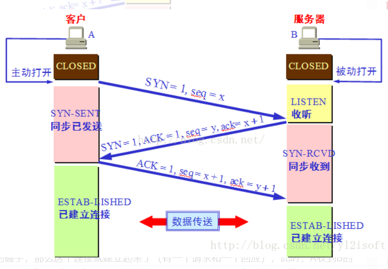
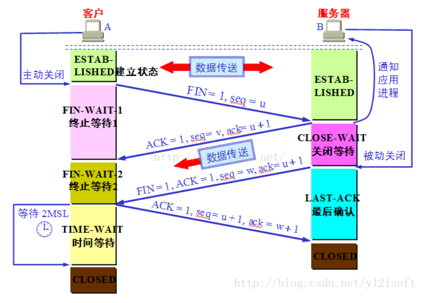
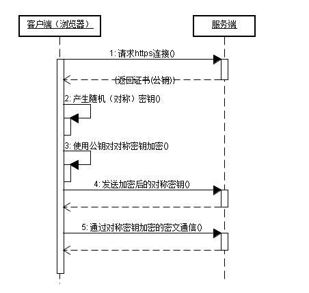
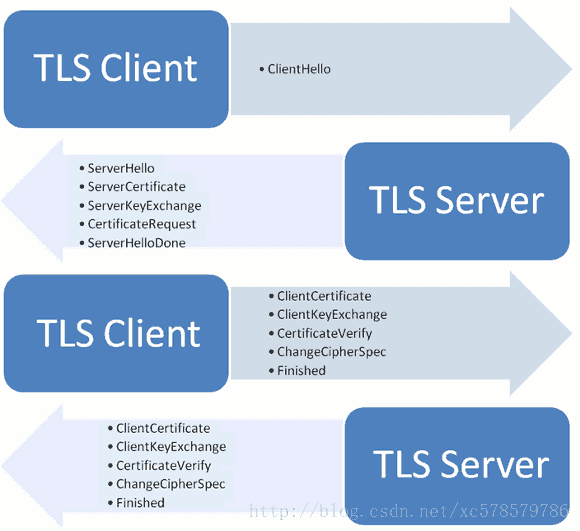

<!-- MarkdownTOC -->

- [1.讲一下TCP的连接和释放连接](#1讲一下tcp的连接和释放连接)
- [2.TCP有哪些应用场景](#2tcp有哪些应用场景)
- [3.tcp为什么可靠](#3tcp为什么可靠)
- [4.tcp为什么要建立连接](#4tcp为什么要建立连接)
- [5.讲一下浏览器从接收到一个URL到最后展示出页面,经历了哪些过程](#5讲一下浏览器从接收到一个url到最后展示出页面经历了哪些过程)
- [6.http和https的区别](#6http和https的区别)
    - [HTTP和HTTPS的基本概念](#http和https的基本概念)
    - [HTTP和HTTPS的主要特点和工作流程](#http和https的主要特点和工作流程)
    - [HTTP特点](#http特点)
    - [HTTP工作流程](#http工作流程)
    - [HTTPS特点](#https特点)
    - [HTTPS工作流程](#https工作流程)
    - [SSL](#ssl)
- [7.说说ssl四次握手的过程](#7说说ssl四次握手的过程)
- [8.http的请求有哪些,应答码502和504有什么区别](#8http的请求有哪些应答码502和504有什么区别)
- [9.http1.1和1.0以及HTTP/2的区别](#9http11和10以及http2的区别)
    - [http1.1和1.0主要区别主要体现在](#http11和10主要区别主要体现在)
    - [http1.x和http/2的区别](#http1x和http2的区别)
- [10.304状态码有什么含义](#10304状态码有什么含义)
- [11.arp协议,arp攻击](#11arp协议arp攻击)
- [12.icmp协议](#12icmp协议)
- [13.讲一下路由器和交换机的区别](#13讲一下路由器和交换机的区别)
- [14.DNS寻址过程](#14dns寻址过程)
- [15.负载均衡反向代理模式优点及缺点](#15负载均衡反向代理模式优点及缺点)
- [16.CentOS 和 Linux的关系](#16centos-和-linux的关系)
- [17.谈谈,64位和32位的区别](#17谈谈64位和32位的区别)
- [18.怎么杀死进程](#18怎么杀死进程)
- [19.线程,进程区别](#19线程进程区别)
- [20.系统线程数量上限是多少](#20系统线程数量上限是多少)
- [21.解释一下LINUX下线程,GDI类](#21解释一下linux下线程gdi类)

<!-- /MarkdownTOC -->

# 1.讲一下TCP的连接和释放连接
三次握手的过程

1）主机A向主机B发送TCP连接请求数据包，其中包含主机A的初始序列号seq(A)=x。（其中报文中同步标志位SYN=1，ACK=0，表示这是一个TCP连接请求数据报文；序号seq=x，表明传输数据时的第一个数据字节的序号是x）；

2）主机B收到请求后，会发回连接确认数据包。（其中确认报文段中，标识位SYN=1，ACK=1，表示这是一个TCP连接响应数据报文，并含主机B的初始序列号seq(B)=y，以及主机B对主机A初始序列号的确认号ack(B)=seq(A)+1=x+1）

3）第三次，主机A收到主机B的确认报文后，还需作出确认，即发送一个序列号seq(A)=x+1；确认号为ack(A)=y+1的报文；


四次挥手过程

假设主机A为客户端，主机B为服务器，其释放TCP连接的过程如下：
1） 关闭客户端到服务器的连接：首先客户端A发送一个FIN，用来关闭客户到服务器的数据传送，然后等待服务器的确认。其中终止标志位FIN=1，序列号seq=u。

2） 服务器收到这个FIN，它发回一个ACK，确认号ack为收到的序号加1。

3） 关闭服务器到客户端的连接：也是发送一个FIN给客户端。

4） 客户段收到FIN后，并发回一个ACK报文确认，并将确认序号seq设置为收到序号加1。 首先进行关闭的一方将执行主动关闭，而另一方执行被动关闭。


# 2.TCP有哪些应用场景
当对网络通讯质量有要求的时候，比如：整个数据要准确无误的传递给对方，这往往用于一些要求可靠的应用，比如HTTP、HTTPS、FTP等传输文件的协议，POP、SMTP等邮件传输的协议

# 3.tcp为什么可靠
三次握手，超时重传，滑动窗口，拥塞控制。

# 4.tcp为什么要建立连接
保证可靠连接

# 5.讲一下浏览器从接收到一个URL到最后展示出页面,经历了哪些过程
1.DNS解析
2.TCP连接
3.发送HTTP请求
4.服务器处理请求并返回HTTP报文
5.浏览器解析渲染页面

# 6.http和https的区别
1. https协议需要到ca申请证书，一般免费证书较少，因而需要一定费用。
2. http是超文本传输协议，信息是明文传输，https则是具有安全性的ssl加密传输协议。
3. http和https使用的是完全不同的连接方式，用的端口也不一样，前者是80，后者是443。
4. http的连接很简单，是无状态的；HTTPS协议是由SSL+HTTP协议构建的可进行加密传输、身份认证的网络协议，比http协议安全


## HTTP和HTTPS的基本概念
**HTTP:** 是互联网上应用最为广泛的一种网络协议，是一个客户端和服务器端请求和应答的标准（TCP），用于从WWW服务器传输超文本到本地浏览器的传输协议，它可以使浏览器更加高效，使网络传输减少。

**HTTPS:** 是以安全为目标的HTTP通道，简单讲是HTTP的安全版，即HTTP下加入SSL层，HTTPS的安全基础是SSL，因此加密的详细内容就需要SSL。

**HTTPS协议的主要作用可以分为两种:** 一种是建立一个信息安全通道，来保证数据传输的安全；另一种就是确认网站的真实性

## HTTP和HTTPS的主要特点和工作流程
## HTTP特点
1.支持客户/服务器模式。（C/S模式）
2.简单快速：客户向服务器请求服务时，只需传送请求方法和路径。请求方法常用的有GET、HEAD、POST。每种方法规定了客户与服务器联系的类型不同。由于HTTP协议简单，使得HTTP服务器的程序规模小，因而通信速度很快。
3.灵活：HTTP允许传输任意类型的数据对象。正在传输的类型由Content-Type加以标记。
4.无连接：无连接的含义是限制每次连接只处理一个请求。服务器处理完客户的请求，并收到客户的应答后，即断开连接。采用这种方式可以节省传输时间。
5.无状态：HTTP协议是无状态协议。无状态是指协议对于事务处理没有记忆能力。缺少状态意味着如果后续处理需要前面的信息，则它必须重传，这样可能导致每次连接传送的数据量增大。另一方面，在服务器不需要先前信息时它的应答就较快

## HTTP工作流程
1. 建立TCP/IP连接，客户端与服务器通过Socket三次握手进行连接
2. 客户端向服务端发起HTTP请求（例如：POST/login.html http/1.1）
3. 客户端发送请求头信息，请求内容，最后会发送一空白行，标示客户端请求完毕
4. 服务器做出应答，表示对于客户端请求的应答，例如：HTTP/1.1 200 OK
5. 服务器向客户端发送应答头信息
6. 服务器向客户端发送请求头信息后，也会发送一空白行，标示应答头信息发送完毕，接着就以Content-type要求的数据格式发送数据给客户端
7. 服务端关闭TCP连接，如果服务器或者客户端增Connection:keep-alive就表示客户端与服务器端继续保存连接，在下次请求时可以继续使用这次的连接

## HTTPS特点
HTTPS是HTTP协议的修改，它加密数据并确保其机密性。其配置可保护用户在与网站交互时免于窃取个人信息和计费数据。

1. 优点：相比于http，https可以提供更加优质保密的信息，保证了用户数据的安全性，此外https同时也一定程度上保护了服务端，使用恶意攻击和伪装数据的成本大大提高。
2. 缺点：缺点也同样很明显，第一https的技术门槛较高，多数个人或者私人网站难以支撑，CA机构颁发的证书都是需要年费的，此外对接Https协议也需要额外的技术支持；其二，目前来说大多数网站并不关心数据的安全性和保密性，其https最大的优点对它来说并不适用；其三，https加重了服务端的负担，相比于http其需要更多的资源来支撑，同时也降低了用户的访问速度；第四，目前来说Http网站仍然大规模使用，在浏览器侧也没有特别大的差别，很多用户不关心的话根本不感知。

## HTTPS工作流程

第一步：客户使用https的URL访问Web服务器，要求与Web服务器建立SSL连接。

第二步：Web服务器收到客户端请求后，会将网站的证书信息（证书中包含公钥）传送一份给客户端。

第三步：客户端的浏览器与Web服务器开始协商SSL连接的安全等级，也就是信息加密的等级。

第四步：客户端的浏览器根据双方同意的安全等级，建立会话密钥，然后利用网站的公钥将会话密钥加密，并传送给网站。

第五步：Web服务器利用自己的私钥解密出会话密钥。

第六步：Web服务器利用会话密钥加密与客户端之间的通信。

## SSL
HTTP+SSL = HTTPS

HTTPS之所以安全就是因为加持了SSL协议来对传输的数据进行加密。那么具体的加密方式是什么呢？

首先先介绍俩个概念：

- 对称加密
- 非对称加密

__对称加密：__  通俗的解释是一个字符串可以通过某一个密钥进行加密和解密。   
亲，你作过弊么？😑不要告诉我在你漫长的学生生涯里你没作过弊(那你的学生生涯得多枯燥)，作弊我们常用的方法是啥？(说把答案写在胳膊大腿纸条上的同学请你出去，谢谢🙂)当然是加密了！比如我出于人道主义，想要帮助小明同学作弊，首先考试前我们会约定好一个暗号来传递选择题的答案，摸头发——A，摸耳朵——B，咳嗽——C，跺脚——D，于是一个加密方法就诞生了，这个加密方法只有我和小明知道，老师虽然看我抓耳挠腮但他顶多把我当成神经病，并没有直接证据说我作弊。好，这种我和小明知道，别人不知道的加密方法就是一种对称加密算法,对称加密算法也是我们日常最常见的加密算法。这种算法🔑只有一把，加密解密都用同一把钥匙，一旦🔑泄露就全玩完了。

__非对称加密:__ 该方法有俩个密钥🔑，一个公钥和一个私钥，这俩🔑是成对的。有俩种方式，公钥加密私钥解密或者私钥加密公钥解密。通常公钥加密，私钥解密用的居多。 __用其中一个密钥把明文加密后所得的密文，只能用相对应的另一个密钥才能解密得到原本的明文；甚至连最初用来加密的密钥也不能用作解密。由于加密和解密需要两个不同的密钥，故被称为非对称加密；__

<font color="red">
将a和b相乘得出乘积c很容易，但要是想要通过乘积c推导出a和b极难。即对一个大数进行因式分解极难
c = a * b
</font>

假设c为公钥，b为私钥。因此，公钥加密的密文只能用私钥解密，私钥加密的密文只能用公钥解密。

__加密过程__

假设客户端叫做爱丽丝，服务器叫做鲍勃。

1. 爱丽丝与鲍伯事先互不认识，也没有可靠安全的沟通渠道，但爱丽丝现在却要透过不安全的互联网向鲍伯发送信息
2. 爱丽丝撰写好原文，原文在未加密的状态下称之为明文x
3. 鲍伯使用密码学安全伪随机数生成器产生一对密钥，其中一个作为公钥为c，另一个作为私钥b
4. 鲍伯可以用任何方法发送公钥c 给爱丽丝，即使伊夫在中间窃听到c也没问题
5. 爱丽丝用公钥c把明文x进行加密，得到密文c(x)
6. 爱丽丝可以用任何方法传输密文c(x)给鲍伯，即使伊夫在中间窃听到密文c(x)也没问题
7. 鲍伯收到密文，用私钥b对密文进行解密b(c(x))，得到爱丽丝撰写的明文x
8. 由于伊夫没有得到鲍伯的私钥b，所以无法得知明文x
9. 如果爱丽丝丢失了她自己撰写的原文x，在没有得到鲍伯的私钥b的情况下，她的处境将等同伊夫，即无法透过鲍伯的公钥c和密文c(x)重新得到原文x

非对称加密的典型代表算法：RSA算法

可如果第三者伊夫发送给爱丽丝他自己的公钥，然后爱丽丝用伊夫给的公钥加密密文发送了出去，伊夫再通过自己的私钥解密，这不就泄露信息了么？我们需要想个办法让爱丽丝判断这个公钥到底是不是鲍勃发来的。

于是就有了数字证书的概念：
```
数字证书就是互联网通讯中标志通讯各方身份信息的一串数字，提供了一种在Internet上验证通信实体身份的方式，数字证书不是数字身份证，而是身份认证机构盖在数字身份证上的一个章或印（或者说加在数字身份证上的一个签名）。
```

数字证书是由权威机构——CA机构统一来进行发行，我们绝对信任这个机构，至于CA机构的安全性…反正99.99%之下都是安全的。🕵

为了防止中间有人对证书内容进行更改，有了一个数字签名的概念，所谓的数字签名就是把以上所有的内容做一个Hash操作，得到一个固定长度然后再传给鲍勃。然而如果别人截取了这个证书然后更改内容，同时生成了新的Hash值那怎么办？处于这个考虑，CA机构在颁发这个证书的时候会用自己的私钥将Hash值加密，从而防止了数字证书被篡改。

验证是否是鲍勃发来的信息的流程：
1. 首先，当爱丽丝开启一个新的浏览器第一次去访问鲍勃的时候，会先让爱丽丝安装一个数字证书，这个数字证书里包含的主要信息就是CA机构的公钥。
2. 鲍勃发送来了CA机构颁发给自己的数字证书，爱丽丝通过第一步中已经得到的公钥解密CA用私钥加密的Hash-a(这个过程就是非对称加密)，然后再用传递过来的HASH算法生成一个Hash-b，如果Hash-a===Hash-b就说明认证通过，确实是鲍勃发过来的。

如上，是整个数字证书的使用过程就是这样的。多说一句，非对称加密实际应用的例子除了SSL还有很多，比如SSH、电子签名等；

如上提到的，非对称加密计算量很大，效率不如对称加密，我们打开网页最注重的是啥？是速度！是速度！是速度！🏃🏃🏃

这点SSL就玩的很巧妙了🤣，通信双方通过对称加密来加密密文，然后使用非对称加密的方式来传递对称加密所使用的密钥。这样效率和安全就都能保证了。

# 7.说说ssl四次握手的过程


1、 客户端发出请求

首先，客户端（通常是浏览器）先向服务器发出加密通信的请求，这被叫做ClientHello请求。

2、服务器回应

服务器收到客户端请求后，向客户端发出回应，这叫做SeverHello。

3、客户端回应

客户端收到服务器回应以后，首先验证服务器证书。如果证书不是可信机构颁布、或者证书中的域名与实际域名不一致、或者证书已经过期，就会向访问者显示一个警告，由其选择是否还要继续通信。

4、服务器的最后回应

服务器收到客户端的第三个随机数pre-master key之后，计算生成本次会话所用的"会话密钥"。然后，向客户端最后发送下面信息。

（1）编码改变通知，表示随后的信息都将用双方商定的加密方法和密钥发送。

（2）服务器握手结束通知，表示服务器的握手阶段已经结束。这一项同时也是前面发送的所有内容的hash值，用来供客户端校验。

至此，整个握手阶段全部结束。接下来，客户端与服务器进入加密通信，就完全是使用普通的HTTP协议，只不过用"会话密钥"加密内容。


# 8.http的请求有哪些,应答码502和504有什么区别
OPTIONS：返回服务器针对特定资源所支持的HTTP请求方法。也可以利用向Web服务器发送"\*"的请求来测试服务器的功能性。

HEAD：向服务器索要与GET请求相一致的响应，只不过响应体将不会被返回。这一方法可以在不必传输整个响应内容的情况下，就可以获取包含在响应消息头中的元信息。

GET：向特定的资源发出请求。

POST：向指定资源提交数据进行处理请求（例如提交表单或者上传文件）。数据被包含在请求体中。POST请求可能会导致新的资源的创建和/或已有资源的修改。

PUT：向指定资源位置上传其最新内容。

DELETE：请求服务器删除Request-URI所标识的资源。

TRACE：回显服务器收到的请求，主要用于测试或诊断。

CONNECT：HTTP/1.1协议中预留给能够将连接改为管道方式的代理服务器。

虽然HTTP的请求方式有8种，但是我们在实际应用中常用的也就是get和post，其他请求方式也都可以通过这两种方式间接的来实现。

502：作为网关或者代理工作的服务器尝试执行请求时，从上游服务器接收到无效的响应。

504：作为网关或者代理工作的服务器尝试执行请求时，未能及时从上游服务器（URI标识出的服务器，例如HTTP、FTP、LDAP）或者辅助服务器（例如DNS）收到响应。

# 9.http1.1和1.0以及HTTP/2的区别
##http1.1和1.0主要区别主要体现在
1. **缓存处理** 在HTTP1.0中主要使用header里的If-Modified-Since,Expires来做为缓存判断的标准，HTTP1.1则引入了更多的缓存控制策略例如Entity tag，If-Unmodified-Since, If-Match, If-None-Match等更多可供选择的缓存头来控制缓存策略。

2. **带宽优化及网络连接的使用** HTTP1.0中，存在一些浪费带宽的现象，例如客户端只是需要某个对象的一部分，而服务器却将整个对象送过来了，并且不支持断点续传功能，HTTP1.1则在请求头引入了range头域，它允许只请求资源的某个部分，即返回码是206（Partial Content），这样就方便了开发者自由的选择以便于充分利用带宽和连接。

3. **错误通知的管理** 在HTTP1.1中新增了24个错误状态响应码，如409（Conflict）表示请求的资源与资源的当前状态发生冲突；410（Gone）表示服务器上的某个资源被永久性的删除。

4. **Host头处理** 在HTTP1.0中认为每台服务器都绑定一个唯一的IP地址，因此，请求消息中的URL并没有传递主机名（hostname）。但随着虚拟主机技术的发展，在一台物理服务器上可以存在多个虚拟主机（Multi-homed Web Servers），并且它们共享一个IP地址。HTTP1.1的请求消息和响应消息都应支持Host头域，且请求消息中如果没有Host头域会报告一个错误（400 Bad Request）。

5. **长连接** HTTP 1.1支持长连接（PersistentConnection）和请求的流水线（Pipelining）处理，在一个TCP连接上可以传送多个HTTP请求和响应，减少了建立和关闭连接的消耗和延迟，在HTTP1.1中默认开启Connection：keep-alive，一定程度上弥补了HTTP1.0每次请求都要创建连接的缺点。

## http1.x和http/2的区别
1. __新的二进制格式__ HTTP1.x的解析是基于文本。基于文本协议的格式解析存在天然缺陷，文本的表现形式有多样性，要做到健壮性考虑的场景必然很多，二进制则不同，只认0和1的组合。基于这种考虑HTTP2.0的协议解析决定采用二进制格式，实现方便且健壮。
2. __多路复用__ 即连接共享，即每一个request都是是用作连接共享机制的。一个request对应一个id，这样一个连接上可以有多个request，每个连接的request可以随机的混杂在一起，接收方可以根据request的 id将request再归属到各自不同的服务端请求里面。
3. __header压缩__ 对前面提到过HTTP1.x的header带有大量信息，而且每次都要重复发送，HTTP2.0使用encoder来减少需要传输的header大小，通讯双方各自cache一份header fields表，既避免了重复header的传输，又减小了需要传输的大小。
4. __服务端推送__ 同SPDY一样，HTTP2.0也具有server push功能。

# 10.304状态码有什么含义
304(未修改)自从上次请求后，请求的网页未修改过。服务器返回此响应时，不会返回网页内容。如果网页自请求者上次请求后再也没有更改过，您应将服务器配置为返回此响应(称为 If-Modified-Since HTTP 标头)。服务器可以告诉 Googlebot 自从上次抓取后网页没有变更，进而节省带宽和开销

# 11.arp协议,arp攻击
地址解析协议。ARP攻击的第一步就是ARP欺骗。由上述“ARP协议的工作过程”我们知道，ARP协议基本没有对网络的安全性做任何思考，当时人们考虑的重点是如何保证网络通信能够正确和快速的完成——ARP协议工作的前提是默认了其所在的网络是一个善良的网络，每台主机在向网络中发送应答信号时都是使用的真实身份。不过后来，人们发现ARP应答中的IP地址和MAC地址中的信息是可以伪造的，并不一定是自己的真实IP地址和MAC地址，由此，ARP欺骗就产生了。

# 12.icmp协议
它是TCP/IP协议族的一个子协议，用于在IP主机、路由器之间传递控制消息。控制消息是指网络通不通、主机是否可达、路由是否可用等网络本身的消息。这些控制消息虽然并不传输用户数据，但是对于用户数据的传递起着重要的作用。

# 13.讲一下路由器和交换机的区别
交换机用于同一网络内部数据的快速传输转发决策通过查看二层头部完成转发不需要修改数据帧工作在 TCP/IP 协议的二层 —— 数据链路层工作简单，直接使用硬件处理路由器用于不同网络间数据的跨网络传输转发决策通过查看三层头部完成转发需要修改 TTL ，IP 头部校验和需要重新计算，数据帧需要重新封装工作在 TCP/IP 协议的三层 —— 网络层工作复杂，使用软件处理。

# 14.DNS寻址过程
1. 在浏览器中输入www.qq.com域名，操作系统会先检查自己本地的hosts文件是否有这个网址映射关系，如果有，就先调用这个IP地址映射，完成域名解析。
2. 如果hosts里没有这个域名的映射，则查找本地DNS解析器缓存，是否有这个网址映射关系，如果有，直接返回，完成域名解析。
3. 如果hosts与本地DNS解析器缓存都没有相应的网址映射关系，首先会找TCP/ip参数中设置的首选DNS服务器，在此我们叫它本地DNS服务器，此服务器收到查询时，如果要查询的域名，包含在本地配置区域资源中，则返回解析结果给客户机，完成域名解析，此解析具有权威性。
4. 如果要查询的域名，不由本地DNS服务器区域解析，但该服务器已缓存了此网址映射关系，则调用这个IP地址映射，完成域名解析，此解析不具有权威性。
5. 如果本地DNS服务器本地区域文件与缓存解析都失效，则根据本地DNS服务器的设置（是否设置转发器）进行查询，如果未用转发模式，本地DNS就把请求发至13台根DNS，根DNS服务器收到请求后会判断这个域名(.com)是谁来授权管理，并会返回一个负责该顶级域名服务器的一个IP。本地DNS服务器收到IP信息后，将会联系负责.com域的这台服务器。这台负责.com域的服务器收到请求后，如果自己无法解析，它就会找一个管理.com域的下一级DNS服务器地址(qq.com)给本地DNS服务器。当本地DNS服务器收到这个地址后，就会找qq.com域服务器，重复上面的动作，进行查询，直至找到www.qq.com主机。
6. 如果用的是转发模式，此DNS服务器就会把请求转发至上一级DNS服务器，由上一级服务器进行解析，上一级服务器如果不能解析，或找根DNS或把转请求转至上上级，以此循环。不管是本地DNS服务器用是是转发，还是根提示，最后都是把结果返回给本地DNS服务器，由此DNS服务器再返回给客户机。

从客户端到本地DNS服务器是属于递归查询，而DNS服务器之间就是的交互查询就是迭代查询。

# 15.负载均衡反向代理模式优点及缺点
1）反向代理（Reverse Proxy）方式是指以代理服务器来接受internet上的连接请求，然后将请求转发给内部网络上的服务器，并将从服务器上得到的结果返回给internet上请求连接的客户端，此时代理服务器对外就表现为一个服务器。

2）反向代理负载均衡技术是把将来自internet上的连接请求以反向代理的方式动态地转发给内部网络上的多台服务器进行处理，从而达到负载均衡的目的。

3）反向代理负载均衡能以软件方式来实现，如apache mod_proxy、netscape proxy等，也可以在高速缓存器、负载均衡器等硬件设备上实现。反向代理负载均衡可以将优化的负载均衡策略和代理服务器的高速缓存技术结合在一起，提升静态网页的访问速度，提供有益的性能；由于网络外部用户不能直接访问真实的服务器，具备额外的安全性（同理，NAT负载均衡技术也有此优点）。

4）其缺点主要表现在以下两个方面

反向代理是处于OSI参考模型第七层应用的，所以就必须为每一种应用服务专门开发一个反向代理服务器，这样就限制了反向代理负载均衡技术的应用范围，现在一般都用于对web服务器的负载均衡。

针对每一次代理，代理服务器就必须打开两个连接，一个对外，一个对内，因此在并发连接请求数量非常大的时候，代理服务器的负载也就非常大了，在最后代理服务器本身会成为服务的瓶颈。

一般来讲，可以用它来对连接数量不是特别大，但每次连接都需要消耗大量处理资源的站点进行负载均衡，如search等。

# 16.CentOS 和 Linux的关系
CentOS是Linux众多得发行版本之一，linux有三大发行版本（：Slackware、debian、redhat）,而Redhat有收费的商业版和免费的开源版,商业版的业内称之为RHEL系列，CentOS是来自于依照开放源代码规定而公布的源代码重新编译而成。可以用CentOS替代商业版的RHEL使用。两者的不同，CentOS不包含封闭源代码软件，是免费的。

# 17.谈谈,64位和32位的区别
操作系统只是硬件和应用软件中间的一个平台。32位操作系统针对的32位的CPU设计。64位操作系统针对的64位的CPU设计。

# 18.怎么杀死进程
先使用命令ps 让计算机罗列出所有进程的ID 然后使用命令kill ID

# 19.线程,进程区别
进程和线程的主要差别在于它们是不同的操作系统资源管理方式。进程有独立的地址空间，一个进程崩溃后，在保护模式下不会对其它进程产生影响，而线程只是一个进程中的不同执行路径。线程有自己的堆栈和局部变量，但线程之间没有单独的地址空间，一个线程死掉就等于整个进程死掉，所以多进程的程序要比多线程的程序健壮，但在进程切换时，耗费资源较大，效率要差一些。但对于一些要求同时进行并且又要共享某些变量的并发操作，只能用线程，不能用进程。

1) 简而言之,一个程序至少有一个进程,一个进程至少有一个线程.

2) 线程的划分尺度小于进程，使得多线程程序的并发性高。

3) 另外，进程在执行过程中拥有独立的内存单元，而多个线程共享内存，从而极大地提高了程序的运行效率。

4) 线程在执行过程中与进程还是有区别的。每个独立的线程有一个程序运行的入口、顺序执行序列和程序的出口。但是线程不能够独立执行，必须依存在应用程序中，由应用程序提供多个线程执行控制。

5) 从逻辑角度来看，多线程的意义在于一个应用程序中，有多个执行部分可以同时执行。但操作系统并没有将多个线程看做多个独立的应用，来实现进程的调度和管理以及资源分配。这就是进程和线程的重要区别。

# 20.系统线程数量上限是多少
Linux 系统中单个进程的最大线程数有其最大的限制 PTHREAD_THREADS_MAX。

这个限制可以在/usr/include/bits/local_lim.h中查看 ，对 linuxthreads 这个值一般是 1024，对于 nptl 则没有硬性的限制，仅仅受限于系统的资源。

这个系统的资源主要就是线程的 stack 所占用的内存，用 ulimit -s 可以查看默认的线程栈大小，一般情况下，这个值是8M=8192KB。

# 21.解释一下LINUX下线程,GDI类
LINUX实现的就是基于核心轻量级进程的”一对一”线程模型，一个线程实体对应一个核心轻量级进程，而线程之间的管理在核外函数库中实现。

GDI类为图像设备编程接口类库。
