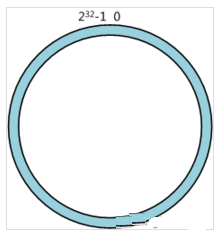
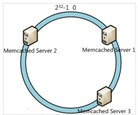
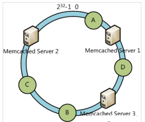
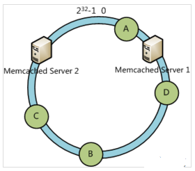
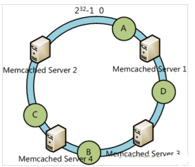
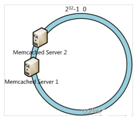
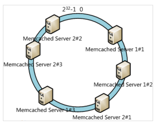

# 1. socket编程，BIO，NIO，epoll？
### BIO
有了Block的定义，就可以讨论BIO和NIO了。BIO是Blocking IO的意思。在类似于网络中进行read, write, connect一类的系统调用时会被卡住。

举个例子，当用read去读取网络的数据时，是无法预知对方是否已经发送数据的。因此在收到数据之前，能做的只有等待，直到对方把数据发过来，或者等到网络超时。

对于单线程的网络服务，这样做就会有卡死的问题。因为当等待时，整个线程会被挂起，无法执行，也无法做其他的工作。

 顺便说一句，这种Block是不会影响同时运行的其他程序（进程）的，因为现代操作系统都是多任务的，任务之间的切换是抢占式的。这里Block只是指Block当前的进程。


于是，网络服务为了同时响应多个并发的网络请求，必须实现为多线程的。每个线程处理一个网络请求。线程数随着并发连接数线性增长。这的确能奏效。实际上2000年之前很多网络服务器就是这么实现的。但这带来两个问题：

线程越多，Context Switch就越多，而Context Switch是一个比较重的操作，会无谓浪费大量的CPU。
每个线程会占用一定的内存作为线程的栈。比如有1000个线程同时运行，每个占用1MB内存，就占用了1个G的内存。
 也许现在看来1GB内存不算什么，现在服务器上百G内存的配置现在司空见惯了。但是倒退20年，1G内存是很金贵的。并且，尽管现在通过使用大内存，可以轻易实现并发1万甚至10万的连接。但是水涨船高，如果是要单机撑1千万的连接呢？


问题的关键在于，当调用read接受网络请求时，有数据到了就用，没数据到时，实际上是可以干别的。使用大量线程，仅仅是因为Block发生，没有其他办法。

当然你可能会说，是不是可以弄个线程池呢？这样既能并发的处理请求，又不会产生大量线程。但这样会限制最大并发的连接数。比如你弄4个线程，那么最大4个线程都Block了就没法响应更多请求了。

要是操作IO接口时，操作系统能够总是直接告诉有没有数据，而不是Block去等就好了。于是，NIO登场。
### NIO
NIO是指将IO模式设为“Non-Blocking”模式。在Linux下，一般是这样：
```c
void setnonblocking(int fd) {
    int flags = fcntl(fd, F_GETFL, 0);
    fcntl(fd, F_SETFL, flags | O_NONBLOCK);
    // 再强调一下，以上操作只对socket对应的文件描述符有意义；对磁盘文件的文件描述符做此设置总会成功，但是会直接被忽略
}
```
这时，BIO和NIO的区别是什么呢？

在BIO模式下，调用read，如果发现没数据已经到达，就会Block住。

在NIO模式下，调用read，如果发现没数据已经到达，就会立刻返回-1, 并且errno被设为EAGAIN。

*在有些文档中写的是会返回EWOULDBLOCK。实际上，在Linux下EAGAIN和EWOULDBLOCK是一样的，即#define EWOULDBLOCK EAGAIN*

于是，一段NIO的代码，大概就可以写成这个样子。
```c
struct timespec sleep_interval{.tv_sec = 0, .tv_nsec = 1000};
ssize_t nbytes;
while (1) {
    /*尝试读取*/
    if ((nbytes = read(fd, buf, sizeof(buf))) < 0) {
        if (errno == EAGAIN) { // 没数据到
            perror("nothing can be read");
        } else {
            perror("fatal error");
            exit(EXIT_FAILURE);
        }
    } else { // 有数据
        process_data(buf, nbytes);
    }
    // 处理其他事情，做完了就等一会，再尝试
    nanosleep(sleep_interval, NULL);
}
```
这段代码很容易理解，就是轮询，不断的尝试有没有数据到达，有了就处理，没有(得到EWOULDBLOCK或者EAGAIN)就等一小会再试。这比之前BIO好多了，起码程序不会被卡死了。

但这样会带来两个新问题：

如果有大量文件描述符都要等，那么就得一个一个的read。这会带来大量的Context Switch（read是系统调用，每调用一次就得在用户态和核心态切换一次）
休息一会的时间不好把握。这里是要猜多久之后数据才能到。等待时间设的太长，程序响应延迟就过大；设的太短，就会造成过于频繁的重试，干耗CPU而已。
要是操作系统能一口气告诉程序，哪些数据到了就好了。

于是IO多路复用被搞出来解决这个问题。

### IO多路复用
IO多路复用（IO Multiplexing) 是这么一种机制：程序注册一组socket文件描述符给操作系统，表示“我要监视这些fd是否有IO事件发生，有了就告诉程序处理”。

IO多路复用是要和NIO一起使用的。尽管在操作系统级别，NIO和IO多路复用是两个相对独立的事情。NIO仅仅是指IO API总是能立刻返回，不会被Blocking；而IO多路复用仅仅是操作系统提供的一种便利的通知机制。操作系统并不会强制这俩必须得一起用——你可以用NIO，但不用IO多路复用，就像上一节中的代码；也可以只用IO多路复用 + BIO，这时效果还是当前线程被卡住。但是，IO多路复用和NIO是要配合一起使用才有实际意义。因此，在使用IO多路复用之前，请总是先把fd设为O_NONBLOCK。

对IO多路复用，还存在一些常见的误解，比如：
- ❌IO多路复用是指多个数据流共享同一个Socket。其实IO多路复用说的是多个Socket，只不过操作系统是一起监听他们的事件而已。
  多个数据流共享同一个TCP连接的场景的确是有，比如Http2 Multiplexing就是指Http2通讯中中多个逻辑的数据流共享同一个TCP连接。但这与IO多路复用是完全不同的问题。


- ❌IO多路复用是NIO，所以总是不Block的。其实IO多路复用的关键API调用(select，poll，epoll_wait）总是Block的，正如下文的例子所讲。
- ❌IO多路复用和NIO一起减少了IO。实际上，IO本身（网络数据的收发）无论用不用IO多路复用和NIO，都没有变化。请求的数据该是多少还是多少；网络上该传输多少数据还是多少数据。IO多路复用和NIO一起仅仅是解决了调度的问题，避免CPU在这个过程中的浪费，使系统的瓶颈更容易触达到网络带宽，而非CPU或者内存。要提高IO吞吐，还是提高硬件的容量（例如，用支持更大带宽的网线、网卡和交换机）和依靠并发传输（例如HDFS的数据多副本并发传输）。

操作系统级别提供了一些接口来支持IO多路复用，最老掉牙的是select和poll。
### select
select长这样：
```c
int select(int nfds, fd_set *readfds, fd_set *writefds, fd_set *exceptfds, struct timeval *timeout);
```
它接受3个文件描述符的数组，分别监听读取(readfds)，写入(writefds)和异常(expectfds)事件。那么一个 IO多路复用的代码大概是这样：
```c
struct timeval tv = {.tv_sec = 1, .tv_usec = 0};

ssize_t nbytes;
while(1) {
    FD_ZERO(&read_fds);
    setnonblocking(fd1);
    setnonblocking(fd2);
    FD_SET(fd1, &read_fds);
    FD_SET(fd2, &read_fds);
    // 把要监听的fd拼到一个数组里，而且每次循环都得重来一次...
    if (select(FD_SETSIZE, &read_fds, NULL, NULL, &tv) < 0) { // block住，直到有事件到达
        perror("select出错了");
        exit(EXIT_FAILURE);
    }
    for (int i = 0; i < FD_SETSIZE; i++) {
        if (FD_ISSET(i, &read_fds)) {
            /*检测到第[i]个读取fd已经收到了，这里假设buf总是大于到达的数据，所以可以一次read完*/
            if ((nbytes = read(i, buf, sizeof(buf))) >= 0) {
                process_data(nbytes, buf);
            } else {
                perror("读取出错了");
                exit(EXIT_FAILURE);
            }
        }
    }
}
```
首先，为了select需要构造一个fd数组（这里为了简化，没有构造要监听写入和异常事件的fd数组）。之后，用select监听了read_fds中的多个socket的读取时间。调用select后，程序会Block住，直到一个事件发生了，或者等到最大1秒钟(tv定义了这个时间长度）就返回。之后，需要遍历所有注册的fd，挨个检查哪个fd有事件到达(FD_ISSET返回true)。如果是，就说明数据已经到达了，可以读取fd了。读取后就可以进行数据的处理。

select有一些发指的缺点：

- select能够支持的最大的fd数组的长度是1024。这对要处理高并发的web服务器是不可接受的。
- fd数组按照监听的事件分为了3个数组，为了这3个数组要分配3段内存去构造，而且每次调用select前都要重设它们（因为select会改这3个数组)；调用select后，这3数组要从用户态复制一份到内核态；事件到达后，要遍历这3数组。很不爽。
- select返回后要挨个遍历fd，找到被“SET”的那些进行处理。这样比较低效。
- select是无状态的，即每次调用select，内核都要重新检查所有被注册的fd的状态。select返回后，这些状态就被返回了，内核不会记住它们；到了下一次调用，内核依然要重新检查一遍。于是查询的效率很低。
### poll
poll与select类似于。它大概长这样：
```c
int poll(struct pollfd *fds, nfds_t nfds, int timeout);
```
poll的代码例子和select差不多，因此也就不赘述了。有意思的是poll这个单词的意思是“轮询”，所以很多中文资料都会提到对IO进行“轮询”。

*上面说的select和下文说的epoll本质上都是轮询。*

poll优化了select的一些问题。比如不再有3个数组，而是1个polldfd结构的数组了，并且也不需要每次重设了。数组的个数也没有了1024的限制。但其他的问题依旧：

- 依然是无状态的，性能的问题与select差不多一样；
- 应用程序仍然无法很方便的拿到那些“有事件发生的fd“，还是需要遍历所有注册的fd。

目前来看，高性能的web服务器都不会使用select和poll。他们俩存在的意义仅仅是“兼容性”，因为很多操作系统都实现了这两个系统调用。

如果是追求性能的话，在BSD/macOS上提供了kqueue api；在Salorias中提供了/dev/poll（可惜该操作系统已经凉凉)；而在Linux上提供了epoll api。它们的出现彻底解决了select和poll的问题。Java NIO，nginx等在对应的平台的上都是使用这些api实现。

因为大部分情况下我会用Linux做服务器，所以下文以Linux epoll为例子来解释多路复用是怎么工作的。

# 2. 什么是页式存储？
主存被等分成大小相等的片，称为主存块，又称为实页。

当一个用户程序装入内存时，以页面为单位进行分配。页面的大小是为2n ,通常为1KB、2KB、2n KB等。

页式存储是指存储的时候以页面作为基本的存储单位,一个大的作业分存在N个页里,当执行作业的时候不需要同事加载所有的页,而是用到哪些加载哪些,页式存储让资源的效率更高

# 3. 操作系统里的内存碎片你怎么理解，有什么解决办法？
内存碎片分为：内部碎片和外部碎片。

内部碎片就是已经被分配出去（能明确指出属于哪个进程）却不能被利用的内存空间；

内部碎片是处于区域内部或页面内部的存储块。占有这些区域或页面的进程并不使用这个存储块。而在进程占有这块存储块时，系统无法利用它。直到进程释放它，或进程结束时，系统才有可能利用这个存储块。

单道连续分配只有内部碎片。多道固定连续分配既有内部碎片，又有外部碎片。

外部碎片指的是还没有被分配出去（不属于任何进程），但由于太小了无法分配给申请内存空间的新进程的内存空闲区域。

外部碎片是出于任何已分配区域或页面外部的空闲存储块。这些存储块的总和可以满足当前申请的长度要求，但是由于它们的地址不连续或其他原因，使得系统无法满足当前申请。

使用伙伴系统算法。

# 4. 什么情况下会发生死锁，解决策略有哪些？
（一）互斥条件：一个资源一次只能被一个进程访问。即某个资源在一段时间内只能由一个进程占有，不能同时被两个或两个以上的进程占 有。这种独占资源如CD-ROM驱动器，打印机等等，必须在占有该资源的进程主动释放它之后，其它进程才能占有该资源。这是由资源本身的属性所决定的。

（二）请求与保持条件：一个进程因请求资源而阻塞时，对已获得的资源保持不放。进程至少已经占有一个资源，但又申请新的资源；由于该资源已被另外进程占有，此时该进程阻塞；但是，它在等待新资源之时，仍继续占用已占有的资源。

（三）不剥夺条件：进程已经获得的资源，在未使用完之前不能强行剥夺，而只能由该资源的占有者进程自行释放。

（四）循环等待条件：若干资源形成一种头尾相接的循环等待资源关系。

解决方法：银行家算法

什么是死锁？

死锁是指两个或两个以上的进程在执行过程中，由于竞争资源或者由于彼此通信而造成的一种阻塞的现象，若无外力作用，它们都将无法推进下去。此时称系统处于死锁状态或系统产生了死锁，这些永远在互相等待的进程称为死锁进程。

死锁的四个必要条件
- 互斥条件（Mutual exclusion）：资源不能被共享，只能由一个进程使用。
- 请求与保持条件（Hold and wait）：已经得到资源的进程可以再次申请新的资源。
- 不剥夺条件（No pre-emption）：已经分配的资源不能从相应的进程中被强制地剥夺。
- 循环等待条件（Circular wait）：系统中若干进程组成环路，该环路中每个进程都在等待相邻进程正占用的资源。

处理死锁的策略

1. 死锁预防。如进程需要的所有资源，在一开始就全部申请好得到之后再开始执行。
2. 死锁避免。如进程每次申请申请资源的时候，根据一定的算法（银行家算法），去看该请求可不可能造成死锁，如果可能，就不给它分配该资源。
3. 死锁处理。破坏四个必要条件的其中一个，比如kill掉一个进程。
4. 死锁忽略

# 5. 系统CPU比较高是什么原因
1. 首先查看是哪些进程的CPU占用率最高（如下可以看到详细的路径）：ps -aux --sort -pcpu | more
2. 位有问题的线程可以用如下命令：ps -mp pid -o THREAD,tid,time | more
3. 查看JAVA进程的每个线程的CPU占用率
ps -Lp 5798 cu | more        # 5798是查出来进程PID
4. 追踪线程，查看负载过高的原因，使用JDK下的一个工具
jstack 5798                        # 5798是PID

jstack -J-d64 -m 5798       # -j-d64指定64为系统

jstack 查出来的线程ID是16进制，可以把输出追加到文件，导出用记事本打开，再根据系统中的线程ID去搜索查看该ID的线程运行内容，可以和开发一起排查。

# 6. 系统如何提高并发性
1、提高CPU并发计算能力

（1）多进程&多线程

（2）减少进程切换，使用线程，考虑进程绑定CPU

（3）减少使用不必要的锁，考虑无锁编程

（4）考虑进程优先级

（5）关注系统负载

2、改进I/O模型

(1)DMA技术

(2)异步I/O

(3)改进多路I/O就绪通知策略，epoll

(4)Sendfile

(5)内存映射

(6)直接I/O

# 7. 一致性哈希算法
###分布式算法
在做服务器负载均衡时候可供选择的负载均衡的算法有很多，包括： 轮循算法(Round Robin)、哈希算法(HASH)、最少连接算法(Least Connection)、响应速度算法(Response Time)、加权法(Weighted )等。其中哈希算法是最为常用的算法.

典型的应用场景是： 有N台服务器提供缓存服务，需要对服务器进行负载均衡，将请求平均分发到每台服务器上，每台机器负责1/N的服务。

常用的算法是对hash结果取余数 (hash() mod N )：对机器编号从0到N-1，按照自定义的 hash()算法，对每个请求的hash()值按N取模，得到余数i，然后将请求分发到编号为i的机器。但这样的算法方法存在致命问题，如果某一台机器宕机，那么应该落在该机器的请求就无法得到正确的处理，这时需要将当掉的服务器从算法从去除，此时候会有(N-1)/N的服务器的缓存数据需要重新进行计算;如果新增一台机器，会有N /(N+1)的服务器的缓存数据需要进行重新计算。对于系统而言，这通常是不可接受的颠簸(因为这意味着大量缓存的失效或者数据需要转移)。那么，如何设计一个负载均衡策略，使得受到影响的请求尽可能的少呢?

在Memcached、Key-Value Store 、Bittorrent DHT、LVS中都采用了Consistent Hashing算法，可以说Consistent Hashing 是分布式系统负载均衡的首选算法。

###  分布式缓存问题
在大型web应用中，缓存可算是当今的一个标准开发配置了。在大规模的缓存应用中，应运而生了分布式缓存系统。分布式缓存系统的基本原理，大家也有所耳闻。key-value如何均匀的分散到集群中？说到此，最常规的方式莫过于hash取模的方式。比如集群中可用机器适量为N，那么key值为K的的数据请求很简单的应该路由到hash(K) mod N对应的机器。的确，这种结构是简单的，也是实用的。但是在一些高速发展的web系统中，这样的解决方案仍有些缺陷。随着系统访问压力的增长，缓存系统不得不通过增加机器节点的方式提高集群的相应速度和数据承载量。增加机器意味着按照hash取模的方式，在增加机器节点的这一时刻，大量的缓存命不中，缓存数据需要重新建立，甚至是进行整体的缓存数据迁移，瞬间会给DB带来极高的系统负载，设置导致DB服务器宕机。 那么就没有办法解决hash取模的方式带来的诟病吗？

假设我们有一个网站，最近发现随着流量增加，服务器压力越来越大，之前直接读写数据库的方式不太给力了，于是我们想引入Memcached作为缓存机制。现在我们一共有三台机器可以作为Memcached服务器，如下图所示：


很显然，最简单的策略是将每一次Memcached请求随机发送到一台Memcached服务器，但是这种策略可能会带来两个问题：一是同一份数据可能被存在不同的机器上而造成数据冗余，二是有可能某数据已经被缓存但是访问却没有命中，因为无法保证对相同key的所有访问都被发送到相同的服务器。因此，随机策略无论是时间效率还是空间效率都非常不好。

要解决上述问题只需做到如下一点：保证对相同key的访问会被发送到相同的服务器。很多方法可以实现这一点，最常用的方法是计算哈希。例如对于每次访问，可以按如下算法计算其哈希值：
h = Hash(key) % 3

其中Hash是一个从字符串到正整数的哈希映射函数。这样，如果我们将Memcached Server分别编号为0、1、2，那么就可以根据上式和key计算出服务器编号h，然后去访问。

这个方法虽然解决了上面提到的两个问题，但是存在一些其它的问题。如果将上述方法抽象，可以认为通过：
h = Hash(key) % N

这个算式计算每个key的请求应该被发送到哪台服务器，其中N为服务器的台数，并且服务器按照0 – (N-1)编号。

这个算法的问题在于容错性和扩展性不好。所谓容错性是指当系统中某一个或几个服务器变得不可用时，整个系统是否可以正确高效运行；而扩展性是指当加入新的服务器后，整个系统是否可以正确高效运行。

现假设有一台服务器宕机了，那么为了填补空缺，要将宕机的服务器从编号列表中移除，后面的服务器按顺序前移一位并将其编号值减一，此时每个key就要按h = Hash(key) % (N-1)重新计算；同样，如果新增了一台服务器，虽然原有服务器编号不用改变，但是要按h = Hash(key) % (N+1)重新计算哈希值。因此系统中一旦有服务器变更，大量的key会被重定位到不同的服务器从而造成大量的缓存不命中。而这种情况在分布式系统中是非常糟糕的。

一个设计良好的分布式哈希方案应该具有良好的单调性，即服务节点的增减不会造成大量哈希重定位。一致性哈希算法就是这样一种哈希方案。

Hash 算法的一个衡量指标是单调性（ Monotonicity ），定义如下：单调性是指如果已经有一些内容通过哈希分派到了相应的缓冲中，又有新的缓冲加入到系统中。哈希的结果应能够保证原有已分配的内容可以被映射到新的缓冲中去，而不会被映射到旧的缓冲集合中的其他缓冲区。

容易看到，上面的简单 hash 算法 hash(object)%N 难以满足单调性要求

一致性哈希算法(Consistent Hashing Algorithm)是一种分布式算法，常用于负载均衡。Memcached client也选择这种算法，解决将key-value均匀分配到众多Memcached server上的问题。它可以取代传统的取模操作，解决了取模操作无法应对增删Memcached Server的问题(增删server会导致同一个key,在get操作时分配不到数据真正存储的server，命中率会急剧下降)。

简单来说，一致性哈希将整个哈希值空间组织成一个虚拟的圆环，如假设某哈希函数H的值空间为0 - (2^32)-1（即哈希值是一个32位无符号整形），整个哈希空间环如下：



整个空间按顺时针方向组织。0和(2^32)-1在零点中方向重合。

下一步将各个服务器使用H进行一个哈希，具体可以选择服务器的ip或主机名作为关键字进行哈希，这样每台机器就能确定其在哈希环上的位置，这里假设将上文中三台服务器使用ip地址哈希后在环空间的位置如下：



接下来使用如下算法定位数据访问到相应服务器：将数据key使用相同的函数H计算出哈希值h，通根据h确定此数据在环上的位置，从此位置沿环顺时针“行走”，第一台遇到的服务器就是其应该定位到的服务器。

例如我们有A、B、C、D四个数据对象，经过哈希计算后，在环空间上的位置如下：



根据一致性哈希算法，数据A会被定为到Server 1上，D被定为到Server 3上，而B、C分别被定为到Server 2上。

### 容错性和可扩展性分析
下面分析一致性哈希算法的容错性和可扩展性。现假设Server 3宕机了：



可以看到此时A、C、B不会受到影响，只有D节点被重定位到Server 2。一般的，在一致性哈希算法中，如果一台服务器不可用，则受影响的数据仅仅是此服务器到其环空间中前一台服务器（即顺着逆时针方向行走遇到的第一台服务器）之间数据，其它不会受到影响。

下面考虑另外一种情况，如果我们在系统中增加一台服务器Memcached Server 4：



此时A、D、C不受影响，只有B需要重定位到新的Server 4。一般的，在一致性哈希算法中，如果增加一台服务器，则受影响的数据仅仅是新服务器到其环空间中前一台服务器（即顺着逆时针方向行走遇到的第一台服务器）之间数据，其它不会受到影响。

综上所述，一致性哈希算法对于节点的增减都只需重定位环空间中的一小部分数据，具有较好的容错性和可扩展性。

### 虚拟节点
一致性哈希算法在服务节点太少时，容易因为节点分部不均匀而造成数据倾斜问题。例如我们的系统中有两台服务器，其环分布如下：



此时必然造成大量数据集中到Server 1上，而只有极少量会定位到Server 2上。为了解决这种数据倾斜问题，一致性哈希算法引入了虚拟节点机制，即对每一个服务节点计算多个哈希，每个计算结果位置都放置一个此服务节点，称为虚拟节点。具体做法可以在服务器ip或主机名的后面增加编号来实现。例如上面的情况，我们决定为每台服务器计算三个虚拟节点，于是可以分别计算“Memcached Server 1#1”、“Memcached Server 1#2”、“Memcached Server 1#3”、“Memcached Server 2#1”、“Memcached Server 2#2”、“Memcached Server 2#3”的哈希值，于是形成六个虚拟节点：



### JAVA实现
```Java
import java.security.MessageDigest;
import java.security.NoSuchAlgorithmException;
import java.util.Collection;
import java.util.SortedMap;
import java.util.TreeMap;

/**
 * 一致性Hash算法
 *
 * @param <T> 节点类型
 */
public class ConsistentHash<T> {
    /**
     * Hash计算对象，用于自定义hash算法
     */
    HashFunc hashFunc;
    /**
     * 复制的节点个数
     */
    private final int numberOfReplicas;
    /**
     * 一致性Hash环
     */
    private final SortedMap<Long, T> circle = new TreeMap<>();

    /**
     * 构造，使用Java默认的Hash算法
     * @param numberOfReplicas 复制的节点个数，增加每个节点的复制节点有利于负载均衡
     * @param nodes            节点对象
     */
    public ConsistentHash(int numberOfReplicas, Collection<T> nodes) {
        this.numberOfReplicas = numberOfReplicas;
        this.hashFunc = new HashFunc() {

            @Override
            public Long hash(Object key) {
//                return fnv1HashingAlg(key.toString());
                return md5HashingAlg(key.toString());
            }
        };
        //初始化节点
        for (T node : nodes) {
            add(node);
        }
    }

    /**
     * 构造
     * @param hashFunc         hash算法对象
     * @param numberOfReplicas 复制的节点个数，增加每个节点的复制节点有利于负载均衡
     * @param nodes            节点对象
     */
    public ConsistentHash(HashFunc hashFunc, int numberOfReplicas, Collection<T> nodes) {
        this.numberOfReplicas = numberOfReplicas;
        this.hashFunc = hashFunc;
        //初始化节点
        for (T node : nodes) {
            add(node);
        }
    }

    /**
     * 增加节点<br>
     * 每增加一个节点，就会在闭环上增加给定复制节点数<br>
     * 例如复制节点数是2，则每调用此方法一次，增加两个虚拟节点，这两个节点指向同一Node
     * 由于hash算法会调用node的toString方法，故按照toString去重
     *
     * @param node 节点对象
     */
    public void add(T node) {
        for (int i = 0; i < numberOfReplicas; i++) {
            circle.put(hashFunc.hash(node.toString() + i), node);
        }
    }

    /**
     * 移除节点的同时移除相应的虚拟节点
     *
     * @param node 节点对象
     */
    public void remove(T node) {
        for (int i = 0; i < numberOfReplicas; i++) {
            circle.remove(hashFunc.hash(node.toString() + i));
        }
    }

    /**
     * 获得一个最近的顺时针节点
     *
     * @param key 为给定键取Hash，取得顺时针方向上最近的一个虚拟节点对应的实际节点
     * @return 节点对象
     */
    public T get(Object key) {
        if (circle.isEmpty()) {
            return null;
        }
        long hash = hashFunc.hash(key);
        if (!circle.containsKey(hash)) {
            SortedMap<Long, T> tailMap = circle.tailMap(hash); //返回此映射的部分视图，其键大于等于 hash
            hash = tailMap.isEmpty() ? circle.firstKey() : tailMap.firstKey();
        }
        //正好命中
        return circle.get(hash);
    }

    /**
     * 使用MD5算法
     * @param key
     * @return
     */
    private static long md5HashingAlg(String key) {
        MessageDigest md5 = null;
        try {
            md5 = MessageDigest.getInstance("MD5");
            md5.reset();
            md5.update(key.getBytes());
            byte[] bKey = md5.digest();
            long res = ((long) (bKey[3] & 0xFF) << 24) | ((long) (bKey[2] & 0xFF) << 16) | ((long) (bKey[1] & 0xFF) << 8)| (long) (bKey[0] & 0xFF);
            return res;
        } catch (NoSuchAlgorithmException e) {
            e.printStackTrace();
        }
        return 0l;
    }

    /**
     * 使用FNV1hash算法
     * @param key
     * @return
     */
    private static long fnv1HashingAlg(String key) {
        final int p = 16777619;
        int hash = (int) 2166136261L;
        for (int i = 0; i < key.length(); i++)
            hash = (hash ^ key.charAt(i)) * p;
        hash += hash << 13;
        hash ^= hash >> 7;
        hash += hash << 3;
        hash ^= hash >> 17;
        hash += hash << 5;
        return hash;
    }

    /**
     * Hash算法对象，用于自定义hash算法
     */
    public interface HashFunc {
        public Long hash(Object key);
    }
}
```

Consistent Hashing最大限度地抑制了hash键的重新分布。另外要取得比较好的负载均衡的效果，往往在服务器数量比较少的时候需要增加虚拟节点来保证服务器能均匀的分布在圆环上。因为使用一般的hash方法，服务器的映射地点的分布非常不均匀。使用虚拟节点的思想，为每个物理节点（服务器）在圆上分配100～200个点。这样就能抑制分布不均匀，最大限度地减小服务器增减时的缓存重新分布。用户数据映射在虚拟节点上，就表示用户数据真正存储位置是在该虚拟节点代表的实际物理服务器上。

# 8. 说一下B+树和B-树
