<!-- MarkdownTOC -->

- [1.socket编程,BIO,NIO,epoll](#1socket编程bionioepoll)
    - [BIO](#bio)
    - [NIO](#nio)
    - [IO多路复用](#io多路复用)
    - [select](#select)
    - [poll](#poll)
- [2.什么是页式存储](#2什么是页式存储)
- [3.操作系统里的内存碎片你怎么理解,有什么解决办法](#3操作系统里的内存碎片你怎么理解有什么解决办法)
- [4.什么情况下会发生死锁,解决策略有哪些](#4什么情况下会发生死锁解决策略有哪些)
- [5.系统CPU比较高是什么原因](#5系统cpu比较高是什么原因)
- [6.系统如何提高并发性](#6系统如何提高并发性)
- [7.一致性哈希算法](#7一致性哈希算法)
    - [分布式算法](#分布式算法)
    - [分布式缓存问题](#分布式缓存问题)
    - [一致性哈希算法](#一致性哈希算法)
    - [容错性和可扩展性分析](#容错性和可扩展性分析)
    - [虚拟节点](#虚拟节点)
    - [JAVA实现](#java实现)
- [8.说一下B+树和B-树](#8说一下b树和b-树)
- [9.java增强for循环实现原理](#9java增强for循环实现原理)
    - [增强for循环的坑](#增强for循环的坑)
- [10.ThreadLocal](#10threadlocal)
    - [ThreadLocal用在什么地方](#threadlocal用在什么地方)
    - [ThreadLocal的最佳实践](#threadlocal的最佳实践)
    - [思考](#思考)
- [11.访问ip的背后过程](#11访问ip的背后过程)
- [12.手撕装饰器](#12手撕装饰器)
- [13.http的请求头](#13http的请求头)
- [14.https的加密过程和原理](#14https的加密过程和原理)
- [15.负载均衡](#15负载均衡)
    - [什么是负载均衡](#什么是负载均衡)
    - [http重定向](#http重定向)
    - [DNS负载均衡](#dns负载均衡)
    - [反向代理负载均衡](#反向代理负载均衡)
    - [IP负载均衡\(LVS-NAT\)](#ip负载均衡lvs-nat)
    - [直接路由\(LVS-DR\)](#直接路由lvs-dr)
    - [IP隧道\(LVS-TUN\)](#ip隧道lvs-tun)

<!-- /MarkdownTOC -->


# 1.socket编程,BIO,NIO,epoll
## BIO
有了Block的定义，就可以讨论BIO和NIO了。BIO是Blocking IO的意思。在类似于网络中进行read, write, connect一类的系统调用时会被卡住。

举个例子，当用read去读取网络的数据时，是无法预知对方是否已经发送数据的。因此在收到数据之前，能做的只有等待，直到对方把数据发过来，或者等到网络超时。

对于单线程的网络服务，这样做就会有卡死的问题。因为当等待时，整个线程会被挂起，无法执行，也无法做其他的工作。

 顺便说一句，这种Block是不会影响同时运行的其他程序（进程）的，因为现代操作系统都是多任务的，任务之间的切换是抢占式的。这里Block只是指Block当前的进程。

于是，网络服务为了同时响应多个并发的网络请求，必须实现为多线程的。每个线程处理一个网络请求。线程数随着并发连接数线性增长。这的确能奏效。实际上2000年之前很多网络服务器就是这么实现的。但这带来两个问题：

线程越多，Context Switch就越多，而Context Switch是一个比较重的操作，会无谓浪费大量的CPU。
每个线程会占用一定的内存作为线程的栈。比如有1000个线程同时运行，每个占用1MB内存，就占用了1个G的内存。
 也许现在看来1GB内存不算什么，现在服务器上百G内存的配置现在司空见惯了。但是倒退20年，1G内存是很金贵的。并且，尽管现在通过使用大内存，可以轻易实现并发1万甚至10万的连接。但是水涨船高，如果是要单机撑1千万的连接呢？


问题的关键在于，当调用read接受网络请求时，有数据到了就用，没数据到时，实际上是可以干别的。使用大量线程，仅仅是因为Block发生，没有其他办法。

当然你可能会说，是不是可以弄个线程池呢？这样既能并发的处理请求，又不会产生大量线程。但这样会限制最大并发的连接数。比如你弄4个线程，那么最大4个线程都Block了就没法响应更多请求了。

要是操作IO接口时，操作系统能够总是直接告诉有没有数据，而不是Block去等就好了。于是，NIO登场。
## NIO
NIO是指将IO模式设为“Non-Blocking”模式。在Linux下，一般是这样：
```c
void setnonblocking(int fd) {
    int flags = fcntl(fd, F_GETFL, 0);
    fcntl(fd, F_SETFL, flags | O_NONBLOCK);
    // 再强调一下，以上操作只对socket对应的文件描述符有意义；对磁盘文件的文件描述符做此设置总会成功，但是会直接被忽略
}
```
这时，BIO和NIO的区别是什么呢？

在BIO模式下，调用read，如果发现没数据已经到达，就会Block住。

在NIO模式下，调用read，如果发现没数据已经到达，就会立刻返回-1, 并且errno被设为EAGAIN。

*在有些文档中写的是会返回EWOULDBLOCK。实际上，在Linux下EAGAIN和EWOULDBLOCK是一样的，即#define EWOULDBLOCK EAGAIN*

于是，一段NIO的代码，大概就可以写成这个样子。
```c
struct timespec sleep_interval{.tv_sec = 0, .tv_nsec = 1000};
ssize_t nbytes;
while (1) {
    /*尝试读取*/
    if ((nbytes = read(fd, buf, sizeof(buf))) < 0) {
        if (errno == EAGAIN) { // 没数据到
            perror("nothing can be read");
        } else {
            perror("fatal error");
            exit(EXIT_FAILURE);
        }
    } else { // 有数据
        process_data(buf, nbytes);
    }
    // 处理其他事情，做完了就等一会，再尝试
    nanosleep(sleep_interval, NULL);
}
```
这段代码很容易理解，就是轮询，不断的尝试有没有数据到达，有了就处理，没有(得到EWOULDBLOCK或者EAGAIN)就等一小会再试。这比之前BIO好多了，起码程序不会被卡死了。

但这样会带来两个新问题：

如果有大量文件描述符都要等，那么就得一个一个的read。这会带来大量的Context Switch（read是系统调用，每调用一次就得在用户态和核心态切换一次）
休息一会的时间不好把握。这里是要猜多久之后数据才能到。等待时间设的太长，程序响应延迟就过大；设的太短，就会造成过于频繁的重试，干耗CPU而已。
要是操作系统能一口气告诉程序，哪些数据到了就好了。

于是IO多路复用被搞出来解决这个问题。

## IO多路复用
IO多路复用（IO Multiplexing) 是这么一种机制：程序注册一组socket文件描述符给操作系统，表示“我要监视这些fd是否有IO事件发生，有了就告诉程序处理”。

IO多路复用是要和NIO一起使用的。尽管在操作系统级别，NIO和IO多路复用是两个相对独立的事情。NIO仅仅是指IO API总是能立刻返回，不会被Blocking；而IO多路复用仅仅是操作系统提供的一种便利的通知机制。操作系统并不会强制这俩必须得一起用——你可以用NIO，但不用IO多路复用，就像上一节中的代码；也可以只用IO多路复用 + BIO，这时效果还是当前线程被卡住。但是，IO多路复用和NIO是要配合一起使用才有实际意义。因此，在使用IO多路复用之前，请总是先把fd设为O_NONBLOCK。

对IO多路复用，还存在一些常见的误解，比如：
- ❌IO多路复用是指多个数据流共享同一个Socket。其实IO多路复用说的是多个Socket，只不过操作系统是一起监听他们的事件而已。
  多个数据流共享同一个TCP连接的场景的确是有，比如Http2 Multiplexing就是指Http2通讯中中多个逻辑的数据流共享同一个TCP连接。但这与IO多路复用是完全不同的问题。


- ❌IO多路复用是NIO，所以总是不Block的。其实IO多路复用的关键API调用(select，poll，epoll_wait）总是Block的，正如下文的例子所讲。
- ❌IO多路复用和NIO一起减少了IO。实际上，IO本身（网络数据的收发）无论用不用IO多路复用和NIO，都没有变化。请求的数据该是多少还是多少；网络上该传输多少数据还是多少数据。IO多路复用和NIO一起仅仅是解决了调度的问题，避免CPU在这个过程中的浪费，使系统的瓶颈更容易触达到网络带宽，而非CPU或者内存。要提高IO吞吐，还是提高硬件的容量（例如，用支持更大带宽的网线、网卡和交换机）和依靠并发传输（例如HDFS的数据多副本并发传输）。

操作系统级别提供了一些接口来支持IO多路复用，最老掉牙的是select和poll。
## select
select长这样：
```c
int select(int nfds, fd_set *readfds, fd_set *writefds, fd_set *exceptfds, struct timeval *timeout);
```
它接受3个文件描述符的数组，分别监听读取(readfds)，写入(writefds)和异常(expectfds)事件。那么一个 IO多路复用的代码大概是这样：
```c
struct timeval tv = {.tv_sec = 1, .tv_usec = 0};

ssize_t nbytes;
while(1) {
    FD_ZERO(&read_fds);
    setnonblocking(fd1);
    setnonblocking(fd2);
    FD_SET(fd1, &read_fds);
    FD_SET(fd2, &read_fds);
    // 把要监听的fd拼到一个数组里，而且每次循环都得重来一次...
    if (select(FD_SETSIZE, &read_fds, NULL, NULL, &tv) < 0) { // block住，直到有事件到达
        perror("select出错了");
        exit(EXIT_FAILURE);
    }
    for (int i = 0; i < FD_SETSIZE; i++) {
        if (FD_ISSET(i, &read_fds)) {
            /*检测到第[i]个读取fd已经收到了，这里假设buf总是大于到达的数据，所以可以一次read完*/
            if ((nbytes = read(i, buf, sizeof(buf))) >= 0) {
                process_data(nbytes, buf);
            } else {
                perror("读取出错了");
                exit(EXIT_FAILURE);
            }
        }
    }
}
```
首先，为了select需要构造一个fd数组（这里为了简化，没有构造要监听写入和异常事件的fd数组）。之后，用select监听了read_fds中的多个socket的读取时间。调用select后，程序会Block住，直到一个事件发生了，或者等到最大1秒钟(tv定义了这个时间长度）就返回。之后，需要遍历所有注册的fd，挨个检查哪个fd有事件到达(FD_ISSET返回true)。如果是，就说明数据已经到达了，可以读取fd了。读取后就可以进行数据的处理。

select有一些发指的缺点：

- select能够支持的最大的fd数组的长度是1024。这对要处理高并发的web服务器是不可接受的。
- fd数组按照监听的事件分为了3个数组，为了这3个数组要分配3段内存去构造，而且每次调用select前都要重设它们（因为select会改这3个数组)；调用select后，这3数组要从用户态复制一份到内核态；事件到达后，要遍历这3数组。很不爽。
- select返回后要挨个遍历fd，找到被“SET”的那些进行处理。这样比较低效。
- select是无状态的，即每次调用select，内核都要重新检查所有被注册的fd的状态。select返回后，这些状态就被返回了，内核不会记住它们；到了下一次调用，内核依然要重新检查一遍。于是查询的效率很低。

## poll
poll与select类似于。它大概长这样：
```c
int poll(struct pollfd *fds, nfds_t nfds, int timeout);
```
poll的代码例子和select差不多，因此也就不赘述了。有意思的是poll这个单词的意思是“轮询”，所以很多中文资料都会提到对IO进行“轮询”。

*上面说的select和下文说的epoll本质上都是轮询。*

poll优化了select的一些问题。比如不再有3个数组，而是1个polldfd结构的数组了，并且也不需要每次重设了。数组的个数也没有了1024的限制。但其他的问题依旧：

- 依然是无状态的，性能的问题与select差不多一样；
- 应用程序仍然无法很方便的拿到那些“有事件发生的fd“，还是需要遍历所有注册的fd。

目前来看，高性能的web服务器都不会使用select和poll。他们俩存在的意义仅仅是“兼容性”，因为很多操作系统都实现了这两个系统调用。

如果是追求性能的话，在BSD/macOS上提供了kqueue api；在Salorias中提供了/dev/poll（可惜该操作系统已经凉凉)；而在Linux上提供了epoll api。它们的出现彻底解决了select和poll的问题。Java NIO，nginx等在对应的平台的上都是使用这些api实现。

因为大部分情况下我会用Linux做服务器，所以下文以Linux epoll为例子来解释多路复用是怎么工作的。

# 2.什么是页式存储
主存被等分成大小相等的片，称为主存块，又称为实页。

当一个用户程序装入内存时，以页面为单位进行分配。页面的大小是为2n ,通常为1KB、2KB、2n KB等。

页式存储是指存储的时候以页面作为基本的存储单位,一个大的作业分存在N个页里,当执行作业的时候不需要同事加载所有的页,而是用到哪些加载哪些,页式存储让资源的效率更高

# 3.操作系统里的内存碎片你怎么理解,有什么解决办法
内存碎片分为：内部碎片和外部碎片。

内部碎片就是已经被分配出去（能明确指出属于哪个进程）却不能被利用的内存空间；

内部碎片是处于区域内部或页面内部的存储块。占有这些区域或页面的进程并不使用这个存储块。而在进程占有这块存储块时，系统无法利用它。直到进程释放它，或进程结束时，系统才有可能利用这个存储块。

单道连续分配只有内部碎片。多道固定连续分配既有内部碎片，又有外部碎片。

外部碎片指的是还没有被分配出去（不属于任何进程），但由于太小了无法分配给申请内存空间的新进程的内存空闲区域。

外部碎片是出于任何已分配区域或页面外部的空闲存储块。这些存储块的总和可以满足当前申请的长度要求，但是由于它们的地址不连续或其他原因，使得系统无法满足当前申请。

使用伙伴系统算法。

# 4.什么情况下会发生死锁,解决策略有哪些
（一）互斥条件：一个资源一次只能被一个进程访问。即某个资源在一段时间内只能由一个进程占有，不能同时被两个或两个以上的进程占 有。这种独占资源如CD-ROM驱动器，打印机等等，必须在占有该资源的进程主动释放它之后，其它进程才能占有该资源。这是由资源本身的属性所决定的。

（二）请求与保持条件：一个进程因请求资源而阻塞时，对已获得的资源保持不放。进程至少已经占有一个资源，但又申请新的资源；由于该资源已被另外进程占有，此时该进程阻塞；但是，它在等待新资源之时，仍继续占用已占有的资源。

（三）不剥夺条件：进程已经获得的资源，在未使用完之前不能强行剥夺，而只能由该资源的占有者进程自行释放。

（四）循环等待条件：若干资源形成一种头尾相接的循环等待资源关系。

解决方法：银行家算法

什么是死锁？

死锁是指两个或两个以上的进程在执行过程中，由于竞争资源或者由于彼此通信而造成的一种阻塞的现象，若无外力作用，它们都将无法推进下去。此时称系统处于死锁状态或系统产生了死锁，这些永远在互相等待的进程称为死锁进程。

死锁的四个必要条件
- 互斥条件（Mutual exclusion）：资源不能被共享，只能由一个进程使用。
- 请求与保持条件（Hold and wait）：已经得到资源的进程可以再次申请新的资源。
- 不剥夺条件（No pre-emption）：已经分配的资源不能从相应的进程中被强制地剥夺。
- 循环等待条件（Circular wait）：系统中若干进程组成环路，该环路中每个进程都在等待相邻进程正占用的资源。

处理死锁的策略

1. 死锁预防。如进程需要的所有资源，在一开始就全部申请好得到之后再开始执行。
2. 死锁避免。如进程每次申请申请资源的时候，根据一定的算法（银行家算法），去看该请求可不可能造成死锁，如果可能，就不给它分配该资源。
3. 死锁处理。破坏四个必要条件的其中一个，比如kill掉一个进程。
4. 死锁忽略

# 5.系统CPU比较高是什么原因
1. 首先查看是哪些进程的CPU占用率最高（如下可以看到详细的路径）：ps -aux --sort -pcpu | more
2. 位有问题的线程可以用如下命令：ps -mp pid -o THREAD,tid,time | more
3. 查看JAVA进程的每个线程的CPU占用率
ps -Lp 5798 cu | more        # 5798是查出来进程PID
4. 追踪线程，查看负载过高的原因，使用JDK下的一个工具
jstack 5798                        # 5798是PID

jstack -J-d64 -m 5798       # -j-d64指定64为系统

jstack 查出来的线程ID是16进制，可以把输出追加到文件，导出用记事本打开，再根据系统中的线程ID去搜索查看该ID的线程运行内容，可以和开发一起排查。

# 6.系统如何提高并发性
1、提高CPU并发计算能力

（1）多进程&多线程

（2）减少进程切换，使用线程，考虑进程绑定CPU

（3）减少使用不必要的锁，考虑无锁编程

（4）考虑进程优先级

（5）关注系统负载

2、改进I/O模型

(1)DMA技术

(2)异步I/O

(3)改进多路I/O就绪通知策略，epoll

(4)Sendfile

(5)内存映射

(6)直接I/O

# 7.一致性哈希算法
## 分布式算法
在做服务器负载均衡时候可供选择的负载均衡的算法有很多，包括： 轮循算法(Round Robin)、哈希算法(HASH)、最少连接算法(Least Connection)、响应速度算法(Response Time)、加权法(Weighted )等。其中哈希算法是最为常用的算法.

典型的应用场景是： 有N台服务器提供缓存服务，需要对服务器进行负载均衡，将请求平均分发到每台服务器上，每台机器负责1/N的服务。

常用的算法是对hash结果取余数 (hash() mod N )：对机器编号从0到N-1，按照自定义的 hash()算法，对每个请求的hash()值按N取模，得到余数i，然后将请求分发到编号为i的机器。但这样的算法方法存在致命问题，如果某一台机器宕机，那么应该落在该机器的请求就无法得到正确的处理，这时需要将当掉的服务器从算法从去除，此时候会有(N-1)/N的服务器的缓存数据需要重新进行计算;如果新增一台机器，会有N /(N+1)的服务器的缓存数据需要进行重新计算。对于系统而言，这通常是不可接受的颠簸(因为这意味着大量缓存的失效或者数据需要转移)。那么，如何设计一个负载均衡策略，使得受到影响的请求尽可能的少呢?

在Memcached、Key-Value Store 、Bittorrent DHT、LVS中都采用了Consistent Hashing算法，可以说Consistent Hashing 是分布式系统负载均衡的首选算法。

## 分布式缓存问题
在大型web应用中，缓存可算是当今的一个标准开发配置了。在大规模的缓存应用中，应运而生了分布式缓存系统。分布式缓存系统的基本原理，大家也有所耳闻。key-value如何均匀的分散到集群中？说到此，最常规的方式莫过于hash取模的方式。比如集群中可用机器适量为N，那么key值为K的的数据请求很简单的应该路由到hash(K) mod N对应的机器。的确，这种结构是简单的，也是实用的。但是在一些高速发展的web系统中，这样的解决方案仍有些缺陷。随着系统访问压力的增长，缓存系统不得不通过增加机器节点的方式提高集群的相应速度和数据承载量。增加机器意味着按照hash取模的方式，在增加机器节点的这一时刻，大量的缓存命不中，缓存数据需要重新建立，甚至是进行整体的缓存数据迁移，瞬间会给DB带来极高的系统负载，设置导致DB服务器宕机。 那么就没有办法解决hash取模的方式带来的诟病吗？

假设我们有一个网站，最近发现随着流量增加，服务器压力越来越大，之前直接读写数据库的方式不太给力了，于是我们想引入Memcached作为缓存机制。现在我们一共有三台机器可以作为Memcached服务器，如下图所示：

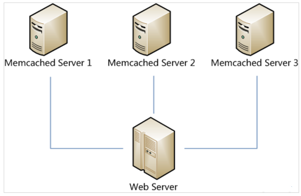

很显然，最简单的策略是将每一次Memcached请求随机发送到一台Memcached服务器，但是这种策略可能会带来两个问题：一是同一份数据可能被存在不同的机器上而造成数据冗余，二是有可能某数据已经被缓存但是访问却没有命中，因为无法保证对相同key的所有访问都被发送到相同的服务器。因此，随机策略无论是时间效率还是空间效率都非常不好。

要解决上述问题只需做到如下一点：保证对相同key的访问会被发送到相同的服务器。很多方法可以实现这一点，最常用的方法是计算哈希。例如对于每次访问，可以按如下算法计算其哈希值：
h = Hash(key) % 3

其中Hash是一个从字符串到正整数的哈希映射函数。这样，如果我们将Memcached Server分别编号为0、1、2，那么就可以根据上式和key计算出服务器编号h，然后去访问。

这个方法虽然解决了上面提到的两个问题，但是存在一些其它的问题。如果将上述方法抽象，可以认为通过：
h = Hash(key) % N

这个算式计算每个key的请求应该被发送到哪台服务器，其中N为服务器的台数，并且服务器按照0 – (N-1)编号。

这个算法的问题在于容错性和扩展性不好。所谓容错性是指当系统中某一个或几个服务器变得不可用时，整个系统是否可以正确高效运行；而扩展性是指当加入新的服务器后，整个系统是否可以正确高效运行。

现假设有一台服务器宕机了，那么为了填补空缺，要将宕机的服务器从编号列表中移除，后面的服务器按顺序前移一位并将其编号值减一，此时每个key就要按h = Hash(key) % (N-1)重新计算；同样，如果新增了一台服务器，虽然原有服务器编号不用改变，但是要按h = Hash(key) % (N+1)重新计算哈希值。因此系统中一旦有服务器变更，大量的key会被重定位到不同的服务器从而造成大量的缓存不命中。而这种情况在分布式系统中是非常糟糕的。

一个设计良好的分布式哈希方案应该具有良好的单调性，即服务节点的增减不会造成大量哈希重定位。一致性哈希算法就是这样一种哈希方案。

Hash 算法的一个衡量指标是单调性（ Monotonicity ），定义如下：单调性是指如果已经有一些内容通过哈希分派到了相应的缓冲中，又有新的缓冲加入到系统中。哈希的结果应能够保证原有已分配的内容可以被映射到新的缓冲中去，而不会被映射到旧的缓冲集合中的其他缓冲区。

容易看到，上面的简单 hash 算法 hash(object)%N 难以满足单调性要求

## 一致性哈希算法
一致性哈希算法(Consistent Hashing Algorithm)是一种分布式算法，常用于负载均衡。Memcached client也选择这种算法，解决将key-value均匀分配到众多Memcached server上的问题。它可以取代传统的取模操作，解决了取模操作无法应对增删Memcached Server的问题(增删server会导致同一个key,在get操作时分配不到数据真正存储的server，命中率会急剧下降)。

简单来说，一致性哈希将整个哈希值空间组织成一个虚拟的圆环，如假设某哈希函数H的值空间为0 - (2^32)-1（即哈希值是一个32位无符号整形），整个哈希空间环如下：


整个空间按顺时针方向组织。0和(2^32)-1在零点中方向重合。

下一步将各个服务器使用H进行一个哈希，具体可以选择服务器的ip或主机名作为关键字进行哈希，这样每台机器就能确定其在哈希环上的位置，这里假设将上文中三台服务器使用ip地址哈希后在环空间的位置如下：


接下来使用如下算法定位数据访问到相应服务器：将数据key使用相同的函数H计算出哈希值h，通根据h确定此数据在环上的位置，从此位置沿环顺时针“行走”，第一台遇到的服务器就是其应该定位到的服务器。

例如我们有A、B、C、D四个数据对象，经过哈希计算后，在环空间上的位置如下：


根据一致性哈希算法，数据A会被定为到Server 1上，D被定为到Server 3上，而B、C分别被定为到Server 2上。

## 容错性和可扩展性分析
下面分析一致性哈希算法的容错性和可扩展性。现假设Server 3宕机了：


可以看到此时A、C、B不会受到影响，只有D节点被重定位到Server 2。一般的，在一致性哈希算法中，如果一台服务器不可用，则受影响的数据仅仅是此服务器到其环空间中前一台服务器（即顺着逆时针方向行走遇到的第一台服务器）之间数据，其它不会受到影响。

下面考虑另外一种情况，如果我们在系统中增加一台服务器Memcached Server 4：


此时A、D、C不受影响，只有B需要重定位到新的Server 4。一般的，在一致性哈希算法中，如果增加一台服务器，则受影响的数据仅仅是新服务器到其环空间中前一台服务器（即顺着逆时针方向行走遇到的第一台服务器）之间数据，其它不会受到影响。

综上所述，一致性哈希算法对于节点的增减都只需重定位环空间中的一小部分数据，具有较好的容错性和可扩展性。

## 虚拟节点
一致性哈希算法在服务节点太少时，容易因为节点分部不均匀而造成数据倾斜问题。例如我们的系统中有两台服务器，其环分布如下：


此时必然造成大量数据集中到Server 1上，而只有极少量会定位到Server 2上。为了解决这种数据倾斜问题，一致性哈希算法引入了虚拟节点机制，即对每一个服务节点计算多个哈希，每个计算结果位置都放置一个此服务节点，称为虚拟节点。具体做法可以在服务器ip或主机名的后面增加编号来实现。例如上面的情况，我们决定为每台服务器计算三个虚拟节点，于是可以分别计算“Memcached Server 1#1”、“Memcached Server 1#2”、“Memcached Server 1#3”、“Memcached Server 2#1”、“Memcached Server 2#2”、“Memcached Server 2#3”的哈希值，于是形成六个虚拟节点：


## JAVA实现
```java
import java.security.MessageDigest;
import java.security.NoSuchAlgorithmException;
import java.util.Collection;
import java.util.SortedMap;
import java.util.TreeMap;

/**
 * 一致性Hash算法
 *
 * @param <T> 节点类型
 */
public class ConsistentHash<T> {
    /**
     * Hash计算对象，用于自定义hash算法
     */
    HashFunc hashFunc;
    /**
     * 复制的节点个数
     */
    private final int numberOfReplicas;
    /**
     * 一致性Hash环
     */
    private final SortedMap<Long, T> circle = new TreeMap<>();

    /**
     * 构造，使用Java默认的Hash算法
     * @param numberOfReplicas 复制的节点个数，增加每个节点的复制节点有利于负载均衡
     * @param nodes            节点对象
     */
    public ConsistentHash(int numberOfReplicas, Collection<T> nodes) {
        this.numberOfReplicas = numberOfReplicas;
        this.hashFunc = new HashFunc() {

            @Override
            public Long hash(Object key) {
//                return fnv1HashingAlg(key.toString());
                return md5HashingAlg(key.toString());
            }
        };
        //初始化节点
        for (T node : nodes) {
            add(node);
        }
    }

    /**
     * 构造
     * @param hashFunc         hash算法对象
     * @param numberOfReplicas 复制的节点个数，增加每个节点的复制节点有利于负载均衡
     * @param nodes            节点对象
     */
    public ConsistentHash(HashFunc hashFunc, int numberOfReplicas, Collection<T> nodes) {
        this.numberOfReplicas = numberOfReplicas;
        this.hashFunc = hashFunc;
        //初始化节点
        for (T node : nodes) {
            add(node);
        }
    }

    /**
     * 增加节点<br>
     * 每增加一个节点，就会在闭环上增加给定复制节点数<br>
     * 例如复制节点数是2，则每调用此方法一次，增加两个虚拟节点，这两个节点指向同一Node
     * 由于hash算法会调用node的toString方法，故按照toString去重
     *
     * @param node 节点对象
     */
    public void add(T node) {
        for (int i = 0; i < numberOfReplicas; i++) {
            circle.put(hashFunc.hash(node.toString() + i), node);
        }
    }

    /**
     * 移除节点的同时移除相应的虚拟节点
     *
     * @param node 节点对象
     */
    public void remove(T node) {
        for (int i = 0; i < numberOfReplicas; i++) {
            circle.remove(hashFunc.hash(node.toString() + i));
        }
    }

    /**
     * 获得一个最近的顺时针节点
     *
     * @param key 为给定键取Hash，取得顺时针方向上最近的一个虚拟节点对应的实际节点
     * @return 节点对象
     */
    public T get(Object key) {
        if (circle.isEmpty()) {
            return null;
        }
        long hash = hashFunc.hash(key);
        if (!circle.containsKey(hash)) {
            SortedMap<Long, T> tailMap = circle.tailMap(hash); //返回此映射的部分视图，其键大于等于 hash
            hash = tailMap.isEmpty() ? circle.firstKey() : tailMap.firstKey();
        }
        //正好命中
        return circle.get(hash);
    }

    /**
     * 使用MD5算法
     * @param key
     * @return
     */
    private static long md5HashingAlg(String key) {
        MessageDigest md5 = null;
        try {
            md5 = MessageDigest.getInstance("MD5");
            md5.reset();
            md5.update(key.getBytes());
            byte[] bKey = md5.digest();
            long res = ((long) (bKey[3] & 0xFF) << 24) | ((long) (bKey[2] & 0xFF) << 16) | ((long) (bKey[1] & 0xFF) << 8)| (long) (bKey[0] & 0xFF);
            return res;
        } catch (NoSuchAlgorithmException e) {
            e.printStackTrace();
        }
        return 0l;
    }

    /**
     * 使用FNV1hash算法
     * @param key
     * @return
     */
    private static long fnv1HashingAlg(String key) {
        final int p = 16777619;
        int hash = (int) 2166136261L;
        for (int i = 0; i < key.length(); i++)
            hash = (hash ^ key.charAt(i)) * p;
        hash += hash << 13;
        hash ^= hash >> 7;
        hash += hash << 3;
        hash ^= hash >> 17;
        hash += hash << 5;
        return hash;
    }

    /**
     * Hash算法对象，用于自定义hash算法
     */
    public interface HashFunc {
        public Long hash(Object key);
    }
}
```

Consistent Hashing最大限度地抑制了hash键的重新分布。另外要取得比较好的负载均衡的效果，往往在服务器数量比较少的时候需要增加虚拟节点来保证服务器能均匀的分布在圆环上。因为使用一般的hash方法，服务器的映射地点的分布非常不均匀。使用虚拟节点的思想，为每个物理节点（服务器）在圆上分配100～200个点。这样就能抑制分布不均匀，最大限度地减小服务器增减时的缓存重新分布。用户数据映射在虚拟节点上，就表示用户数据真正存储位置是在该虚拟节点代表的实际物理服务器上。

# 8.说一下B+树和B-树

# 9.java增强for循环实现原理
在java中，遍历集合和数组一般有以下三种方式:

```java
for (int i = 0; i < list.size(); i++) {
   System.out.print(list.get(i) + ",");
}

Iterator iterator = list.iterator();
while (iterator.hasNext()) {
   System.out.print(iterator.next() + ",");
}

for (Integer i : list) {
   System.out.print(i + ",");
}
```

1. 第一种是普通的for循环遍历
2. 第二种是使用迭代器进行遍历
3. 第三种我们一般称之为增强for循环（foreach）。

第三种形式是JAVA提供的语法糖，这里我们剖析一下，这种增强for循环底层是如何实现的。

我们对以下代码进行反编译：
```java
for (Integer i : list) {
   System.out.println(i);
}
```

反编译后：
```java
Integer i;
for(Iterator iterator = list.iterator(); iterator.hasNext(); System.out.println(i)){
   i = (Integer)iterator.next();        
}
```

反编译后的代码其实比较复杂，我们按照执行顺序拆解一下：
```
Integer i; 定义一个临时变量i
Iterator iterator = list.iterator(); 获取List的迭代器
iterator.hasNext(); 判断迭代器中是否有未遍历过的元素
i = (Integer)iterator.next(); 获取第一个未遍历的元素，赋值给临时变量i
System.out.println(i) 输出临时变量i的值
```

如此循环往复，直到遍历完List中的所有元素。

通过反编译，我们看到，其实JAVA中的增强for循环底层是通过迭代器模式来实现的。

## 增强for循环的坑
这里说是增强for循环的坑，其实主要是因为有些人不了解增强for循环的实现原理而可能踩入的坑。

既然增强for循环通过迭代器实现，那么必然有迭代器的特性。

Java中有fail-fast机制。在使用迭代器遍历元素的时候，在对集合进行删除的时候一定要注意，使用不当有可能发生ConcurrentModificationException，这是一种运行时异常，编译期并不会发生。只有在程序真正运行时才会爆发。

如以下代码：
```java
for (Student stu : students) {    
   if (stu.getId() == 2)    
       students.remove(stu);    
}
```

会抛出ConcurrentModificationException异常。

```
Iterator是工作在一个独立的线程中，并且拥有一个 mutex 锁。Iterator被创建之后会建立一个指向原来对象的单链索引表，当原来的对象数量发生变化时，这个索引表的内容不会同步改变，所以当索引指针往后移动的时候就找不到要迭代的对象，所以按照 fail-fast 原则 Iterator 会马上抛出
java.util.ConcurrentModificationException异常。
```

__所以 Iterator 在工作的时候是不允许被迭代的对象被改变的。__

但你可以使用 Iterator 本身的方法 remove() 来删除对象，Iterator.remove() 方法会在删除当前迭代对象的同时维护索引的一致性。

正确的在遍历的同时删除元素的姿势：
```JAVA
Iterator<Student> stuIter = students.iterator();    
while (stuIter.hasNext()) {    
   Student student = stuIter.next();    
   if (student.getId() == 2)    
       stuIter.remove();//这里要使用Iterator的remove方法移除当前对象，如果使用List的remove方法，则同样会出现ConcurrentModificationException    
}
```

好啦，这里给你介绍了增强for循环的实现原理，以及使用不当可能踩入的坑。所以，虽然是一个简单的for-each语法，但是也要了解其原理，不然可能导致一些莫名其妙的问题。

# 10.ThreadLocal
## ThreadLocal用在什么地方
讨论ThreadLocal用在什么地方前，我们先明确下，如果仅仅就一个线程，那么都不用谈ThreadLocal的，__ThreadLocal是用在多线程的场景的__！！！

ThreadLocal归纳下来就2类用途：

1. 保存线程上下文信息，在任意需要的地方可以获取！！！
2. 线程安全的，避免某些情况需要考虑线程安全必须同步带来的性能损失！！！

- 保存线程上下文信息，在任意需要的地方可以获取！！！

由于ThreadLocal的特性，同一线程在某地方进行设置，在随后的任意地方都可以获取到。从而可以用来保存线程上下文信息。

常用的比如每个请求怎么把一串后续关联起来，就可以用ThreadLocal进行set，在后续的任意需要记录日志的方法里面进行get获取到请求id，从而把整个请求串起来。

还有比如Spring的事务管理，用ThreadLocal存储Connection，从而各个DAO可以获取同一Connection，可以进行事务回滚，提交等操作。

```JAVA
备注：ThreadLocal的这种用处，很多时候是用在一些优秀的框架里面的，一般我们很少接触，反而下面的场景我们接触的更多一些！
```

- 线程安全的，避免某些情况需要考虑线程安全必须同步带来的性能损失！！！

ThreadLocal为解决多线程程序的并发问题提供了一种新的思路。但是ThreadLocal也有局限性，我们来看看阿里规范

ThreadLocal无法解决共享对象的更新问题，ThreadLocal对象建议使用static修饰。这个变量是针对一个线程内所有操作共享的，所以设置为静态变量，所有此类实例共享此静态变量，也就是说在类第一次被使用时装载，只分配一块存储空间，所有此类的对象(只要是这个线程内定义的)都可以这个操控这个变量。

每个线程往ThreadLocal中读写数据是线程隔离，互相之间不会影响的，所以ThreadLocal无法解决共享对象的更新问题。

```JAVA
由于不需要共享信息，自然就不存在竞争问题了，从而保证了某些情况下线程的安全，以及避免了某些情况需要考虑线程安全必须同步带来的性能损失！！！
```

这类场景阿里规范里面也提到了：

```JAVA
[强制]SimpleDateFormat是线程不安全的类，一般不要定义为static变量，如果定义为static，必须加锁，或者使用DateUtils工具类。
正例：注意线程安全，使用DateUtils。亦推荐入下处理：
private static final ThreadLocal<DateFormat> df = new ThreadLocal<DateFormat>(){
    @Override
    protected DateFormat initValue(){
        return new SimpleDateFormat("yyyy-MM-dd");
    }
}
```

ThreadLocal使用示例代码：
```JAVA
public class ThreadLocalTest {
    private static ThreadLocal<Integer> threadLocal = new ThreadLocal<>();

    public static void main(String[] args) {

        new Thread(() -> {
            try {
                for (int i = 0; i < 100; i++) {
                    threadLocal.set(i);
                    System.out.println(Thread.currentThread().getName() + "====" + threadLocal.get());
                    try {
                        Thread.sleep(200);
                    } catch (InterruptedException e) {
                        e.printStackTrace();
                    }
                }
            } finally {
                threadLocal.remove();
            }
        }, "threadLocal1").start();


        new Thread(() -> {
            try {
                for (int i = 0; i < 100; i++) {
                    System.out.println(Thread.currentThread().getName() + "====" + threadLocal.get());
                    try {
                        Thread.sleep(200);
                    } catch (InterruptedException e) {
                        e.printStackTrace();
                    }
                }
            } finally {
                threadLocal.remove();
            }
        }, "threadLocal2").start();
    }
}
```

代码截图：


代码运行结果:
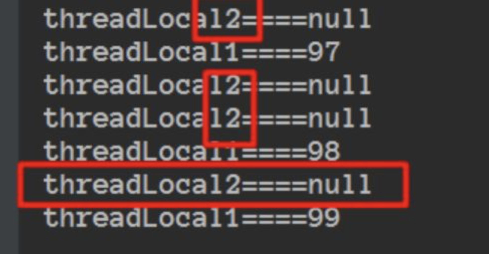

从运行的结果我们可以看到threadLocal1进行set值对threadLocal2并没有任何影响！

Thread、ThreadLocalMap、ThreadLocal总览图：
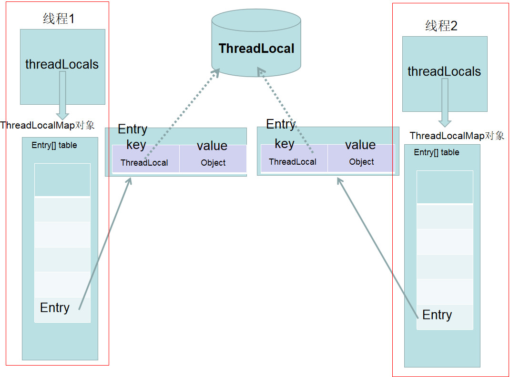

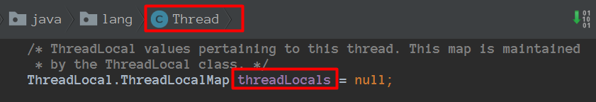

Thread类有属性变量threadLocals（类型是ThreadLocal.ThreadLocalMap），也就是说每个线程有一个自己的ThreadLocalMap，所以每个线程往这个ThreadLocal中读写隔离的，并且是互相不会影响的。

__一个ThreadLocal只能存储一个Object对象，如果需要存储多个Object对象那么就需要多个ThreadLocal！！！__

如图:
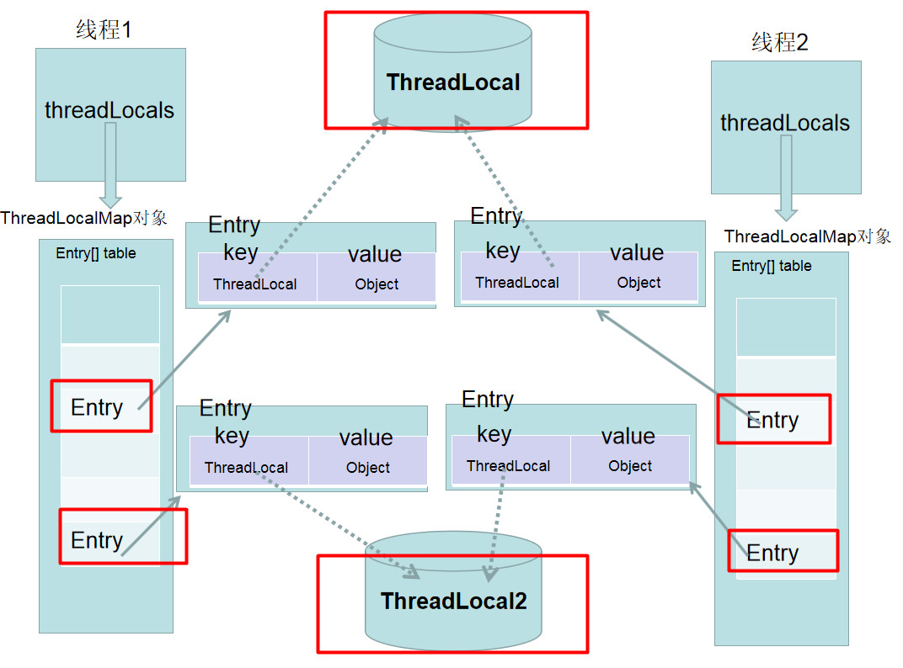

看到上面的几个图，大概思路应该都清晰了，我们Entry的key指向ThreadLocal用虚线表示弱引用 ，下面我们来看看ThreadLocalMap:
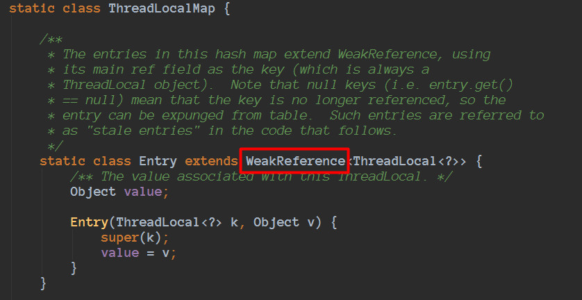

java对象的引用包括 ：强引用，软引用，弱引用，虚引用 。

因为这里涉及到弱引用，简单说明下：

弱引用也是用来描述非必需对象的，当JVM进行垃圾回收时，无论内存是否充足，该对象仅仅被弱引用关联，那么就会被回收。

当仅仅只有ThreadLocalMap中的Entry的key指向ThreadLocal的时候，ThreadLocal会进行回收的！！！

ThreadLocal被垃圾回收后，在ThreadLocalMap里对应的Entry的键值会变成null，但是Entry是强引用，那么Entry里面存储的Object，并没有办法进行回收，所以ThreadLocalMap 做了一些额外的回收工作。


虽然做了但是也会存在内存泄漏风险（我没有遇到过，网上很多类似场景，所以会提到后面的ThreadLocal最佳实践！！！）

## ThreadLocal的最佳实践
ThreadLocal被垃圾回收后，在ThreadLocalMap里对应的Entry的键值会变成null，但是Entry是强引用，那么Entry里面存储的Object，并没有办法进行回收，所以ThreadLocalMap做了一些额外的回收工作。
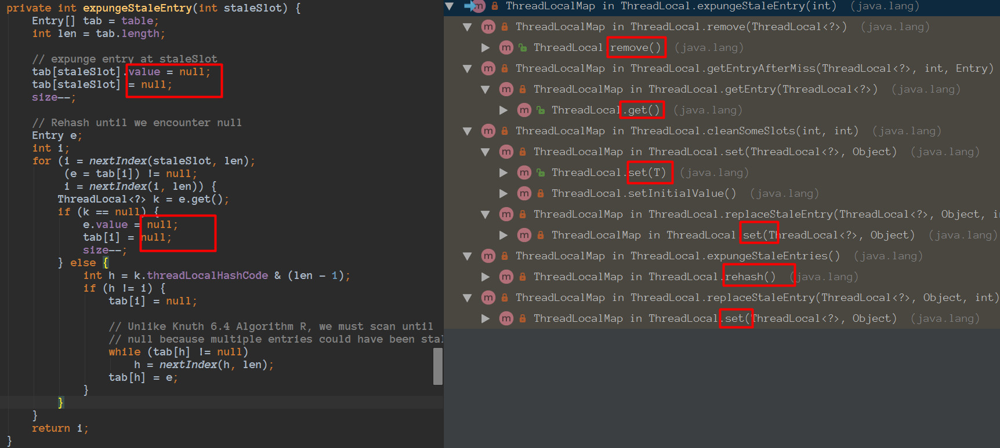
```
备注：很多时候，我们都是用在线程池的场景，程序不停止，线程基本不会销毁！！！
```

由于线程的生命周期很长，如果我们往ThreadLocal里面set了很大很大的Object对象，虽然set、get等等方法在特定的条件会调用进行额外的清理，但是 __ThreadLocal被垃圾回收后，在ThreadLocalMap里对应的Entry的键值会变成null，但是后续在也没有操作set、get等方法了__。

__所以最佳实践，应该在我们不使用的时候，主动调用remove方法进行清理。__

```
ThreadLocal无法解决共享对象的更新问题，ThreadLocal对象建议使用static修饰。这个变量是针对一个线程内所有操作共享的，所以设置为静态变量，所有此类实例共享此静态变量，也就是说在类第一次被使用时装载，只分配一块存储空间，所有此类的对象
```

这里把ThreadLocal定义为static还有一个好处就是，由于ThreadLocal有强引用在，那么在ThreadLocalMap里对应的Entry的键会永远存在，那么执行remove的时候就可以正确进行定位到并且删除！！！

最佳实践做法应该为：
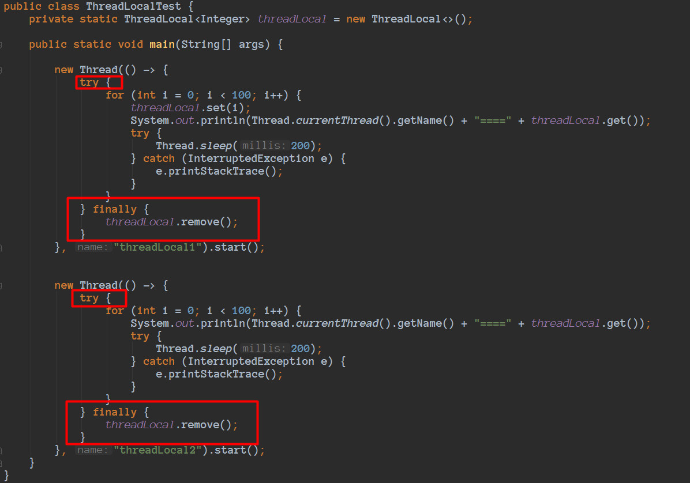

抽象为:
```JAVA
try {
    // 其它业务逻辑
} finally {
    threadLocal对象.remove();
}
```

## 思考
如果面试的时候，可以把上面的内容都可以讲到，个人觉得就非常好了，回答的就挺完美了。但是如果你可以进行下面的回答，那么就更完美了。

对于ThreadLocal，我在看Netty源码的时候，还了解过FastThreadLocal，xxxxx一些列内容，那就是一个升级了。
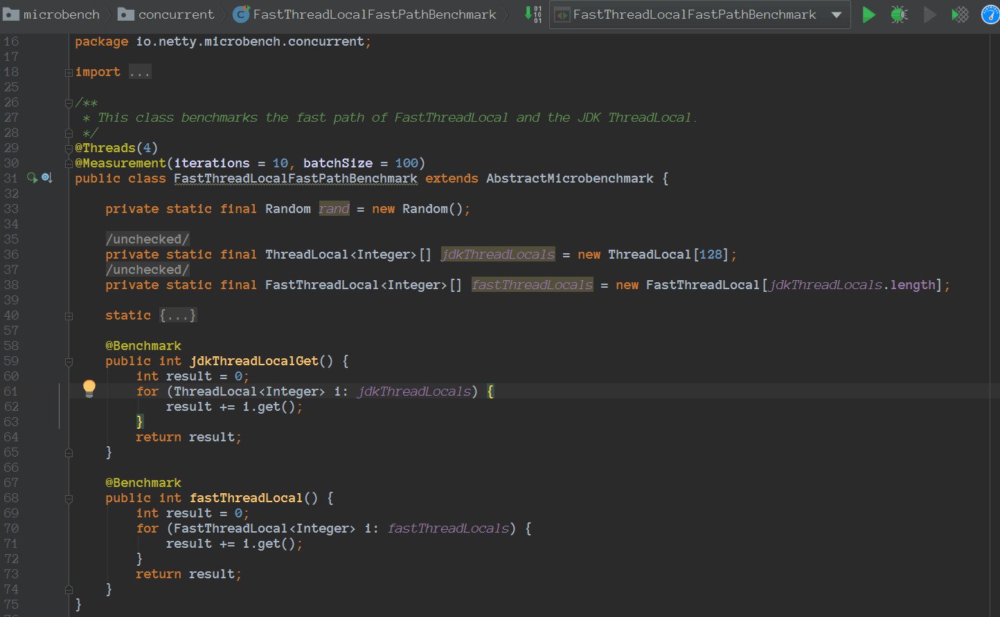

在我本地进行测试，FastThreadLocal的吞吐量是jdkThreadLocal的3倍左右。
```
备注：由于FastThreadLocal内容也非常非常多，而且有很多技巧，所以准备后续专门在开一篇进行串起来！！！
```

# 11.访问ip的背后过程
# 12.手撕装饰器
# 13.http的请求头
# 14.https的加密过程和原理
# 15.负载均衡
## 什么是负载均衡
不能狭义的理解为分配给所有实际服务器一样的工作量，因为多台服务器的承载能力不同，这可能体系在硬件配置，网络带宽的差异，也可能因为某台服务器身兼多职，我们所说的"均衡"，也就是希望所有服务器都不要过载，并且能够最大程序的发挥作用。

## http重定向
当http代理(比如浏览器)向web服务器请求某个URL后，web服务器可以通过http响应头信息中的Location标记来返回一个新的URL，这意味着http代理需要继续请求这个新的URL，完成自动跳转。

__性能缺陷:__

- 吞吐量限制

主站点服务器的吞吐率平均分配到了被转移的服务器。现假设使用RR(Round Robin)调度策略，子服务器的最大吞吐率为1000reqs/s，那么主服务器的吞吐率要达到3000reqs/s才能完全发挥三台子服务器的作用，那么如果有100台服务器，那么主服务器的吞吐率可想而知得有多大？相反，如果主服务器的最大吞吐率为6000reqs/s，那么平均分配到子服务器的吞吐率为2000reqs/s，而现子服务器的最大吞吐率为1000reqs/s，因此就得增加子服务器的数量，增加到6个才能满足。

- 重定向访问深度不同

有的重定向一个静态页面，有的重定向一个相对复杂的页面。那么服务器的负载差异是不可预料的，而主站服务器却一无所知。因此整站使用重定向方法做负载均衡不太好。

我们需要权衡转移请求的开销和处理实际请求的开销，前者相对于后者越小，那么重定向的意义就越大。例如下载，你可以去很多镜像下载网站试下，会发现基本下载都使用了Location做了重定向。

## DNS负载均衡
DNS负责提供域名解析服务，当访问某个站点时，实际上首先需要通过该站点域名的DNS服务器来获取域名指向的IP地址，在这一过程中，DNS服务器完成了域名到IP地址的映射，同样，这样映射也可以是一对多的，这时候，DNS服务器便充当了负载均衡调度器，它就像http重定向转换策略一样，将用户的请求分散到多台服务器上，但是它的实现机制完全不同。

使用dig命令来看下”baidu”的DNS设置
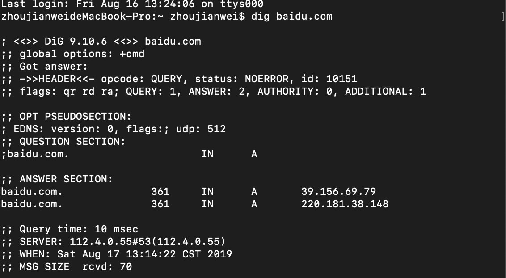
可见百度拥有俩个A记录

相比http重定向，基于DNS的负载均衡完全节省了所谓的主站点，或者说DNS服务器已经充当了主站点的职能。但不同的是，作为调度器，DNS服务器本身的性能几乎不用担心。因为DNS记录可以被用户浏览器或者互联网接入服务商的各级DNS服务器缓存，只有当缓存过期后才会重新向域名的DNS服务器请求解析。也说是DNS不存在http的吞吐率限制，理论上可以无限增加实际服务器的数量。

特性：

1. 可以根据用户IP来进行智能解析。DNS服务器可以在所有可用的A记录中寻找离用记最近的一台服务器。
2. 动态DNS：在每次IP地址变更时，及时更新DNS服务器。当然，因为缓存，一定的延迟不可避免。

不足：

1. 没有用户能直接看到DNS解析到了哪一台实际服务器，加服务器运维人员的调试带来了不便。
2. 策略的局限性。例如你无法将HTTP请求的上下文引入到调度策略中，而在前面介绍的基于HTTP重定向的负载均衡系统中，调度器工作在HTTP层面，它可以充分理解HTTP请求后根据站点的应用逻辑来设计调度策略，比如根据请求不同的URL来进行合理的过滤和转移。
3. 如果要根据实际服务器的实时负载差异来调整调度策略，这需要DNS服务器在每次解析操作时分析各服务器的健康状态，对于DNS服务器来说，这种自定义开发存在较高的门槛，更何况大多数站点只是使用第三方DNS服务。
4. DNS记录缓存，各级节点的DNS服务器不同程序的缓存会让你晕头转向。
5. 基于以上几点，DNS服务器并不能很好地完成工作量均衡分配，最后，是否选择基于DNS的负载均衡方式完全取决于你的需要

## 反向代理负载均衡
这个肯定大家都有所接触，因为几乎所有主流的Web服务器都热衷于支持基于反向代理的负载均衡。它的核心工作就是转发HTTP请求。

相比前面的HTTP重定向和DNS解析，反向代理的调度器扮演的是用户和实际服务器中间人的角色：

1. 任何对于实际服务器的HTTP请求都必须经过调度器
2. 调度器必须等待实际服务器的HTTP响应，并将它反馈给用户（前两种方式不需要经过调度反馈，是实际服务器直接发送给用户）

__特性：__

1. 调度策略丰富。例如可以为不同的实际服务器设置不同的权重，以达到能者多劳的效果。
2. 对反向代理服务器的并发处理能力要求高，因为它工作在HTTP层面。
3. 反向代理服务器进行转发操作本身是需要一定开销的，比如创建线程、与后端服务器建立TCP连接、接收后端服务器返回的处理结果、分析HTTP头部信息、用户空间和内核空间的频繁切换等，虽然这部分时间并不长，但是当后端服务器处理请求的时间非常短时，转发的开销就显得尤为突出。例如请求静态文件，更适合使用前面介绍的基于DNS的负载均衡方式
4. 反向代理服务器可以监控后端服务器，比如系统负载、响应时间、是否可用、TCP连接数、流量等，从而根据这些数据调整负载均衡的策略。
5. 反向代理服务器可以让用户在一次会话周期内的所有请求始终转发到一台特定的后端服务器上（粘滞会话），这样的好处一是保持session的本地访问，二是防止后端服务器的动态内存缓存的资源浪费。

## IP负载均衡(LVS-NAT)
因为反向代理服务器工作在HTTP层，其本身的开销就已经严重制约了可扩展性，从而也限制了它的性能极限。那能否在HTTP层面以下实现负载均衡呢？

NAT服务器:它工作在传输层，它可以修改发送来的IP数据包，将数据包的目标地址修改为实际服务器地址。

从Linux2.4内核开始，其内置的Neftilter模块在内核中维护着一些数据包过滤表，这些表包含了用于控制数据包过滤的规则。可喜的是，Linux提供了iptables来对过滤表进行插入、修改和删除等操作。更加令人振奋的是，Linux2.6.x内核中内置了IPVS模块，它的工作性质类型于Netfilter模块，不过它更专注于实现IP负载均衡。

想知道你的服务器内核是否已经安装了IPVS模块，可以

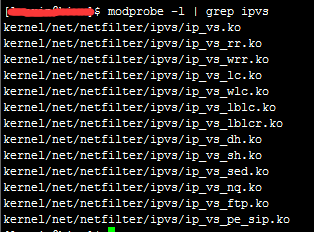

有输出意味着IPVS已经安装了。IPVS的管理工具是ipvsadm，它为提供了基于命令行的配置界面，可以通过它快速实现负载均衡系统。这就是大名鼎鼎的LVS(Linux Virtual Server，Linux虚拟服务器)。

1. 打开调度器的数据包转发选项 echo 1 > /proc/sys/net/ipv4/ip_forward
2. 检查实际服务器是否已经将NAT服务器作为自己的默认网关，如果不是，如添加 route add default gw xx.xx.xx.xx
3. 使用ipvsadm配置 ipvsadm -A -t 111.11.11.11:80 -s rr 添加一台虚拟服务器，-t 后面是服务器的外网ip和端口，-s rr是指采用简单轮询的RR调度策略（这属于静态调度策略，除此之外，LVS还提供了系列的动态调度策略，比如最小连接（LC）、带权重的最小连接（WLC），最短期望时间延迟（SED）等）。

ipvsadm -a -t 111.11.11.11:80 -r 10.10.120.210:8000 -m 

ipvsadm -a -t 111.11.11.11:80 -r 10.10.120.211:8000 -m

添加两台实际服务器（不需要有外网ip），-r后面是实际服务器的内网ip和端口，-m表示采用NAT方式来转发数据包

运行ipvsadm -L -n可以查看实际服务器的状态。这样就大功告成了。

实验证明使用基于NAT的负载均衡系统。作为调度器的NAT服务器可以将吞吐率提升到一个新的高度，几乎是反向代理服务器的两倍以上，这大多归功于在内核中进行请求转发的较低开销。但是一旦请求的内容过大时，不论是基于反向代理还是NAT，负载均衡的整体吞吐量都差距不大，这说明对于一睦开销较大的内容，使用简单的反向代理来搭建负载均衡系统是值考虑的。

这么强大的系统还是有它的瓶颈，那就是NAT服务器的网络带宽，包括内部网络和外部网络。当然如果你不差钱，可以去花钱去购买千兆交换机或万兆交换机，甚至负载均衡硬件设备，但如果你是个屌丝，咋办？

一个简单有效的办法就是将基于NAT的集群和前面的DNS混合使用，比如５个100Mbps出口宽带的集群，然后通过DNS来将用户请求均衡地指向这些集群，同时，你还可以利用DNS智能解析实现地域就近访问。这样的配置对于大多数业务是足够了，但是对于提供下载或视频等服务的大规模站点，NAT服务器还是不够出色。

## 直接路由(LVS-DR)
NAT是工作在网络分层模型的传输层（第四层），而直接路由是工作在数据链路层（第二层），貌似更屌些。它通过修改数据包的目标MAC地址（没有修改目标IP），将数据包转发到实际服务器上，不同的是，实际服务器的响应数据包将直接发送给客户羰，而不经过调度器。

- __网络设置:__ 这里假设一台负载均衡调度器，两台实际服务器，购买三个外网ip，一台机一个，三台机的默认网关需要相同，最后再设置同样的ip别名，这里假设别名为10.10.120.193。这样一来，将通过10.10.120.193这个IP别名来访问调度器，你可以将站点的域名指向这个IP别名。
- __将ip别名添加到回环接口lo上:__ 这是为了让实际服务器不要去寻找其他拥有这个IP别名的服务器，在实际服务器中运行:
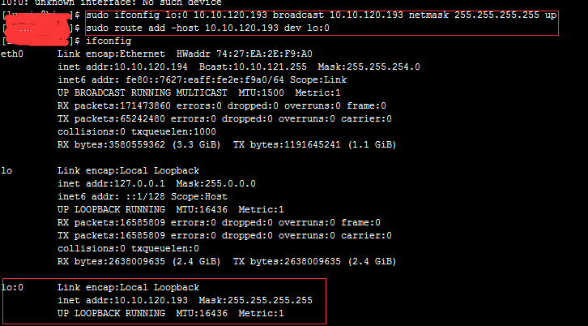

另外还要防止实际服务器响应来自网络中针对IP别名的ARP广播，为此还要执行：
```shell
echo "1" > /proc/sys/net/ipv4/conf/lo/arp_ignore
echo "2" > /proc/sys/net/ipv4/conf/lo/arp_announce
echo "1" > /proc/sys/net/ipv4/conf/all/arp_ignore
echo "1" > /proc/sys/net/ipv4/conf/all/arp_announce
```

配置完了就可以使用ipvsadm配置LVS-DR集群了:
```shell
ipvsadm -A -t 10.10.120.193:80 -s rr
ipvsadm -a -t 10.10.120.193:80 -r 10.10.120.210:8000 -g
ipvsadm -a -t 10.10.120.193:80 -r 10.10.120.211:8000 -g
```
-g 就意味着使用直接路由的方式转发数据包

LVS-DR 相较于LVS-NAT的最大优势在于LVS-DR不受调度器宽带的限制，例如假设三台服务器在WAN交换机出口宽带都限制为10Mbps，只要对于连接调度器和两台实际服务器的LAN交换机没有限速，那么，使用LVS-DR理论上可以达到20Mbps的最大出口宽带，因为它的实际服务器的响应数据包可以不经过调度器而直接发往用户端啊，所以它与调度器的出口宽带没有关系，只能自身的有关系。而如果使用LVS-NAT，集群只能最大使用10Mbps的宽带。所以，越是响应数据包远远超过请求数据包的服务，就越应该降低调度器转移请求的开销，也就越能提高整体的扩展能力，最终也就越依赖于WAN出口宽带。

总的来说，LVS-DR适合搭建可扩展的负载均衡系统，不论是Web服务器还是文件服务器，以及视频服务器，它都拥有出色的性能。前提是你必须为实际器购买一系列的合法IP地址。

## IP隧道(LVS-TUN)
基于IP隧道的请求转发机制：将调度器收到的IP数据包封装在一个新的IP数据包中，转交给实际服务器，然后实际服务器的响应数据包可以直接到达用户端。目前Linux大多支持，可以用LVS来实现，称为LVS-TUN，与LVS-DR不同的是，实际服务器可以和调度器不在同一个WANt网段，调度器通过IP隧道技术来转发请求到实际服务器，所以实际服务器也必须拥有合法的IP地址。

总体来说，LVS-DR和LVS-TUN都适合响应和请求不对称的Web服务器，如何从它们中做出选择，取决于你的网络部署需要，因为LVS-TUN可以将实际服务器根据需要部署在不同的地域，并且根据就近访问的原则来转移请求，所以有类似这种需求的，就应该选择LVS-TUN。


