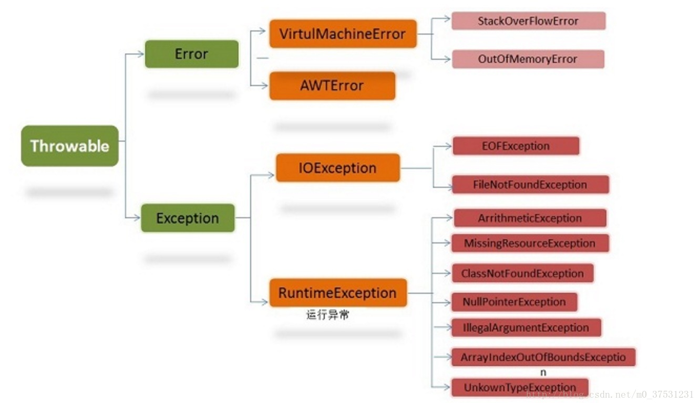

<!-- MarkdownTOC -->

- [1.同步方法和同步代码块的区别是什么](#1同步方法和同步代码块的区别是什么)
- [2.在监视器\(Monitor\)内部,是如何做线程同步的,程序应该做哪种级别的同步](#2在监视器monitor内部是如何做线程同步的程序应该做哪种级别的同步)
- [3.sleep\(\)和wait\(\)有什么区别](#3sleep和wait有什么区别)
- [4.同步和异步有何异同,在什么情况下分别使用他们,举例说明](#4同步和异步有何异同在什么情况下分别使用他们举例说明)
- [5.stop\(\)和suspend\(\)方法为何不推荐使用](#5stop和suspend方法为何不推荐使用)
- [6.线程的sleep\(\)方法和yield\(\)方法有什么区别](#6线程的sleep方法和yield方法有什么区别)
- [7.请说出与线程同步以及线程调度相关的方法](#7请说出与线程同步以及线程调度相关的方法)
- [8.如何保证线程安全](#8如何保证线程安全)
- [9.讲一下非公平锁和公平锁在reetrantlock里的实现](#9讲一下非公平锁和公平锁在reetrantlock里的实现)
    - [NonfairSync非公平锁](#nonfairsync非公平锁)
    - [FairSync公平锁](#fairsync公平锁)
- [10.讲一下synchronized,可重入怎么实现](#10讲一下synchronized可重入怎么实现)
- [11.什么是死锁](#11什么是死锁)
- [12.如何确保N个线程可以访问N个资源同时又不导致死锁](#12如何确保n个线程可以访问n个资源同时又不导致死锁)
- [13.Java中的LongAdder和AtomicLong的区别](#13java中的longadder和atomiclong的区别)
- [14.JDK和JRE的区别是什么](#14jdk和jre的区别是什么)
- [15.反射的实现与作用](#15反射的实现与作用)
    - [什么是反射](#什么是反射)
    - [Java反射框架提供以下功能](#java反射框架提供以下功能)
    - [反射的主要用途](#反射的主要用途)
    - [反射的基本运用](#反射的基本运用)
    - [通过反射生成对象主要通过俩种方式](#通过反射生成对象主要通过俩种方式)
- [16.怎么打印日志](#16怎么打印日志)
- [17.运行时异常与一般异常有何异同](#17运行时异常与一般异常有何异同)
- [18.error和exception有什么区别](#18error和exception有什么区别)
- [19.给我一个你最常见到的runtime exception](#19给我一个你最常见到的runtime-exception)
- [20.Java中的异常处理机制的简单原理和应用](#20java中的异常处理机制的简单原理和应用)
- [21.java中有几种类型的流,JDK为每种类型的流提供了一些抽象类以供继承,请说出他们分别是哪些类](#21java中有几种类型的流jdk为每种类型的流提供了一些抽象类以供继承请说出他们分别是哪些类)
- [22.什么是java序列化,如何实现java序列化](#22什么是java序列化如何实现java序列化)
- [23.运行时异常与受检异常有什么区别](#23运行时异常与受检异常有什么区别)
- [24. Double-Check中的volatile作用](#24-double-check中的volatile作用)

<!-- /MarkdownTOC -->


# 1.同步方法和同步代码块的区别是什么
1. 同步方法默认用this或者当前类class对象作为锁。
2. 同步代码可以选择以什么来加锁，比同步方法更细颗粒化，同步代码可以同步有同步问题的部分代码而不是整个方法。
3. 同步方法用关键字synchronized修饰方法，同步代码主要修饰需要进行同步的代码块，用synchronized（object）｛代码内容｝进行修饰

# 2.在监视器(Monitor)内部,是如何做线程同步的,程序应该做哪种级别的同步
在 java 虚拟机中, 每个对象( Object 和 class )通过某种逻辑关联监视器,每个监视器和一个对象引用相关联, 为了实现监视器的互斥功能, 每个对象都关联着一把锁.

一旦方法或者代码块被 synchronized 修饰, 那么这个部分就放入了监视器的监视区域, 确保一次只能有一个线程执行该部分的代码, 线程在获取锁之前不允许执行该部分的代码

另外 java 还提供了显式监视器( Lock )和隐式监视器( synchronized )两种锁方案
>https://www.nowcoder.com/questionTerminal/26fc16a2a85e49a5bd5fc2b5759dbbc2?pos=102&orderByHotValue=0
# 3.sleep()和wait()有什么区别
1. 这两个方法来自不同的类分别是，sleep来自Thread类，和wait来自Object类
sleep是Thread的静态类方法，谁调用的谁去睡觉，即使在a线程里调用了b的sleep方法，实际上还是a去睡觉，要让b线程睡觉要在b的代码中调用sleep。
2. 最主要是sleep方法没有释放锁，而wait方法释放了锁，使得其他线程可以使用同步控制块或者方法。   
sleep不出让系统资源；wait是进入线程等待池等待，出让系统资源，其他线程可以占用CPU。一般wait不会加时间限制，因为如果wait线程的运行资源不够，再出来也没用，要等待其他线程调用notify/notifyAll唤醒等待池中的所有线程，才会进入就绪队列等待OS分配系统资源。sleep(milliseconds)可以用时间指定使它自动唤醒过来，如果时间不到只能调用interrupt()强行打断。    
Thread.Sleep(0)的作用是“触发操作系统立刻重新进行一次CPU竞争”。
3. 使用范围：wait，notify和notifyAll只能在同步控制方法或者同步控制块里面使用，而sleep可以在任何地方使用 
4. sleep必须捕获异常，而wait，notify和notifyAll不需要捕获异常
>https://www.cnblogs.com/plmnko/archive/2010/10/15/1851854.html

# 4.同步和异步有何异同,在什么情况下分别使用他们,举例说明
同步:发送一个请求,等待返回,然后再发送下一个请求 

异步:发送一个请求,不等待返回,随时可以再发送下一个请求

同步可以避免出现死锁，读脏数据的发生，一般共享某一资源的时候用，如果每个人都有修改权限，同时修改一个文件，有可能使一个人读取另一个人已经删除的内容，就会出错，同步就会按顺序来修改。

异步则是可以提高效率了，现在cpu都是双核，四核，异步处理的话可以同时做多项工作，当然必须保证是可以并发处理的。

同步和异步最大的区别就在于。一个需要等待，一个不需要等待。 

比如发短信，就是一个异步例子。发起者不关心接收者的状态。不需要等待接收者的返回信息，则可以进行下一次发送。 
电话，就是一个同步例子。发起者需要等待接收者，接通电话后，通信才开始。需要等待接收者的返回信息

而我们平时经常讨论的同步问题多发生在多线程环境中的数据共享问题。即当多个线程需要访问同一个资源时，它们需要以某种顺序来确保该资源在某一特定时刻只能被一个线程所访问，如果使用异步，程序的运行结果将不可预料。因此，在这种情况下，就必须对数据进行同步，即限制只能有一个进程访问资源，其他线程必须等待。

实现同步的机制主要有临界区、互斥、信号量和事件       
临界区：通过对多线程的串行化来访问公共资源或一段代码，速度快，适合控制数据访问。在任意时刻只允许一个线程对共享资源进行访问，如果有多个线程试图访问公共资 源，那么在有一个线程进入后，其他试图访问公共资源的线程将被挂起，并一直等到进入临界区的线程离开，临界区在被释放后，其他线程才可以抢占。          
互斥量：采用互斥对象机制。 只有拥有互斥对象的线程才有访问公共资源的权限，因为互斥对象只有一个，所以能保证公共资源不会同时被多个线程访问。互斥不仅能实现同一应用程序的公共资源安全共享，还能实现不同应用程序的公共资源安全共享 .互斥量比临界区复杂。因为使用互斥不仅仅能够在同一应用程序不同线程中实现资源的安全共享，而且可以在不同应用程序的线程之间实现对资源的安全共享。       
信号量：它允许多个线程在同一时刻访问同一资源，但是需要限制在同一时刻访问此资源的最大线程数目 。信号量对象对线程的同步方式与前面几种方法不同，信号允许多个线程同时使用共享资源，这与操作系统中的PV操作相同。它指出了同时访问共享资源的线程最大数目。它允许多个线程在同一时刻访问同一资源，但是需要限制在同一时刻访问此资源的最大线程数目。       
事件：通过通知操作的方式来保持线程的同步，还可以方便实现对多个线程的优先级比较的操作 。     
>https://blog.csdn.net/qq_36179561/article/details/53411857

# 5.stop()和suspend()方法为何不推荐使用
反对使用stop()，是因为它不安全。它会解除由线程获取的所有锁定，当在一个线程对象上调用stop()方法时，这个线程对象所运行的线程就会立即停止，假如一个线程正在执行：synchronized void { x = 3; y = 4;}　由于方法是同步的，多个线程访问时总能保证x,y被同时赋值，而如果一个线程正在执行到x = 3;时，被调用了 stop()方法，即使在同步块中，它也干脆地stop了，这样就产生了不完整的残废数据。而多线程编程中最最基础的条件要保证数据的完整性，所以请忘记线程的stop方法，以后我们再也不要说“停止线程”了。而且如果对象处于一种不连贯状态，那么其他线程能在那种状态下检查和修改它们。结果很难检查出真正的问题所在。

suspend()方法容易发生死锁。调用suspend()的时候，目标线程会停下来，但却仍然持有在这之前获得的锁定。此时，其他任何线程都不能访问锁定的资源，除非被"挂起"的线程恢复运行。对任何线程来说，如果它们想恢复目标线程，同时又试图使用任何一个锁定的资源，就会造成死锁。所以不应该使用suspend()，而应在自己的Thread类中置入一个标志，指出线程应该活动还是挂起。若标志指出线程应该挂起，便用 wait()命其进入等待状态。若标志指出线程应当恢复，则用一个notify()重新启动线程。

# 6.线程的sleep()方法和yield()方法有什么区别
yield方法   
暂停当前正在执行的线程对象。   
yield()只是使当前线程重新回到可执行状态，所以执行yield()的线程有可能在进入到可执行状态后马上又被执行。   
yield()只能使同优先级或更高优先级的线程有执行的机会。    
调用yield方法并不会让线程进入阻塞状态，而是让线程重回就绪状态，它只需要等待重新获取CPU执行时间，这一点是和sleep方法不一样的。   

1.  sleep()方法给其他线程运行机会时不考虑线程的优先级，因此会给低优先级的线程以运行的机会；yield()方法只会给相同优先级或更高优先级的线程以运行的机会；
2.  线程执行sleep()方法后转入阻塞（blocked）状态，而执行yield()方法后转入就绪（ready）状态；
3.  sleep()方法声明抛出InterruptedException，而yield()方法没有声明任何异常；
4.  sleep()方法比yield()方法（跟操作系统CPU调度相关）具有更好的可移植性。

# 7.请说出与线程同步以及线程调度相关的方法
线程同步：即当有一个线程在对内存进行操作时，其他线程都不可以对这个内存地址进行操作，直到该线程完成操作，其他线程才能对该内存地址进行操作，而其他线程又处于等待状态，目前实现线程同步的方法有很多，临界区对象就是其中一种。

线程调度：是指按照特定机制为多个线程分配CPU的使用权。

与线程同步以及线程调度相关的方法有哪些呢?

1. wait()：使一个线程处于等待(阻塞)状态，并且释放所持有的对象的锁;
2. sleep()：使一个正在运行的线程处于睡眠状态，是一个静态方法，调用此方法要处理InterruptedException异常;
3. notify()：唤醒一个处于等待状态的线程，当然在调用此方法的时候，并不能确切的唤醒某一个等待状态的线程，而是由JVM确定唤醒哪个线程，而且与优先级无关;
4. notityAll()：唤醒所有处于等待状态的线程，该方法并不是将对象的锁给所有线程，而是让它们竞争，只有获得锁的线程才能进入就绪状态;

Java 5通过Lock接口提供了显式的锁机制（explicit lock），增强了灵活性以及对线程的协调。Lock接口中定义了加锁（lock()）和解锁（unlock()）的方法，同时还提供了newCondition()方法来产生用于线程之间通信的Condition对象；此外，Java 5还提供了信号量机制（semaphore），信号量可以用来限制对某个共享资源进行访问的线程的数量。在对资源进行访问之前，线程必须得到信号量的许可（调用Semaphore对象的acquire()方法）；在完成对资源的访问后，线程必须向信号量归还许可（调用Semaphore对象的release()方法）。
>https://www.jianshu.com/p/80963dc65ec8

# 8.如何保证线程安全
 线程安全在三个方面体现

1. 原子性：提供互斥访问，同一时刻只能有一个线程对数据进行操作，（atomic,synchronized）；
2. 可见性：一个线程对主内存的修改可以及时地被其他线程看到，（synchronized,volatile）；
3. 有序性：一个线程观察其他线程中的指令执行顺序，由于指令重排序，该观察结果一般杂乱无序，（happens-before原则）。

方法:

1. 使用线程安全的类；
2. 使用synchronized同步代码块，或者用Lock锁；

# 9.讲一下非公平锁和公平锁在reetrantlock里的实现
所谓公平锁，就是线程按照执行顺序排成一排，依次获取锁，但是这种方式在高并发的场景下极其损耗性能；

所谓非公平锁，就是不管执行顺序，每个线程获取锁的几率都是相同的，获取失败了，才会采用像公平锁那样的方式。这样做的好处是，JVM可以花比较少的时间在线程调度上，更多的时间则是用在执行逻辑代码里面。

相关源码:   
```JAVA
//创建一个非公平锁，默认是非公平锁
Lock lock = new ReentrantLock();
Lock lock = new ReentrantLock(false);
//创建一个公平锁，构造传参true
Lock lock = new ReentrantLock(true);
```

```JAVA
    public ReentrantLock() {
        sync = new NonfairSync();
    }

    public ReentrantLock(boolean fair) {
        sync = fair ? new FairSync() : new NonfairSync();
    }
```

## NonfairSync非公平锁 
在谈NonfairSync之前，首先要谈谈ReentrantLock类里面定义的一个类属性Sync，它才是ReentrantLock实现的精髓。它首先在属性里声明，然后以抽象静态内部类的形式实现了AQS，源码如下：
```JAVA
abstract static class Sync extends AbstractQueuedSynchronizer {
        private static final long serialVersionUID = -5179523762034025860L;

        //声明的lock()方法，供子类实现
        abstract void lock();

        //非公平锁的获取方式，相较于公平锁的tryAcquire()
        final boolean nonfairTryAcquire(int acquires) {
            final Thread current = Thread.currentThread();
            int c = getState();
            if (c == 0) {
                if (compareAndSetState(0, acquires)) {
                    setExclusiveOwnerThread(current);
                    return true;
                }
            }
            else if (current == getExclusiveOwnerThread()) {
                int nextc = c + acquires;
                if (nextc < 0) // overflow
                    throw new Error("Maximum lock count exceeded");
                setState(nextc);
                return true;
            }
            return false;
        }

        //释放锁
        protected final boolean tryRelease(int releases) {
            int c = getState() - releases;
            if (Thread.currentThread() != getExclusiveOwnerThread())
                throw new IllegalMonitorStateException();
            boolean free = false;
            if (c == 0) {
                free = true;
                setExclusiveOwnerThread(null);
            }
            setState(c);
            return free;
        }

        //判断当前线程是否是锁的持有者
        protected final boolean isHeldExclusively() {
            return getExclusiveOwnerThread() == Thread.currentThread();
        }

        final ConditionObject newCondition() {
            return new ConditionObject();
        }

        //获取当前锁持有线程，如果在队列中等待获取锁，则返回null
        final Thread getOwner() {
            return getState() == 0 ? null : getExclusiveOwnerThread();
        }

        //返回当前线程status的状态，如果持有锁就读取status，没有就0
        final int getHoldCount() {
            return isHeldExclusively() ? getState() : 0;
        }

        //是否上锁
        final boolean isLocked() {
            return getState() != 0;
        }

        /**
         * Reconstitutes the instance from a stream (that is, deserializes it).
         */
        private void readObject(java.io.ObjectInputStream s)
            throws java.io.IOException, ClassNotFoundException {
            s.defaultReadObject();
            setState(0); // reset to unlocked state
        }
    }
```

此后，NonfairSync继承它来实现非公平锁，FairSync继承它来实现公平锁，AQS提供一个tryAcquire()的模板方法来使得公平锁和非公平锁的实现方式显得灵活。我们来看看NonfairSync的源码：
```JAVA
static final class NonfairSync extends Sync {
        private static final long serialVersionUID = 7316153563782823691L;

        final void lock() {
            if (compareAndSetState(0, 1))
                setExclusiveOwnerThread(Thread.currentThread());
            else
                acquire(1);
        }

        protected final boolean tryAcquire(int acquires) {
            return nonfairTryAcquire(acquires);
        }
    }
```

如代码所示，在lock的时候，先是尝试将AQS的status从0设为1，成功的话就把当前线程设置为锁的持有者，如果尝试失败了，基于模板方法，实际调用的是Sync的nonfairTryAcquire(int acquires)方法，该方法源码如下：


```JAVA
final boolean nonfairTryAcquire(int acquires) {
            final Thread current = Thread.currentThread();
            int c = getState();
            if (c == 0) {
                if (compareAndSetState(0, acquires)) {
                    setExclusiveOwnerThread(current);
                    return true;
                }
            }
            //ReentrantLock是可重入锁是这里实现的
            else if (current == getExclusiveOwnerThread()) {
                int nextc = c + acquires;
                if (nextc < 0) // overflow
                    throw new Error("Maximum lock count exceeded");
                setState(nextc);
                return true;
            }
            return false;
        }
```

首先获取当前线程，和当前AQS维护的锁的状态，如果状态为0，则尝试将AQS的status从0设为acquires(实际是1)，如果设置成功，则获取锁成功，把当前锁设置为锁的持有者，返回true；如果当前线程已经是锁的持有者，则把status+acquires，如果结果越界，抛出异常，如果成功，返回true。细心的同学可以发现，一共有两次原子设status从0到1，为什么呢？因为这样可以提高获取锁的概率，因为是非公平的，所以有必要进行这样的操作，而且这样的操作与锁相对来讲损耗微乎其微。

## FairSync公平锁
公平锁就是每个线程在获取锁时会先查看此锁维护的等待队列，如果为空，或者当前线程线程是等待队列的第一个，就占有锁，否则就会加入到等待队列中，以后会按照FIFO的规则从队列中获取，下面是FairSync 的源码：

```JAVA
static final class FairSync extends Sync {
        private static final long serialVersionUID = -3000897897090466540L;

        final void lock() {
            acquire(1);
        }

        protected final boolean tryAcquire(int acquires) {
            final Thread current = Thread.currentThread();
            int c = getState();
            if (c == 0) {
                if (!hasQueuedPredecessors() &&
                    compareAndSetState(0, acquires)) {
                    setExclusiveOwnerThread(current);
                    return true;
                }
            }
            else if (current == getExclusiveOwnerThread()) {
                int nextc = c + acquires;
                if (nextc < 0)
                    throw new Error("Maximum lock count exceeded");
                setState(nextc);
                return true;
            }
            return false;
        }
    }
```

来看子类的 tryAcquire方法，与非公平锁比较，获取锁的操作只有一点不同，就是加入了hasQueuedPredecessors() 方法，该方法又大有来头，ctrl进去是这的：

```JAVA
public final boolean hasQueuedPredecessors() {
        Node t = tail; 
        Node h = head;
        Node s;
        //head没有next ----> false
        //head有next，next持有的线程不是当前线程 ----> true
        //head有next，next持有的线程是当前线程 ----> false
        return h != t && ((s = h.next) == null || s.thread != Thread.currentThread());
    }
```

该方法的签名是：查询是否有其他线程比当前线程等待获取锁花费了更多的时间。在AQS中对线程是做了一个FIFO队列，这里的tail是尾，head是头，具体的实现会在后续跟进，这里就不多做赘述，有意思的是return那一行，其中的意思在上面做了解答，查询是否有其他线程比当前线程等待获取锁花费了更多的时间，有就返回true，没有就返回false，也就是说该方法返回false，才进行addWaiter状态的更改尝试，其余和部分和非公平锁的部分一样。

ctrl点进acquire(1)是这样的：
```JAVA
 public final void acquire(int arg) {
        if (!tryAcquire(arg) &&
            acquireQueued(addWaiter(Node.EXCLUSIVE), arg))
            selfInterrupt();
    }
```

首先通过tryAcquire方法尝试获取锁，如果成功直接返回，否则通过acquireQueued()再次尝试获取。在acquireQueued()中会先通过addWaiter将当前线程加入到CLH队列的队尾，在CLH队列中等待。在等待过程中线程处于休眠状态，直到成功获取锁才会返回。
>https://blog.csdn.net/rickiyeat/article/details/78307739

# 10.讲一下synchronized,可重入怎么实现
什么是可重入？

若一个程序或子程序可以“在任意时刻被中断然后操作系统调度执行另外一段代码，这段代码又调用了该子程序不会出错”，则称其为可重入（reentrant或re-entrant）的。即当该子程序正在运行时，执行线程可以再次进入并执行它，仍然获得符合设计时预期的结果。与多线程并发执行的线程安全不同，可重入强调对单个线程执行时重新进入同一个子程序仍然是安全的。

可重入的条件

1. 不在函数内使用静态或全局数据。
2. 不返回静态或全局数据，所有数据都由函数的调用者提供。
3. 使用本地数据（工作内存），或者通过制作全局数据的本地拷贝来保护全局数据。
4. 不调用不可重入函数。

可重入与线程安全

一般而言，可重入的函数一定是线程安全的，反之则不一定成立。在不加锁的前提下，如果一个函数用到了全局或静态变量，那么它不是线程安全的，也不是可重入的。如果我们加以改进，对全局变量的访问加锁，此时它是线程安全的但不是可重入的，因为通常的枷锁方式是针对不同线程的访问（如Java的synchronized），当同一个线程多次访问就会出现问题。只有当函数满足可重入的四条条件时，才是可重入的。

synchronized是可重入锁

如果一个获取锁的线程调用其它的synchronized修饰的方法，会发生什么？

从设计上讲，当一个线程请求一个由其他线程持有的对象锁时，该线程会阻塞。当线程请求自己持有的对象锁时，如果该线程是重入锁，请求就会成功，否则阻塞。

我们回来看synchronized，synchronized拥有强制原子性的内部锁机制，是一个可重入锁。因此，在一个线程使用synchronized方法时调用该对象另一个synchronized方法，即一个线程得到一个对象锁后再次请求该对象锁，是永远可以拿到锁的。

在Java内部，同一个线程调用自己类中其他synchronized方法/块时不会阻碍该线程的执行，同一个线程对同一个对象锁是可重入的，同一个线程可以获取同一把锁多次，也就是可以多次重入。原因是Java中线程获得对象锁的操作是以线程为单位的，而不是以调用为单位的。

__synchronized可重入锁的实现__

每个锁关联一个线程持有者和一个计数器。当计数器为0时表示该锁没有被任何线程持有，那么任何线程都都可能获得该锁而调用相应方法。当一个线程请求成功后，JVM会记下持有锁的线程，并将计数器计为1。此时其他线程请求该锁，则必须等待。而该持有锁的线程如果再次请求这个锁，就可以再次拿到这个锁，同时计数器会递增。当线程退出一个synchronized方法/块时，计数器会递减，如果计数器为0则释放该锁。

这里牛客网的答案：

对象监视器。会在对象头部有个区域，专门记录锁信息。包括持有锁的线程，锁的计数器，锁的状态这些。 线程在尝试获取对象锁时，先看看锁计数器是不是为0，为零就说明锁还在，于是获取锁，计数器变成1，并记录下持有锁的线程，当有线程再来请求同步方法时，先看看是不是当前持有锁的线程，是的，那就直接访问，锁计数器+1，如果不是，对不起，你阻塞吧。当退出同步块时，计数器-1，变成0时，释放锁。

>https://www.cnblogs.com/cielosun/p/6684775.html
>https://www.nowcoder.com/questionTerminal/13c83316cb21460c990d49b0c5388335?toCommentId=2517638

# 11.什么是死锁
死锁 :是指两个或两个以上的进程在执行过程中,因争夺资源而造成的一种互相等待的现象,若无外力作用,它们都将无法推进下去
 
1. 因为系统资源不足。
2. 进程运行推进顺序不合适。
3. 资源分配不当等。

如果系统资源充足，进程的资源请求都能够得到满足，死锁出现的可能性就很低，否则
就会因争夺有限的资源而陷入死锁。其次，进程运行推进顺序与速度不同，也可能产生死锁。

1. 互斥条件：一个资源每次只能被一个进程使用。
2. 请求与保持条件：一个进程因请求资源而阻塞时，对已获得的资源保持不放。
3. 不剥夺条件:进程已获得的资源，在末使用完之前，不能强行剥夺。
4. 循环等待条件:若干进程之间形成一种头尾相接的循环等待资源关系。

这四个条件是死锁的必要条件，只要系统发生死锁，这些条件必然成立，而只要上述条件之
一不满足，就不会发生死锁。

死锁的解除与预防：

理解了死锁的原因，尤其是产生死锁的四个必要条件，就可以最大可能地避免、预防和
解除死锁。所以，在系统设计、进程调度等方面注意如何不让这四个必要条件成立，如何确
定资源的合理分配算法，避免进程永久占据系统资源。此外，也要防止进程在处于等待状态
的情况下占用资源。因此，对资源的分配要给予合理的规划。
>https://www.nowcoder.com/questionTerminal/09b51b00891543d6b08ace80c0704b01

# 12.如何确保N个线程可以访问N个资源同时又不导致死锁

一下四个条件破坏掉其中一个即可：

1. 互斥条件：一个资源每次只能被一个进程使用。
2. 请求与保持条件：一个进程因请求资源而阻塞时，对已获得的资源保持不放。
3. 不剥夺条件:进程已获得的资源，在末使用完之前，不能强行剥夺。
4. 循环等待条件:若干进程之间形成一种头尾相接的循环等待资源关系。

# 13.Java中的LongAdder和AtomicLong的区别
AtomicLong是作用是对长整形进行原子操作，显而易见，在java1.8中新加入了一个新的原子类LongAdder，该类也可以保证Long类型操作的原子性，相对于AtomicLong，LongAdder有着更高的性能和更好的表现，可以完全替代AtomicLong的来进行原子操作。 在32位操作系统中，64位的long 和 double 变量由于会被JVM当作两个分离的32位来进行操作，所以不具有原子性。而使用AtomicLong能让long的操作保持原子型。 AtomicLong的实现方式是内部有个value 变量，当多线程并发自增，自减时，均通过cas 指令从机器指令级别操作保证并发的原子性。 唯一会制约AtomicLong高效的原因是高并发，高并发意味着CAS的失败几率更高， 重试次数更多，越多线程重试，CAS失败几率又越高，变成恶性循环，AtomicLong效率降低。 那怎么解决？ LongAdder给了我们一个非常容易想到的解决方案: 减少并发，将单一value的更新压力分担到多个value中去，降低单个value的 “热度”，分段更新！！！ 这样，线程数再多也会分担到多个value上去更新，只需要增加value就可以降低 value的 “热度” AtomicLong中的 恶性循环不就解决了吗？ cells 就是这个 “段” cell中的value 就是存放更新值的， 这样，当我需要总数时，把cells 中的value都累加一下不就可以了么！！ 当然，聪明之处远远不仅仅这里，在看看add方法中的代码，casBase方法可不可以不要，直接分段更新,上来就计算 索引位置，然后更新value？ 答案是不好，不是不行，因为，casBase操作等价于AtomicLong中的cas操作，要知道，LongAdder这样的处理方式是有坏处的，分段操作必然带来空间上的浪费，可以空间换时间，但是，能不换就不换，看空间时间都节约~！ 所以，casBase操作保证了在低并发时，不会立即进入分支做分段更新操作，因为低并发时，casBase操作基本都会成功，只有并发高到一定程度了，才会进入分支，所以，Doug Lead对该类的说明是： 低并发时LongAdder和AtomicLong性能差不多，高并发时LongAdder更高效！ 但是，Doung Lea 还是没这么简单，聪明之处还没有结束…… 如此，retryUpdate中做了什么事，也基本略知一二了，因为cell中的value都更新失败(说明该索引到这个cell的线程也很多，并发也很高时) 或者cells数组为空时才会调用retryUpdate, 因此，retryUpdate里面应该会做两件事： 1. 扩容，将cells数组扩大，降低每个cell的并发量，同样，这也意味着cells数组的rehash动作。 2. 给空的cells变量赋一个新的Cell数组。 LongAdder确实用了很多心思减少并发量，并且，每一步都是在”没有更好的办法“的时候才会选择更大开销的操作，从而尽可能的用最最简单的办法去完成操作。追求简单，但是绝对不粗暴。 AtomicLong可不可以废掉？ 我的想法是可以废掉了，因为，虽然LongAdder在空间上占用略大，但是，它的性能已经足以说明一切了,无论是从节约空的角度还是执行效率上，AtomicLong基本没有优势了。
>https://www.nowcoder.com/questionTerminal/78101a1ff284496591714f29a502094f?orderByHotValue=1&difficulty=01101&mutiTagIds=643_642_641_639&page=4&onlyReference=false

# 14.JDK和JRE的区别是什么
1.JDK

JDK是Java Development Kit的缩写，是Java的开发工具包，主要包含了各种类库和工具，当然也包含了另外一个JRE。那么为什么要包含另外一个JRE呢？而且<JDK安装目录>/JRE/bin目录下，包含有server一个文件夹~包含一个jvm.dll，这说明JDK提供了一个虚拟机。

另外，JDK的bin目录下有各种Java程序需要用到的命令，与JRE的bin目录最明显的区别就是JDK文件下才有javac，这一点很好理解，因为JRE只是一个运行环境而已，与开发无关。正因为如此，具备开发功能的JDK所包含的JRE下才会同时有server的JVM，而仅仅作为运行环境的JRE下，只需要server的jvm.dll就够了。

注意：JDK所提供的运行环境和工具度需要进行环境变量的配置以后，才能使用，最主要的配置就是把<JDK安装目录>/bin目录设置为Path环境变量值的一部分。

2.JRE

JRE是Java Runtime Environment的缩写，是Java程序的运行环境。既然是运行，当然要包含JVM，也就是所谓的Java虚拟机，还有所以的Java类库的class文件，都在lib目录下，并且都打包成了jar。
>https://www.cnblogs.com/dadonggg/p/7799344.html

# 15.反射的实现与作用
## 什么是反射
当程序运行时，允许改变程序结构或变量类型，这种语言称为动态语言。我们认为Java并不是动态语言，但是它却又一个非常突出的动态相关的机制，俗称：反射。Reflection是Java程序开发语言的特征之一，它允许运行中的Java程序获取自身的信息，并且可以操作类和对象的内部属性。

通过反射，我们可以在运行时获得程序或程序集中每一个类型成员和成员变量的信息。    
程序中一般的对象类型都是在编译期就确定下来的，而Java 反射机制可以动态的创建对象并调用其属性，这样对象的类型在编译期是未知的。所以我们可以通过反射机制直接创建对象即使这个对象在编译期是未知的，反射的核心：是JVM在运行时才动态加载的类或调用方法或属性，他不需要事先（写代码的时候或编译期）知道运行对象是谁。

## Java反射框架提供以下功能
1. 在运行时判断任意一个对象所属的类
2. 在运行时构造任意一个类的对象
3. 在运行时判断任意一个类所具有的成员变量和方法（通过反射设置可以调用 private）
4. 在运行时调用人一个对象的方法

## 反射的主要用途

反射最重要的用途就是开发各种通用框架。

很多框架（比如 Spring）都是配置化的（比如通过 XML文件配置 JavaBean，Action之类的），为了保证框架的通用性，他们可能根据配置文件加载不同的对象或类，调用不同的方法，这个时候就必须用到反射——运行时动态加载需要加载的对象。
举一个例子，在运用Struts 2框架的开发中我们一般会在struts.xml里去配置Action，比如：
```XML
<action name="login"
           class="org.ScZyhSoft.test.action.SimpleLoginAction"
           method="execute">
       <result>/shop/shop-index.jsp</result>
       <result name="error">login.jsp</result>
   </action>
```
配置文件与Action建立了一种映射关系，当View层发出请求时，请求会被StrutsPrepareAndExecuteFilter拦截，然后StrutsPrepareAndExecuteFilter会去动态地创建Action实例。

——比如我们请求login.action，那么StrutsPrepareAndExecuteFilter就会去解析struts.xml文件，检索action中name为login的Action，并根据class属性创建SimpleLoginAction实例，并用invoke方法来调用execute方法，这个过程离不开反射。
对与框架开发人员来说，反射虽小但作用非常大，它是各种容器实现的核心。而对于一般的开发者来说，不深入框架开发则用反射用的就会少一点，不过了解一下框架的底层机制有助于丰富自己的编程思想，也是很有益的。

## 反射的基本运用
1. 获得Class对象
2. 判断是否是某一个类的实例
3. 创建实例

## 通过反射生成对象主要通过俩种方式
- 使用 Class 对象的 newInstance() 方法来创建对象对应类的实例。
```java
Class<?> c  = String.calss;
Object str = c.getInstance();
```
- 先通过Class对象获取制定的Constructor对象，在调用Constructor对象的newInstance()方法来创建实例。这种方法可以用指定的构造器构造类的实例。
```java
 //获取String所对应的Class对象
   Class<?> c = String.class;
  //获取String类带一个String参数的构造器
  Constructor constructor = c.getConstructor(String.class);
  //根据构造器创建实例
  Object obj = constructor.newInstance("23333");
  System.out.println(obj);
```
>https://www.jianshu.com/p/d6035d5d4d12

# 16.怎么打印日志
在Java 中实现记录日志的方式有很多种， 

1. 最简单的方式，就是system.println.out(error) ,这样直接在控制台打印消息了。 
2. Java.util.logging ; 在JDK 1.4 版本之后，提供了日志的API ，可以往文件中写日志了。 
3. log4j , 最强大的记录日志的方式。 可以通过配置 .properties 或是 .xml 的文件， 配置日志的目的地，格式等等。 
4. commons-logging, 最综合和常见的日志记录方式， 经常是和log4j 结合起来使用。
>https://blog.csdn.net/weinihecaihktk/article/details/78881398

# 17.运行时异常与一般异常有何异同


可以看出，所有的异常都是由Throwable类，下一层分解为两个分支：Error和Exceprion。    
Error层次结构描述了java运行时系统的内部错误和资源耗尽错误。大多数错误与代码编写者执行的操作无关，而表示代码运行时 JVM（Java 虚拟机）出现的问题。应用程序不应该抛出这种类型的对象。         
Exceprion这个层次结构又分解为连个分支：一个分支派生于RuntimeException；另一个分支包含其他异常。划分两个分支的规则是：由程序错误导致的异常属于RuntimeException；而程序本身没有没有问题，但由于像I/O错误这类异常导致的异常属于其他异常。        
常见的RuntimeException（运行时异常）：       
IndexOutOfBoundsException(下标越界异常)       
NullPointerException(空指针异常)          
NumberFormatException （String转换为指定的数字类型异常）      
ArithmeticException -（算术运算异常 如除数为0）      
ArrayStoreException - （向数组中存放与声明类型不兼容对象异常）        
SecurityException -（安全异常）         
IOException（其他异常）       
FileNotFoundException（文件未找到异常。）       
IOException（操作输入流和输出流时可能出现的异常。）    
EOFException （文件已结束异常    

# 18.error和exception有什么区别
Error类和Exception类都继承自Throwable类

Error的继承关系：    


Exception的继承关系：    


二者的不同之处：

Exception：

1. 可以是可被控制(checked) 或不可控制的(unchecked)。
2. 表示一个由程序员导致的错误。
3. 应该在应用程序级被处理。

Error：

1. 总是不可控制的(unchecked)。
2. 经常用来用于表示系统错误或低层资源的错误。
3. 如何可能的话，应该在系统级被捕捉。

Java 中定义了两类异常：

1. Checked exception: 这类异常都是Exception的子类 。异常的向上抛出机制进行处理，假如子类可能产生A异常，那么在父类中也必须throws A异常。可能导致的问题：代码效率低，耦合度过高。
2. Unchecked exception:这类异常都是RuntimeException的子类，虽然RuntimeException同样也是Exception的子类，但是它们是非凡的，它们不能通过client code来试图解决，所以称为Unchecked exception 。
>https://blog.csdn.net/min996358312/article/details/65729617

# 19.给我一个你最常见到的runtime exception
NullPointerException - 空指针引用异常
ClassCastException - 类型强制转换异常。
IllegalArgumentException - 传递非法参数异常。
ArithmeticException - 算术运算异常
ArrayStoreException - 向数组中存放与声明类型不兼容对象异常
IndexOutOfBoundsException - 下标越界异常
NegativeArraySizeException - 创建一个大小为负数的数组错误异常
NumberFormatException - 数字格式异常
SecurityException - 安全异常
UnsupportedOperationException - 不支持的操作异常
 
算术异常类：ArithmeticExecption
空指针异常类：NullPointerException
类型强制转换异常：ClassCastException
数组负下标异常：NegativeArrayException
数组下标越界异常：ArrayIndexOutOfBoundsException
违背安全原则异常：SecturityException
文件已结束异常：EOFException
文件未找到异常：FileNotFoundException
字符串转换为数字异常：NumberFormatException
操作数据库异常：SQLException
输入输出异常：IOException
方法未找到异常：NoSuchMethodException

java.lang.AbstractMethodError
抽象方法错误。当应用试图调用抽象方法时抛出。

java.lang.AssertionError
断言错。用来指示一个断言失败的情况。

java.lang.ClassCircularityError
类循环依赖错误。在初始化一个类时，若检测到类之间循环依赖则抛出该异常。

java.lang.ClassFormatError
类格式错误。当Java虚拟机试图从一个文件中读取Java类，而检测到该文件的内容不符合类的有效格式时抛出。

java.lang.Error
错误。是所有错误的基类，用于标识严重的程序运行问题。这些问题通常描述一些不应被应用程序捕获的反常情况。

java.lang.ExceptionInInitializerError
初始化程序错误。当执行一个类的静态初始化程序的过程中，发生了异常时抛出。静态初始化程序是指直接包含于类中的static语句段。

java.lang.IllegalAccessError
违法访问错误。当一个应用试图访问、修改某个类的域（Field）或者调用其方法，但是又违反域或方法的可见性声明，则抛出该异常。

java.lang.IncompatibleClassChangeError
不兼容的类变化错误。当正在执行的方法所依赖的类定义发生了不兼容的改变时，抛出该异常。一般在修改了应用中的某些类的声明定义而没有对整个应用重新编译而直接运行的情况下，容易引发该错误。

java.lang.InstantiationError
实例化错误。当一个应用试图通过Java的new操作符构造一个抽象类或者接口时抛出该异常.

java.lang.InternalError
内部错误。用于指示Java虚拟机发生了内部错误。

java.lang.LinkageError
链接错误。该错误及其所有子类指示某个类依赖于另外一些类，在该类编译之后，被依赖的类改变了其类定义而没有重新编译所有的类，进而引发错误的情况。

java.lang.NoClassDefFoundError
未找到类定义错误。当Java虚拟机或者类装载器试图实例化某个类，而找不到该类的定义时抛出该错误。

java.lang.NoSuchFieldError
域不存在错误。当应用试图访问或者修改某类的某个域，而该类的定义中没有该域的定义时抛出该错误。

java.lang.NoSuchMethodError
方法不存在错误。当应用试图调用某类的某个方法，而该类的定义中没有该方法的定义时抛出该错误。

java.lang.OutOfMemoryError
内存不足错误。当可用内存不足以让Java虚拟机分配给一个对象时抛出该错误。

java.lang.StackOverflowError
堆栈溢出错误。当一个应用递归调用的层次太深而导致堆栈溢出时抛出该错误。

java.lang.ThreadDeath
线程结束。当调用Thread类的stop方法时抛出该错误，用于指示线程结束。

java.lang.UnknownError
未知错误。用于指示Java虚拟机发生了未知严重错误的情况。

java.lang.UnsatisfiedLinkError
未满足的链接错误。当Java虚拟机未找到某个类的声明为native方法的本机语言定义时抛出。

java.lang.UnsupportedClassVersionError
不支持的类版本错误。当Java虚拟机试图从读取某个类文件，但是发现该文件的主、次版本号不被当前Java虚拟机支持的时候，抛出该错误。

java.lang.VerifyError
验证错误。当验证器检测到某个类文件中存在内部不兼容或者安全问题时抛出该错误。

java.lang.VirtualMachineError
虚拟机错误。用于指示虚拟机被破坏或者继续执行操作所需的资源不足的情况。

java.lang.ArithmeticException
算术条件异常。譬如：整数除零等。

java.lang.ArrayIndexOutOfBoundsException
数组索引越界异常。当对数组的索引值为负数或大于等于数组大小时抛出。

java.lang.ArrayStoreException
数组存储异常。当向数组中存放非数组声明类型对象时抛出。

java.lang.ClassCastException
类造型异常。假设有类A和B（A不是B的父类或子类），O是A的实例，那么当强制将O构造为类B的实例时抛出该异常。该异常经常被称为强制类型转换异常。

java.lang.ClassNotFoundException
找不到类异常。当应用试图根据字符串形式的类名构造类，而在遍历CLASSPAH之后找不到对应名称的class文件时，抛出该异常。

java.lang.CloneNotSupportedException
不支持克隆异常。当没有实现Cloneable接口或者不支持克隆方法时,调用其clone()方法则抛出该异常。

java.lang.EnumConstantNotPresentException
枚举常量不存在异常。当应用试图通过名称和枚举类型访问一个枚举对象，但该枚举对象并不包含常量时，抛出该异常。

java.lang.Exception
根异常。用以描述应用程序希望捕获的情况。

java.lang.IllegalAccessException
违法的访问异常。当应用试图通过反射方式创建某个类的实例、访问该类属性、调用该类方法，而当时又无法访问类的、属性的、方法的或构造方法的定义时抛出该异常。

java.lang.IllegalMonitorStateException
违法的监控状态异常。当某个线程试图等待一个自己并不拥有的对象（O）的监控器或者通知其他线程等待该对象（O）的监控器时，抛出该异常。

java.lang.IllegalStateException
违法的状态异常。当在Java环境和应用尚未处于某个方法的合法调用状态，而调用了该方法时，抛出该异常。

java.lang.IllegalThreadStateException
违法的线程状态异常。当县城尚未处于某个方法的合法调用状态，而调用了该方法时，抛出异常。

java.lang.IndexOutOfBoundsException
索引越界异常。当访问某个序列的索引值小于0或大于等于序列大小时，抛出该异常。

java.lang.InstantiationException
实例化异常。当试图通过newInstance()方法创建某个类的实例，而该类是一个抽象类或接口时，抛出该异常。

java.lang.InterruptedException
被中止异常。当某个线程处于长时间的等待、休眠或其他暂停状态，而此时其他的线程通过Thread的interrupt方法终止该线程时抛出该异常。

java.lang.NegativeArraySizeException
数组大小为负值异常。当使用负数大小值创建数组时抛出该异常。

java.lang.NoSuchFieldException
属性不存在异常。当访问某个类的不存在的属性时抛出该异常。

java.lang.NoSuchMethodException
方法不存在异常。当访问某个类的不存在的方法时抛出该异常。

java.lang.NullPointerException
空指针异常。当应用试图在要求使用对象的地方使用了null时，抛出该异常。譬如：调用null对象的实例方法、访问null对象的属性、计算null对象的长度、使用throw语句抛出null等等。

java.lang.NumberFormatException
数字格式异常。当试图将一个String转换为指定的数字类型，而该字符串确不满足数字类型要求的格式时，抛出该异常。

java.lang.RuntimeException
运行时异常。是所有Java虚拟机正常操作期间可以被抛出的异常的父类。

java.lang.SecurityException
安全异常。由安全管理器抛出，用于指示违反安全情况的异常。

java.lang.StringIndexOutOfBoundsException
字符串索引越界异常。当使用索引值访问某个字符串中的字符，而该索引值小于0或大于等于序列大小时，抛出该异常。

java.lang.TypeNotPresentException
类型不存在异常。当应用试图以某个类型名称的字符串表达方式访问该类型，但是根据给定的名称又找不到该类型是抛出该异常。该异常与ClassNotFoundException的区别在于该异常是unchecked（不被检查）异常，而ClassNotFoundException是checked（被检查）异常。

java.lang.UnsupportedOperationException
不支持的方法异常。指明请求的方法不被支持情况的异常。

# 20.Java中的异常处理机制的简单原理和应用
```JAVA
异常处理是与程序执行是并行的.

Try{
    //可能发现异常的语句块
}catch(异常类型,e){
   //发生异常时候的执行语句块
} finnally{
  //不管是否发生异常都执行的语句块
}
```

自定义异常测试类:
```java
package code;
class MyException extends Exception
{
    public void f()
    {
        System.out.println("this is my Exception!!");
     }
}
public class ExceptionTestTwo {
     private int i = 0;
      private int j;
       ExceptionTestTwo(int x) throws MyException
      {
         f2();
          j = x / i;
        }
       public void f2() throws MyException
      {
          System.out.println("this is My first Exception!!");
          throw new MyException();
       }
     public static void main(String[] args)
    {
         try {
                  new ExceptionTestTwo(9);
              } catch (MyException e2) {
                    e2.f();
               } catch (Exception e) {
                    e.printStackTrace();
               } finally {
                      System.out.println("Finally is first Exception!!");
                }
        try {
             throw new MyException();
           } catch (MyException e1) {
                e1.f();
            } finally {
                System.out.println("Finally is second Exception!!");
           }
     }
}
```
>https://blog.csdn.net/qq_23127721/article/details/52856220

# 21.java中有几种类型的流,JDK为每种类型的流提供了一些抽象类以供继承,请说出他们分别是哪些类
IO流用来处理设备之间的数据传输        
流的分类：      
流按处理数据类型分为两种：字节流与字符流。          
流按数据流向分为：输入流，输出流。        
字符流的抽象基类：        
Reader用于读取字符流的抽象类        
Writer写入字符流的抽象类       
字节流的抽象基类：   
InputStream此抽象类是表示字节输入流的所有类的超类。   
OutputStream此抽象类是表示输出字节流的所有类的超类。   


# 22.什么是java序列化,如何实现java序列化
序列化就是一种用来处理对象流的机制，所谓对象流也就是将对象的内容进行流化。可以对流化后的对象进行读写操作，也可将流化后的对象传输于网络之间。

序列化是为了解决在对对象流进行读写操作时所引发的问题。序列化的实现：将需要被序列化的类实现Serializable接口，该接口没有需要实现的方法，implements Serializable只是为了标注该对象是可被序列化的，然后使用一个输出流(如：FileOutputStream)来构造一个ObjectOutputStream(对象流)对象，接着，使用ObjectOutputStream对象的writeObject(Object obj)方法就可以将参数为obj的对象写出(即保存其状态)，要恢复的话则用输入流。

当两个进程在进行远程通信时，彼此可以发送各种类型的数据。无论是何种类型的数据，都会以二进制序列的形式在网络上传送。发送方需要把这个Java对象转换为字节序列，才能在网络上传送；接收方则需要把字节序列再恢复为Java对象。

只能将支持 java.io.Serializable 接口的对象写入流中。每个serializable对象的类都被编码，编码内容包括类名和类签名、对象的字段值和数组值，以及从初始对象中引用的其他所有对象的闭包。

序列化：把Java对象转换为字节序列的过程。      
反序列化：把字节序列恢复为Java对象的过程。      

对象的序列化主要有两种用途：

1. 把对象的字节序列永久地保存到硬盘上，通常存放在一个文件中；
2. 在网络上传送对象的字节序列。

序列化API

java.io.ObjectOutputStream代表对象输出流，它的writeObject(Object obj)方法可对参数指定的obj对象进行序列化，把得到的字节序列写到一个目标输出流中。只有实现了Serializable和Externalizable接口的类的对象才能被序列化。

java.io.ObjectInputStream代表对象输入流，它的readObject()方法从一个源输入流中读取字节序列，再把它们反序列化为一个对象，并将其返回。

```java
import java.io.*;
import java.util.Date;

public class ObjectSaver {
    public static void main(String[] args) throws Exception {
        /*其中的  D:\\objectFile.obj 表示存放序列化对象的文件*/

        
        //序列化对象
        ObjectOutputStream out = new ObjectOutputStream(new FileOutputStream("D:\\objectFile.obj"));
        Customer customer = new Customer("王麻子", 24);    
        out.writeObject("你好!");    //写入字面值常量
        out.writeObject(new Date());    //写入匿名Date对象
        out.writeObject(customer);    //写入customer对象
        out.close();

        
        //反序列化对象
        ObjectInputStream in = new ObjectInputStream(new FileInputStream("D:\\objectFile.obj"));
        System.out.println("obj1 " + (String) in.readObject());    //读取字面值常量
        System.out.println("obj2 " + (Date) in.readObject());    //读取匿名Date对象
        Customer obj3 = (Customer) in.readObject();    //读取customer对象
        System.out.println("obj3 " + obj3);
        in.close();
    }
}

class Customer implements Serializable {
    private String name;
    private int age;
    public Customer(String name, int age) {
        this.name = name;
        this.age = age;
    }

    public String toString() {
        return "name=" + name + ", age=" + age;
    }
}
```

# 23.运行时异常与受检异常有什么区别
Java提供了两类主要的异常:runtime exception和checked exception。checked 异常也就是我们经常遇到的IO异常，以及SQL异常都是这种异常。对于这种异常，JAVA编译器强制要求我们必需对出现的这些异常进行catch。所以，面对这种异常不管我们是否愿意，只能自己去写一大堆catch块去处理可能的异常。     

但是另外一种异常：runtime exception，也称运行时异常，我们可以不处理。当出现这样的异常时，总是由虚拟机接管。比如：我们从来没有人去处理过NullPointerException异常，它就是运行时异常，并且这种异常还是最常见的异常之一。 

出现运行时异常后，系统会把异常一直往上层抛，一直遇到处理代码。如果没有处理块，到最上层，如果是多线程就由Thread.run()抛出，如果是单线程就被main()抛出。抛出之后，如果是线程，这个线程也就退出了。如果是主程序抛出的异常，那么这整个程序也就退出了。运行时异常是Exception的子类，也有一般异常的特点，是可以被Catch块处理的。只不过往往我们不对他处理罢了。也就是说，你如果不对运行时异常进行处理，那么出现运行时异常之后，要么是线程中止，要么是主程序终止。 

如果不想终止，则必须扑捉所有的运行时异常，决不让这个处理线程退出。队列里面出现异常数据了，正常的处理应该是把异常数据舍弃，然后记录日志。不应该由于异常数据而影响下面对正常数据的处理。在这个场景这样处理可能是一个比较好的应用，但并不代表在所有的场景你都应该如此。如果在其它场景，遇到了一些错误，如果退出程序比较好，这时你就可以不太理会运行时异常，或者是通过对异常的处理显式的控制程序退出。

# 24. Double-Check中的volatile作用
一个单例模式的代码：
```java
class Instance{

}
public class DoubleCheckedLocking{
    private static Instance instance = null;
    public static Instance getInstance(){
        if(instance == null){
            synchronized(DoubleCheckedLocking.class){
                if(instance == null){
                    instance = new Instance();
                }
            }
        }
        return instance;
    }
}
```
- 第一个if (instance == null)，其实是为了解决效率问题，只有instance为null的时候，才进入synchronized的代码段——大大减少了几率。
- 第二个if (instance == null)，则是为了防止可能出现多个实例的情况

那么还会有问题吗？

主要在于instance = new Instance();这句。这并非是一个原子操作， 事实上，在JVM中，这句实际上做了3件事情。

1. 给instance分配内存
2. 调用Instance的构造函数来初始化成员变量，形成实例
3. 将instance对象指向分配的内存空间(执行完这一步，instance才是非null)

但是在JVM的即时编译器中存在 __指令重排序__ 的优化。也就是说上面的第二步和第三步的顺序是不能保证的，最终的执行顺序可能是 __1-2-3__ 也可能是 __1-3-2__ 。如果是后者，则在 3 执行完毕、2 未执行之前，被线程二抢占了，这时 instance 已经是非 null 了（但却没有初始化），所以线程二会直接返回 instance，然后使用，然后顺理成章地报错。

再稍微解释一下，就是说，由于有一个『instance已经不为null但是仍没有完成初始化』的中间状态，而这个时候，如果有其他线程刚好运行到第一层if (instance == null)这里，这里读取到的instance已经不为null了，所以就直接把这个中间状态的instance拿去用了，就会产生问题。这里的关键在于——线程T1对instance的写操作没有完成，线程T2就执行了读操作。
```java
class Instance{

}
public class DoubleCheckedLocking{
    private static voltile Instance instance = null;
    public static Instance getInstance(){
        if(instance == null){
            synchronized(DoubleCheckedLocking.class){
                if(instance == null){
                    instance = new Instance();
                }
            }
        }
        return instance;
    }
}
```


