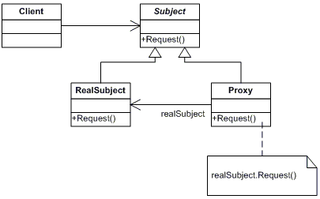

# 1. 线程池相关
一个程序中线程的创建和销毁是需要时间的。因此可以使用线程池来优化。 
线程池的接口模型：

  

- Executor:所有线程池的接口，只有一个方法
- Executors:Executor的工厂类，提供了各种创建Executor的方法，返回的线程池都是实现了ExecutorService接口
- ThreadPoolExecutor:线程池的具体实现类，一般所有的线程池都是基于这个类实现的。

TheadPoolExecutor是线程池最核心的一个类。构造方法如下
```JAVA
public ThreadPoolExecutor(int corePoolSize,
                              int maximumPoolSize,
                              long keepAliveTime,
                              TimeUnit unit,
                              BlockingQueue<Runnable> workQueue,
                              ThreadFactory threadFactory,
                              RejectedExecutionHandler handler) {
        if (corePoolSize < 0 ||
            maximumPoolSize <= 0 ||
            maximumPoolSize < corePoolSize ||
            keepAliveTime < 0)
            throw new IllegalArgumentException();
        if (workQueue == null || threadFactory == null || handler == null)
            throw new NullPointerException();
        this.acc = System.getSecurityManager() == null ?
                null :
                AccessController.getContext();
        this.corePoolSize = corePoolSize;
        this.maximumPoolSize = maximumPoolSize;
        this.workQueue = workQueue;
        this.keepAliveTime = unit.toNanos(keepAliveTime);
        this.threadFactory = threadFactory;
        this.handler = handler;
    }
```
- corePoolSize:线程池的核心线程数
- maximumPoolSize:线程池中允许的最大线程数
- keepAliveTime:空闲线程结束的超时时间
- unit:是一个枚举，他表示的是keepAliveTime的单位
- workQueue:工作队列，用于任务的存放。这是一个阻塞队列，一般取值为：
    - ArrayBlockingQueue: 基于数组的先进先出队列，此队列创建时必须指定大小；
    - LinkedBlockingQueue: 基于链表的先进先出队列，如果创建时没有指定此队列大小，则默认为Integer.MAX_VALUE；
    - SynchronousQueue: 这个队列比较特殊，它不会保存提交的任务，而是将直接新建一个线程来执行新来的任务。
- threadFactory：线程工厂，主要用来创建线程；
- handler：表示当拒绝处理任务时的策略，有以下四种取值:
    - ThreadPoolExecutor.AbortPolicy:丢弃任务并抛出RejectedExecutionException异常。 
    - ThreadPoolExecutor.DiscardPolicy：也是丢弃任务，但是不抛出异常。 
    - ThreadPoolExecutor.DiscardOldestPolicy：丢弃队列最前面的任务，然后重新尝试执行任务（重复此过程）
    - ThreadPoolExecutor.CallerRunsPolicy：由调用线程处理该任务 

<font color="red">
    假如有一个工厂，工厂里面有10个工人，每个工人同时只能做一件任务。因此只要当10个工人中有工人是空闲的，来了任务就分配给空闲的工人做；当10个工人都有任务在做时，如果还来了任务，就把任务进行排队等待；如果说新任务数目增长的速度远远大于工人做任务的速度，那么此时工厂主管可能会想补救措施，比如重新招4个临时工人进来；然后就将任务也分配给这4个临时工人做；如果说着14个工人做任务的速度还是不够，此时工厂主管可能就要考虑不再接收新的任务或者抛弃前面的一些任务了。当这14个工人当中有人空闲时，而新任务增长的速度又比较缓慢，工厂主管可能就考虑辞掉4个临时工了，只保持原来的10个工人，毕竟请额外的工人是要花钱的。

    这里的10相当于corePoolSize,这里的14相当于maximumPoolSize
</font>

java线程池的工作过程

1. 线程池刚创建时，里面没有一个线程。任务队列是作为参数传进来的。不过就算队列里有任务，线程池也不会马上执行他们。
2. 当调用一个execute()方法添加一个任务时，线程池会做出如下判断：
    1. 如果正在运行的线程数量小于corePoolSize,那么马上创建线程运行这个任务
    2. 如果正在运行的线程数量大于或等于corePoolSize，那么就将这个任务放入队列
    3. 如果这时候队列满了，而且正在运行的线程数量小于maximumPoolSize，那么还是要创建非核心线程立刻运行这个任务
    4. 如果队列满了，而正在运行的线程数量大于或等于maximumPoolSize，那么线程池会抛出RejectExecutionException
3. 当一个线程完成任务时，它会从队列取下一个任务来执行。
4. 当一个线程无事可做，超过一定时间(keepAliveTime)，线程池就会判断，如果当前运行的线程数大于corePoolSize，那么这个线程会被停掉，所以线程池的所有任务完成以后，它会收缩到corePoolSize的大小。(注意，这里是默认的),如果调用allowCoreThreadTimeOut(boolean)方法，在线程池中的线程数不大于corePoolSize时，keepAliveTime参数也会起作用，直到线程池中的线程数为0；

线程池的关闭

ThreadPoolSize提供了俩个方法用于线程池的关闭，分别是shutdown()和shutdownNow():   
shutdown()：不会立即终止线程池，而是要等所有任务缓存队列中的任务都执行完后才终止，但再也不会接受新的任务   
shutdownNow()：立即终止线程池，并尝试打断正在执行的任务，并且清空任务缓存队列，返回尚未执行的任务

线程池容量的动态调整

ThreadPoolExecutor提供了动态调整线程池容量大小的方法：setCorePoolSize()和setMaximumPoolSize():    
setCorePoolSize：设置核心池大小   
setMaximumPoolSize：设置线程池最大能创建的线程数目大小    
当上述参数从小变大时，ThreadPoolExecutor进行线程赋值，还可能立即创建新的线程来执行任务。

#  2. 注解的定义
#### 注解通过@interface关键字定义
```JAVA
public @interface TestAnnotation {
}
```
上述代码创建了一个名为TestAnnotation的注解。   
#### 注解的使用
```JAVA
@TestAnnotation
public class Test {
}
```
简单理解就是给Test类添加了一个TestAnnotation标签    
不过想让注解正常工作，还需要元注解
#### 元注解
元注解是可以注解到注解上的注解，或者说元注解是一种基本注解，但是它能够应用到其它的注解上面。    
元标签有 @Retention、@Documented、@Target、@Inherited、@Repeatable 5 种。 
##### @Retention
Retention 的英文意为保留期的意思。当 @Retention 应用到一个注解上的时候，它解释说明了这个注解的的存活时间。       
他的取值如下：

1. RetentionPolicy.SOURCE 注解只在源码阶段保留，在编译器进行编译时它将被丢弃忽视。
2. RetentionPolicy.CLASS 注解只被保留到编译进行的时候，它并不会被加载到 JVM 中。
3. RetentionPolicy.RUNTIME 注解可以保留到程序运行的时候，它会被加载进入到 JVM 中，所以在程序运行时可以获取到它们。
当一个注解被@Retention修饰的时候，@Rentention指定了这个注解的生命周期。    
```JAVA
@Retention(RetentionPolicy.RUNTIME)
public @interface TestAnnotation {
}
```
上述代码指定 TestAnnotation 可以在程序运行周期被获取到，因此它的生命周期非常的长。

##### @Documented
这个元注解肯定是和文档有关。它的作用是能够将注解中的元素包含到 Javadoc 中去

##### @Target
指定了注解运用的地方。类比到标签，原本标签是你想张贴到哪个地方就到哪个地方，但是因为@Target 的存在，它张贴的地方就非常具体了，比如只能张贴到方法上、类上、方法参数上等等。@Target 有下面的取值：

- ElementType.ANNOTATION_TYPE 可以给一个注解进行注解
- ElementType.CONSTRUCTOR 可以给构造方法进行注解
- ElementType.FIELD 可以给属性进行注解
- ElementType.LOCAL_VARIABLE 可以给局部变量进行注解
- ElementType.METHOD 可以给方法进行注解
- ElementType.PACKAGE 可以给一个包进行注解
- ElementType.PARAMETER 可以给一个方法内的参数进行注解
- ElementType.TYPE 可以给一个类型进行注解，比如类、接口、枚举

##### @Inherited
Inherited 是继承的意思，但是它并不是说注解本身可以继承，而是说如果一个超类被 @Inherited 注解过的注解进行注解的话，那么如果它的子类没有被任何注解应用的话，那么这个子类就继承了超类的注解。
```JAVA
@Inherited
@Retention(RetentionPolicy.RUNTIME)
@interface Test {}

@Test
public class A {}

public class B extends A {}
```
注解 Test 被 @Inherited 修饰，之后类 A 被 Test 注解，类 B 继承 A,类 B 也拥有 Test 这个注解。

##### @Repeatable
Repeatable 自然是可重复的意思。@Repeatable 是 Java 1.8 才加进来的，所以算是一个新的特性。
什么样的注解会多次应用呢？通常是注解的值可以同时取多个。
```JAVA
@interface Persons {
    Person[]  value();
}

@Repeatable(Persons.class)
@interface Person{
    String role default "";
}

@Person(role="artist")
@Person(role="coder")
@Person(role="PM")
public class SuperMan{
    
}
```
@Repeatable 注解了 Person。而 @Repeatable 后面括号中的类相当于一个容器注解。
什么是容器注解呢？就是用来存放其它注解的地方。它本身也是一个注解。
可以这样理解：Persons 是一张总的标签，上面贴满了 Person 这种同类型但内容不一样的标签。把 Persons 给一个 SuperMan 贴上，相当于同时给他贴了程序员、产品经理、画家的标签。

#### 注解的属性
<font color="red">注解的属性也叫做成员变量。注解只有成员变量，没有方法。</font>注解的成员变量在注解的定义中以“无形参的方法”形式来声明，其方法名定义了该成员变量的名字，其返回值定义了该成员变量的类型。
```JAVA
@Target(ElementType.TYPE)
@Retention(RetentionPolicy.RUNTIME)
public @interface TestAnnotation {
    
    int id();
    
    String msg();
}
```
上面代码定义了 TestAnnotation 这个注解中拥有 id 和 msg 两个属性。在使用的时候，我们应该给它们进行赋值。赋值的方式是在注解的括号内以 value="" 形式，多个属性之前用 ","隔开。
```JAVA
@TestAnnotation(id=3,msg="hello annotation")
public class Test {
}
```
<font color="red">需要注意的是，在注解中定义属性时它的类型必须是 8 种基本数据类型外加 类、接口、注解及它们的数组。注解中属性可以有默认值，默认值需要用 default 关键值指定。</font>
```JAVA
@Target(ElementType.TYPE)
@Retention(RetentionPolicy.RUNTIME)
public @interface TestAnnotation {
    
    public int id() default -1;
    
    public String msg() default "Hi";

}
```
他可以这样用：
```JAVA
@TestAnnotation() //因为TestAnnotation中的值有默认的了
public class Test {}
```
另外，还有一种情况。如果一个注解内仅仅只有一个名字为 value 的属性时，应用这个注解时可以直接接属性值填写到括号内。
```JAVA
public @interface Check {
    String value();
}


@Check("hi")
int a;
```
还需要注意的一种情况是一个注解没有任何属性。
```JAVA
public @interface Perform {}
```
在使用这个注解的时候连括号都可以不用。
```JAVA
@Perform
public void testMethod(){}
```

#### Java 预置的注解
| 注解 | 作用|
|-------|-------|
|@Deprecated|这个元素是用来标记过时的元素。编译器在编译阶段遇到这个注解时会发出提醒警告，告诉开发者正在调用一个过时的元素比如过时的方法、过时的类、过时的成员变量。|
|@Override|提示子类要复写父类中被 @Override 修饰的方法|
|@SuppressWarnings|阻止警告的意思。调用被 @Deprecated 注解的方法后，编译器会警告提醒，而有时候开发者会忽略这种警告，他们可以在调用的地方通过 @SuppressWarnings 达到目的。|
|@SafeVarargs|参数安全类型注解。提醒开发者不要用参数做一些不安全的操作,它的存在会阻止编译器产生 unchecked 这样的警告|
|@FunctionalInterface|函数式接口注解，这个是 Java 1.8 版本引入的新特性。|

```JAVA
@FunctionalInterface
public interface Runnable {
    /**
     * When an object implementing interface <code>Runnable</code> is used
     * to create a thread, starting the thread causes the object's
     * <code>run</code> method to be called in that separately executing
     * thread.
     * <p>
     * The general contract of the method <code>run</code> is that it may
     * take any action whatsoever.
     *
     * @see     java.lang.Thread#run()
     */
    public abstract void run();
}
```
我们进行线程开发中常用的 Runnable 就是一个典型的函数式接口，上面源码可以看到它就被 @FunctionalInterface 注解。函数式接口标记有什么用，这个原因是函数式接口可以很容易转换为 Lambda 表达式。

#### 注解的提取
要想正确检阅注解，离不开一个手段，那就是反射。
##### 注解与反射
- 注解通过反射获取。首先可以通过 Class 对象的 isAnnotationPresent() 方法判断它是否应用了某个注解

```JAVA
    public boolean isAnnotationPresent(Class<? extends Annotation> annotationClass) {}
```

- 然后通过 getAnnotation() 方法来获取 Annotation 对象。

```JAVA
    public <A extends Annotation> A getAnnotation(Class<A> annotationClass) {}
```

    或者是getAnnotations() 方法

```JAVA
    public Annotation[] getAnnotations() {}
```

    前一种方法返回指定类型的注解，后一种方法返回注解到这个元素上的所有注解。

- 如果获取到的 Annotation 如果不为 null，则就可以调用它们的属性方法了。
```JAVA
public class Test {
    
    public static void main(String[] args) {
        
        boolean hasAnnotation = Test.class.isAnnotationPresent(TestAnnotation.class);
        
        if ( hasAnnotation ) {
            TestAnnotation testAnnotation = Test.class.getAnnotation(TestAnnotation.class);
            
            System.out.println("id:"+testAnnotation.id());
            System.out.println("msg:"+testAnnotation.msg());
        }

    }

} 
```

上面的例子中，只是检阅出了注解在类上的注解，其实属性、方法上的注解照样是可以的。
```JAVA
@TestAnnotation(msg="hello")
public class Test {
    
    @Check(value="hi")
    int a;
    
    
    @Perform
    public void testMethod(){}
    
    
    @SuppressWarnings("deprecation")
    public void test1(){
        Hero hero = new Hero();
        hero.say();
        hero.speak();
    }


    public static void main(String[] args) {
        
        boolean hasAnnotation = Test.class.isAnnotationPresent(TestAnnotation.class);
        
        if ( hasAnnotation ) {
            TestAnnotation testAnnotation = Test.class.getAnnotation(TestAnnotation.class);
            //获取类的注解
            System.out.println("id:"+testAnnotation.id());
            System.out.println("msg:"+testAnnotation.msg());
        }
        
        
        try {
            Field a = Test.class.getDeclaredField("a");
            a.setAccessible(true);
            //获取一个成员变量上的注解
            Check check = a.getAnnotation(Check.class);
            
            if ( check != null ) {
                System.out.println("check value:"+check.value());
            }
            
            Method testMethod = Test.class.getDeclaredMethod("testMethod");
            
            if ( testMethod != null ) {
                // 获取方法中的注解
                Annotation[] ans = testMethod.getAnnotations();
                for( int i = 0;i < ans.length;i++) {
                    System.out.println("method testMethod annotation:"+ans[i].annotationType().getSimpleName());
                }
            }
        } catch (NoSuchFieldException e) {
            // TODO Auto-generated catch block
            e.printStackTrace();
            System.out.println(e.getMessage());
        } catch (SecurityException e) {
            // TODO Auto-generated catch block
            e.printStackTrace();
            System.out.println(e.getMessage());
        } catch (NoSuchMethodException e) {
            // TODO Auto-generated catch block
            e.printStackTrace();
            System.out.println(e.getMessage());
        }
        
        

    }

}
```
<font color="red">需要注意的是，如果一个注解要在运行时被成功提取，那么 @Retention(RetentionPolicy.RUNTIME) 是必须的。
</font>

# 总结
1. 如果注解难于理解，你就把它类同于标签，标签为了解释事物，注解为了解释代码。
2. 注解的基本语法，创建如同接口，但是多了个 @ 符号。
3. 注解的元注解。
4. 注解的属性。
5. 注解主要给编译器及工具类型的软件用的。
6. 注解的提取需要借助于 Java 的反射技术，反射比较慢，所以注解使用时也需要谨慎计较时间成本
>https://blog.csdn.net/briblue/article/details/73824058

# 3.JAVA代理模式
### 代理模式定义
定义：给某个对象提供一个代理对象，并由代理对象控制对于原对象的访问，即客户不直接操控原对象，而是通过代理对象间接地操控原对象

## 静态代理


### 代理模式的作用
1. 在某些情况下，一个客户不想或者不能直接引用另一个对象，而代理对象可以在客户端和目标对象之间起到中介的作用。
2. 通过代理类对原有类进行功能增强，如增加缓存、异常处理、日志处理等，Spring AOP用的就是（动态）代理模式

代理模式一般涉及到的角色有：

- 抽象主题(Subject)：声明真实对象和代理对象的共同接口
- 代理(Proxy)：代理对象角色内部含有对真实对象的引用，从而可以操作真实对象，同时代理对象提供与真实对象相同的接口以便在任何时刻都能代替真实对象。同时，代理对象可以在执行真实对象操作时，附加其他的操作，相当于对真实对象进行封装。
- 真实对象(RealSubject)：代理角色所代表的真实对象，是我们最终要引用的对象。


### 应用举例
定义一个卖票例子：
```JAVA
public interface TicketSubject {
   public void sell();
}
```

定义一个真实对象:
```JAVA
public class TrainStation implements TicketSubject {
   public void sell() {
   System.out.println("卖出一张票!");
   }
}
```

再定义一个代理对象：
```JAVA
public class TrainStationProxy implements TicketSubject {
   private TrainStation trainStation;//持有真实对象的引用
   public TrainStationProxy(TrainStation trainStation){
       this.trainStation=trainStation;
   }

  public void sell() {
      System.out.println("欢迎光临!");
      trainStation.sell();//调用真实对象的方法，体现代理行为
      System.out.println("请交手续费!");
   }
}
```

最后，测试一下:
定义一个买票的人
```JAVA
public class SomeBody {
   private TicketSubject tickSubject;
   public void buy(){
      tickSubject.sell();
   }
   public void goToTicketSubject( TicketSubject tickSubject){
      this.tickSubject=tickSubject;
   }
}
```

注意，买票人依赖的是接口而不是具体实现类，这样就可以用代理类替换实际类了。

最后，这个人去代售点买票：
```JAVA
public class TestProxy {
   public static void main(String[] args) {
      SomeBody someBody=new SomeBody();
      TrainStationProxy adaptor=new TrainStationProxy(new TrainStation());
      someBody.goToTicketSubject(adaptor);
      someBody.buy();
   }
}
```
>https://blog.csdn.net/suifeng3051/article/details/51491158

在代理模式中代理对象和被代理对象一般实现相同的接口，调用者与代理对象进行交互。代理的存在对于调用者来说是透明的，调用者看到的只是接口。这就是传统的代理模式静态代理的特点。

那么传统的静态代理模式有什么问题呢？如果需要代理的类只有一个，那么静态代理没什么问题，如果有很多类需要代理呢，用静态代理的话就需要为每一个类创建一个代理类，显然这么做太过繁琐也容易出错。为此，JDK 5引入的动态代理机制，允许开发人员在运行时刻动态的创建出代理类及其对象。也就是说，我们不用为每个类再单独创建一个代理对象了。

##  动态代理
动态代理的原理：动态代理主要是利用了Java的反射机制。

### 动态代理类的创建
要创建一个动态代理，只需要利用Java API提供的两个类：

- java.lang.reflect.InvocationHandler： 这是调用处理器接口，它自定义了一个 invoke() 方法，我们就在这个方法里触发代理对象自己的方法，你可以在它的前后增加我们自己的增强方法。
- java.lang.reflect.Proxy： 这是 Java 动态代理机制的主类，它提供了一组静态方法来为一组接口动态地生成代理类及其对象，也就是动态生成代理对象的方法。

每个代理类的对象都会关联一个表示内部处理逻辑的InvocationHandler接口的实现。当使用者调用了代理对象所代理的接口中的方法的时候，这个调用的信息会被传递给InvocationHandler的invoke()方法。在 invoke()方法的参数中可以获取到代理对象、方法对应的Method对象和调用的实际参数。invoke()方法的返回值被返回给使用者。这种做法实际上相 当于对方法调用进行了拦截。熟悉AOP的人对这种使用模式应该不陌生。但是这种方式不需要依赖AspectJ等AOP框架。

# 4. 回调函数
当程序跑起来时，一般情况下，应用程序（application program）会时常通过API调用库里所预先备好的函数。但是有些库函数（library function）却要求应用先传给它一个函数，好在合适的时候调用，以完成目标任务。这个被传入的、后又被调用的函数就称为回调函数（callback function）。
