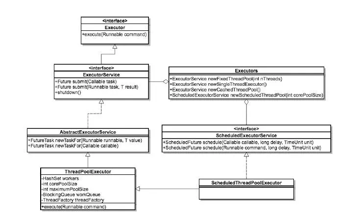

# 1. 线程池相关
一个程序中线程的创建和销毁是需要时间的。因此可以使用线程池来优化。 
线程池的接口模型：

  

- Executor:所有线程池的接口，只有一个方法
- Executors:Executor的工厂类，提供了各种创建Executor的方法，返回的线程池都是实现了ExecutorService接口
- ThreadPoolExecutor:线程池的具体实现类，一般所有的线程池都是基于这个类实现的。

TheadPoolExecutor是线程池最核心的一个类。构造方法如下
```JAVA
public ThreadPoolExecutor(int corePoolSize,
                              int maximumPoolSize,
                              long keepAliveTime,
                              TimeUnit unit,
                              BlockingQueue<Runnable> workQueue,
                              ThreadFactory threadFactory,
                              RejectedExecutionHandler handler) {
        if (corePoolSize < 0 ||
            maximumPoolSize <= 0 ||
            maximumPoolSize < corePoolSize ||
            keepAliveTime < 0)
            throw new IllegalArgumentException();
        if (workQueue == null || threadFactory == null || handler == null)
            throw new NullPointerException();
        this.acc = System.getSecurityManager() == null ?
                null :
                AccessController.getContext();
        this.corePoolSize = corePoolSize;
        this.maximumPoolSize = maximumPoolSize;
        this.workQueue = workQueue;
        this.keepAliveTime = unit.toNanos(keepAliveTime);
        this.threadFactory = threadFactory;
        this.handler = handler;
    }
```
- corePoolSize:线程池的核心线程数
- maximumPoolSize:线程池中允许的最大线程数
- keepAliveTime:空闲线程结束的超时时间
- unit:是一个枚举，他表示的是keepAliveTime的单位
- workQueue:工作队列，用于任务的存放。这是一个阻塞队列，一般取值为：
    - ArrayBlockingQueue: 基于数组的先进先出队列，此队列创建时必须指定大小；
    - LinkedBlockingQueue: 基于链表的先进先出队列，如果创建时没有指定此队列大小，则默认为Integer.MAX_VALUE；
    - SynchronousQueue: 这个队列比较特殊，它不会保存提交的任务，而是将直接新建一个线程来执行新来的任务。
- threadFactory：线程工厂，主要用来创建线程；
- handler：表示当拒绝处理任务时的策略，有以下四种取值:
    - ThreadPoolExecutor.AbortPolicy:丢弃任务并抛出RejectedExecutionException异常。 
    - ThreadPoolExecutor.DiscardPolicy：也是丢弃任务，但是不抛出异常。 
    - ThreadPoolExecutor.DiscardOldestPolicy：丢弃队列最前面的任务，然后重新尝试执行任务（重复此过程）
    - ThreadPoolExecutor.CallerRunsPolicy：由调用线程处理该任务 

<font color="red">
    假如有一个工厂，工厂里面有10个工人，每个工人同时只能做一件任务。因此只要当10个工人中有工人是空闲的，来了任务就分配给空闲的工人做；当10个工人都有任务在做时，如果还来了任务，就把任务进行排队等待；如果说新任务数目增长的速度远远大于工人做任务的速度，那么此时工厂主管可能会想补救措施，比如重新招4个临时工人进来；然后就将任务也分配给这4个临时工人做；如果说着14个工人做任务的速度还是不够，此时工厂主管可能就要考虑不再接收新的任务或者抛弃前面的一些任务了。当这14个工人当中有人空闲时，而新任务增长的速度又比较缓慢，工厂主管可能就考虑辞掉4个临时工了，只保持原来的10个工人，毕竟请额外的工人是要花钱的。

    这里的10相当于corePoolSize,这里的14相当于maximumPoolSize
</font>

java线程池的工作过程

1. 线程池刚创建时，里面没有一个线程。任务队列是作为参数传进来的。不过就算队列里有任务，线程池也不会马上执行他们。
2. 当调用一个execute()方法添加一个任务时，线程池会做出如下判断：
    1. 如果正在运行的线程数量小于corePoolSize,那么马上创建线程运行这个任务
    2. 如果正在运行的线程数量大于或等于corePoolSize，那么就将这个任务放入队列
    3. 如果这时候队列满了，而且正在运行的线程数量小于maximumPoolSize，那么还是要创建非核心线程立刻运行这个任务
    4. 如果队列满了，而正在运行的线程数量大于或等于maximumPoolSize，那么线程池会抛出RejectExecutionException
3. 当一个线程完成任务时，它会从队列取下一个任务来执行。
4. 当一个线程无事可做，超过一定时间(keepAliveTime)，线程池就会判断，如果当前运行的线程数大于corePoolSize，那么这个线程会被停掉，所以线程池的所有任务完成以后，它会收缩到corePoolSize的大小。(注意，这里是默认的),如果调用allowCoreThreadTimeOut(boolean)方法，在线程池中的线程数不大于corePoolSize时，keepAliveTime参数也会起作用，直到线程池中的线程数为0；

线程池的关闭

ThreadPoolSize提供了俩个方法用于线程池的关闭，分别是shutdown()和shutdownNow():   
shutdown()：不会立即终止线程池，而是要等所有任务缓存队列中的任务都执行完后才终止，但再也不会接受新的任务   
shutdownNow()：立即终止线程池，并尝试打断正在执行的任务，并且清空任务缓存队列，返回尚未执行的任务

线程池容量的动态调整

ThreadPoolExecutor提供了动态调整线程池容量大小的方法：setCorePoolSize()和setMaximumPoolSize():    
setCorePoolSize：设置核心池大小   
setMaximumPoolSize：设置线程池最大能创建的线程数目大小    
当上述参数从小变大时，ThreadPoolExecutor进行线程赋值，还可能立即创建新的线程来执行任务。


