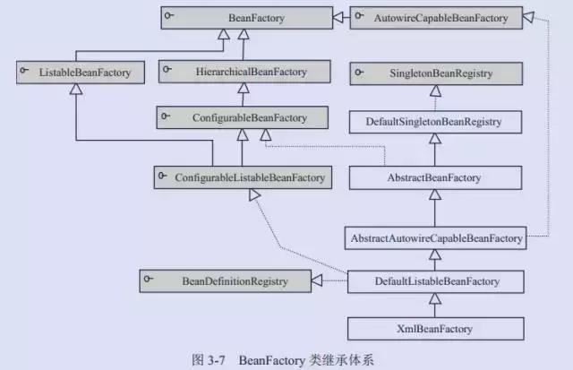
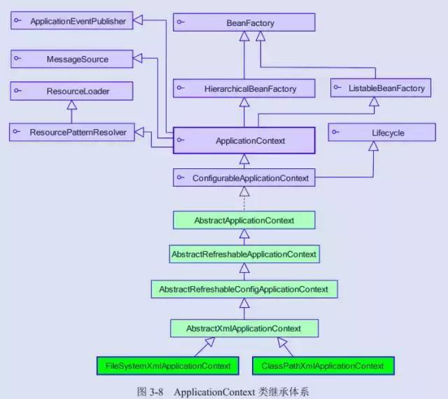
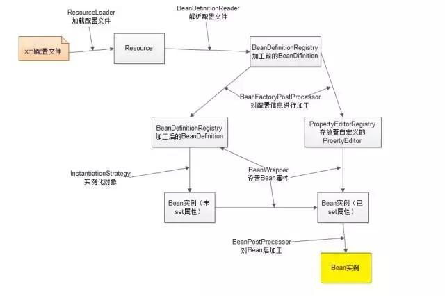
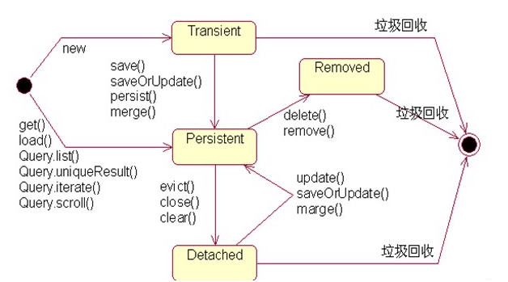

# 1. 说一下IOC和AOP?
## spring 的优点
1. 降低了组件之间的耦合性 ，实现了软件各层之间的解耦 
2. 可以使用容易提供的众多服务，如事务管理，消息服务等
3. 容器提供单例模式支持
4. 容器提供了AOP技术，利用它很容易实现如权限拦截，运行期监控等功能
5. 容器提供了众多的辅助类，能加快应用的开发 
6. spring对于主流的应用框架提供了集成支持，如hibernate，JPA，Struts等 
7. spring属于低侵入式设计，代码的污染极低
8. 独立于各种应用服务器
9. spring的DI机制降低了业务对象替换的复杂性
10. Spring的高度开放性，并不强制应用完全依赖于Spring，开发者可以自由选择spring的部分或全部 

## 什么是DI机制
依赖注入（Dependecy Injection）和控制反转（Inversion of Control）是同一个概念，具体的讲：当某个角色需要另外一个角色协助的时候，在传统的程序设计过程中，通常由调用者来创建被调用者的实例。但在spring中创建被调用者的工作不再由调用者来完成，因此称为控制反转。创建被调用者的工作由spring来完成，然后注入调用者   
spring的依赖注入有3种方式：

- 使用属性的setter方法注入 ，这是最常用的方式
- 使用构造器注入
- 使用Filed注入（用于注解方式）

## 什么是AOP
面向切面编程（AOP）完善spring的依赖注入（DI），面向切面编程在spring中主要表现为两个方面:

1. 面向切面编程提供声明式事务管理
2. spring支持用户自定义的切面

面向切面编程（aop）是对面向对象编程（oop）的补充，面向对象编程将程序分解成各个层次的对象，面向切面编程将程序运行过程分解成各个切面。AOP从程序运行角度考虑程序的结构，提取业务处理过程的切面，oop是静态的抽象，aop是动态的抽象，
是对应用执行过程中的步骤进行抽象，从而获得步骤之间的逻辑划分

## aop框架具有的两个特征
1. 各个步骤之间的良好隔离性
2. 源代码无关性 
Spring的事务管理机制实现的原理，就是通过这样一个动态代理对所有需要事务管理的Bean进行加载，并根据配置在invoke方法中对当前调用的 方法名进行判定，并在method.invoke方法前后为其加上合适的事务管理代码，这样就实现了Spring式的事务管理。Spring中的AOP实 现更为复杂和灵活，不过基本原理是一致的。

# 2. 介绍一下bean的生命周期
在spring中，从BeanFactory或ApplicationContext取得的实例为Singleton，也就是预设为每一个Bean的别名只能维持一个实例，而不是每次都产生一个新的对象使用Singleton模式产生单一实例，对单线程的程序说并不会有什么问题，但对于多线程的程序，就必须注意安全(Thread-safe)的议题，防止多个线程同时存取共享资源所引发的数据不同步问题。

然而在spring中 可以设定每次从BeanFactory或ApplicationContext指定别名并取得Bean时都产生一个新的实例：例如：

在spring中，singleton属性默认是true，只有设定为false，则每次指定别名取得的Bean时都会产生一个新的实例。一个Bean从创建到销毁，如果是用BeanFactory来生成,管理Bean的话，会经历几个执行阶段(如下图)：


1. bean的建立:容器寻找Bean的定义信息并将其实例化。
2. 属性注入:使用依赖注入，Spring按照Bean定义信息配置Bean所有属性
3. BeanNameAware的setBeanName()：如果Bean类有实现org.springframework.beans.BeanNameAware接口，工厂调用Bean的setBeanName()方法传递Bean的ID。
4. BeanFactoryAware的setBeanFactory()：如果Bean类有实现org.springframework.beans.factory.BeanFactoryAware接口，工厂调用setBeanFactory()方法传入工厂自身。
5. BeanPostProcessors的ProcessBeforeInitialization():如果有org.springframework.beans.factory.config.BeanPostProcessors和Bean关联，那么其postProcessBeforeInitialization()方法将被将被调用。
6. initializingBean的afterPropertiesSet()：如果Bean类已实现org.springframework.beans.factory.InitializingBean接口，则执行他的afterProPertiesSet()方法
7. Bean定义文件中定义init-method：可以在Bean定义文件中使用"init-method"属性设定方法名称例如：如果有以上设置的话，则执行到这个阶段，就会执行initBean()方法
8. BeanPostProcessors的ProcessaAfterInitialization():如果有任何的BeanPostProcessors实例与Bean实例关联，则执行BeanPostProcessors实例的ProcessaAfterInitialization()方法。此时，Bean已经可以被应用系统使用，并且将保留在BeanFactory中知道它不在被使用。有两种方法可以将其从BeanFactory中删除掉如下图:


1. DisposableBean的destroy():在容器关闭时，如果Bean类有实现org.springframework.beans.factory.DisposableBean接口，则执行他的destroy()方法
2. Bean定义文件中定义destroy-method:在容器关闭时，可以在Bean定义文件中使用"destroy-method"属性设定方法名称。

如果有以上设定的话，则进行至这个阶段时，就会执行destroy()方法，如果是使用ApplicationContext来生成并管理Bean的话则稍有不同，使用ApplicationContext来生成及管理Bean实例的话，在执行BeanFactoryAware的setBeanFactory()阶段后，若Bean类上有实现org.springframework.context.ApplicationContextAware接口，则执行其setApplicationContext()方法，接着才执行BeanPostProcessors的ProcessBeforeInitialization()及之后的流程。

找工作的时候有些人会被问道Spring中Bean的生命周期，其实也就是考察一下对Spring是否熟悉，工作中很少用到其中的内容，那我们简单看一下。
Spring上下文中的Bean的生命周期，如下：

1. 实例化一个Bean－－也就是我们常说的new；
2. 按照Spring上下文对实例化的Bean进行配置－－也就是IOC注入；
3. 如果这个Bean已经实现了BeanNameAware接口，会调用它实现的setBeanName(String)方法，此处传递的就是Spring配置文件中Bean的id值
4. 如果这个Bean已经实现了BeanFactoryAware接口，会调用它实现的setBeanFactory(setBeanFactory(BeanFactory)传递的是Spring工厂自身（可以用这个方式来获取其它Bean，只需在Spring配置文件中配置一个普通的Bean就可以）；
5. 如果这个Bean已经实现了ApplicationContextAware接口，会调用setApplicationContext(ApplicationContext)方法，传入Spring上下文（同样这个方式也可以实现步骤4的内容，但比4更好，因为ApplicationContext是BeanFactory的子接口，有更多的实现方法）；
6. 如果这个Bean关联了BeanPostProcessor接口，将会调用postProcessBeforeInitialization(Object obj, String s)方法，BeanPostProcessor经常被用作是Bean内容的更改，并且由于这个是在Bean初始化结束时调用那个的方法，也可以被应用于内存或缓存技术；
7. 如果Bean在Spring配置文件中配置了init-method属性会自动调用其配置的初始化方法。
8. 如果这个Bean关联了BeanPostProcessor接口，将会调用postProcessAfterInitialization(Object obj, String s)方法、；   
**注：以上工作完成以后就可以应用这个Bean了，那这个Bean是一个Singleton的，所以一般情况下我们调用同一个id的Bean会是在内容地址相同的实例，当然在Spring配置文件中也可以配置非Singleton，这里我们不做赘述。**
9. 当Bean不再需要时，会经过清理阶段，如果Bean实现了DisposableBean这个接口，会调用那个其实现的destroy()方法；
10. 最后，如果这个Bean的Spring配置中配置了destroy-method属性，会自动调用其配置的销毁方法。
>http://www.cnblogs.com/kenshinobiy/p/4652008.html

# 4. Spring里面注解用过没有？autowired 和resource区别？
@Resource的作用相当于@Autowired，只不过@Autowired按byType自动注入，而@Resource默认按 byName自动注入罢了。@Resource有两个属性是比较重要的，分是name和type，Spring将@Resource注解的name属性解析为bean的名字，而type属性则解析为bean的类型。所以如果使用name属性，则使用byName的自动注入策略，而使用type属性时则使用byType自动注入策略。如果既不指定name也不指定type属性，这时将通过反射机制使用byName自动注入策略。

### @Resource装配顺序

1. 如果同时指定了name和type，则从Spring上下文中找到唯一匹配的bean进行装配，找不到则抛出异常
2. 如果指定了name，则从上下文中查找名称（id）匹配的bean进行装配，找不到则抛出异常 
3. 如果指定了type，则从上下文中找到类型匹配的唯一bean进行装配，找不到或者找到多个，都会抛出异常
4. 如果既没有指定name，又没有指定type，则自动按照byName方式进行装配；如果没有匹配，则回退为一个原始类型进行匹配，如果匹配则自动装配；

### @Autowired 与@Resource的区别：
- @Autowired与@Resource都可以用来装配bean. 都可以写在字段上,或写在setter方法上。
- @Autowired默认按类型装配（这个注解是属于spring的），默认情况下必须要求依赖对象必须存在，如果要允许null值，可以设置它的required属性为false，如：@Autowired(required=false) ，如果我们想使用名称装配可以结合@Qualifier注解进行使用，如下：
```JAVA
@Autowired()
@Qualifier("baseDao")
private BaseDao baseDao;
```
- @Resource（这个注解属于J2EE的），默认安装名称进行装配，名称可以通过name属性进行指定，如果没有指定name属性，当注解写在字段上时，默认取字段名进行安装名称查找，如果注解写在setter方法上默认取属性名进行装配。当找不到与名称匹配的bean时才按照类型进行装配。但是需要注意的是，如果name属性一旦指定，就只会按照名称进行装配。
```JAVA
@Resource(name="baseDao")
private BaseDao baseDao;
```
- 推荐使用：@Resource注解在字段上，这样就不用写setter方法了，并且这个注解是属于J2EE的，减少了与spring的耦合。这样代码看起就比较优雅。

# 3. @Controller和@RestController的区别？
@RestController注解相当于@ResponseBody ＋ @Controller合在一起的作用

1. 如果只是使用@RestController注解Controller，则Controller中的方法无法返回jsp页面，配置的视图解析器InternalResourceViewResolver不起作用，返回的内容就是Return 里的内容。
例如：本来应该到success.jsp页面的，则其显示success.
2. 如果需要返回到指定页面，则需要用 @Controller配合视图解析器InternalResourceViewResolver才行。
3. 如果需要返回JSON，XML或自定义mediaType内容到页面，则需要在对应的方法上加上@ResponseBody注解。

### 使用@Controller 注解
在对应的方法上，视图解析器可以解析return 的jsp,html页面，并且跳转到相应页面。若返回json等内容到页面，则需要加@ResponseBody注解
```JAVA
@CrossOrigin
@Controller
public class FileUploadController {

//跳转到上传文件的页面
@RequestMapping(value="/gouploadimg", method = RequestMethod.GET)
public String goUploadImg() {
//跳转到 templates 目录下的 uploadimg.html
return "uploadimg";
}

//处理文件上传
@RequestMapping(value="/testuploadimg", method = RequestMethod.POST)
public @ResponseBody String uploadImg(@RequestParam("file") MultipartFile file,
HttpServletRequest request) {
System.out.println("调用文件上传方法");
String contentType = file.getContentType();
String fileName = file.getOriginalFilename();
```
### @RestController注解
相当于@Controller+@ResponseBody两个注解的结合，返回json数据不需要在方法前面加@ResponseBody注解了，但使用@RestController这个注解，就不能返回jsp,html页面，视图解析器无法解析jsp,html页面
```JAVA
@CrossOrigin
@RestController /* @Controller + @ResponseBody*/
public class HospitalController {

    //注入Service服务对象
    @Autowired
    private HospitalService hospitalService;

    /**
     * 查询所有医院信息（未分页）
     */

    @RequestMapping(value = "findAllHospital",method = RequestMethod.GET)
    public  List<Hospital> findAllHospital(){
        List<Hospital> hospitalList= hospitalService.findAllHospital();
        return hospitalList;
    }
```

# 4. 依赖注入的方式有几种，哪几种？

spring的依赖注入有3种方式：

- 使用属性的setter方法注入 ，这是最常用的方式
- 使用构造器注入
- 使用Filed注入（用于注解方式）

# 5. springIOC原理？自己实现IOC要怎么做，哪些步骤？
Bean缓存池：HashMap实现

### IOC容器介绍
Spring 通过一个配置文件描述 Bean 及 Bean 之间的依赖关系，利用 Java 语言的反射功能实例化 Bean 并建立 Bean 之间的依赖关系。 Spring 的 IoC 容器在完成这些底层工作的基础上，还提供了 Bean 实例缓存、生命周期管理、 Bean 实例代理、事件发布、资源装载等高级服务。

BeanFactory 是 Spring 框架的基础设施，面向 Spring 本身；

ApplicationContext 面向使用 Spring 框架的开发者，几乎所有的应用场合我们都直接使用 ApplicationContext 而非底层的 BeanFactory。

BeanFactory体系架构：


- BeanDefinitionRegistry:Spring 配置文件中每一个节点元素在 Spring 容器里都通过一个 BeanDefinition 对象表示，它描述了 Bean 的配置信息。而 BeanDefinitionRegistry 接口提供了向容器手工注册 BeanDefinition 对象的方法。
- BeanFactory 接口位于类结构树的顶端 ，它最主要的方法就是 getBean(String beanName)，该方法从容器中返回特定名称的 Bean，BeanFactory 的功能通过其他的接口得到不断扩展:
    - **ListableBeanFactory**：该接口定义了访问容器中 Bean 基本信息的若干方法，如查看Bean 的个数、获取某一类型 Bean 的配置名、查看容器中是否包括某一 Bean 等方法
    - **HierarchicalBeanFactory**：父子级联 IoC 容器的接口，子容器可以通过接口方法访问父容器； 通过 HierarchicalBeanFactory 接口， Spring 的 IoC 容器可以建立父子层级关联的容器体系，子容器可以访问父容器中的 Bean，但父容器不能访问子容器的 Bean。Spring 使用父子容器实现了很多功能，比如在 Spring MVC 中，展现层 Bean 位于一个子容器中，而业务层和持久层的 Bean 位于父容器中。这样，展现层 Bean 就可以引用业务层和持久层的 Bean，而业务层和持久层的 Bean 则看不到展现层的 Bean。
    - **ConfigurableBeanFactory**：是一个重要的接口，增强了 IoC 容器的可定制性，它定义了设置类装载器、属性编辑器、容器初始化后置处理器等方法；
    - **AutowireCapableBeanFactory**：定义了将容器中的 Bean 按某种规则（如按名字匹配、按类型匹配等）进行自动装配的方法
    - **SingletonBeanRegistry**：定义了允许在运行期间向容器注册单实例 Bean 的方法；

<font color="red">值得一提的是，在初始化 BeanFactory 时，必须为其提供一种日志框架，比如使用Log4J， 即在类路径下提供 Log4J 配置文件，这样启动 Spring 容器才不会报错。</font>

### ApplicationContext
ApplicationContext 由 BeanFactory 派生而来，提供了更多面向实际应用的功能。

在BeanFactory 中，很多功能需要以编程的方式实现，而在 ApplicationContext 中则可以通过配置的方式实现。


ApplicationContext 继承了 HierarchicalBeanFactory 和 ListableBeanFactory 接口，在此基础上，还通过多个其他的接口扩展了 BeanFactory 的功能：

- **ApplicationEventPublisher**：让容器拥有发布应用上下文事件的功能，包括容器启动事件、关闭事件等。实现了 ApplicationListener 事件监听接口的 Bean 可以接收到容器事件 ， 并对事件进行响应处理 。 在 ApplicationContext 抽象实现类AbstractApplicationContext 中，我们可以发现存在一个 ApplicationEventMulticaster，它负责保存所有监听器，以便在容器产生上下文事件时通知这些事件监听者。
- **MessageSource**：为应用提供 i18n 国际化消息访问的功能
- **ResourcePatternResolver** ： 所 有 ApplicationContext 实现类都实现了类似于PathMatchingResourcePatternResolver 的功能，可以通过带前缀的 Ant 风格的资源文件路径装载 Spring 的配置文件。
- __LifeCycle__：该接口是 Spring 2.0 加入的，该接口提供了 start()和 stop()两个方法，主要用于控制异步处理过程。在具体使用时，该接口同时被 ApplicationContext 实现及具体 Bean 实现， ApplicationContext 会将 start/stop 的信息传递给容器中所有实现了该接口的 Bean，以达到管理和控制 JMX、任务调度等目的。
- __ConfigurableApplicationContext__ 扩展于 ApplicationContext，它新增加了两个主要的方法： refresh()和 close()，让 ApplicationContext 具有启动、刷新和关闭应用上下文的能力。在应用上下文关闭的情况下调用 refresh()即可启动应用上下文，在已经启动的状态下，调用 refresh()则清除缓存并重新装载配置信息，而调用close()则可关闭应用上下文。这些接口方法为容器的控制管理带来了便利，但作为开发者，我们并不需要过多关心这些方法。

ApplicationContext 和 BeanFactory不同之处在于：ApplicationContext会利用 Java 反射机制自动识别出配置文件中定义的 BeanPostProcessor、 InstantiationAwareBeanPostProcessor 和 BeanFactoryPostProcessor，并自动将它们注册到应用上下文中；而后者需要在代码中通过手工调用 addBeanPostProcessor()方法进行注册。这也是为什么在应用开发时，我们普遍使用 ApplicationContext 而很少使用 BeanFactory 的原因之一

### IOC容器工作机制
#### 容器启动过程
__web环境下Spring容器、SpringMVC容器启动过程__：

首先，对于一个web应用，其部署在web容器中，web容器提供其一个全局的上下文环境，这个上下文就是ServletContext，其为后面的spring IoC容器提供宿主环境。

其次，在web.xml中会提供有contextLoaderListener（或ContextLoaderServlet）。在web容器启动时，会触发容器初始化事件，此时contextLoaderListener会监听到这个事件，其contextInitialized方法会被调用，在这个方法中，spring会初始化一个启动上下文，这个上下文被称为根上下文，即WebApplicationContext，这是一个接口类，确切的说，其实际的实现类是XmlWebApplicationContext。这个就是spring的IoC容器，其对应的Bean定义的配置由web.xml中的context-param标签指定。在这个IoC容器初始化完毕后，spring容器以WebApplicationContext.ROOTWEBAPPLICATIONCONTEXTATTRIBUTE为属性Key，将其存储到ServletContext中，便于获取。

再次，contextLoaderListener监听器初始化完毕后，开始初始化web.xml中配置的Servlet，这个servlet可以配置多个，以最常见的DispatcherServlet为例（Spring MVC），这个servlet实际上是一个标准的前端控制器，用以转发、匹配、处理每个servlet请求。DispatcherServlet上下文在初始化的时候会建立自己的IoC上下文容器，用以持有spring mvc相关的bean，这个servlet自己持有的上下文默认实现类也是XmlWebApplicationContext。在建立DispatcherServlet自己的IoC上下文时，会利用WebApplicationContext.ROOTWEBAPPLICATIONCONTEXTATTRIBUTE先从ServletContext中获取之前的根上下文(即WebApplicationContext)作为自己上下文的parent上下文（即第2步中初始化的XmlWebApplicationContext作为自己的父容器）。有了这个parent上下文之后，再初始化自己持有的上下文（这个DispatcherServlet初始化自己上下文的工作在其initStrategies方法中可以看到，大概的工作就是初始化处理器映射、视图解析等）。初始化完毕后，spring以与servlet的名字相关(此处不是简单的以servlet名为Key，而是通过一些转换)的属性为属性Key，也将其存到ServletContext中，以便后续使用。这样每个servlet就持有自己的上下文，即拥有自己独立的bean空间，同时各个servlet共享相同的bean，即根上下文定义的那些bean。

#### Bean加载过程
Spring的高明之处在于，它使用众多接口描绘出了所有装置的蓝图，构建好Spring的骨架，继而通过继承体系层层推演，不断丰富，最终让Spring成为有血有肉的完整的框架。所以查看Spring框架的源码时，有两条清晰可见的脉络：

1. 接口层描述了容器的重要组件及组件间的协作关系；
2. 继承体系逐步实现组件的各项功能。

接口层清晰地勾勒出Spring框架的高层功能，框架脉络呼之欲出。有了接口层抽象的描述后，不但Spring自己可以提供具体的实现，任何第三方组织也可以提供不同实现， 可以说Spring完善的接口层使框架的扩展性得到了很好的保证。纵向继承体系的逐步扩展，分步骤地实现框架的功能，这种实现方案保证了框架功能不会堆积在某些类的身上，造成过重的代码逻辑负载，框架的复杂度被完美地分解开了。

Spring组件按其所承担的角色可以划分为两类：

1. __物料组件__：Resource、BeanDefinition、PropertyEditor以及最终的Bean等，它们是加工流程中被加工、被消费的组件，就像流水线上被加工的物料。__BeanDefinition__：Spring通过BeanDefinition将配置文件中的配置信息转换为容器的内部表示，并将这些BeanDefinition注册到BeanDefinitionRegistry中。Spring容器的后续操作直接从BeanDefinitionRegistry中读取配置信息。
2. __加工设备组件__：ResourceLoader、BeanDefinitionReader、BeanFactoryPostProcessor、InstantiationStrategy以及BeanWrapper等组件像是流水线上不同环节的加工设备，对物料组件进行加工处理。__InstantiationStrategy__：负责实例化Bean操作，相当于Java语言中new的功能，并不会参与Bean属性的配置工作。属性填充工作留待BeanWrapper完成。__BeanWrapper__：继承了PropertyAccessor和PropertyEditorRegistry接口，BeanWrapperImpl内部封装了两类组件：（1）被封装的目标Bean（2）一套用于设置Bean属性的属性编辑器；具有三重身份：（1）Bean包裹器（2）属性访问器 （3）属性编辑器注册表。__PropertyAccessor__：定义了各种访问Bean属性的方法。PropertyEditorRegistry：属性编辑器的注册表

该图描述了Spring容器从加载配置文件到创建出一个完整Bean的作业流程：


1. ResourceLoader从存储介质中加载Spring配置信息，并使用Resource表示这个配置文件的资源
2. BeanDefinitionReader读取Resource所指向的配置文件资源，然后解析配置文件。配置文件中每一个解析成一个BeanDefinition对象，并保存到BeanDefinitionRegistry中
3. 容器扫描BeanDefinitionRegistry中的BeanDefinition，使用Java的反射机制自动识别出Bean工厂后处理后器（实现BeanFactoryPostProcessor接口）的Bean，然后调用这些Bean工厂后处理器对BeanDefinitionRegistry中的BeanDefinition进行加工处理。主要完成以下两项工作：
    - 对使用到占位符的元素标签进行解析，得到最终的配置值，这意味对一些半成品式的BeanDefinition对象进行加工处理并得到成品的BeanDefinition对象
    - 对BeanDefinitionRegistry中的BeanDefinition进行扫描，通过Java反射机制找出所有属性编辑器的Bean（实现java.beans.PropertyEditor接口的Bean），并自动将它们注册到Spring容器的属性编辑器注册表中（PropertyEditorRegistry）
4. Spring容器从BeanDefinitionRegistry中取出加工后的BeanDefinition，并调用InstantiationStrategy着手进行Bean实例化的工作
5. 在实例化Bean时，Spring容器使用BeanWrapper对Bean进行封装，BeanWrapper提供了很多以Java反射机制操作Bean的方法，它将结合该Bean的BeanDefinition以及容器中属性编辑器，完成Bean属性的设置工作
6. 利用容器中注册的Bean后处理器（实现BeanPostProcessor接口的Bean）对已经完成属性设置工作的Bean进行后续加工，直接装配出一个准备就绪的Bean

Spring IOC容器主要有继承体系底层的BeanFactory、高层的ApplicationContext和WebApplicationContext。

Bean有自己的生命周期

__容器启动原理__：Spring应用的IOC容器通过tomcat的Servlet或Listener监听启动加载；Spring MVC的容器由DispatchServlet作为入口加载；Spring容器是Spring MVC容器的父容器

__容器加载Bean原理：

__BeanDefinitionReader读取Resource所指向的配置文件资源，然后解析配置文件。配置文件中每一个解析成一个BeanDefinition对象，并保存到BeanDefinitionRegistry中；

容器扫描BeanDefinitionRegistry中的BeanDefinition；调用InstantiationStrategy进行Bean实例化的工作；使用BeanWrapper完成Bean属性的设置工作

单例Bean缓存池：Spring 在 DefaultSingletonBeanRegistry 类中提供了一个用于缓存单实例 Bean 的缓存器，它是一个用 HashMap 实现的缓存器，单实例的 Bean 以 beanName 为键保存在这个HashMap 中
> https://www.jianshu.com/p/9fe5a3c25ab6

ioc容器可以看做由一下四部完成:

1. 创建容器的配置文件
2. 读取配置文件
3. 根据配置文件初始化容器
4. 根据配置文件创建Bean并放入容器中完成容器初始化。

### 下面是一个例子模拟了Spring的DI和IOC
首先写两个注解模拟Spring的注解:
```JAVA
Entity注解代表的是Spring的@Service
@Target(ElementType.TYPE) // 类
@Retention(RetentionPolicy.RUNTIME)
public @interface Entity {
}

代表的是Spring里面的@Autowrid
@Target(ElementType.FIELD) //描述方法的
@Retention(RetentionPolicy.RUNTIME) // 仅运行时保留
public @interface Resources {
}
```

当注解建立完成之后再建立两个类：

Rain类代表的是需要从其他地方获取天气数据（数据库或者服务器）:
```JAVA
public class Rain {
    public void rain(){
        System.out.println("正在下雨"); // 为了方便直接写了
    }
}
```

Weather类代表的是获取到的天气数据:
```JAVA
@Entity
public class Weather {
    @Resources
    Rain rain;  // 这里在后面通过反射直接注入rain

    public void weather_rain() {
        rain.rain();
    }
```

下面是通过反射来直接注入：

首先遍历指定的包名：这一步先省略

首先是建立一个List模拟Spring的bean容器，即将已经装初始化好的带有Entity注解的类全部初始化
```JAVA
public class Weather_reflec {
    List<Object> objectList ;  // 模拟Spring容器

    public Weather_reflec() {
        objectList= new ArrayList<Object>();
    }
// 在这里其实最好的做法是先找出带有注解的类，判断带有Entity注解再传入。但是为了方便直接省略了
    public  void get_ref(Object object) throws ClassNotFoundException, IllegalAccessException, InstantiationException, NoSuchMethodException, InvocationTargetException {
        Class<?> clazz =object.getClass();
        if(clazz.isAnnotationPresent(Entity.class)){  //判断是否带有Entity注解
            Field[] fields =clazz.getDeclaredFields();  //获取其变量
            for(Field field :fields){
                if(field.isAnnotationPresent(Resources.class)){  //判断是否需要注入
                    Class<?> rainClass=Class.forName(field.getType().getName(),false,Thread.currentThread().getContextClassLoader());   // 这里先将Rain类加载
                    field.set(object,rainClass.newInstance()); //赋给rain
                    objectList.add(object);   //最后将已将赋值后的Weather保存进容器
                }
            }
        }
    }

    public List<Object> returnList(){
        return objectList;  //返回容器方便以后使用
    }
```

最后也就是模拟Controller里面直接使用的
```JAVA
public class WeatherPrediction {
    public static void main(String args[]) throws ClassNotFoundException, NoSuchMethodException, InstantiationException, IllegalAccessException, InvocationTargetException {
       WeatherPrediction weatherPrediction =new WeatherPrediction(); 
        Weather weather =(Weather)weatherPrediction.springDo();
        weather.weather_rain();  // 这里如果是普通调用会报空指针异常，而容器却为其将rain这个变量赋值了，所以可以正常输出
    }
    /*
    模拟Spring启动过程，这一步其实可以单独写一个类，这一步是容器该做的，而我们并不需要去管
     */
    public Object springDo() throws ClassNotFoundException, NoSuchMethodException, InvocationTargetException, InstantiationException, IllegalAccessException {
        Weather_reflec weather_reflec =new Weather_reflec(); // 启动的时候就需要加载的
        Weather weather =new Weather();                     //扫描类注解后new操作然后进行下一步
        weather_reflec.get_ref(weather);                    // 将其类里面的变量进行new操作并放入容器
        Object object =weather_reflec.returnList().get(0);
        return object;
    }
```

运行后输出：正在下雨

>https://segmentfault.com/a/1190000009139271

# 6. Spring中BeanFactory和ApplicationContext的区别
1. 一般的，我们称BeanFactory为Ioc容器，而ApplicationContext为应用上下文
2. BeanFactory是Spring框架的基础设施，面向Spring本身;ApplicationContext面向使用Spring框架的开发者
3. BeanFactory在初始化容器的时候，并未实例化Bean，直到第一次访问某个Bean时才实例化目标Bean;而ApplicationContext则在初始化应用上下文时就实例化所有单实例的Bean，因此ApplicationContext的初始化时间会比BeanFactory稍长一点

### 我们该用BeanFactory还是ApplicationContent
延迟实例化的优点：（BeanFactory）应用启动的时候占用资源很少；对资源要求较高的应用，比较有优势；

不延迟实例化的优点： （ApplicationContext）:

1. 所有的Bean在启动的时候都加载，系统运行的速度快
2. 在启动的时候所有的Bean都加载了，我们就能在系统启动的时候，尽早的发现系统中的配置问题
3. 建议web应用，在启动的时候就把所有的Bean都加载了。（把费时的操作放到系统启动中完成） 

# 7. 问Spring中Bean的作用域有哪些
1. singleton：单例模式，在整个Spring IoC容器中，使用singleton定义的Bean将只有一个实例
2. prototype：原型模式，每次通过容器的getBean方法获取prototype定义的Bean时，都将产生一个新的Bean实例
3. request：对于每次HTTP请求，使用request定义的Bean都将产生一个新实例，即每次HTTP请求将会产生不同的Bean实例。只有在Web应用中使用Spring时，该作用域才有效
4. session：对于每次HTTP Session，使用session定义的Bean豆浆产生一个新实例。同样只有在Web应用中使用Spring时，该作用域才有效
5. globalsession：每个全局的HTTP Session，使用session定义的Bean都将产生一个新实例。典型情况下，仅在使用portlet context的时候有效。同样只有在Web应用中使用Spring时，该作用域才有效

# 8. 谈谈Spring中自动装配的方式有哪些
1. no：不进行自动装配，手动设置Bean的依赖关系
2. byName：根据Bean的名字进行自动装配
3. byType：根据Bean的类型进行自动装配
4. constructor：类似于byType，不过是应用于构造器的参数，如果正好有一个Bean与构造器的参数类型相同则可以自动装配，否则会导致错误
5. autodetect：如果有默认的构造器，则通过constructor的方式进行自动装配，否则使用byType的方式进行自动装配。

说明：自动装配没有自定义装配方式那么精确，而且不能自动装配简单属性（基本类型、字符串等），在使用时应注意

# 9. aop的应用场景？
AOP用来封装横切关注点，具体可以在下面的场景中使用:

- Authentication 权限
- Caching 缓存
- Context passing 内容传递
- Error handling 错误处理
- Lazy loading　懒加载
- Debugging　　调试
- logging, tracing, profiling and monitoring　记录跟踪　优化　校准
- Performance optimization　性能优化
- Persistence　　持久化
- Resource pooling　资源池
- Synchronization　同步
- Transactions 事务

# 10. AOP的原理是什么?
AOP（Aspect Orient Programming），指面向方面（切面）编程，作为面向对象的一种补充，用于处理系统中分布于各个模块的横切关注点，比如事务管理、日志、缓存等等。AOP实现的关键在于AOP框架自动创建的AOP代理，AOP代理主要分为静态代理和动态代理，静态代理的代表为AspectJ；而动态代理则以Spring AOP为代表。通常使用AspectJ的编译时增强实现AOP，AspectJ是静态代理的增强，所谓的静态代理就是AOP框架会在编译阶段生成AOP代理类，因此也称为编译时增强。

Spring AOP中的动态代理主要有两种方式，JDK动态代理和CGLIB动态代理。JDK动态代理通过反射来接收被代理的类，并且要求被代理的类必须实现一个接口。JDK动态代理的核心是InvocationHandler接口和Proxy类。

如果目标类没有实现接口，那么Spring AOP会选择使用CGLIB来动态代理目标类。CGLIB（Code Generation Library），是一个代码生成的类库，可以在运行时动态的生成某个类的子类，注意，CGLIB是通过继承的方式做的动态代理，因此如果某个类被标记为final，那么它是无法使用CGLIB做动态代理的

# 11. 你如何理解AOP中的连接点（Joinpoint）、切点（Pointcut）、增强（Advice）、引介（Introduction）、织入（Weaving）、切面（Aspect）这些概念?
1. __切面(Aspect)__ ：官方的抽象定义为“一个关注点的模块化，这个关注点可能会横切多个对象”。PointCut + Advice 形成了切面Aspect，这个概念本身即代表切面的所有元素。但到这一地步并不是完整的，因为还不知道如何将切面植入到代码中，解决此问题的技术就是PROXY
2. __连接点（Joinpoint)__ ：程序执行过程中的某一行为。
3. 通知(Advice） ：“切面”对于某个“连接点”所产生的动作。在切入点干什么，指定在PointCut地方做什么事情（增强），打日志、执行缓存、处理异常等等。
4. __切入点(Pointcut)__ ：匹配连接点的断言，在AOP中通知和一个切入点表达式关联。即在哪个地方进行切入,它可以指定某一个点，也可以指定多个点。
比如类A的methord函数，当然一般的AOP与语言（AOL）会采用多用方式来定义PointCut,比如说利用正则表达式，可以同时指定多个类的多个函数。
5. __引入(ntroduction)__：添加方法或字段到被通知的类。 Spring允许引入新的接口到任何被通知的对象。例如，你可以使用一个引入使任何对象实现 IsModified接口，来简化缓存。Spring中要使用Introduction, 可有通过DelegatingIntroductionInterceptor来实现通知，通过DefaultIntroductionAdvisor来配置Advice和代理类要实现的接口
6. __织入(Weaving)__：组装方面来创建一个被通知对象。这可以在编译时完成（例如使用AspectJ编译器），也可以在运行时完成。Spring和其他纯Java AOP框架一样，在运行时完成织入

# 12. Spring支持的事务管理类型有哪些？
Spring支持编程式事务管理和声明式事务管理。许多Spring框架的用户选择声明式事务管理，因为这种方式和应用程序的关联较少，因此更加符合轻量级容器的概念。声明式事务管理要优于编程式事务管理，尽管在灵活性方面它弱于编程式事务管理，因为编程式事务允许你通过代码控制业务。

事务分为全局事务和局部事务。全局事务由应用服务器管理，需要底层服务器JTA支持（如WebLogic、WildFly等）。局部事务和底层采用的持久化方案有关，例如使用JDBC进行持久化时，需要使用Connetion对象来操作事务；而采用Hibernate进行持久化时，需要使用Session对象来操作事务。

这些事务的父接口都是PlatformTransactionManager。Spring的事务管理机制是一种典型的策略模式，PlatformTransactionManager代表事务管理接口，该接口定义了三个方法，该接口并不知道底层如何管理事务，但是它的实现类必须提供getTransaction()方法（开启事务）、commit()方法（提交事务）、rollback()方法（回滚事务）的多态实现，这样就可以用不同的实现类代表不同的事务管理策略。使用JTA全局事务策略时，需要底层应用服务器支持，而不同的应用服务器所提供的JTA全局事务可能存在细节上的差异，因此实际配置全局事务管理器是可能需要使用JtaTransactionManager的子类，如：WebLogicJtaTransactionManager（Oracle的WebLogic服务器提供）、UowJtaTransactionManager（IBM的WebSphere服务器提供）等。

# 13. 介绍一下spring
1. Spring AOP：采用了面向切面编程的思想，使Spring框架管理的对象支持AOP，同时这个模块也提供了事务管理，可以不依赖具体的EJB组件，就可以将事务管理集成到应用程序中
2. Spring ORM：提供了对现有的ORM框架的支持，例如Hibernate,JDo等
3. Spring DAO：提供了对DAO（Data Access Object,数据访问对象）模式和JDBC的支持。DAO可以实现将业务逻辑与数据库访问的代码分离，从而降低代码的耦合度。通过对JDBC的抽象，简化了开发工作，同时简化了对异常的处理(可以很好的处理不同数据库厂商抛出的异常)
4. Spring Web：提供了Servlet监听器的Context和Web应用的上下文。同时还集成了一些现有的Web框架，例如Struts
5. Spring Context：扩展核心容器，提供了Spring上下文环境，给开发人员提供了很多非常有用的服务，例如国际化,Email和JNDI访问等
6. Spring Web MVC：提供了一个构建Web应用程序的MVC的实现
7. Spring Core：Spring框架的核心容器，他提供了Spring框架的基本功能。这个模块中最主要的一个组件为BeanFactory,它使用工厂模式来创建所需的对象。同时BeanFactory使用IOC思想，通过读取XML文件的方式来实例化对象，可以说BeanFactory提供了组件生命周期的管理，组件的创建，装配以及销毁等功能

Spring 核心特点：IOC和AOP

Spring 优点总结:

- 低侵入式设计，代码的污染极低：很多框架通过强迫应用继承它们的类或实现它们的接口而导致应用与框架绑死，而Spring是通过spring特有的注解和通用的pojo结合。Spring的非侵入编程模型意味着这个类在Spring应用和非Spring应用中都可以发挥同样的作用。Spring的组件就是普通的Java Bean，这也使得单元测试可以不再依赖容器，编写更加容易。
- 使用模板消除样板式代码： 如Spring的JdbcTemplate使得执行数据库操作时避免传统的JDBC样板代码（创建一个数据库连接，然后再创建一个语句对象，最后你才能进行查询，关闭数据库连接、语句和结果集）成为了可能
- 独立于各种应用服务器：基于Spring框架的应用，可以真正实现Write Once，Run Anywhere的承诺
- Spring的IoC容器降低了业务对象替换的复杂性，降低了了组件之间的耦合性：对象的依赖关系将由系统中负责协调各对象的第三方组件在创建对象的时候进行设定，所以对象无需自行创建或管理它们的依赖关系，依赖关系将被自动注入到需要它们的对象当中去。而且如果一个对象只通过接口而不是具体实现或初始化过程来表明依赖关系，那么这种依赖就能够在对象本身毫不知情的情况下，用不同的具体实现进行替换
- Spring的AOP支持允许将一些通用任务如安全、事务、日志等进行集中式管理： 将核心业务和系统服务分离，保持POJO的简单性和内聚性，从而使他们各自达到更好的复用
- Spring的ORM和DAO提供了与第三方持久层框架的良好整合，并简化了底层的数据库访问
- Spring的高度开放性，并不强制应用完全依赖于Spring，开发者可自由选用Spring框架的部分或全部：当Spring不能满足需求时， 完全可以考虑其他选择。事实上， Spring甚至提供了与其他第三方框架和类库的集成点， 这样你就不需要自己编写这样的代码了。比如以前常用的SSH框架，现在常用的SSM框架

# 14. Struts拦截器和Spring AOP区别
拦截器是AOP的一种实现，struts2 拦截器采用xwork2的interceptor！而spring的AOP基于IoC基础,其底层采用动态代理与CGLIB代理两种方式结合的实现方式。

# 15. 持久层设计要考虑的问题有哪些?
所谓”持久”就是将数据保存到可掉电式存储设备中以便今后使用，简单的说，就是将内存中的数据保存到关系型数据库、文件系统、消息队列等提供持久化支持的设备中。持久层就是系统中专注于实现数据持久化的相对独立的层面。

持久层设计的目标包括：

1. 数据存储逻辑的分离，提供抽象化的数据访问接口。
2. 数据访问底层实现的分离，可以在不修改代码的情况下切换底层实现。
3. 资源管理和调度的分离，在数据访问层实现统一的资源调度（如缓存机制）。
4. 数据抽象，提供更面向对象的数据操作。

# 16. 阐述实体对象的三种状态以及转换关系
最新的Hibernate文档中为Hibernate对象定义了四种状态（原来是三种状态，面试的时候基本上问的也是三种状态），分别是：瞬时态（new, or transient）、持久态（managed, or persistent）、游离态（detached）和移除态（removed，以前Hibernate文档中定义的三种状态中没有移除态），如下图所示，就以前的Hibernate文档中移除态被视为是瞬时态


- 瞬时态：当new一个实体对象后，这个对象处于瞬时态，即这个对象只是一个保存临时数据的内存区域，如果没有变量引用这个对象，则会被JVM的垃圾回收机制回收。这个对象所保存的数据与数据库没有任何关系，除非通过Session的save()、saveOrUpdate()、persist()、merge()方法把瞬时态对象与数据库关联，并把数据插入或者更新到数据库，这个对象才转换为持久态对象。
- 持久态：持久态对象的实例在数据库中有对应的记录，并拥有一个持久化标识（ID）。对持久态对象进行delete操作后，数据库中对应的记录将被删除，那么持久态对象与数据库记录不再存在对应关系，持久态对象变成移除态（可以视为瞬时态）。持久态对象被修改变更后，不会马上同步到数据库，直到数据库事务提交。
- 游离态：当Session进行了close()、clear()、evict()或flush()后，实体对象从持久态变成游离态，对象虽然拥有持久和与数据库对应记录一致的标识值，但是因为对象已经从会话中清除掉，对象不在持久化管理之内，所以处于游离态（也叫脱管态）。游离态的对象与临时状态对象是十分相似的，只是它还含有持久化标识。

# 17. Hibernate中SessionFactory是线程安全的吗？Session是线程安全的吗（两个线程能够共享同一个Session吗）？
SessionFactory对应Hibernate的一个数据存储的概念，它是线程安全的，可以被多个线程并发访问。

SessionFactory一般只会在启动的时候构建。对于应用程序，最好将SessionFactory通过单例模式进行封装以便于访问。

Session是一个轻量级非线程安全的对象（线程间不能共享session），它表示与数据库进行交互的一个工作单元。

Session是由SessionFactory创建的，在任务完成之后它会被关闭。Session是持久层服务对外提供的主要接口。

Session会延迟获取数据库连接（也就是在需要的时候才会获取）。为了避免创建太多的session，可以使用ThreadLocal将session和当前线程绑定在一起，这样可以让同一个线程获得的总是同一个session。Hibernate 3中SessionFactory的getCurrentSession()方法就可以做到

# 18. Hibernate中Session的load和get方法的区别是什么？
主要有以下三项区别：

1. 如果没有找到符合条件的记录，get方法返回null，load方法抛出异常。
2. get方法直接返回实体类对象，load方法返回实体类对象的代理。
3. 在Hibernate 3之前，get方法只在一级缓存中进行数据查找，如果没有找到对应的数据则越过二级缓存，直接发出SQL语句完成数据读取；load方法则可以从二级缓存中获取数据；从Hibernate 3开始，get方法不再是对二级缓存只写不读，它也是可以访问二级缓存的。

说明：对于load()方法Hibernate认为该数据在数据库中一定存在可以放心的使用代理来实现延迟加载，如果没有数据就抛出异常，而通过get()方法获取的数据可以不存在。

# 19. 如何理解Hibernate的延迟加载机制？在实际应用中，延迟加载与Session关闭的矛盾是如何处理的？
延迟加载就是并不是在读取的时候就把数据加载进来，而是等到使用时再加载。Hibernate使用了虚拟代理机制实现延迟加载，我们使用Session的load()方法加载数据或者一对多关联映射在使用延迟加载的情况下从一的一方加载多的一方，得到的都是虚拟代理，简单的说返回给用户的并不是实体本身，而是实体对象的代理。代理对象在用户调用getter方法时才会去数据库加载数据。但加载数据就需要数据库连接。而当我们把会话关闭时，数据库连接就同时关闭了。

延迟加载与session关闭的矛盾一般可以这样处理： 

1. 关闭延迟加载特性。这种方式操作起来比较简单，因为Hibernate的延迟加载特性是可以通过映射文件或者注解进行配置的，但这种解决方案存在明显的缺陷。首先，出现"no session or session was closed"通常说明系统中已经存在主外键关联，如果去掉延迟加载的话，每次查询的开销都会变得很大。
2. 在session关闭之前先获取需要查询的数据，可以使用工具方法Hibernate.isInitialized()判断对象是否被加载，如果没有被加载则可以使用Hibernate.initialize()方法加载对象。
3. 使用拦截器或过滤器延长Session的生命周期直到视图获得数据。Spring整合Hibernate提供的OpenSessionInViewFilter和OpenSessionInViewInterceptor就是这种做法。

# 20. 简述Hibernate常见优化策略
1. 制定合理的缓存策略（二级缓存、查询缓存）。 
2. 采用合理的Session管理机制。 
3. 尽量使用延迟加载特性。 
4. 设定合理的批处理参数。 
5. 如果可以，选用UUID作为主键生成器。 
6. 如果可以，选用基于版本号的乐观锁替代悲观锁。 
7. 在开发过程中, 开启hibernate.show_sql选项查看生成的SQL，从而了解底层的状况；开发完成后关闭此选项。 
8. 考虑数据库本身的优化，合理的索引、恰当的数据分区策略等都会对持久层的性能带来可观的提升，但这些需要专业的DBA（数据库管理员）提供支持。

# 21. 锁机制有什么用？简述Hibernate的悲观锁和乐观锁机制。
有些业务逻辑在执行过程中要求对数据进行排他性的访问，于是需要通过一些机制保证在此过程中数据被锁住不会被外界修改，这就是所谓的锁机制

Hibernate支持悲观锁和乐观锁两种锁机制。

悲观锁，顾名思义悲观的认为在数据处理过程中极有可能存在修改数据的并发事务（包括本系统的其他事务或来自外部系统的事务），于是将处理的数据设置为锁定状态。悲观锁必须依赖数据库本身的锁机制才能真正保证数据访问的排他性，关于数据库的锁机制和事务隔离级别在《Java面试题大全（上）》中已经讨论过了。

乐观锁，顾名思义，对并发事务持乐观态度（认为对数据的并发操作不会经常性的发生），通过更加宽松的锁机制来解决由于悲观锁排他性的数据访问对系统性能造成的严重影响。最常见的乐观锁是通过数据版本标识来实现的，读取数据时获得数据的版本号，更新数据时将此版本号加1，然后和数据库表对应记录的当前版本号进行比较，如果提交的数据版本号大于数据库中此记录的当前版本号则更新数据，否则认为是过期数据无法更新。

Hibernate中通过Session的get()和load()方法从数据库中加载对象时可以通过参数指定使用悲观锁；而乐观锁可以通过给实体类加整型的版本字段再通过XML或@Version注解进行配置。

使用乐观锁会增加了一个版本字段，很明显这需要额外的空间来存储这个版本字段，浪费了空间，但是乐观锁会让系统具有更好的并发性，这是对时间的节省。因此乐观锁也是典型的空间换时间的策略。

# 22. Hibernate如何实现分页查询？

通过Hibernate实现分页查询，开发人员只需要提供HQL语句(调用Session的createQuery()方法)或查询条件(调用Session的createCriteria()方法)、设置查询起始行数(调用Query或Criteria接口的setFirstResult()方法）和最大查询行数(调用Query或Criteria接口的setMaxResults()方法)并调用Query或Criteria接口的list()方法，Hibernate会自动生成分页查询的SQL语句。

第一我们需要一个定义页面的类:
```JAVA
package com.entity;

import javax.persistence.criteria.CriteriaBuilder;

public class Page {
    /**
     *  其中currentPage,perPageRows这两个参数是做分页查询必须具备的参数
     *  原因是：hibernate中的Criteria或则是Query这两个接口：都有setFirstResult(Integer firstResult)
     *  和setMaxResult(Integer maxResult),
     *  这里的firstResult就是每页的开始的索引数：
     *  每页开始的索引数的计算公式是：（currentPage-1）*perPageRows+1,(这是相对索引从1开始的)
     *  但是Hibernate中的firstResult的索引是从0开始的，所以在hibernate中每页开始的索引数的计算公式是：
     *  (currentPage-1)*perPageRows+1-1=(currentPge-1)*perPageRows.
     *
     *  maxResult就是每页能查询的最大记录数：也就是perPageRows.
     *
     *  Math.ceil(totalRows/perPageRows)==totalPages;//这是根据总记录数和每页的记录数算出总页数的计算公式。
     */
    private Integer currentPage;//当前页
    private Integer perPageRows;//每页的记录数
    private Integer totalRows;//总记录数：
    private Integer totalPages;//总页数：
    public Integer getCurrentPage() {
        return currentPage;
    }

    public void setCurrentPage(Integer currentPage) {
        this.currentPage = currentPage;
    }

    public Integer getPerPageRows() {
        return perPageRows;
    }

    public void setPerPageRows(Integer perPageRows) {
        this.perPageRows = perPageRows;
    }

    public Integer getTotalRows() {
        return totalRows;
    }

    public void setTotalRows(Integer totalRows) {
        this.totalRows = totalRows;
    }

    public Integer getTotalPages() {
        return totalPages;
    }

    public void setTotalPages(Integer totalPages) {
        this.totalPages = totalPages;
    }
}
```

第二步需要查找信息（员工）的类:
```JAVA
package com.entity;

import javax.persistence.*;

@Entity
@Table(name = "EMPLOYEE")
public class Employee {
    @Id
    @GeneratedValue(strategy = GenerationType.IDENTITY)
    private int id;
    @Column(name = "first_name")
    private String firstName;
    @Column(name = "last_name")
    private String lastName;
    @Column(name = "salary")
    private int salary;
    //a constructor with no arguments


    public Employee() {
    }

    public int getId() {
        return id;
    }

    public void setId(int id) {
        this.id = id;
    }

    public String getFirstName() {
        return firstName;
    }

    public void setFirstName(String firstName) {
        this.firstName = firstName;
    }

    public String getLastName() {
        return lastName;
    }

    public void setLastName(String lastName) {
        this.lastName = lastName;
    }

    public int getSalary() {
        return salary;
    }

    public void setSalary(int salary) {
        this.salary = salary;
    }
}
```

第三步创建表:
```MYSQL
create table EMPLOYEE (
   id INT NOT NULL auto_increment,
   first_name VARCHAR(20) default NULL,
   last_name  VARCHAR(20) default NULL,
   salary     INT  default NULL,
   PRIMARY KEY (id)
);
```

第四步 写配置文件，用于连接数据库:hibernate.cfg.xml用于连接数据库
```XML
<?xml version='1.0' encoding='utf-8'?>
<!DOCTYPE hibernate-configuration PUBLIC
        "-//Hibernate/Hibernate Configuration DTD//EN"
        "http://hibernate.sourceforge.net/hibernate-configuration-5.0.dtd">

<hibernate-configuration>
    <session-factory>
        <property name="hibernate.connection.driver_class">com.mysql.jdbc.Driver</property>
        <property name="hibernate.connection.url">jdbc:mysql://localhost:3306/test</property>
        <property name="hibernate.connection.username">root</property>
        <property name="hibernate.connection.password">130850a,</property>
        <property name="hibernate.connection.pool_size">10</property>
        <property name="show_sql">true</property>
        <property name="dialect">org.hibernate.dialect.MySQLDialect</property>
        <property name="hibernate.current_session_context_class">thread</property>

        <mapping class="com.entity.Employee" />

    </session-factory>
</hibernate-configuration>
```

第五步写一个用于启动hibernate的util类:
```JAVA
package com.util;
import org.hibernate.SessionFactory;
import org.hibernate.boot.Metadata;
import org.hibernate.boot.MetadataSources;
import org.hibernate.boot.registry.StandardServiceRegistry;
import org.hibernate.boot.registry.StandardServiceRegistryBuilder;
import org.hibernate.cfg.Configuration;
import org.hibernate.service.ServiceRegistry;
public class HibernateUtil {
    private static final SessionFactory sessionFactory;

    private static ServiceRegistry serviceRegistry;

    static {
        try {
            StandardServiceRegistry standardRegistry =
                    new StandardServiceRegistryBuilder().configure("hibernate.cfg.xml").build();
            Metadata metaData =
                    new MetadataSources(standardRegistry).getMetadataBuilder().build();
            sessionFactory = metaData.getSessionFactoryBuilder().build();
        } catch (Throwable th) {

            System.err.println("Enitial SessionFactory creation failed" + th);
            throw new ExceptionInInitializerError(th);

        }
    }
    public static SessionFactory getSessionFactory() {

        return sessionFactory;

    }
}
```

最后实现分页查询
```JAVA
package com.hibDemo;

import com.entity.Employee;
import com.entity.Page;
import com.util.HibernateUtil;
import org.hibernate.Criteria;
import org.hibernate.Session;
import org.hibernate.SessionFactory;
import org.hibernate.Transaction;

import java.util.List;

public class PaginationQuery {

    public void paginationByCriteria(){
        SessionFactory sessionFactory = HibernateUtil.getSessionFactory();
        Session session = sessionFactory.getCurrentSession();
        Transaction tx=null;
        try {
            //do some work
            tx=session.beginTransaction();
            Page page = new Page();
            /**
             * 假设现在查询的是第一页，每页查询的最大记录数是3.
             */
            page.setCurrentPage(1);
            page.setPerPageRows(3);
            Criteria criteria = session.createCriteria(Employee.class);
            Integer currentPage = page.getCurrentPage();//得到当前页
            Integer perPageRows = page.getPerPageRows();//得到每页的记录数：
            /**
             * 在Page类中我已说明了：每页开始的索引数在hibernate中的计算公式是：(currentPage-1)*perPageRows
             */
            criteria.setFirstResult((currentPage-1)*perPageRows);
            criteria.setMaxResults(perPageRows);
            List<Employee> employees = criteria.list();
            for(Employee employee:employees){
                System.out.println("*********************");
                System.out.println("id="+employee.getId()+" firstName="+employee.getFirstName()+" lastName="+employee.getLastName());
            }
            tx.commit();

        } catch (Exception e) {
            if(tx!=null){
                tx.rollback();
            }
            e.printStackTrace();
        } finally {
            session.close();//关闭流，一定要关闭，不然会影响运行速度。
        }
    }
    public static void main(String[] args) {
        PaginationQuery paginationQuery = new PaginationQuery();
        paginationQuery.paginationByCriteria();
    }
}
```