<!-- MarkdownTOC -->

- 1.谈一谈Hibernate的一级缓存、二级缓存和查询缓存
    - 什么是缓存呢？
    - 缓存在软件系统中的位置
    - hibernate的缓存一般分为几种？
    - 一级缓存
    - 二级缓存
    - 查询缓存
    - 结论
    - 其他补充：
- 2.说说STRUTS的应用
    - struts1与struts2都是mvc框架的经典实现模式。
    - Struts2的核心是什么,体现了什么思想
    - 为何继承ActionSupport
    - Struts2 如何定位action中的方法
    - 模型驱动和属性驱动的区别是什么
    - Struts2是怎样进行值封装的？
    - Struts2如何进行校验
    - 谈谈Struts2 的国际化
    - OGNL是什么你在项目中如何使用它
    - Strust2如何访问Servlet API
    - 什么是拦截器 说说Struts2用拦截器来干什么 说出6个拦截器来
    - 如何实现自定义拦截器？
    - ActionContext是用来干什么的
    - Struts2是如何实现mvc的：struts2的底层视图默认是freemaker。
    - 为什么要继承默认的包？
    - 常见的有那些有十几种结果集类型
    - 开发项目时struts2在页面怎样拿值
    - 怎么样用Struts2进行文件的上传或者下载
    - 简单讲下struts里面的标签,说不少于5个
    - 默认struts2里面的标签取值都是从那里取值的
    - ValueStack分为那两部分,组成部分是什么,分别怎么访问
    - 标签和el表达式有什么区别
    - struts2的请求处理流程
- 3.解释一下MyBatis中命名空间（namespace）的作用
- 4.MyBatis中的动态SQL是什么意思？
    - if
    - choose,when和otherwise
    - where
    - trim
    - set
    - foreach
- 5.Spring MVC注解的优点
- 6.springmvc和spring-boot区别？
    - spring和springMvc：
    - springMvc和springBoot：
    - springBoot和springCloud：
    - 总结：
- 7.SpringMVC的运行机制，运行机制的每一部分的相关知识？
    - SpringMVC流程
    - 组件说明
    - 核心架构的具体流程步骤如下：
    - springmvc原理
- 8.Mybatis和Hibernate区别？
- 9.启动项目时如何实现不在链接里输入项目名就能启动?
- 10.1分钟之内只能处理1000个请求，你怎么实现，手撕代码?
- 11.什么时候用assert
- 12.JAVA应用服务器有那些
- 13.JSP的内置对象及方法
    - 何为作用域?
    - 作用域规定的是变量的有效期限
    - jsp动作及作用
- 14.JSP和Servlet有哪些相同点和不同点，他们之间的联系是什么？（JSP）
- 15.说一说四种会话跟踪技术
    - 什么是会话
    - 什么是会话跟踪
    - 为什么需要会话跟踪
    - 介绍
    - 四种会话跟踪技术
    - 四种会话跟踪技术的对比
    - Session和Cookie区别：
- 16.讲讲Request对象的主要方法
- 17.说说weblogic中一个Domain的缺省目录结构?比如要将一个简单的helloWorld.jsp放入何目录下,然后在浏览器上就可打入主机？
- 18.请谈谈JSP有哪些内置对象？作用分别是什么？
- 19.说一下表达式语言（EL）的隐式对象及其作用
- 20.JSP中的静态包含和动态包含有什么区别？
- 21.过滤器有哪些作用和用法？
    - 什么是过滤器
    - 过滤器的作用
    - 过滤器的工作方式
    - 使用场合
    - 使用步骤
    - 常用配置项
    - 过滤器链，有多个过滤器就会形成过滤器连
- 22.请谈谈你对Javaweb开发中的监听器的理解？
    - 概述
    - Servlet监听器的分类
    - 监听ServletContext域对象的创建和销毁
    - 监听HttpSession域对象的创建和销毁
    - 监听ServletRequest域对象的创建和销毁
- 23.说说web.xml文件中可以配置哪些内容

<!-- /MarkdownTOC -->


# 1.谈一谈Hibernate的一级缓存、二级缓存和查询缓存
## 什么是缓存呢？
缓存：是计算机领域的概念，它介于应用程序和永久性数据存储源之间。

缓存：一般人的理解是在内存中的一块空间，可以将二级缓存配置到硬盘。用白话来说，就是一个存储数据的容器。我们关注的是，哪些数据需要被放入二级缓存。

作用：降低应用程序直接读写数据库的频率，从而提高程序的运行性能。缓存中的数据是数据存储源中数据的拷贝。缓存的物理介质通常是内存。

## 缓存在软件系统中的位置
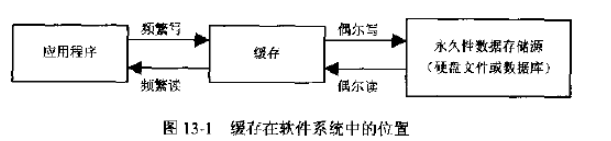

## hibernate的缓存一般分为几种？
分为三种：一级缓存，二级缓存和查询缓存

## 一级缓存
session内的缓存即一级缓存，内置且不能被卸载，一个事务内有效。在这个空间存放了相互关联的Java对象，这种位于session缓存内的对象也别称为持久化对象，session负责根据持久化对象的状态变化来同步更新数据库。

session为应用程序提供了管理缓存的方法：evict(Object o)和clear()

一级缓存的生命周期和session的生命周期一致，当前session一旦关闭，一级缓存就消失了，因此一级缓存也叫session级的缓存或事务级缓存，一级缓存只存实体对象，它不会缓存一般的对象属性（查询缓存可以），即当获得对象后，就将该对象缓存起来，如果在同一session中再去获取这个对象时，它会先判断在缓存中有没有该对象的id，如果有则直接从缓存中获取此对象，反之才去数据库中取，取的同时再将此对象作为一级缓存处理。

以下方法支持一级缓存:

1. get()
2. load()
3. iterate（查询实体对象）

其中 Query 和Criteria的list() 只会缓存，但不会使用缓存（除非结合查询缓存）。


## 二级缓存
二级缓存是进程（N个事务）或集群范围内的缓存，可以被所有的Session共享，在多个事务之间共享

二级缓存是可配置的插件

二级缓存的散装数据
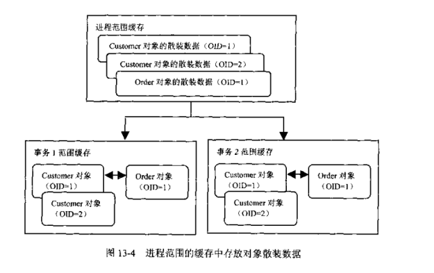

注意：如果缓存中的数据采用对象的散装数据形式，那么当不用的事务到缓存中查询OID为1的Customer对象时，获得的是Customer对象的散装数据，每个事务都必须分别根据散装数据重新构造出Customer实例，也就是说，每个事务都会获得不同的Customer对象。

二级缓存机制:
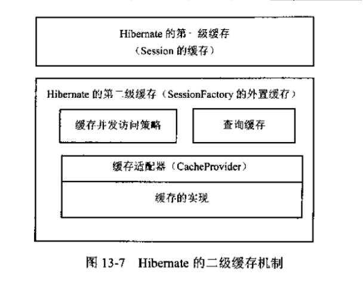

二级缓存分为：类级别缓存，集合级别缓存，更新时间戳和查询缓存。

二级缓存的散装原理图
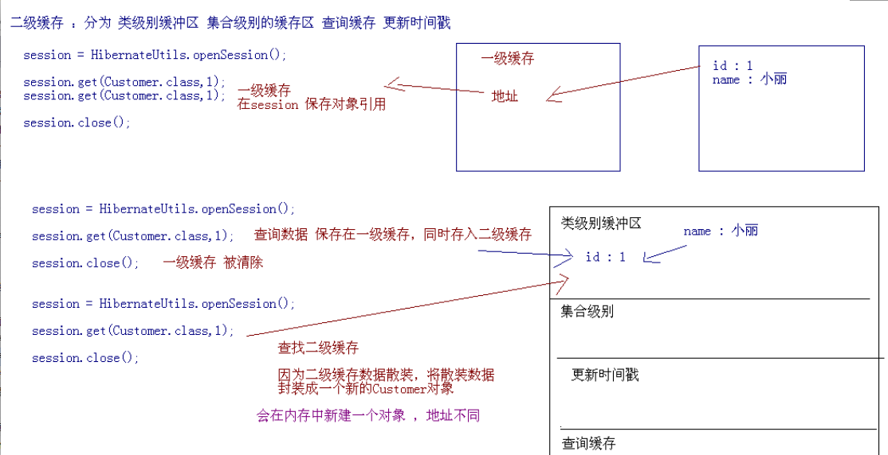

类级别的二级缓存只适用于get和load获取数据，对query接口的list()可以将数据放置到类级别的缓存中，但不能使用query接口的list()从缓存中获取数据。

注意点：修改一级缓存的数据，会自动同步到二级缓存。

二级缓存也称进程级的缓存或SessionFactory级的缓存，二级缓存可以被所有session共享，二级缓存的生命周期和SessionFactory的生命周期一致。hibernate为实现二级缓存，只提供二级缓存的接口供第三方实现。二级缓存也是缓存实体对象，原理和方法都与一级缓存差不多，只是生命周期有所差异。

## 查询缓存
查询是数据库技术中最常用的操作，Hibernate为查询提供了缓存，用来提高查询速度，优化查询性能相同HQL语句检索结果的缓存

查询缓存依赖于二级缓存，查询缓存是针对普通属性结果集的缓存，对实体对象的结果集只缓存id（其id不是对象的真正id，可以看成是HQL或者SQL语句，它与查询的条件相关即where后的条件相关，不同的查询条件，其缓存的id也不一样）。查询缓存的生命周期，当前关联的表发生修改或是查询条件改变时，那么查询缓存生命周期结束，它不受一级缓存和二级缓存生命周期的影响，要想使用查询缓存需要手动配置。

## 结论
不要想当然的以为缓存可以提高性能，仅仅在你能够驾驭它并且条件合适的情况下才是这样的。hibernate的二级缓存限制还是比较多的。在不了解原理的情况下乱用，可能会有1+N的问题。不当的使用还可能导致读出脏数据。如果受不了hibernate的诸多限制，那么还是自己在应用程序的层面上做缓存吧。

在越高的层面上做缓存，效果就会越好。就好像尽管磁盘有缓存，数据库还是要实现自己的缓存，尽管数据库有缓存，咱们的应用程序还是要做缓存。因为底层的缓存它并不知道高层要用这些数据干什么，只能做的比较通用，而高层可以有针对性的实现缓存，所以在更高的级别上做缓存，效果也要好些吧。

缓存是位于应用程序与物理数据源之间，用于临时存放复制数据的内存区域，目的是为了减少应用程序对物理数据源访问的次数，从而提高应用程序的运行性能.      Hibernate在查询数据时，首先到缓存中去查找，如果找到就直接使用，找不到的时候就会从物理数据源中检索，所以，把频繁使用的数据加载到缓存区后，就可以大大减少应用程序对物理数据源的访问，使得程序的运行性能明显的提升。

>https://www.cnblogs.com/wl0000-03/p/6377990.html

## 其他补充：

1. Hibernate的Session提供了一级缓存的功能，默认总是有效的，当应用程序保存持久化实体、修改持久化实体时，Session并不会立即把这种改变提交到数据库，而是缓存在当前的Session中，除非显示调用了Session的flush()方法或通过close()方法关闭Session。通过一级缓存，可以减少程序与数据库的交互，从而提高数据库访问性能。
2. SessionFactory级别的二级缓存是全局性的，所有的Session可以共享这个二级缓存。不过二级缓存默认是关闭的，需要显示开启并指定需要使用哪种二级缓存实现类（可以使用第三方提供的实现）。一旦开启了二级缓存并设置了需要使用二级缓存的实体类，SessionFactory就会缓存访问过的该实体类的每个对象，除非缓存的数据超出了指定的缓存空间。
3. 一级缓存和二级缓存都是对整个实体进行缓存，不会缓存普通属性，如果希望对普通属性进行缓存，可以使用查询缓存。查询缓存是将HQL或SQL语句以及它们的查询结果作为键值对进行缓存，对于同样的查询可以直接从缓存中获取数据。查询缓存默认也是关闭的，需要显示开启。

# 2.说说STRUTS的应用
## struts1与struts2都是mvc框架的经典实现模式。
Struts2不是从Struts1升级而来,而是有WebWork改名而来,而WebWork只是Xwork加了很多WEB拦截器而已?
区别：

1. 核心控制器改成了过滤器（过滤器比Servlet的级别要高，因为程序运行时是先进入过滤器再进入Servlet）
2. struts1要求业务类必须继承Action或dispatchAction，struts2不强制这么做，只需要提供一个pojo类。
3. 绑定值到业务类时struts1是通过ActionForm，struts2是通过模型或属性驱动直接绑定到Action属性。
4. struts1严重依赖于Servlet（因为太过于依赖于api的HttpServletRequest与HttpServletResponse的两个参数），
struts2就则脱离了Servlet的API。
5. 管理Action时struts1是单例模式，struts2是每个请求产生一个实例。
6. 在表达式的支持上struts2不仅有jstl，还有功能更加强大的ognl表达式。
7. struts1的类型转换是单向的（页面到ActionForm），struts2是双向的(页面到Action再到页面回显)
8. 校验，struts1没有针对具体方法的校验，struts2提供了指定某个方法进行效验，还有框架校验。
9. struts2提供了拦截器，利用拦截器可以在访问Action之前或之后增加如权限拦截等功能。
10. struts2提供了全局范围，包范围，Action范围的国际化资源文件管理实现。
11. struts2支持多种视图类型，如：jsp，freemaker，velocity，源代码等。

## Struts2的核心是什么,体现了什么思想
Struts2的核心是拦截器,基本上核心功能都是由拦截器完成,拦截器的实现体现了AOP(面向切面编程)思想?

## 为何继承ActionSupport
因为ActionSupport实现了Action接口，提供了国际化，校验功能。
ActionSupport实现了国际化功能：因为它提供了一个getText(String key)方法实现国际化,该方法从资源文件上获取国际化信息。
Action接口提供了五个常量(success,error,login,input,none)。

## Struts2 如何定位action中的方法
1. 感叹号定位方法（动态方法）。
2. 在xml配置文件中通过配置多个action，使用action的method指定方法。
3. 使用通配符(*)匹配方法。

## 模型驱动和属性驱动的区别是什么
模型驱动与属性驱动都是用来封装数据的。

1. 模型驱动：在实现类中实现ModelDriven<T>接口使用泛型把属性类封装起来，重写getModel()方法，然后在实现类里创建一个属性类的实例，
通过这个实例拿到封装进来的值，拿返回值的时候使用工具进行值拷贝。
2. 属性驱动：在实现类里定义属性，生成get与set方法，通过属性来拿值。

注意：模型驱动使用时注意的是在使用前先把属性类实例化，否则会出现空指针错误，拿返回对象的值需要用拷贝内存因为地址发生改变。
模型驱动不可以使用局部类型转换器。

## Struts2是怎样进行值封装的？
struts2的值封装实际上是采用了ognl表达式。struts2的拦截器经过模型驱动时会先判断action是否实现了ModelDriven，如果是则拿到模型的实例放在了栈的顶部，到属性驱动的时候会从栈里面把栈顶的实例给取出来，从页面传进来的值放在一个map集合当中，通过map集合进行迭代会通过ognl技术把值封装到实例中。

## Struts2如何进行校验
编程校验：

1. 继承ActionSupport，重写validate方法(针对所有方法)(服务器端编程,不推荐)。
2. validateXxx方法（Xxx代表的是方法名，针对某个方法进行效验）。
3. 如果有错误就把错误信息放在FieldError中，并且跳转到指定的错误业务类，没有就会进行action方法的调用。

校验框架:
每个Action类有一个校验文件，命名 Action类名-validation。xml，且与Action类同目录，这是对action里面所有的方法进行校验。对Action里面的指定方法做校验使用Action的类名-访问路径_方法名-validation.xml。

如:StudentAction-student_add-validation.xml    
在效验文件里又分为两种:   
字段校验：字段用什么校验器来校验。     
非字段校验：是用校验器校验什么字段。    
通俗点讲：字段校验：校验谁，用什么方法。      
非字段校验：用什么校验，校验谁 。

## 谈谈Struts2 的国际化
在struts2中是使用了拦截器来实现国际化。

struts2的国际化分为三部分：

1. Action范围，这种范围是用Action的实现类的类名来作为前缀__语言名称_国家地区名（大写）.properties.
2. 包范围，包范围是用package作为前缀__语言名称_国家地区名（大写）.properties。
3. 全局范围，全局范围的前缀默认的是application，可以通过xml配置文件配置常量(使用constant标签注册i18l拦截器)来指定前缀,前缀__语言名称_国家地区名（大写）.properties。

国际化实现的原理:通过i18n拦截器获得请求参数request——locale的值(zh或者是en)并把当前的值转化为locale对象，把locale对象存在ww_trans_i18n_locale的session作用域中，根据struts2的请求处理流程，拦截器只会在进入action的时候才会调用，所有我们一般把对jsp的访问转化为对action的访问。

## OGNL是什么你在项目中如何使用它
OGNL是：对象图形导航语言。

原ognl是单个对象的，在struts2的应用是多个对象的，struts2的类型转换也是通过ognl来实现的。

Struts2中默认的表达式语言就是ognl，struts2的取值设值都是通过ognl来实现的,struts2要依靠它的标签才可以使用ognl。
相对于jstl或者其他表达式语言，它有如下优势：

1. 能够调用对象实例的方法
2. 能够调用类的静态方法
3. 操作集合对象
4. 访问Ognl上下文

取值时ognl有三个参数：

1. 表达式，
2. ognl的上下文(map)，
3. 对象实例(值栈)。

如果表达式带#号是从上下文中(map)拿值，否则是从值栈中拿值。
设值时有四个参数：

1. 表达式，
2. ognl的上下文(map)，
3. 对象实例，
4. 设入的值

如果表达式带#号是把值设入上下文中(map)，否则是把值设入值栈中。
在struts2中 ognl的实现关系:ActionConetxt。
ognl 3个常用的符号 # $ %

'#'

1. 构造map，list集合。
2. 取ognl上下文的值。
3. 用来过滤集合。

'$' 

1. 在校验框架中取资源文件中的值。
2. 可以在配置文件中传递参数。

'%' 

使用百分号可以进行转义。

## Strust2如何访问Servlet API
1. 通过ActionContext可以获得request，application，session三个作用域(struts2实际上是通过适配器来把servlet的api转换为一个map，
    并把这些map放在ActionContext里面)。
2. 通过ActionContext的子类ServletActionContext去获取原滋原味的API。
3. 可以通过实现ServletRequestAware接口，重写里面的setServletRequest方法可以获得request，实际上是通过set的依赖注入。

## 什么是拦截器 说说Struts2用拦截器来干什么 说出6个拦截器来
在访问类的某个方法或者属性之前执行，拦截的是Action的请求，进行拦截然后在方法的执行前或者之后加入某些操作，    
如：国际化，权限，效验等与源代码无关的操作。     
国际化，表单重复提交，类型转换，自动装配，数据封装,异常处理，模型驱动，请求参数，处理类型转换错误，日志拦截器。

## 如何实现自定义拦截器？
可以继承MethodFilterInterceptor重写doIntercept方法指定某个方法进行拦截，或者继承AbstractInterceptor，重写intercept方法

在xml配置文件中定义自定义拦截器，然后注入到拦截器栈中，再把拦截器引用到action中。
    在把拦截器注入拦截器栈时配置<param\>标签，使用name属性配置excludeMethods表示不拦截指定方法。
    在配置文件中配置includeMethods指定拦截某个方法。
    可以配置到某个action单独使用，也可以配置到包下面的所有action使用。

## ActionContext是用来干什么的
ActionContext是Action的上下文。

通过ActionContext这个类来可以获得:request，application，session，Locale、ValueStack,ConversionErrors

1. 可以获得servlet的api：request，application，session。
2. 进行国际化：获得语言环境 Locale。
3. 收集错误信息：ConversionErrors。
4. 有个值栈来装action实例与创建的模型驱动的实例:ValueStack。
5. ActionContext是线程安全的-用本地线程实现的。

## Struts2是如何实现mvc的：struts2的底层视图默认是freemaker。
什么是mvc？

    M：模型，V：视图，C：控制器

    在struts2中分别对应什么？

    M(模型)：除核心控制器外都属于模型，实现业务的类(service层与dao层)。    
    V(视图)：result,type,dispatcher默认的(jsp，freemaker，velocity，源代码等)。    
    C(控制器)：核心控制器与业务控制器。     

    mvc解决什么问题？

    解决了数据封装，类型转换，数据效验，国际化，异常处理等问题。

## 为什么要继承默认的包？
因为在Strtus2里面默认有很多的常量,拦截器,还有一些bean,如果继承默认的包,这些默认值和常量就会继承过来

## 常见的有那些有十几种结果集类型
常见的结果集类型有dispatcher,redirect,redirectAction,stream等。

默认的是dispatcher,值得是转发    
redirect指重定向,    
redirectAction是重定向到一个Action     
stream是返回一个流,一般用在文件下载上面    

## 开发项目时struts2在页面怎样拿值
从值栈中或者是ognl的上下文

## 怎么样用Struts2进行文件的上传或者下载
Struts2里面已经提供了默认的拦截器来处理上传,只要在jsp用了s:file标签,把s:from的enctype 属性设置为 multipart/form-data,然后在action里面定义三个字段 File file ,String [file]ContentType,String [file]?FileName即可,如果有多个文件上传,那么就用    List<File>来接受,然后把接受到的File构建成FileInputStream,转化成硬盘上面的文件即可(用输出流)
    下载用了resust为stream的类型,然后在action定义四个属性,默认的有个是InputStream 的类型叫inputStream的,从硬盘上面读取文件到这个流    赋值即可.

## 简单讲下struts里面的标签,说不少于5个
s:iterater ?s:property s:form s:url s:if 等等

## 默认struts2里面的标签取值都是从那里取值的
默认都是从OGNL值栈里面取值的?

## ValueStack分为那两部分,组成部分是什么,分别怎么访问
分为对象栈和ContextMap ,对象栈里面放入的是Action及其用户定义的对象,在前台可以直接访问,在contextMap里面放入的是Servlet对象转    化后map,譬如requestMap,sessionMap,访问的时候前面加#即可.

## 标签<s:property\>和el表达式有什么区别
它们都可以从值栈里面取值,但是el表达式只能取属性有get set方法的简单数据类型,如果要取得数组的一些方法等复杂数据对象类型,那么就要用s:property标签

## struts2的请求处理流程
1. 客户端发送请求。
2. 经过一系列的过滤器(如:ActionContextCleanUp、SiteMesh等)到达核心控制器(FilterDispatcher)。
3. 核心控制器通过ActionMapper决定调用哪个Action，如果不是调用Action就直接跳转到jsp页面。
4. 如果ActionMapper决定调用了某个Action，核心控制器就把请求的处理交给一个代理类(ActionProxy)。
5. 代理类通过配置管理器(Configuration Manager)找到配置文件（struts.xml）找到需要调用的Action类。
6. 代理类还要创建一个Action的调度器(ActionInvocation)。
7. 由调度器去调用Action，当然这里还涉及到一些相关的拦截器的调用。
8. Action执行完后，这个调度器还会创建一个Result返回结果集，返回结果前还可以做一些操作(结果集前的监听器)。

# 3.解释一下MyBatis中命名空间（namespace）的作用
在大型项目中，可能存在大量的SQL语句，这时候为每个SQL语句起一个唯一的标识（ID）就变得并不容易了。为了解决这个问题，在MyBatis中，可以为每个映射文件起一个唯一的命名空间，这样定义在这个映射文件中的每个SQL语句就成了定义在这个命名空间中的一个ID。只要我们能够保证每个命名空间中这个ID是唯一的，即使在不同映射文件中的语句ID相同，也不会再产生冲突了。

# 4.MyBatis中的动态SQL是什么意思？
对于一些复杂的查询，我们可能会指定多个查询条件，但是这些条件可能存在也可能不存在，需要根据用户指定的条件动态生成SQL语句。如果不使用持久层框架我们可能需要自己拼装SQL语句，还好MyBatis提供了动态SQL的功能来解决这个问题。MyBatis中用于实现动态SQL的元素主要有：

- if
- choose / when / otherwise
- trim
- where
- set
- foreach

## if
if就是简单的条件判断，利用if语句我们可以实现某些简单的条件选择。
```XML
    <select id="dynamicIfTest" parameterType="Blog" resultType="Blog">
        select * from t_blog where 1 = 1
        <if test="title != null">
            and title = #{title}
        </if>
        <if test="content != null">
            and content = #{content}
        </if>
        <if test="owner != null">
            and owner = #{owner}
        </if>
    </select>
```

这条语句的意思非常简单，如果你提供了title参数，那么就要满足title=#{title}，同样如果你提供了Content和Owner的时候，它们也需要满足相应的条件，之后就是返回满足这些条件的所有Blog，这是非常有用的一个功能，以往我们使用其他类型框架或者直接使用JDBC的时候， 如果我们要达到同样的选择效果的时候，我们就需要拼SQL语句，这是极其麻烦的，比起来，上述的动态SQL就要简单多了

## choose,when和otherwise
choose元素的作用就相当于JAVA中的switch语句，基本上跟JSTL中的choose的作用和用法是一样的，通常都是与when和otherwise搭配的。看如下一个例子：
```XML
    <select id="dynamicChooseTest" parameterType="Blog" resultType="Blog">
        select * from t_blog where 1 = 1 
        <choose>
            <when test="title != null">
                and title = #{title}
            </when>
            <when test="content != null">
                and content = #{content}
            </when>
            <otherwise>
                and owner = "owner1"
            </otherwise>
        </choose>
    </select>
```

when元素表示当when中的条件满足的时候就输出其中的内容，跟JAVA中的switch效果差不多的是按照条件的顺序，当when中有条件满足的时候，就会跳出choose，即所有的when和otherwise条件中，只有一个会输出，当所有的我很条件都不满足的时候就输出otherwise中的内容。所以上述语句的意思非常简单， 当title!=null的时候就输出and titlte = #{title}，不再往下判断条件，当title为空且content!=null的时候就输出and content = #{content}，当所有条件都不满足的时候就输出otherwise中的内容。

## where
where语句的作用主要是简化SQL语句中where中的条件判断的，先看一个例子，再解释一下where的好处。
```XML
    <select id="dynamicWhereTest" parameterType="Blog" resultType="Blog">
        select * from t_blog 
        <where>
            <if test="title != null">
                title = #{title}
            </if>
            <if test="content != null">
                and content = #{content}
            </if>
            <if test="owner != null">
                and owner = #{owner}
            </if>
        </where>
    </select>
```

where元素的作用是会在写入where元素的地方输出一个where，另外一个好处是你不需要考虑where元素里面的条件输出是什么样子的，MyBatis会智能的帮你处理，如果所有的条件都不满足那么MyBatis就会查出所有的记录，如果输出后是and 开头的，MyBatis会把第一个and忽略，当然如果是or开头的，MyBatis也会把它忽略；此外，在where元素中你不需要考虑空格的问题，MyBatis会智能的帮你加上。像上述例子中，如果title=null， 而content != null，那么输出的整个语句会是select * from t_blog where content = #{content}，而不是select * from t_blog where and content = #{content}，因为MyBatis会智能的把首个and 或 or 给忽略。

## trim
trim元素的主要功能是可以在自己包含的内容前加上某些前缀，也可以在其后加上某些后缀，与之对应的属性是prefix和suffix；可以把包含内容的首部某些内容覆盖，即忽略，也可以把尾部的某些内容覆盖，对应的属性是prefixOverrides和suffixOverrides；正因为trim有这样的功能，所以我们也可以非常简单的利用trim来代替where元素的功能，示例代码如下：
```XML
    <select id="dynamicTrimTest" parameterType="Blog" resultType="Blog">
        select * from t_blog 
        <trim prefix="where" prefixOverrides="and |or">
            <if test="title != null">
                title = #{title}
            </if>
            <if test="content != null">
                and content = #{content}
            </if>
            <if test="owner != null">
                or owner = #{owner}
            </if>
        </trim>
    </select>
```

## set
set元素主要是用在更新操作的时候，它的主要功能和where元素其实是差不多的，主要是在包含的语句前输出一个set，然后如果包含的语句是以逗号结束的话将会把该逗号忽略，如果set包含的内容为空的话则会出错。有了set元素我们就可以动态的更新那些修改了的字段。下面是一段示例代码：
```XML
    <update id="dynamicSetTest" parameterType="Blog">
        update t_blog
        <set>
            <if test="title != null">
                title = #{title},
            </if>
            <if test="content != null">
                content = #{content},
            </if>
            <if test="owner != null">
                owner = #{owner}
            </if>
        </set>
        where id = #{id}
    </update>
```

上述示例代码中，如果set中一个条件都不满足，即set中包含的内容为空的时候就会报错。

## foreach
foreach的主要用在构建in条件中，它可以在SQL语句中进行迭代一个集合。foreach元素的属性主要有item，index，collection，open，separator，close。item表示集合中每一个元素进行迭代时的别名，index指定一个名字，用于表示在迭代过程中，每次迭代到的位置，open表示该语句以什么开始，separator表示在每次进行迭代之间以什么符号作为分隔符，close表示以什么结束，在使用foreach的时候最关键的也是最容易出错的就是collection属性，该属性是必须指定的，但是在不同情况下，该属性的值是不一样的，主要有一下3种情况：

1. 如果传入的是单参数且参数类型是一个List的时候，collection属性值为list
2. 如果传入的是单参数且参数类型是一个array数组的时候，collection的属性值为array
3. 如果传入的参数是多个的时候，我们就需要把它们封装成一个Map了，当然单参数也可以封装成map，实际上如果你在传入参数的时候，在MyBatis里面也是会把它封装成一个Map的，map的key就是参数名，所以这个时候collection属性值就是传入的List或array对象在自己封装的map里面的key

- 单参数List的类型:
```XML
    <select id="dynamicForeachTest" resultType="Blog">
        select * from t_blog where id in
        <foreach collection="list" index="index" item="item" open="(" separator="," close=")">
            #{item}
        </foreach>
    </select>
```

上述collection的值为list，对应的Mapper是这样的
```JAVA
public List<Blog> dynamicForeachTest(List<Integer> ids);
```

 测试代码
```JAVA
    @Test
    public void dynamicForeachTest() {
        SqlSession session = Util.getSqlSessionFactory().openSession();
        BlogMapper blogMapper = session.getMapper(BlogMapper.class);
        List<Integer> ids = new ArrayList<Integer>();
        ids.add(1);
        ids.add(3);
        ids.add(6);
        List<Blog> blogs = blogMapper.dynamicForeachTest(ids);
        for (Blog blog : blogs)
            System.out.println(blog);
        session.close();
    }
```

- 单参数array数组的类型
```XML
    <select id="dynamicForeach2Test" resultType="Blog">
        select * from t_blog where id in
        <foreach collection="array" index="index" item="item" open="(" separator="," close=")">
            #{item}
        </foreach>
    </select>
```

上述collection为array，对应的Mapper代码:
```JAVA
public List<Blog> dynamicForeach2Test(int[] ids);
```

对应的测试代码：
```JAVA
    @Test
    public void dynamicForeach2Test() {
        SqlSession session = Util.getSqlSessionFactory().openSession();
        BlogMapper blogMapper = session.getMapper(BlogMapper.class);
        int[] ids = new int[] {1,3,6,9};
        List<Blog> blogs = blogMapper.dynamicForeach2Test(ids);
        for (Blog blog : blogs)
            System.out.println(blog);
        session.close();
    }
```

- 自己把参数封装成Map的类型
```XML
    <select id="dynamicForeach3Test" resultType="Blog">
        select * from t_blog where title like "%"#{title}"%" and id in
        <foreach collection="ids" index="index" item="item" open="(" separator="," close=")">
            #{item}
        </foreach>
    </select>
```

上述collection的值为ids，是传入的参数Map的key，对应的Mapper代码：
```JAVA
public List<Blog> dynamicForeach3Test(Map<String, Object> params);
```

对应测试代码：
```JAVA
    @Test
    public void dynamicForeach3Test() {
        SqlSession session = Util.getSqlSessionFactory().openSession();
        BlogMapper blogMapper = session.getMapper(BlogMapper.class);
        final List<Integer> ids = new ArrayList<Integer>();
        ids.add(1);
        ids.add(2);
        ids.add(3);
        ids.add(6);
        ids.add(7);
        ids.add(9);
        Map<String, Object> params = new HashMap<String, Object>();
        params.put("ids", ids);
        params.put("title", "中国");
        List<Blog> blogs = blogMapper.dynamicForeach3Test(params);
        for (Blog blog : blogs)
            System.out.println(blog);
        session.close();
    }
```

- foreach标签遍历的集合元素类型是Map.Entry类型时，index属性指定的变量代表对应的Map.Entry的key，item属性指定的变量代表对应的Map.Entry的value。此时如果对应的集合是Map.entrySet，则对应的collection属性用collection。foreach在进行遍历的时候如果传入的参数是List类型，则其collection属性的值可以是list或collection，但如果传入的参数是Set类型，则collection属性的值只能用collection。
```XML
    <select id="dynamicForeachTest" resultType="Blog">
        select * from t_blog where id in
        <!-- 遍历的对象是Map.Entry时，index代表对应的key，item代表对应的value -->
        <foreach collection="collection" index="key" item="value" open="(" separator="," close=")">
            #{key}, #{value}
        </foreach>
    </select>
```

其对应的接口方法大概是如下这样：
```JAVA
    public List<Blog> dynamicForeachTest(Set<Map.Entry<Integer, Integer>> ids);
```

- bind标签，动态SQL中已经包含了这样一个新的标签，它的功能是在当前OGNL上下文中创建一个变量并绑定一个值。有了它以后我们以前的模糊查询就可以改成这个样子：
```XML
    <select id="fuzzyQuery" resultType="Blog" parameterType="java.lang.String">  
        <!-- bind标签用于创建新的变量 -->
        <bind name="titleLike" value="'%'+_parameter+'%'"/>
        select * from t_blog where title like #{titleLike}  
    </select>
```

# 5.Spring MVC注解的优点
1. XML配置起来有时候冗长，此时注解可能是更好的选择，如jpa的实体映射；注解在处理一些不变的元数据时有时候比XML方便的多，比如springmvc的数据绑定，如果用xml写的代码会多的多；
2. 注解最大的好处就是简化了XML配置；其实大部分注解一定确定后很少会改变，所以在一些中小项目中使用注解反而提供了开发效率，所以没必要一头走到黑；
3. 注解相对于XML的另一个好处是类型安全的，XML只能在运行期才能发现问题。

注解的缺点：

1. 在使用spring注解时，会发现注解分散到很多类中，不好管理和维护；
2. 注解的开启/关闭必须修改源代码，因为注解是源代码绑定的，如果要修改，需要改源码，有这个问题，所以如果是这种情况，还是使用XML配置方式；比如数据源；
3. 注解还一个缺点就是灵活性，比如在之前翻译的Spring Framework 4.0 M1: WebSocket 支持；在实现复杂的逻辑上，没有XML来的更加强大；注解就是要么用，要么不用；
4. 通用配置还是走XML吧，比如事务配置，比如数据库连接池等等，即通用的配置集中化，而不是分散化，如很多人使用@Transactional来配置事务，在很多情况下这是一种太分散化的配置；
5. XML方式比注解的可扩展性和复杂性维护上好的多，比如需要哪些组件，不需要哪些；在面对这种情况，注解扫描机制比较逊色，因为规则很难去写或根本不可能写出来；

# 6.springmvc和spring-boot区别？
## spring和springMvc：
1. spring是一个一站式的轻量级的java开发框架，核心是控制反转（IOC）和面向切面（AOP），针对于开发的WEB层(springMvc)、业务层(Ioc)、持久层(jdbcTemplate)等都提供了多种配置解决方案；
2. springMvc是spring基础之上的一个MVC框架，主要处理web开发的路径映射和视图渲染，属于spring框架中WEB层开发的一部分；

## springMvc和springBoot：
1. springMvc属于一个企业WEB开发的MVC框架，涵盖面包括前端视图开发、文件配置、后台接口逻辑开发等，XML、config等配置相对比较繁琐复杂；
2. springBoot框架相对于springMvc框架来说，更专注于开发微服务后台接口，不开发前端视图；

## springBoot和springCloud：
1. spring boot使用了默认大于配置的理念，集成了快速开发的spring多个插件，同时自动过滤不需要配置的多余的插件，简化了项目的开发配置流程，一定程度上取消xml配置，是一套快速配置开发的脚手架，能快速开发单个微服务；
2. spring cloud大部分的功能插件都是基于springBoot去实现的，springCloud关注于全局的微服务整合和管理，将多个springBoot单体微服务进行整合以及管理；  springCloud依赖于springBoot开发，而springBoot可以独立开发；

## 总结：
1. Spring 框架就像一个家族，有众多衍生产品例如 boot、security、jpa等等。但他们的基础都是Spring的ioc、aop等. ioc 提供了依赖注入的容器， aop解决了面向横切面编程，然后在此两者的基础上实现了其他延伸产品的高级功能；
2. springMvc是基于Servlet 的一个MVC框架主要解决WEB开发的问题，因为Spring的配置非常复杂，各种XML、JavaConfig、servlet处理起来比较繁琐；
3. 为了简化开发者的使用，从而创造性地推出了springBoot框架，默认优于配置，简化了springMvc的配置流程；
但区别于springMvc的是，springBoot专注于微服务方面的接口开发，和前端解耦，虽然springBoot也可以做成springMvc前后台一起开发，但是这就有点不符合springBoot框架的初衷了；
4. 对于springCloud框架来说，它和springBoot一样，注重的是微服务的开发，但是springCloud更关注的是全局微服务的整合和管理，相当于管理多个springBoot框架的单体微服务；
>https://blog.csdn.net/alan_liuyue/article/details/80656687

# 7.SpringMVC的运行机制，运行机制的每一部分的相关知识？

## SpringMVC流程
1. 用户发送请求至前端控制器DispatcherServlet。
2. DispatcherServlet收到请求调用HandlerMapping处理器映射器。
3. 处理器映射器找到具体的处理器(可以根据xml配置、注解进行查找)，生成处理器对象及处理器拦截器(如果有则生成)一并返回给DispatcherServlet。
4. DispatcherServlet调用HandlerAdapter处理器适配器。
5. HandlerAdapter经过适配调用具体的处理器(Controller，也叫后端控制器)。
6. Controller执行完成返回ModelAndView。
7. HandlerAdapter将controller执行结果ModelAndView返回给DispatcherServlet。
8. DispatcherServlet将ModelAndView传给ViewReslover视图解析器。
9. ViewReslover解析后返回具体View。
10. DispatcherServlet根据View进行渲染视图（即将模型数据填充至视图中）。
11. DispatcherServlet响应用户。

## 组件说明
DispatcherServlet：作为前端控制器，整个流程控制的中心，控制其它组件执行，统一调度，降低组件之间的耦合性，提高每个组件的扩展性。

HandlerMapping：通过扩展处理器映射器实现不同的映射方式，例如：配置文件方式，实现接口方式，注解方式等。 

HandlAdapter：通过扩展处理器适配器，支持更多类型的处理器。

ViewResolver：通过扩展视图解析器，支持更多类型的视图解析，例如：jsp、freemarker、pdf、excel等。

1. 前端控制器DispatcherServlet（不需要工程师开发）,由框架提供
作用：接收请求，响应结果，相当于转发器，中央处理器。有了dispatcherServlet减少了其它组件之间的耦合度。
用户请求到达前端控制器，它就相当于mvc模式中的c，dispatcherServlet是整个流程控制的中心，由它调用其它组件处理用户的请求，dispatcherServlet的存在降低了组件之间的耦合性。
2. 处理器映射器HandlerMapping(不需要工程师开发),由框架提供
作用：根据请求的url查找Handler
HandlerMapping负责根据用户请求找到Handler即处理器，springmvc提供了不同的映射器实现不同的映射方式，例如：配置文件方式，实现接口方式，注解方式等。
3. 处理器适配器HandlerAdapter
作用：按照特定规则（HandlerAdapter要求的规则）去执行Handler
通过HandlerAdapter对处理器进行执行，这是适配器模式的应用，通过扩展适配器可以对更多类型的处理器进行执行。
4. 处理器Handler(需要工程师开发)
注意：编写Handler时按照HandlerAdapter的要求去做，这样适配器才可以去正确执行Handler
Handler 是继DispatcherServlet前端控制器的后端控制器，在DispatcherServlet的控制下Handler对具体的用户请求进行处理。
由于Handler涉及到具体的用户业务请求，所以一般情况需要工程师根据业务需求开发Handler。
5. 视图解析器View resolver(不需要工程师开发),由框架提供
作用：进行视图解析，根据逻辑视图名解析成真正的视图（view）
View Resolver负责将处理结果生成View视图，View Resolver首先根据逻辑视图名解析成物理视图名即具体的页面地址，再生成View视图对象，最后对View进行渲染将处理结果通过页面展示给用户。 springmvc框架提供了很多的View视图类型，包括：jstlView、freemarkerView、pdfView等。
一般情况下需要通过页面标签或页面模版技术将模型数据通过页面展示给用户，需要由工程师根据业务需求开发具体的页面。
6. 视图View(需要工程师开发jsp...)
View是一个接口，实现类支持不同的View类型（jsp、freemarker、pdf...）

## 核心架构的具体流程步骤如下：

1. 首先用户发送请求——>DispatcherServlet，前端控制器收到请求后自己不进行处理，而是委托给其他的解析器进行处理，作为统一访问点，进行全局的流程控制；
2. DispatcherServlet——>HandlerMapping， HandlerMapping 将会把请求映射为HandlerExecutionChain 对象（包含一个Handler 处理器（页面控制器）对象、多个HandlerInterceptor 拦截器）对象，通过这种策略模式，很容易添加新的映射策略；
3. DispatcherServlet——>HandlerAdapter，HandlerAdapter 将会把处理器包装为适配器，从而支持多种类型的处理器，即适配器设计模式的应用，从而很容易支持很多类型的处理器；
4. HandlerAdapter——>处理器功能处理方法的调用，HandlerAdapter 将会根据适配的结果调用真正的处理器的功能处理方法，完成功能处理；并返回一个ModelAndView 对象（包含模型数据、逻辑视图名）；
5. ModelAndView的逻辑视图名——> ViewResolver， ViewResolver 将把逻辑视图名解析为具体的View，通过这种策略模式，很容易更换其他视图技术；
6. View——>渲染，View会根据传进来的Model模型数据进行渲染，此处的Model实际是一个Map数据结构，因此很容易支持其他视图技术；
7. 返回控制权给DispatcherServlet，由DispatcherServlet返回响应给用户，到此一个流程结束。

##  springmvc原理


第一步:用户发起请求到前端控制器（DispatcherServlet）

第二步：前端控制器请求处理器映射器（HandlerMappering）去查找处理器（Handle）：通过xml配置或者注解进行查找

第三步：找到以后处理器映射器（HandlerMappering）像前端控制器返回执行链（HandlerExecutionChain）

第四步：前端控制器（DispatcherServlet）调用处理器适配器（HandlerAdapter）去执行处理器（Handler）

第五步：处理器适配器去执行Handler

第六步：Handler执行完给处理器适配器返回ModelAndView

第七步：处理器适配器向前端控制器返回ModelAndView

第八步：前端控制器请求视图解析器（ViewResolver）去进行视图解析

第九步：视图解析器像前端控制器返回View

第十步：前端控制器对视图进行渲染

第十一步：前端控制器向用户响应结果

# 8.Mybatis和Hibernate区别？
- 简介

Hibernate：Hibernate是当前最流行的ORM框架之一，对JDBC提供了较为完整的封装。Hibernate的O/R Mapping实现了POJO 和数据库表之间的映射，以及SQL的自动生成和执行。

Mybatis：Mybatis同样也是非常流行的ORM框架，主要着力点在于 POJO 与 SQL 之间的映射关系。然后通过映射配置文件，将SQL所需的参数，以及返回的结果字段映射到指定 POJO 。相对Hibernate“O/R”而言，Mybatis 是一种“Sql Mapping”的ORM实现。

- 缓存机制对比

相同点

Hibernate和Mybatis的二级缓存除了采用系统默认的缓存机制外，都可以通过实现你自己的缓存或为其他第三方缓存方案，创建适配器来完全覆盖缓存行为。

不同点

Hibernate的二级缓存配置在SessionFactory生成的配置文件中进行详细配置，然后再在具体的表-对象映射中配置是那种缓存。

MyBatis的二级缓存配置都是在每个具体的表-对象映射中进行详细配置，这样针对不同的表可以自定义不同的缓存机制。并且Mybatis可以在命名空间中共享相同的缓存配置和实例，通过Cache-ref来实现。

两者比较

因为Hibernate对查询对象有着良好的管理机制，用户无需关心SQL。所以在使用二级缓存时如果出现脏数据，系统会报出错误并提示。而MyBatis在这一方面，使用二级缓存时需要特别小心。如果不能完全确定数据更新操作的波及范围，避免Cache的盲目使用。否则，脏数据的出现会给系统的正常运行带来很大的隐患。

Mybatis：小巧、方便、高效、简单、直接、半自动化

Hibernate：强大、方便、高效、复杂、间接、全自动化

# 9.启动项目时如何实现不在链接里输入项目名就能启动?
修改Tomcat配置文件 server.xml。找到自己的项目配置 ：
```XML
<Context docBase="oneProject" path="/one Project" reloadable="true" source="org.eclipse.jst.jee.server:userManager"/>
```
改为如下配置:
```XML
<Context docBase="oneProject" path="/" reloadable="true" source="org.eclipse.jst.jee.server:userManager"/>
```

# 10.1分钟之内只能处理1000个请求，你怎么实现，手撕代码?
Application 对所有用户访问的次数计数。同时定义一个计时器，单位为一分钟。如果Application 中的用户在单位时间内超出请求次数，就拒绝处理该请求。一分钟再刷新application的值为0.

使用一个Map 维护变量：
```JAVA
// 泛型 String 表示用户标识，List中存放用户不同请求的时间戳。
private Map<String, List> map = new ConcurrentHashMap<>();
```
我们只需要在单位计数中判断 List中数量是否超出限制即可。

使用 aop 实现请求的限制，在需要限制的请求方法上加上 aop 逻辑。即可实现，思路如下：
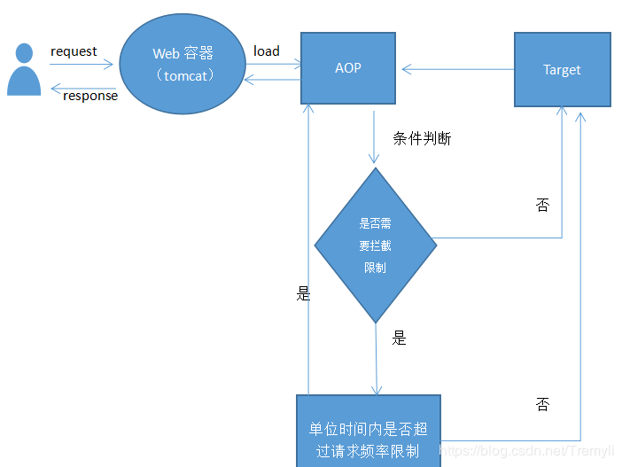

自定义注解类实现请求限制的拦截逻辑，在需要限制的方法上使用注解，超出限制后拒绝处理请求。

# 11.什么时候用assert
断言在软件开发中是一种常用的调试方式，很多开发语言中都支持这种机制。一般来说，断言用于保证程序最基本、关键的正确性。断言检查通常在开发和测试时开启。为了保证程序的执行效率，在软件发布后断言检查通常是关闭的。断言是一个包含布尔表达式的语句，在执行这个语句时假定该表达式为true；如果表达式的值为false，那么系统会报告一个AssertionError。断言的使用如下面的代码所示：
```JAVA
assert(a > 0); // throws an AssertionError if a <= 0
```

断言可以有两种形式：

1. assert Expression1;
2. assert Expression1 : Expression2 ;

Expression1 应该总是产生一个布尔值。
Expression2 可以是得出一个值的任意表达式；这个值用于生成显示更多调试信息的字符串消息。

要在运行时启用断言，可以在启动JVM时使用-enableassertions或者-ea标记。要在运行时选择禁用断言，可以在启动JVM时使用-da或者-disableassertions标记。要在系统类中启用或禁用断言，可使用-esa或-dsa标记。还可以在包的基础上启用或者禁用断言。

<font color="red">断言不应该以任何方式改变程序的状态。简单的说，如果希望在不满足某些条件时阻止代码的执行，就可以考虑用断言来阻止它。
</font>

# 12.JAVA应用服务器有那些
BEA WebLogic Server，

IBM WebSphere Application Server，

Oracle9i Application Server

jBoss，

Tomcat

# 13.JSP的内置对象及方法
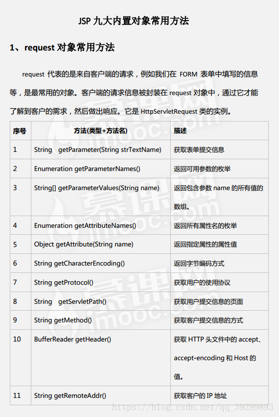
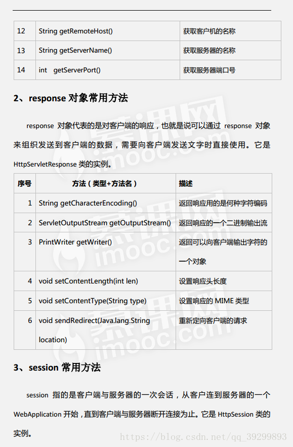
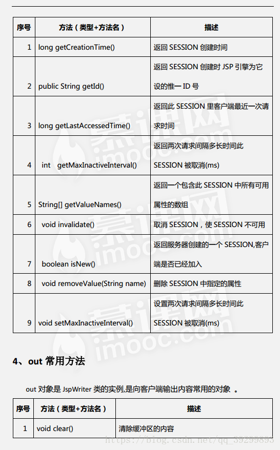
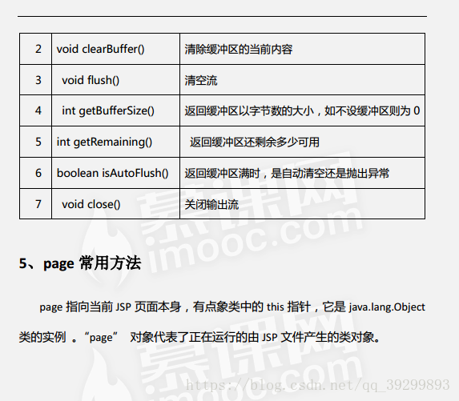
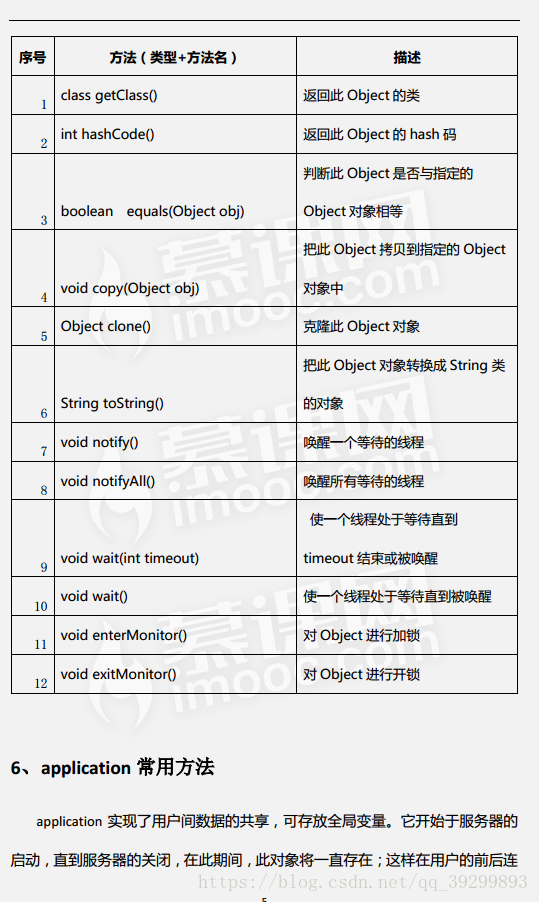

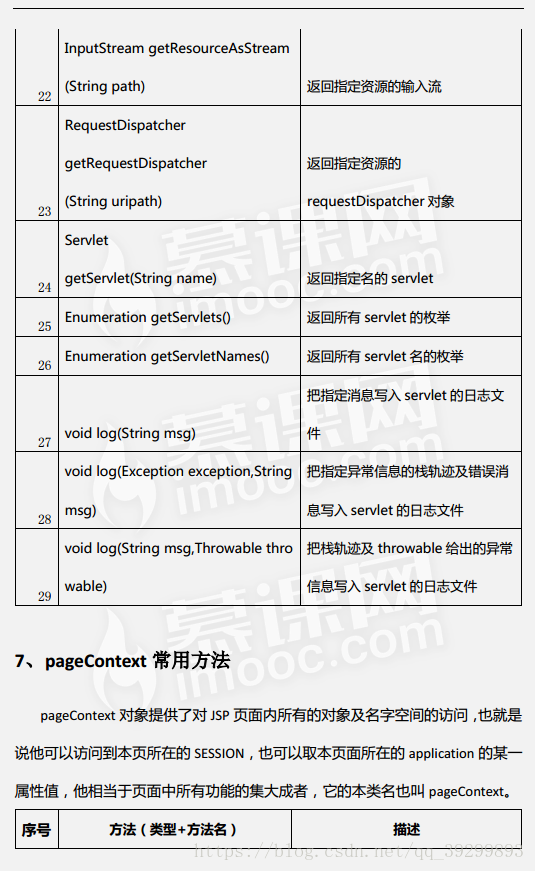
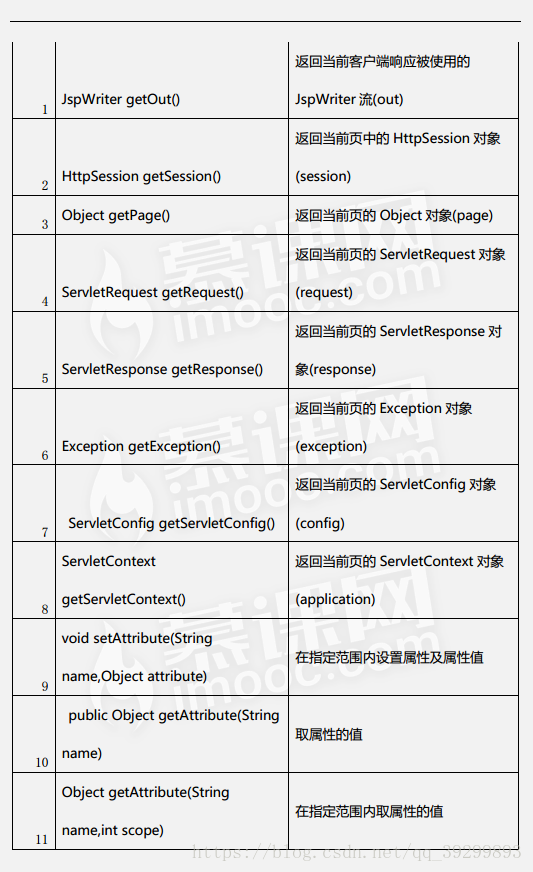
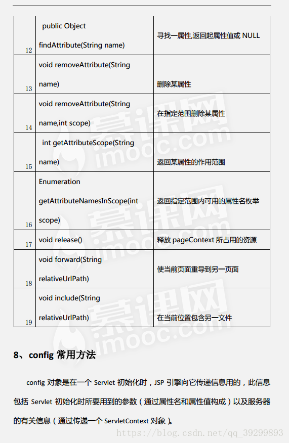
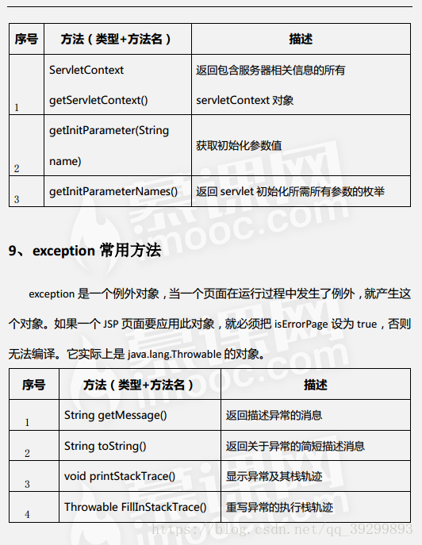
>https://blog.csdn.net/qq_39299893/article/details/80470392
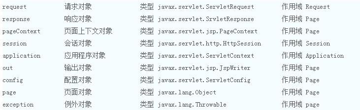

## 何为作用域?
大概流程是这样的，我们访问index.jsp的时候，分别对pageContext, request, session,application四个作用域中的变量进行累加。（当然先判断这个变量是不是存在，如果变量不存在，则要把变量初始化成1）。计算完成后就从index.jsp执行forward跳转到test.jsp。在test.jsp里再进行一次累加，然后显示出这四个整数来。

从显示的结果来看，我们可以直观的得出结论：

page里的变量没法从index.jsp传递到test.jsp。只要页面跳转了，它们就不见了。

request里的变量可以跨越forward前后的两页。但是只要刷新页面，它们就重新计算了。

session和application里的变量一直在累加，开始还看不出区别，只要关闭浏览器，再次重启浏览器访问这页，session里的变量就重新计算了。

application里的变量一直在累加，除非你重启tomcat，否则它会一直变大。

## 作用域规定的是变量的有效期限
如果把变量放到pageContext里，就说明它的作用域是page，它的有效范围只在当前jsp页面里。

从把变量放到pageContext开始，到jsp页面结束，你都可以使用这个变量。

如果把变量放到request里，就说明它的作用域是request，它的有效范围是当前请求周期。

所谓请求周期，就是指从http请求发起，到服务器处理结束，返回响应的整个过程。在这个过程中可能使用forward的方式跳转了多个jsp页面，在这些页面里你都可以使用这个变量。

如果把变量放到session里，就说明它的作用域是session，它的有效范围是当前会话。

所谓当前会话，就是指从用户打开浏览器开始，到用户关闭浏览器这中间的过程。这个过程可能包含多个请求响应。也就是说，只要用户不关浏览器，服务器就有办法知道这些请求是一个人发起的，整个过程被称为一个会话（session），而放到会话中的变量，就可以在当前会话的所有请求里使用。

如果把变量放到application里，就说明它的作用域是application，它的有效范围是整个应用。

整个应用是指从应用启动，到应用结束。我们没有说“从服务器启动，到服务器关闭”，是因为一个服务器可能部署多个应用，当然你关闭了服务器，就会把上面所有的应用都关闭了。

application作用域里的变量，它们的存活时间是最长的，如果不进行手工删除，它们就一直可以使用。

与上述三个不同的是，application里的变量可以被所有用户共用。如果用户甲的操作修改了application中的变量，用户乙访问时得到的是修改后的值。这在其他scope中都是不会发生的，page, request,session都是完全隔离的，无论如何修改都不会影响其他人的数据。

## jsp动作及作用
JSP共有以下6种基本动作：

1. jsp:include：在页面被请求的时候引入一个文件；
2. jsp:useBean：寻找或者实例化一个JavaBean。；
3. jsp:setProperty：设置JavaBean的属性。；
4. jsp:getProperty：输出某个JavaBean的属性；
5. jsp:forward：把请求转到一个新的页面；
6. jsp:plugin：根据浏览器类型为Java插件生成OBJECT或EMBED标记
>https://www.cnblogs.com/MissSu/p/6149244.html

# 14.JSP和Servlet有哪些相同点和不同点，他们之间的联系是什么？（JSP）
1. jsp经编译后就变成了Servlet.(JSP的本质就是Servlet，JVM只能识别java的类，不能识别JSP的代码,Web容器将JSP的代码编译成JVM能够识别的java类)
2. jsp更擅长表现于页面显示,servlet更擅长于逻辑控制.
3. Servlet中没有内置对象，Jsp中的内置对象都是必须通过HttpServletRequest对象，HttpServletResponse对象以及HttpServlet对象得到.

Jsp是Servlet的一种简化，使用Jsp只需要完成程序员需要输出到客户端的内容，Jsp中的Java脚本如何镶嵌到一个类中，由Jsp容器完成。而Servlet则是个完整的Java类，这个类的Service方法用于生成对客户端的响应。

联系： JSP是Servlet技术的扩展，本质上就是Servlet的简易方式。JSP编译后是“类servlet”。Servlet和JSP最主要的不同点在于，Servlet的应用逻辑是在Java文件中，并且完全从表示层中的HTML里分离开来。而JSP的情况是Java和HTML可以组合成一个扩展名为.jsp的文件。JSP侧重于视图，Servlet主要用于控制逻辑。

# 15.说一说四种会话跟踪技术
## 什么是会话
客户端打开与服务器的连接发出请求到服务器响应客户端请求的全过程称之为会话 
## 什么是会话跟踪
对同一个用户对服务器的连续的请求和接受响应的监视。（将用户与同一用户发出的不同请求之间关联，为了数据共享）
## 为什么需要会话跟踪
浏览器与服务器之间的通信是通过HTTP协议进行通信的，而HTTP协议是”无状态”的协议，它不能保存客户的信息，即一次响应完成之后连接就断开了，下一次的请求需要重新连接，这样就需要判断是否是同一个用户，所以才应会话跟踪技术来实现这种要求
## 介绍
当服务器响应客户端的第一次请求时，将会创建一个新的session对象(该对象实现了HttpSession接口)和一个唯一的ID分配给该请求，以后客户将此会话ID与请求一起传给服务器，此会话ID在后续的请求中会将用户与session对象进行匹配，用于识别不同的客户。 
## 四种会话跟踪技术
1. URL重写：URL(统一资源定位符)是Web上特定页面的地址，URL地址重写的原理是将该用户Session的id信息重写 到URL地址中，以便在服务器端进行识别不同的用户。URL重写能够在客户端停用cookies或者不支持cookies的时候仍然能够发挥作用。
2.  隐藏表单域：将会话ID添加到HTML表单元素中提交到服务器，此表单元素并不在客户端显示，浏览时看不到，源代码中有。
3.  Cookie：Cookie是Web服务器发送给客户端的一小段信息，客户端请求时可以读取该信息发送到服务器端，进而进行用户的识别。对于客户端的每次请求，服务器都会将Cookie发送到客户端,在客户端可以进行保存,以便下次使用。 服务器创建保存于浏览器端，不可跨域名性，大小及数量有限。客户端可以采用两种方式来保存这个Cookie对象，一种方式是 保存在 客户端内存中，称为临时Cookie，浏览器关闭后 这个Cookie对象将消失。另外一种方式是保存在 客户机的磁盘上，称为永久Cookie。以后客户端只要访问该网站，就会将这个Cookie再次发送到服务器上，前提是 这个Cookie在有效期内。 这样就实现了对客户的跟踪。<font color="red">cookie是可以被禁止的</font>
4.  session： 每一个用户都有一个不同的session，各个用户之间是不能共享的，是每个用户所独享的，在session中可以存放信息。 保存在服务器端。需要解决多台服务器间共享问题。如果Session内容过于复杂，当大量客户访问服务器时可能会导致内存溢出。因此，Session里的信息应该尽量精简。 在服务器端会创建一个session对象，产生一个sessionID来标识这个session对象，然后将这个sessionID放入到Cookie中发送到客户端，下一次访问时，sessionID会发送到服务器，在服务器端进行识别不同的用户。 
Session是依赖Cookie的，如果Cookie被禁用，那么session也将失效。

创建Session对象：
```JAVA
HttpSession session=request.getSession(); 
HttpSession session=request.getSession(true); 
```
上面二种创建session的方法效果是一样的。首先获取传递进来的在Cookie中存放的sessionID，再根据sessionID查找session对象，如果没有找到将创建一个新的session对象，并保存到Cookie中发送到客户端。如果找到了，就将session对象赋予给引用 
```JAVA
HttpSession session=request.getSession(false); 
```
这种方式创建过程: 首先获取传递进来的在Cookie中存放的sessionID，再根据sessionID查找session对象，如果没有找到将返回null，如果找到了，就将session对象赋予给引用 

## 四种会话跟踪技术的对比
- 隐藏表单域：
```XML
<input type="hidden" id="xxx" value="xxx">
```
 
     特点：
         (参数存放)参数是存放在请求实体里的，因此没有长度限制，但是不支持 GET 请求方法，因为 GET 没有请求实体
         （Cookie禁用）当Cookie被禁用时依旧能够工作
         持久性）不存在持久性，一旦浏览器关闭就结束
- URL重写

可以在 URL 后面附加参数，和服务器的请求一起发送，这些参数为键/值对

__重写原理：__当服务器程序调用request.getSession();代码时，其会先看request.getCookies()方法中有没有名为JSESSIONID的cookie带过来，如果没有，就看URL有没有被重写(即附带JSESSIONID)，如果有，则从服务器中找key为JSESSIONID的session对象，如果都没有，则创建一个新的session。如果用户禁用了cookie，则只能通过URL重写方式实现会话跟踪！

    特点:
        （参数存放）参数是存放在 url 里的，有1024长度限制
            （Cookie禁用）当Cookie被禁用时依旧能够工作
            持久性）不存在持久性，一旦浏览器关闭就结束

- Cookie

 Cookie 是浏览器保存的一个小文件，其包含多个键值对

服务器首先使用 Set-Cookie 响应头传输多个参数给浏览器，浏览器将其保存为 Cookie，后续对同一服务器的请求都使用Cookie 请求头将这些参数传输给服务器

    特点：
        （参数存放）参数是存放在请求头部里的，也存在长度限制，但这个限制是服务器配置的限制，可以更改
        Cookie禁用）可能会禁用Cookie
        （持久性）浏览器可以保存Cookie一段时间，在此期间Cookie持续有效

- Session

基于前三种会话跟踪技术之一（一般是基于Cookie技术基础，如果浏览器禁用Cookie则可以采用URL重写技术），在每一次请求中只传输唯一一个参数：JSESSIONID，即会话id，服务器根据此会话id开辟一块会话内存空间，以存放其他参数

    特点：
        会话数据全部存放在服务端，减轻了客户端及网络压力，但加剧了服务端压力
        既然是基于前三种会话技术之一（Cookie、url重写、隐藏表单域），因此也具备其对应的几个特点

## Session和Cookie区别：
1. cookie数据存放在客户的浏览器上，session数据放在服务器上。
2. cookie不是很安全，别人可以分析存放在本地的cookie并进行cookie欺骗，考虑到安全应当使用session。
3. session会在一定时间内保存在服务器上。当访问增多，会比较占用你服务器的性能，考虑到减轻服务器性能方面，应当使用cookie。
4. 单个cookie保存的数据不能超过4K，很多浏览器都限制一个站点最多保存20个cookie。

[深入理解Cookie和Session](https://blog.csdn.net/canot/article/details/50667793)

>https://blog.csdn.net/qq_33098039/article/details/78184535

>https://blog.csdn.net/hi_kevin/article/details/7302868

>https://www.baidu.com/link?url=71PEsVhGYA-bT4_VzPdhCB-gufIK92A54MuzE_iQcoHVR9ictdPByquAq733t4HvjaV8yWpE0zk7-UX9yK2wtN5aX6OGL-t3A32YHM7DTOa&wd=&eqid=ae65d8330008167a000000055cd0df11

# 16.讲讲Request对象的主要方法
1. setAttribute(String name,Object)：设置名字为name的request的参数值
2. getAttribute(String name)：返回由name指定的属性值
3. getAttributeNames()：返回request对象所有属性的名字集合，结果是一个枚举的实例
4. getCookies()：返回客户端的所有Cookie对象，结果是一个Cookie数组
5. getCharacterEncoding()：返回请求中的字符编码方式
6. getContentLength()：返回请求的Body的长度
7. getHeader(String name)：获得HTTP协议定义的文件头信息
8. getHeaders(String name)：返回指定名字的request Header的所有值，结果是一个枚举的实例
9. getHeaderNames()：返回所以request Header的名字，结果是一个枚举的实例
10. getInputStream()：返回请求的输入流，用于获得请求中的数据
11. getMethod()：获得客户端向服务器端传送数据的方法
12. getParameter(String name)：获得客户端传送给服务器端的有name指定的参数值
13. getParameterNames()：获得客户端传送给服务器端的所有参数的名字，结果是一个枚举的实例
14. getParameterValues(String name)：获得有name指定的参数的所有值
15. getProtocol()：获取客户端向服务器端传送数据所依据的协议名称
16. getQueryString()：获得查询字符串
17. getRequestURI()：获取发出请求字符串的客户端地址
18. getRemoteAddr()：获取客户端的IP地址
19. getRemoteHost()：获取客户端的名字
20. getSession([Boolean create])：返回和请求相关Session
21. getServerName()：获取服务器的名字
22. getServletPath()：获取客户端所请求的脚本文件的路径
23. getServerPort()：获取服务器的端口号
24. removeAttribute(String name)：删除请求中的一个属性

# 17.说说weblogic中一个Domain的缺省目录结构?比如要将一个简单的helloWorld.jsp放入何目录下,然后在浏览器上就可打入主机？
<font color="red">什么是weblogic啊？需要学习一波</font>

# 18.请谈谈JSP有哪些内置对象？作用分别是什么？
1. request 用户端请求，此请求会包含来自GET/POST请求的参数。request表示HttpServletRequest对象。它包含了有关浏览器请求的信息，并且提供了几个用于获取cookie, header,和session数据的有用的方法。
2. response 网页传回用户端的回应。response表示HttpServletResponse对象，并提供了几个用于设置送回浏览器的响应的方法（如cookies,头信息等）
3. pageContext 网页的属性是在这里管理。pageContext表示一个javax.servlet.jsp.PageContext对象。它是用于方便存取各种范围的名字空间、servlet相关的对象的API，并且包装了通用的
4. session 与请求有关的会话期。session表示一个请求的javax.servlet.http.HttpSession对象。Session可以存贮用户的状态信息
5. application servlet 正在执行的内容。applicaton 表示一个javax.servle.ServletContext对象。这有助于查找有关servlet引擎和servlet环境的信息
6. out 用来传送回应的输出。out对象是javax.jsp.JspWriter的一个实例，并提供了几个方法使你能用于向浏览器回送输出结果。
7. config servlet的构架部件。config表示一个javax.servlet.ServletConfig对象。该对象用于存取servlet实例的初始化参数。
8. page JSP网页本身。page表示从该页面产生的一个servlet实例
9. exception 针对错误网页，未捕捉的例外。

# 19.说一下表达式语言（EL）的隐式对象及其作用
EL的隐式对象包括：

1. pageContext
2. initParam（访问上下文参数）
3. param（访问请求参数）
4. paramValues
5. header（访问请求头）
6. headerValues
7. cookie（访问cookie）
8. applicationScope（访问application作用域）
9. sessionScope（访问session作用域）
10. requestScope（访问request作用域）
11. pageScope（访问page作用域）。

# 20.JSP中的静态包含和动态包含有什么区别？
1. <%@ include file=” ”%>是指令元素。<jsp:include page=” ”/\>是行为元素
2. 最终编译成java文件的数目不同。
    1. 静态包含在转换成为java文件的时候将包含文件的内容“复制”到主体文件，然后作为一个整体编译。最终编译为一个java文件。
    2. 动态包含是各个jsp文件分别转换，分别编译。最终编程成多个java文件。
3. 执行时间不同
    1. 静态包含发生在：JSP---->java文件阶段。
    2. 动态包含发生在：执行class文件阶段。动态加入。
    3. 静态包含是编译时包含，如果包含的页面不存在则会产生编译错误，而且两个页面的"contentType"属性应保持一致，因为两个页面会合二为一，只产生一个class文件，因此被包含页面发生的变动再包含它的页面更新前不会得到更新。动态包含是运行时包含，可以向被包含的页面传递参数，包含页面和被包含页面是独立的，会编译出两个class文件，如果被包含的页面不存在，不会产生编译错误，也不影响页面其他部分的执行。
4. 静态包含在两个文件中不能有相同的变量，动态包含允许。   
    - 由于静态包含相当于将包含文件内容直接复制到主体文件中，如果出现相同的变量，就会出现覆盖等问题，导致文件出错。而动态包含相当于调用不同的jsp，变量所在的空间不同，自然不会出现覆盖等现象。
5. 无论是动态包含还是静态包含，其request对象都是相同的。也就是同一个request对象。   
    - 静态包含最终编译成一个java文件，有一个request对象很好理解。而动态包含最终编译成多个jsp文件，为何会使用一个request对象呢？其实这些jsp组合的过程是一个请求转发的过程，自然也使用同一个request对象了。
>https://www.cnblogs.com/wxgblogs/p/5602689.html

# 21.过滤器有哪些作用和用法？
## 什么是过滤器
过滤器是向WEB应用程序的请求和响应添加功能的WEB服务组件
## 过滤器的作用
1. 可以统一的集中处理请求和响应
2. 可以实现对请求数据的过滤

## 过滤器的工作方式
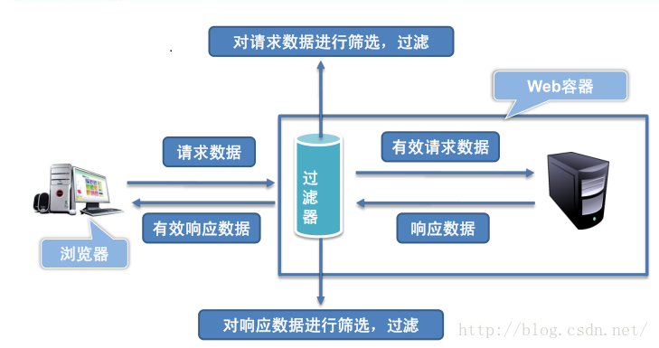

## 使用场合
1. 对请求和响应统一处理
2. 对请求进行日志记录和审核
3. 对数据进行屏蔽和替换
4. 对数据进行加密和解密

## 使用步骤
1. 在java类里面实现Fileter接口
2. 在WEB.xml文件中配置过滤器
```XML
<filter>
    <filter-name>过滤器名称</filter-name>
    <filter-class>过滤器的完全限定名</filter-calss>
</filter>
<filter-mapping>
    <filter-name>过滤器名称</filter-name>
    <url-pattern>需要过滤的页面地址</url-pattern>
</filter-mapping>
```
可选配置：
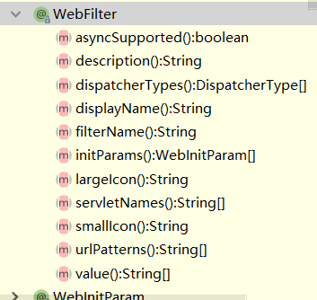

## 常用配置项
- urlPatterns:配置要拦截的资源
    - 以指定资源匹配。例如"/index.jsp"
    - 以目录匹配。例如"/servlet/*"
    - 以后缀名匹配，例如"*.jsp"
    - 通配符，拦截所有web资源。"/*"
- initParams:配置初始化参数，跟Servlet配置一样
    - initParams = {
        @WebInitParam(name = "key",value = "value")
        }
- dispatcherTypes:配置拦截的类型，可配置多个。默认为DispatcherType.REQUEST
    - dispatcherTypes = {DispatcherType.ASYNC,DispatcherType.ERROR}
    - 其中DispatcherType是个枚举类型，有下面几个值:
        - FORWARD,//转发的
        - INCLUDE,//包含在页面的
        - REQUEST,//请求的
        - ASYNC,//异步的
        - ERROR;//出错的

## 过滤器链，有多个过滤器就会形成过滤器连
关于chain.doFilter(request,response)它的作用是将请求转发给过滤器链上下一个对象。这里的下一个指的是下一个filter，如果没有filter那就是你请求的资源。 一般filter都是一个链,web.xml 里面配置了几个就有几个。一个一个的连在一起 

request -> filter1 -> filter2 ->filter3 -> .... -> request resource.

1. 在web.xml中，filter执行顺序跟<filter-mapping>的顺序有关，先声明的先执行
2. 使用注解配置的话，filter的执行顺序跟名称的字母顺序有关，例如AFilter会比BFilter先执行
3. 如果既有在web.xml中声明的Filter，也有通过注解配置的Filter，那么会优先执行web.xml中配置的Filter

```JAVA
package filter;

import javax.servlet.*;
import javax.servlet.annotation.WebFilter;
import javax.servlet.annotation.WebInitParam;
import java.io.IOException;

@WebFilter(filterName = "CharsetFilter",
        urlPatterns = "/*",/*通配符（*）表示对所有的web资源进行拦截*/
        initParams = {
                @WebInitParam(name = "charset", value = "utf-8")/*这里可以放一些初始化的参数*/
        })
public class CharsetFilter implements Filter {
    private String filterName;
    private String charset;

    public void destroy() {
        /*销毁时调用*/

        System.out.println(filterName + "销毁");
    }

    public void doFilter(ServletRequest req, ServletResponse resp, FilterChain chain) throws ServletException, IOException {
        /*过滤方法 主要是对request和response进行一些处理，然后交给下一个过滤器或Servlet处理*/
        System.out.println(filterName + "doFilter()");
        req.setCharacterEncoding(charset);
        resp.setCharacterEncoding(charset);
        chain.doFilter(req, resp);
    }

    public void init(FilterConfig config) throws ServletException {

        /*初始化方法  接收一个FilterConfig类型的参数 该参数是对Filter的一些配置*/

        filterName = config.getFilterName();
        charset = config.getInitParameter("charset");

        System.out.println("过滤器名称：" + filterName);
        System.out.println("字符集编码：" + charset);

    }

}
```
过滤器是在服务器启动时就会创建的，只会创建一个实例，常驻内存，也就是说服务器一启动就会执行Filter的init(FilterConfig config)方法.
当Filter被移除或服务器正常关闭时，会执行destroy方法.

# 22.请谈谈你对Javaweb开发中的监听器的理解？
## 概述
JavaWeb中的监听器是Servlet规范中定义的一种特殊类，它用于监听web应用程序中的ServletContext，HttpSession和ServletRequest等域对象的创建与销毁事件，以及监听这些域对象中的属性发生修改的事件。
## Servlet监听器的分类
在Servlet规范中定义了多种类型的监听器，它们用于监听的事件源分别为ServletContext，HttpSession和ServletRequest这三个域对象。 
Servlet规范针对这三个对象上的操作，又把多种类型的监听器划分为三种类型：

1. 监听三个域对象创建和销毁的事件监听器。
2. 监听域对象中的属性的增加和删除的事件监听器。
3. 监听绑定到HttpSession域中的某个对象的状态的事件监听器。

## 监听ServletContext域对象的创建和销毁
ServletContextListener接口用于监听ServletContext对象的创建和销毁事件。实现了ServletContextListener接口的类都可以对ServletContext对象的创建和销毁进行监听。

- 当ServletContext对象被创建时，激发contextInitialized (ServletContextEvent sce)方法。
- 当ServletContext对象被销毁时，激发contextDestroyed(ServletContextEvent sce)方法。

__ServletContext域对象何时创建和销毁？__
- 创建：服务器启动针对每一个Web应用创建ServletContext
- 销毁：服务器关闭前先关闭代表每一个Web应用的ServletContext。

编写一个MyServletContextListener类，实现ServletContextListener接口，监听ServletContext对象的创建和销毁。

编写一个监听器:
```JAVA
public class MyServletContextListener implements ServletContextListener {

    // 当ServletContext被创建的时候(什么时候创建ServletContext呢？将web工程发布到web服务器里面去了，只要一启动web服务器，web服务器会针对每一个web应用创建ServletContext)，下面方法执行
    @Override
    public void contextInitialized(ServletContextEvent sce) {
        System.out.println("ServletContext被创建了！！！");
    }

    // 当ServletContext被销毁的时候(停止服务器，服务器就会把针对于每一个web应用的ServletContext摧毁)，下面方法执行
    @Override
    public void contextDestroyed(ServletContextEvent sce) {
        System.out.println("ServletContext被销毁了！！！");
    }

}
```

在web.xml文件中注册监听器。

MyServletContextListener监听器想要能工作，必须注册到事件源上面去，以前我们注册到事件源上面去，都是自己调方法，往事件源上面注册。现在就不能这么干了，想要把监听器注册到ServletContext这个事件源上面去，只须告诉tomcat服务器，tomcat服务器会自动帮你注册。监听器也属于web资源，只要涉及到对web资源的配置，都要找web.xml文件。
```XML
<listener>
    <listener-class>cn.itcast.web.listener.MyServletContextListener</listener-class>
</listener>
```

经过这两个步骤，我们就完成了监听器的编写和注册，Web服务器在启动时，就会自动把在web.xml中配置的监听器注册到ServletContext对象上，这样开发好的MyServletContextListener监听器就可以对ServletContext对象进行监听了。

注意以下三点：

1. 和编写其它事件监听器一样，编写servlet监听器也需要实现一个特定的接口，并针对相应动作覆盖接口中的相应方法。
2. 和其它事件监听器略有不同的是，servlet监听器的注册不是直接注册在事件源上，而是由WEB容器负责注册，开发人员只需在web.xml文件中使用<listener\>标签配置好监听器，web容器就会自动把监听器注册到事件源中。
3. 一个web.xml文件中可以配置多个Servlet事件监听器，web服务器按照它们在web.xml文件中的注册顺序来加载和注册这些Serlvet事件监听器。

在做实际开发时，有时候希望web应用启动时，就初始化一些资源，那就把初始化一些资源的代码写到contextInitialized方法里面。

1. web应用一启动时，希望启动一些定时器来定时的执行某些任务。只要把启动定时器的代码写到contextInitialized方法里面，这个web应用一启动，定时器就启动了。
2. Spring的启动代码就是写在一个ServletContext监听器的contextInitialized方法里面的。Spring是一个框架，我们希望web应用一启动的时候，就把Spring框架启动起来

## 监听HttpSession域对象的创建和销毁
HttpSessionListener接口用于监听HttpSession对象的创建和销毁。

- 创建一个Session时，激发sessionCreated(HttpSessionEvent se)方法。
- 销毁一个Session时，激发sessionDestroyed(HttpSessionEvent se)方法。

__Session域对象创建和销毁的时机?__

1. 创建：用户每一次访问时，服务器创建session。
2. 销毁：如果用户的session30分钟没有使用，服务器就会销毁session，我们在web.xml里面也可以配置session失效时间。

编写一个MyHttpSessionListener类，实现HttpSessionListener接口，监听HttpSession对象的创建和销毁。

编写一个监听器：
```JAVA
public class MyHttpSessionListener implements HttpSessionListener {

    @Override
    public void sessionCreated(HttpSessionEvent se) {
        System.out.println(se.getSession() + "被创建了！！！");
        System.out.println("创建好的HttpSession的id是：" + se.getSession().getId());
    }

    @Override
    public void sessionDestroyed(HttpSessionEvent se) {
        System.out.println("session被销毁了！！！");
    }

}
```

在web.xml文件中注册监听器
```XML
<listener>
    <listener-class>cn.itcast.web.listener.MyHttpSessionListener</listener-class>
</listener>
<!-- 配置HttpSession对象的销毁时机 -->
<session-config>
    <!-- 配置HttpSession对象1分钟之后销毁 -->
    <session-timeout>1</session-timeout>
</session-config>
```

当我们访问jsp页面时，HttpSession对象就会创建，此时就可以在HttpSessionListener观察到HttpSession对象的创建过程了，我们可以写一个jsp页面观察HttpSession对象创建的过程。
```XML
<%@ page language="java" contentType="text/html; charset=UTF-8"
pageEncoding="UTF-8"%>
<!DOCTYPE html PUBLIC "-//W3C//DTD HTML 4.01 Transitional//EN" "http://www.w3.org/TR/html4/loose.dtd">
<html>
<head>
<meta http-equiv="Content-Type" content="text/html; charset=UTF-8">
<title>HttpSessionListener监听器监听HttpSession对象的创建</title>
</head>
<body>
     一访问JSP页面，HttpSession就创建了，创建好的Session的Id是：${pageContext.session.id}
</body>
</html>
```

由于在web.xml里面配置了session的失效时间，所以在一分钟之后session将被销毁。

注意：

1. 现在在客户端把cookie给禁用了，那么再次点击刷新按钮，有没有session被创建？ 
    答：有，现在在客户端把cookie给禁了，意味着你再去访问服务器，没有带sessionid号过去，服务器看你没有带sessionid，它认为你又是一个新的来访者，它又会帮你创建session。
2. 现在将浏览器窗口关了，能不能看见session被销毁？ 
    答：不能，session会驻留在内存里面，30分钟没人用了服务器才将其摧毁。

这个技术在开发里面用在哪里呢？

统计当前在线人数。一般来说，用户都会开一个浏览器访问服务器，只要他一访问，服务器就会针对他创建一个session，每个用户就有一个session，在实际开发里面，只要统计内存里面有多少session，就能知道当前有多少在线人数。为了统计当前在线人数，这时可以写一个这样的监听器，只要有一个session被创建就让一个变量count+1，session被销毁就让变量count-1，输出count这个值，就能知道当前有多少在线人数。 

## 监听ServletRequest域对象的创建和销毁
ServletRequestListener接口用于监听ServletRequest对象的创建和销毁

- Request对象被创建时，监听器的requestInitialized(ServletRequestEvent sre)方法将会被调用。
- Request对象被销毁时，监听器的requestDestroyed(ServletRequestEvent sre)方法将会被调用。

__ServletRequest域对象创建和销毁时机?__

1. 创建：用户每一次访问都会创建request对象。
2. 销毁：当前访问结束，request对象就会销毁。

编写一个MyServletRequestListener类，实现ServletRequestListener接口，监听ServletRequest对象的创建和销毁。

编写监听器:
```JAVA
public class MyServletRequestListener implements ServletRequestListener {

    @Override
    public void requestDestroyed(ServletRequestEvent sre) {
        System.out.println("request被销毁！！！");
    }

    @Override
    public void requestInitialized(ServletRequestEvent sre) {
        System.out.println("request被创建！！！");
    }

}
```

在web.xml文件中注册监听器。
```XML
<listener>
    <listener-class>cn.itcast.web.listener.MyServletRequestListener</listener-class>
</listener>
```

这个技术在开发里面用在哪里呢？

这个监听器可以用来做网站性能统计，针对每一个请求，都会有一个request对象创建。

在requestInitialized(ServletRequestEvent sre)方法里面加上一句代码：count++，如下：
```JAVA
public void requestInitialized(ServletRequestEvent sre) {
    System.out.println("request被创建！！！");
    count++;
}
```

也可以在requestInitialized(ServletRequestEvent sre)方法里面加上一句代码：sre.getServletRequest().getRemoteAddr();，如下：
```JAVA
public void requestInitialized(ServletRequestEvent sre) {
    System.out.println("request被创建！！！");
    sre.getServletRequest().getRemoteAddr();
}
```

可以知道当前这个请求是由哪个IP发出来的，在后台可以通过这个监听器监听到哪些IP在给你发请求，这样做的目的是为了防止坏人，有些坏人恶意点击，写机器人点击，在后台写这样的一个监听器可以监听到某个时间段有某个IP重复点击，如果发生这种情况，就说明这个人是坏人，就可以屏蔽其IP。
>https://blog.csdn.net/yerenyuan_pku/article/details/52468244

# 23.说说web.xml文件中可以配置哪些内容
web.xml用于配置Web应用的相关信息，如：监听器（listener）、过滤器（filter）、 Servlet、相关参数、会话超时时间、安全验证方式、错误页面等，下面是一些开发中常见的配置：

- 配置Spring上下文加载监听器加载Spring配置文件并创建IoC容器：
```XML
<context-param>
<param-name>contextConfigLocation</param-name>
<param-value>classpath:applicationContext.xml</param-value>
</context-param>

<listener>
<listener-class>
org.springframework.web.context.ContextLoaderListener
</listener-class>
</listener>
```

- 配置Spring的OpenSessionInView过滤器来解决延迟加载和Hibernate会话关闭的矛盾：
```XML
<filter>
<filter-name>openSessionInView</filter-name>
<filter-class>
org.springframework.orm.hibernate3.support.OpenSessionInViewFilter
</filter-class>
</filter>

<filter-mapping>
<filter-name>openSessionInView</filter-name>
<url-pattern>/*</url-pattern>
</filter-mapping>
```

- 配置会话超时时间为10分钟：
```XML
<session-config>
<session-timeout>10</session-timeout>
</session-config>
```

- 配置404和Exception的错误页面：
```XML
<error-page>
<error-code>404</error-code>
<location>/error.jsp</location>
</error-page>

<error-page>
<exception-type>java.lang.Exception</exception-type>
<location>/error.jsp</location>
</error-page>
```

- 配置安全认证方式：
```XML
<security-constraint>
<web-resource-collection>
<web-resource-name>ProtectedArea</web-resource-name>
<url-pattern>/admin/*</url-pattern>
<http-method>GET</http-method>
<http-method>POST</http-method>
</web-resource-collection>
<auth-constraint>
<role-name>admin</role-name>
</auth-constraint>
</security-constraint>

<login-config>
<auth-method>BASIC</auth-method>
</login-config>

<security-role>
<role-name>admin</role-name>
</security-role>
```
