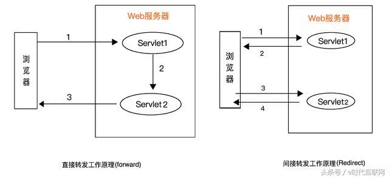
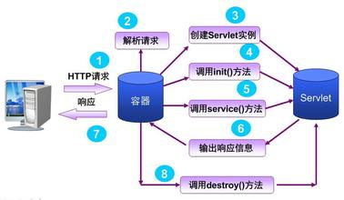
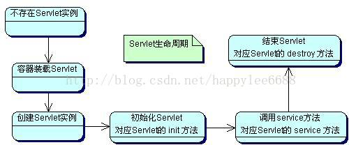

<!-- MarkdownTOC -->

- [1.forward与redirect区别,说一下你知道的状态码,redirect的状态码是多少](#1forward与redirect区别说一下你知道的状态码redirect的状态码是多少)
  - [forward过程](#forward过程)
  - [redirect过程](#redirect过程)
- [2.servlet生命周期,是否单例,为什么是单例](#2servlet生命周期是否单例为什么是单例)
- [3.Servlet和CGI的区别](#3servlet和cgi的区别)
  - [什么是CGI](#什么是cgi)
  - [CGI功能](#cgi功能)
  - [运行环境](#运行环境)
  - [CGI处理步骤](#cgi处理步骤)
- [4.Servlet执行时一般实现哪几个方法](#4servlet执行时一般实现哪几个方法)
  - [GenericServlet与HttpServlet类](#genericservlet与httpservlet类)
  - [Servlet执行时一般要实现的方法](#servlet执行时一般要实现的方法)
- [5.说说Servlet接口中有哪些方法](#5说说servlet接口中有哪些方法)
- [6.Servlet 3中的异步处理指的是什么](#6servlet-3中的异步处理指的是什么)
- [7.如何在基于Java的Web项目中实现文件上传和下载](#7如何在基于java的web项目中实现文件上传和下载)
- [8.服务器收到用户提交的表单数据,到底是调用Servlet的doGet\(\)还是doPost\(\)方法](#8服务器收到用户提交的表单数据到底是调用servlet的doget还是dopost方法)
- [9.Servlet中如何获取用户提交的查询参数或表单数据](#9servlet中如何获取用户提交的查询参数或表单数据)
- [10.Servlet中如何获取用户配置的初始化参数以及服务器上下文参数](#10servlet中如何获取用户配置的初始化参数以及服务器上下文参数)
- [11.缓存的优点](#11缓存的优点)
- [12.说说MVC的各个部分都有那些技术来实现?如何实现](#12说说mvc的各个部分都有那些技术来实现如何实现)
- [13.什么是DAO模式](#13什么是dao模式)
- [14.你的项目中使用过哪些JSTL标签](#14你的项目中使用过哪些jstl标签)
- [15.请问Java Web开发的Model 1和Model 2分别指的是什么](#15请问java-web开发的model-1和model-2分别指的是什么)
- [16.使用标签库有什么好处,如何自定义JSP标签\(JSP标签\)](#16使用标签库有什么好处如何自定义jsp标签jsp标签)
- [17.get和post区别](#17get和post区别)
- [18.请谈谈转发和重定向的区别](#18请谈谈转发和重定向的区别)
- [19.BS与CS的联系与区别](#19bs与cs的联系与区别)
- [20.如何设置请求的编码以及响应内容的类型](#20如何设置请求的编码以及响应内容的类型)
- [21.什么是Web Service\(Web服务\)](#21什么是web-serviceweb服务)
- [22.谈谈Session的save\(\),update\(\),merge\(\),lock\(\),saveOrUpdate\(\)和persist\(\)方法分别是做什么的,有什么区别](#22谈谈session的saveupdatemergelocksaveorupdate和persist方法分别是做什么的有什么区别)
- [23.大型网站在架构上应当考虑哪些问题](#23大型网站在架构上应当考虑哪些问题)

<!-- /MarkdownTOC -->

# 1.forward与redirect区别,说一下你知道的状态码,redirect的状态码是多少
## forward过程
转发，服务器端行为。web服务器把接受的请求，调用内部的方法在容器内部完成请求处理和转发动作，然后响应客户端，在这里，转发的路径必须是同一个web容器下的url，其不能转向到其他的web路径上去，中间传递的是自己的容器内的request。
## redirect过程
重定向，客户端行为。客户端发送http请求，web服务器接受后发送302状态码响应及对应新的location给客客户端，客户端发现是302响应，则自动再发送一个新的http请求，请求url是新的location地址，在这里location可以重定向到任意URL，既然是浏览器重新发出了请求，则就没有什么request传递的概念了。重定向行为是浏览器做了至少两次的访问请求的。


区别：

1. 从地址栏显示来说：   
    forward是服务器请求资源,服务器直接访问目标地址的URL，把那个URL的响应内容读取过来，然后把这些内容再发给浏览器。浏览器根本不知道服务器发送的内容从哪里来的,所以它的地址栏还是原来的地址。   
    redirect是服务端根据逻辑,发送一个状态码,告诉浏览器重新去请求那个地址.所以地址栏显示的是新的URL。
2. 从数据共享来说：   
    forward:转发页面和转发到的页面可以共享request里面的数据.    
    redirect:不能共享数据.
3. 从运用地方来说：    
    forward:一般用于用户登陆的时候,根据角色转发到相应的模块.    
    redirect:一般用于用户注销登陆时返回主页面和跳转到其它的网站等.
4. 从效率来说
    forward:高.    
    redirect:低.    

客户端

- 404 -Not Found 代表客户端错误，指的是服务器端无法找到所请求的资源
- 400 -请求无效，服务器不理解请求的语法
- 403 - 禁止访问 ，服务器拒绝请求
- 405 - 资源被禁止，禁用请求中指定的方法
- 406 - 无法接受 ，无法使用请求的内容特性响应请求的网页
- 407 - 要求代理身份验证 ，此状态代码与 401（未授权）类似，但指定请求者应当授权使用代理
- 408 - 请求超时，服务器等候请求时发生超时
- 409 - 冲突，服务器在完成请求时发生冲突。 服务器必须在响应中包含有关冲突的信息
- 410 - 已删除，如果请求的资源已永久删除，服务器就会返回此响应。
- 411 - 需要有效长度， 服务器不接受不含有效内容长度标头字段的请求。
- 412 - 未满足前提条件， 服务器未满足请求者在请求中设置的其中一个前提条件。
- 413 - 请求实体过大，服务器无法处理请求，因为请求实体过大，超出服务器的处理能力。
- 414 - 请求的 URI 过长， 请求的 URI（通常为网址）过长，服务器无法处理。
- 415 - 不支持的媒体类型， 请求的格式不受请求页面的支持。
- 416 - 请求范围不符合要求，如果页面无法提供请求的范围，则服务器会返回此状态代码。
- 417 - 未满足期望值，服务器未满足”期望”请求标头字段的要求
- 500 - 内部服务器错误，无法完成请求
- 501 - 未实现 ，服务器不具备完成请求的功能。 例如，服务器无法识别请求方法时可能会返回此代码
- 502 - 网关错误 ，服务器作为网关或代理，从上游服务器收到无效响应
- 503 - 服务不可用，服务器目前无法使用，通常，这只是暂时状态
- 504 - 网关超时， 服务器作为网关或代理，但是没有及时从上游服务器收到请求
- 505 - HTTP 版本不受支持， 服务器不支持请求中所用的 HTTP 协议版本

服务端

- 2xx - 客户端请求已成功。  
- 200 - 服务器已成功处理了请求。 通常，这表示服务器提供了请求的网页
- 201 - 已创建，请求成功并且服务器创建了新的资源
- 202 - 已接受，但尚未处理
- 203 - 非权威性信息，服务器已成功处理了请求，但返回的信息可能来自另一来源
- 204 - 无内容，服务器成功处理了请求，但没有返回任何内容
- 205 - 重置内容，服务器成功处理了请求，但没有返回任何内容
- 206 - 部分内容，服务器成功处理了部分 GET 请求
- 3xx - 重定向  
- 302 - 对象已移动
- 304 - 未修改
- 307 - 临时重定向

redirect的状态码是302

# 2.servlet生命周期,是否单例,为什么是单例


Servlet生命周期定义了一个Servlet如何被加载、初始化，以及它怎样接收请求、响应请求，提供服务。在讨论Servlet生命周期之前，先让我们来看一下这几个方法：

1. init()方法
    在Servlet的生命周期中，仅执行一次init()方法，它是在服务器装入Servlet时执行的，可以配置服务器，以在启动服务器或客户机首次访问Servlet时装入Servlet。无论有多少客户机访问Servlet，都不会重复执行init()；
2. service()方法
    它是Servlet的核心，每当一个客户请求一个HttpServlet对象，该对象的Service()方法就要调用，而且传递给这个方法一个“请求”（ServletRequest）对象和一个“响应”（ServletResponse）对象作为参数。在HttpServlet中已存在Service()方法。默认的服务功能是调用与HTTP请求的方法相应的do功能。
3. destroy()方法
    仅执行一次，在服务器端停止且卸载Servlet时执行该方法，有点类似于C++的delete方法。一个Servlet在运行service()方法时可能会产生其他的线程，因此需要确认在调用destroy()方法时，这些线程已经终止或完成。

下面来谈谈Servlet的生命周期，Servlet的生命周期是由Servlet容器来控制的，它始于装入Web服务器的内存时，并在终止或重新装入Servlet时结束。这项操作一般是动态执行的。然而，Server通常会提供一个管理的选项，用于在Server启动时强制装载和初始化特定的Servlet。

在代码中，Servlet生命周期由接口javax.servlet.Servlet定义。所有的Java Servlet 必须直接或间接地实现javax.servlet.Servlet接口，这样才能在Servlet Engine上运行。javax.servlet.Servlet接口定义了一些方法，在Servlet 的生命周期中，这些方法会在特定时间按照一定的顺序被调用。



加载和实例化Servlet

tomcat是如何加载的？

Servlet容器会在一下几种情况装载Servlet：

1. 如果已配置自动装入选项，则在启动时自动载入。
2. 在服务器启动时，客户机首次向Servlet发出请求。
3. 重新装入Servlet时

当启动Servlet容器时，容器首先查找一个配置文件web.xml，这个文件中记录了可以提供服务的Servlet。每个Servlet被指定一个Servlet名，也就是这个Servlet实际对应的Java的完整class文件名。Servlet容器会为每个自动装入选项的Servlet创建一个实例。所以，每个Servlet类必须有一个公共的无参数的构造器。

初始化

当Servlet被实例化后，Servlet容器将调用每个Servlet的init方法来实例化每个实例，执行完init方法之后，Servlet处于“已初始化”状态。所以说，一旦Servlet被实例化，那么必将调用init方法。通过Servlet在启动后不立即初始化，而是收到请求后进行。在web.xml文件中用<load-on-statup\> ...... </load-on-statup\>对Servlet进行预先初始化。

初始化失败后，执行init()方法抛出ServletException异常，Servlet对象将会被垃圾回收器回收，当客户端第一次访问服务器时加载Servlet实现类，创建对象并执行初始化方法。

请求处理

Servlet 被初始化以后，就处于能响应请求的就绪状态。每个对Servlet 的请求由一个Servlet Request 对象代表。Servlet 给客户端的响应由一个Servlet Response对象代表。对于到达客户机的请求，服务器创建特定于请求的一个“请求”对象和一个“响应”对象。调用service方法，这个方法可以调用其他方法来处理请求。

Service方法会在服务器被访问时调用，Servlet对象的生命周期中service方法可能被多次调用，由于web-server启动后，服务器中公开的部分资源将处于网络中，当网络中的不同主机（客户端）并发访问服务器中的同一资源，服务器将开设多个线程处理不同的请求，多线程同时处理同一对象时，有可能出现数据并发访问的错误。

另外注意，多线程难免同时处理同一变量时（如：对同一文件进行写操作），且有读写操作时，必须考虑是否加上同步，同步添加时，不要添加范围过大，有可能使程序变为纯粹的单线程，大大削弱了系统性能；只需要做到多个线程安全的访问相同的对象就可以了。

卸载Servlet

当服务器不再需要Servlet实例或重新装入时，会调用destroy方法，使用这个方法，Servlet可以释放掉所有在init方法申请的资源。一个Servlet实例一旦终止，就不允许再次被调用，只能等待被卸载。

Servlet一旦终止，Servlet实例即可被垃圾回收，处于“卸载”状态，如果Servlet容器被关闭，Servlet也会被卸载，一个Servlet实例只能初始化一次，但可以创建多个相同的Servlet实例。如相同的Servlet可以在根据不同的配置参数连接不同的数据库时创建多个实例。

Servlet单实例，减少了产生servlet的开销；

Servlet是非线程安全的，如何实现线程安全的Servlet：

1. 实现 SingleThreadModel 接口。该接口指定了系统如何处理对同一个Servlet的调用。如果一个Servlet被这个接口指定,那么在这个Servlet中的service方法将不会有两个线程被同时执行，当然也就不存在线程安全的问题。
2. 同步对共享数据的操作 

# 3.Servlet和CGI的区别
##  什么是CGI
CGI(Common Gateway Interface 公共网关接口)是HTTP服务器与你的或其它机器上的程序进行“交谈”的一种工具，其程序须运行在网络服务器上。
## CGI功能
绝大多数的CGI程序被用来解释处理来自表单的输入信息，并在服 务器产生相应的处理，或将相应的信息反馈给浏览器。CGI程序使 网页具有交互功能。
## 运行环境
CGI程序在UNIX操作系统上CERN或NCSA格式的服务器上运行。 在其它操作系统（如：windows NT及windows95等）的服务器上 也广泛地使用CGI程序，同时它也适用于各种类型机器。
## CGI处理步骤
1. 通过Internet把用户请求送到服务器
2. 服务器接收用户请求并交给CGI程序处理
3. CGI程序把处理结果传送给服务器
4. 服务器把结果送回到用户

Servlet是一种服务器端的Java应用程序，具有独立于平台和协议的特性,可以生成动态的Web页面。 

它担当客户请求（Web浏览器或其他HTTP客户程序）与服务器响应（HTTP服务器上的数据库或应用程序）的中间层。 Servlet是位于Web 服务器内部的服务器端的Java应用程序，与传统的从命令行启动的Java应用程序不同，Servlet由Web服务器进行加载，该Web服务器必须包含支持Servlet的Java虚拟机。

工作模式：客户端发送请求至服务器；服务器启动并调用Servlet，Servlet根据客户端请求生成响应内容并将其传给服务器；服务器将响应返回客户端。

Java Servlet与CGI (Common Gateway Interface 公共网关接口)的比较:

1. 与传统的CGI和许多其他类似CGI的技术相比，Java Servlet具有更高的效率，更容易使用，功能更强大，具有更好的可移植性，更节省投资。在未来的技术发展过程中，Servlet有可能彻底取代CGI。
2. 在传统的CGI中，每个请求都要启动一个新的进程，如果CGI程序本身的执行时间较短，启动进程所需要的开销很可能反而超过实际执行时间。而在Servlet中，每个请求由一个轻量级的Java线程处理(而不是重量级的操作系统进程)。
3. 在传统CGI中，如果有N个并发的对同一CGI程序的请求，则该CGI程序的代码在内存中重复装载了N次；而对于Servlet，处理请求的是N个线程，只需要一份Servlet类代码。在性能优化方面，Servlet也比CGI有着更多的选择。

与cgi的区别在于servlet处于服务器进程中，它通过多线程方式运行其service方法，一个实例可以服务于多个请求，并且其实例一般不会销毁，而CGI对每个请求都产生新的进程，服务完成后就销毁，所以效率上低于servlet。
>http://www.cnblogs.com/MuyouSome/p/3938203.html

# 4.Servlet执行时一般实现哪几个方法
## GenericServlet与HttpServlet类

GenericServlet类是一个实现了Servlet的基本特征和功能的基类，其完整名称为javax.servlet.GenericServlet，它实现了Servlet和ServletConfig接口。

HttpServlet类是GenericServlet的子类，其完整名称为javax.servlet.HttpServlet，它提供了处理HTTP协议的基本构架。

如果一个Servlet类要充分使用Http协议的功能，就应该继承HttpServlet。

在HttpServlet类及其子类中，除可以调用HttpServlet类内部新定义的方法外，还可以调用包括Servlet，ServletConfig接口和GenericServlet类中的一些方法。

## Servlet执行时一般要实现的方法
```JAVA
public void init(ServletConfig config)
public ServletConfig getServletConfig()
public String getServletInfo()
public void service(ServletRequest request,ServletResponse response)
public void destroy()
```

init ()方法在servlet的生命周期中仅执行一次，在servlet引擎创建servlet对象后执行。Servlet在调用init方法时，会传递一个包含servlet的配置和运行环境信息的ServletConfig对象。如果初始化代码中要使用到ServletConfig对象，则初始化代码就只能在Servlet的init方法中编写，而不能在构造方法中编写。缺省的init()方法通常是符合要求的，不过也可以根据需要进行 override，比如管理服务器端资源，初始化数据库连接等，缺省的inti()方法设置了servlet的初始化参数，并用它 的ServeltConfig对象参数来启动配置，所以覆盖init()方法时，应调用super.init()以确保仍然执行这些任务。

service ()方法是servlet的核心，用于响应对Servlet的访问请求。对于HttpServlet，每当客户请求一个 HttpServlet对象，该对象的service()方法就要被调用，HttpServlet缺省的service()方法的服务功能就是调用与 HTTP请求的方法相应的do功能，doPost()和doGet()，所以对于HttpServlet，一般都是重写doPost()和doGet() 方法。

destroy()方法在servlet的生命周期中也仅执行一次，即在服务器停止卸载servlet之前被调用，把servlet作为 服务器进程的一部分关闭。缺省的destroy()方法通常是符合要求的，但也可以override，来完成与init方法相反的功能。比如在卸载servlet时将统计数字保存在文件 中，或是关闭数据库连接或IO流。

getServletConfig()方法返回一个servletConfig对象，该对象用来返回初始化参数和servletContext。servletContext接口提供有关servlet的环境信息。

getServletInfo()方法提供有关servlet的描述信息，如作者，版本，版权。可以对它进行覆盖。

doxxx方法  客户端可以用HTTP协议中规定的各种请求方式来访问Servlet，Servlet采取不同的访问方式进行处理。不管那种请求方式访问Servlet,Servlet引擎都会调用Servlet的service方法，service方法是所有请求方式的入口。

- doGet 用于处理Get请求
- doPost用于处理Post请求
- doHead用于处理Head请求
- doPut 用于处理Put请求
- doDelete 用于处理Delete请求
- doTrace 用于处理Trace请求
- doOptions用于处理OPTIONS请求
>https://blog.csdn.net/tuiroger/article/details/3854076

# 5.说说Servlet接口中有哪些方法
Servlet接口定义了5个方法，其中前三个方法与Servlet生命周期相关：

- void init(ServletConfig config) throws ServletException
- void service(ServletRequest req, ServletResponse resp) throws ServletException, java.io.IOException
- void destory()
- java.lang.String getServletInfo()
- ServletConfig getServletConfig()

Web容器加载Servlet并将其实例化后，Servlet生命周期开始，容器运行其init()方法进行Servlet的初始化；请求到达时调用Servlet的service()方法，service()方法会根据需要调用与请求对应的doGet或doPost等方法；当服务器关闭或项目被卸载时服务

器会将Servlet实例销毁，此时会调用Servlet的destroy()方法。

# 6.Servlet 3中的异步处理指的是什么
Servlet 3.0 开始提供了AsyncContext用来支持异步处理请求

Web容器一般来说处理请求的方式是：为每个request分配一个thread。我们都知道thread的创建不是没有代价的，Web容器的thread pool都是有上限的。

那么一个很容易预见的问题就是，在高负载情况下，thread pool都被占着了，那么后续的request就只能等待，如果运气不好客户端会报等待超时的错误。
在AsyncContext出现之前，解决这个问题的唯一办法就是扩充Web容器的thread pool。

但是这样依然有一个问题，考虑以下场景：

有一个web容器，线程池大小200。有一个web app，它有两个servlet，Servlet-A处理单个请求的时间是10s，Servlet-B处理单个请求的时间是1s。
现在遇到了高负载，有超过200个request到Servlet-A，如果这个时候请求Servlet-B就会等待，因为所有HTTP thread都已经被Servlet-A占用了。
这个时候工程师发现了问题，扩展了线程池大小到400，但是负载依然持续走高，现在有400个request到Servlet-A，Servlet-B依然无法响应。

看到问题了没有，因为HTTP thread和Worker thread耦合在了一起（就是同一个thread），所以导致了当大量request到一个耗时操作时，就会将HTTP thread占满，导致整个Web容器就会无法响应。

但是如果使用AsyncContext，我们就可以将耗时的操作交给另一个thread去做，这样HTTP thread就被释放出来了，可以去处理其他请求了。

注意，只有使用AsyncContext才能够达到上面所讲的效果，如果直接new Thread()或者类似的方式的，HTTP thread并不会归还到容器。

__官方小Demo__

```JAVA
@WebServlet(urlPatterns={"/asyncservlet"}, asyncSupported=true)
public class AsyncServlet extends HttpServlet {
   /* ... Same variables and init method as in SyncServlet ... */

   @Override
   public void doGet(HttpServletRequest request, 
                     HttpServletResponse response) {
      response.setContentType("text/html;charset=UTF-8");
      final AsyncContext acontext = request.startAsync();
      acontext.start(new Runnable() {
         public void run() {
            String param = acontext.getRequest().getParameter("param");
            String result = resource.process(param);
            HttpServletResponse response = acontext.getResponse();
            /* ... print to the response ... */
            acontext.complete();
            }
      });
   }
}
```

__陷阱__

在这个官方例子里，每个HTTP thread都会开启另一个Worker thread来处理请求，然后把HTTP thread就归还给Web容器。但是看AsyncContext.start()方法的javadoc：

Causes the container to dispatch a thread, possibly from a managed thread pool, to run the specified Runnable.

实际上这里并没有规定Worker thread到底从哪里来，也许是HTTP thread pool之外的另一个thread pool？还是说就是HTTP thread pool？

实际上：不同的Web容器对此有不同的实现，不过Tomcat实际上是利用HTTP thread pool来处理AsyncContext.start()的。

这也就是说，我们原本是想释放HTTP thread的，但实际上并没有，因为有HTTP thread依然被用作Worker thread，只不过这个thread和接收请求的HTTP thread不是同一个而已。

__解决方案：__使用ExecutorService

前面看到了Tomcat并没有单独维护Worker thread pool，那么我们就得自己想办法搞一个，它使用了一个带Thread pool的ExecutorService来处理AsyncContext。
```JAVA
package me.chanjar.learning;

import javax.servlet.AsyncContext;
import javax.servlet.ServletException;
import javax.servlet.annotation.WebServlet;
import javax.servlet.http.HttpServlet;
import javax.servlet.http.HttpServletRequest;
import javax.servlet.http.HttpServletResponse;
import java.io.IOException;
import java.util.concurrent.ExecutorService;
import java.util.concurrent.Executors;
import java.util.concurrent.TimeUnit;

@WebServlet(value = "/async-servlet-2", asyncSupported = true)
public class AsyncServlet2 extends HttpServlet {

  private volatile ExecutorService executorService;

  @Override
  protected void doGet(HttpServletRequest req, HttpServletResponse resp) throws ServletException, IOException {

    AsyncContext asyncCtx = req.startAsync();
    executorService.submit(new SlowJobRunner(new SlowJob("async servlet2"), asyncCtx));

  }

  @Override
  public void init() throws ServletException {

    super.init();
    executorService = Executors.newFixedThreadPool(400);
  }

  @Override
  public void destroy() {

    super.destroy();
    executorService.shutdown();
    boolean successfulTerminated = false;
    try {
      successfulTerminated = executorService.awaitTermination(5, TimeUnit.SECONDS);
    } catch (InterruptedException e) {
      e.printStackTrace();
    }
    if (!successfulTerminated) {
      executorService.shutdownNow();
    }
    executorService = null;
  }

}
```
>https://segmentfault.com/a/1190000012318350

Servlet 3.0的异步处理是通过AsyncContext类来处理的，Servlet可通过ServletRequest的如下两个方法开启异步调用、创建AsyncContext对象： 

1. AsyncContext startAsync() 
2. AsyncContext startAsync(ServletRequest, ServletResponse) 

重复调用上面的方法将得到同一个AsyncContext对象。AsyncContext对象代表异步处理的上下文，它提供了一些工具方法，可完成设置异步调用的超时时长，dispatch用于请求、启动后台线程、获取request、response对象等功能。

除此之外，Servlet 3.0 还为异步处理提供了一个监听器，使用 AsyncListener 接口表示。它可以监控如下四种事件：

1. 异步线程开始时，调用 AsyncListener 的 onStartAsync(AsyncEvent event) 方法；
2. 异步线程出错时，调用 AsyncListener 的 onError(AsyncEvent event) 方法；
3. 异步线程执行超时，调用 AsyncListener 的 onTimeout(AsyncEvent event) 方法；
4. 异步执行完毕时，调用 AsyncListener 的 onComplete(AsyncEvent event) 方法；
>https://blog.csdn.net/kobejayandy/article/details/12209907

# 7.如何在基于Java的Web项目中实现文件上传和下载
在Sevlet 3 以前，Servlet API中没有支持上传功能的API，因此要实现上传功能需要引入第三方工具从POST请求中获得上传的附件或者通过自行处理输入流来获得上传的文件，我们推荐使用Apache的commons-fileupload。

从Servlet 3开始，文件上传变得简单许多。
```JAVA
package com.jackfrued.servlet;
 import java.io.IOException;
 import javax.servlet.ServletException;
 import javax.servlet.annotation.MultipartConfig;
 import javax.servlet.annotation.WebServlet;
 import javax.servlet.http.HttpServlet;
 import javax.servlet.http.HttpServletRequest;
 import javax.servlet.http.HttpServletResponse;
 import javax.servlet.http.Part;
 @WebServlet("/UploadServlet")
 @MultipartConfig
 public class UploadServlet extends HttpServlet {
     private static final long serialVersionUID = 1L;
     protected void doPost(HttpServletRequest request,
             
HttpServletResponse response) throws ServletException, IOException {
         // 可以用request.getPart()方法获得名为photo的上传附件
         // 也可以用request.getParts()获得所有上传附件（多文件上传）
         // 然后通过循环分别处理每一个上传的文件
         Part part = request.getPart("photo");
         if (part != null &&
part.getSubmittedFileName().length() > 0) {
             // 用ServletContext对象的getRealPath()方法获得上传文件夹的绝对路径
             String
savePath = request.getServletContext().getRealPath("/upload");
             // Servlet
3.1规范中可以用Part对象的getSubmittedFileName()方法获得上传的文件名
             // 更好的做法是为上传的文件进行重命名（避免同名文件的相互覆盖）
             
part.write(savePath + "/" + part.getSubmittedFileName());
             
request.setAttribute("hint", "Upload Successfully!");
         } else {
             request.setAttribute("hint",
"Upload failed!");
         }
         // 跳转回到上传页面
         
request.getRequestDispatcher("index.jsp").forward(request, response);
     }
 }
```

# 8.服务器收到用户提交的表单数据,到底是调用Servlet的doGet()还是doPost()方法
HTML的<form>元素有一个method属性，用来指定提交表单的方式，其值可以是get或post。我们自定义的Servlet一般情况下会重写doGet()或doPost()两个方法之一或全部，如果是GET请求就调用doGet()方法，如果是POST请求就调用doPost()方法，那为什么为什么这样呢？我们自定义的Servlet通常继承自HttpServlet，HttpServlet继承自GenericServlet并重写了其中的service()方法，这个方法是Servlet接口中定义的。HttpServlet重写的service()方法会先获取用户请求的方法，然后根据请求方法调用doGet()、doPost()、doPut()、doDelete()等方法，如果在自定义Servlet中重写了这些方法，那么显然会调用重写过的（自定义的）方法，这显然是对模板方法模式的应用（如果不理解，请参考阎宏博士的《Java与模式》一书的第37章）。当然，自定义Servlet中也可以直接重写service()方法，那么不管是哪种方式的请求，都可以通过自己的代码进行处理，这对于不区分请求方法的场景比较合适。

# 9.Servlet中如何获取用户提交的查询参数或表单数据
可以通过请求对象(HttpServletRequest)的getParameter()方法通过参数名获得参数值。
```JAVA
request.getParameter("username");
```

如果有包含多个值的参数（例如复选框），可以通过请求对象的getParameterValues()方法获得。
```JAVA
request.getParameterValues("checkbox");返回一个String类型的数组
```

当然也可以通过请求对象的getParameterMap()获得一个参数名和参数值的映射（Map）。
```JAVA
Map map =request.getParameterMap();
String[] items =(String[])map.get("checkbox");
```

如果servlet中不知道有哪几个参数名称
```JAVA
Enumeration e =request.getParameterNames()
String parameterName = null;

while(e.hasMoreElements()){
    parameterNames = (String) e.nextElement();
    String values[] = request.getParameterValues(parameterName);
    out.pritnln(parameterName);
    然后用for循环输出

}
```

与上述方法类似 道理一样 ；方法不同
```JAVA
Map map  =request.getParameterMap()
Set set  =map.keySet();   set为所有参数名称

Iterator it  = set.iterator();

String parameterNames = null;

while(it.hasNext()){
    parameterName=(String)it.next();
    String values[] = request.getParameterValues(parameterName);
    out.println(parameterName);
    然后用for循环输出
}
```

# 10.Servlet中如何获取用户配置的初始化参数以及服务器上下文参数
以通过重写Servlet接口的init(ServletConfig)方法并通过ServletConfig对象的getInitParameter()方法来获取Servlet的初始化参数。

可以通过ServletConfig对象的getServletContext()方法获取ServletContext对象，并通过该对象的getInitParameter()方法来获取服务器上下文参数。

当然，ServletContext对象也在处理用户请求的方法（如doGet()方法）中通过请求对象的getServletContext()方法来获得。


获取Servlet初始化参数:

1. 在Servlet中直接调用getinitparaneterr()方法来初始化参数
2. 通过ServletConfig借口的gerInitParameter()方法.

getServletConfig该方法定义在Servlet接口中,返回ServletConfig接口的引用,所有Servlet都继承了该方法.

当容器实例化Servlet之前,会从web.xml中读取这个Servlet的初始化参数,并交给ServletConfig,然后再调用init方法时,容器会传送这个ServletConfig的引用到Servlet.  每个Servlet都会有一个ServletConfig引用.一旦有了ServletConfig的引用就可以调用getInitParameter方法来取得Servlet中设置的初始化参数

取得上下文初始化参数？

1. servlet的ServletConfig对象拥有该servlet的ServletContext的一个引用，所以可这样取得上下文初始化参数：
    getServletConfig().getServletContext().getInitParameter()
2. 也可以在Servlet中直接调用getServletContext().getInitParameter()

# 11.缓存的优点
优点：

1. 减少了对数据库的读操作，数据库的压力降低 
2. 加快了响应速度

缺点：

1. 因为内存断电就清空数据，存放到内存中的数据可能丢失
2. 缓存中的数据可能与数据库中数据不一致
3. 内存的成本高
4. 内存容量相对硬盘小

# 12.说说MVC的各个部分都有那些技术来实现?如何实现
MVC 是 Model－View－Controller 的简写

"Model" 代表的是应用的业务逻辑（通过JavaBean，EJB 组件实现），

"View" 是应用的表示面（由 JSP 页面产生），

"Controller"是提供应用的处理过程控制（一般是一个 Servlet），通过这种设计模型把应用逻辑，处理过程和显示逻辑分成不同的组件实现。这些组件可以进行交互和重用

model层实现系统中的业务逻辑，view层用于与用户的交互，controller层是model与view之间沟通的桥梁，可以分派用户的请求并选择恰当的视图以用于显示，同时它也可以解释用户的输入并将它们映射为模型层可执行的操作。

# 13.什么是DAO模式
DAO（Data Access Object）顾名思义是一个为数据库或其他持久化机制提供了抽象接口的对象，在不暴露底层持久化方案实现细节的前提下提供了各种数据访问操作。在实际的开发中，应该将所有对数据源的访问操作进行抽象化后封装在一个公共API中。用程序设计语言来说，就是建立一个接口，接口中定义了此应用程序中将会用到的所有事务方法。在这个应用程序中，当需要和数据源进行交互的时候则使用这个接口，并且编写一个单独的类来实现这个接口，在逻辑上该类对应一个特定的数据存储。

DAO模式实际上是两个某时的组合，Data Accessor模式和Active Domain Object模式。

Data Accessor模式：封装了数据访问实现的机制，通过提供黒盒式数据存取接口，实现数据访问和业务逻辑的分离。

Active Domain Object模式：实现业务数据的对象化封装。

优点：

1. 数据存储逻辑的分离：一方面避免业务代码中混杂的JDBC代码，另一方面，数据访问接口与数据访问实现相分离，这样精通数据库的人可以根据接口专注于数据库访问的最优化实现，而精通业务的人可以专注于业务逻辑编码。

2. 数据访问底层实现的分离：DAO模式将数据访问分为抽象层和实现层，分离了数据使用和数据访问的底层实现细节。这样可以在保持上层结构不变的情况下，通过更改底层实现来修改数据访问的机制，比如只要通过修改数据访问层实现，我们就可以部署在不同数据库平台上。

3. 资源管理和调度的分离：数据访问逻辑从业务逻辑中脱离开来，使数据访问层实现统一的资源调度，通过数据库连接池和各种缓存机制的使用，可以保持上层系统不变的情况下来提高系统性能。

4. 数据抽象：通过对底层数据的封装，开发人员可以使用面向对象思想对数据进行操作。比如通过调用方法获取数据比通过SQL语句访问数据库获取数据，在代码上更易于理解，清晰，对日后维护带来便利。
>https://www.cnblogs.com/cst11021/p/4774954.html

# 14.你的项目中使用过哪些JSTL标签
项目中主要使用了JSTL的核心标签库，包括<c:if\>、<c:choose\>、<c: when\>、<c: otherwise\>、<c:forEach\>等，主要用于构造循环和分支结构以控制显示逻辑。

虽然JSTL标签库提供了core、sql、fmt、xml等标签库，但是实际开发中建议只使用核心标签库（core），而且最好只使用分支和循环标签并辅以表达式语言（EL），这样才能真正做到数据显示和业务逻辑的分离，这才是最佳实践。

# 15.请问Java Web开发的Model 1和Model 2分别指的是什么
Model 1是以页面为中心的Java Web开发，使用JSP+JavaBean技术将页面显示逻辑和业务逻辑处理分开，JSP实现页面显示，JavaBean对象用来保存数据和实现业务逻辑。

Model 2是基于MVC（模型-视图-控制器，Model-View-Controller）架构模式的开发模型，实现了模型和视图的彻底分离，利于团队开发和代码复用，

model1模式优点：执行效率高，开发效率比较高，适合小型项目

model1模式缺点：逻辑比较混乱，页面混乱，维护困难，扩展不容易

model2模式优点：将视图和业务分离，结构清晰，分工明确，维护方便，适合中大型项目

model2模式缺点：执行效率相对model1低，代码量大，重复代码比较多

# 16.使用标签库有什么好处,如何自定义JSP标签(JSP标签)
使用标签库的好处包括以下几个方面： 

- 分离JSP页面的内容和逻辑，简化了Web开发； 
- 开发者可以创建自定义标签来封装业务逻辑和显示逻辑； 
- 标签具有很好的可移植性、可维护性和可重用性； 
- 避免了对Scriptlet（小脚本）的使用（很多公司的项目开发都不允许在JSP中书写小脚本）

自定义JSP标签包括以下几个步骤：

1. 编写一个Java类实现Tag/BodyTag/IterationTag接口（开发中通常不直接实现这些接口而是继承TagSupport/BodyTagSupport/SimpleTagSupport类，这是对缺省适配模式的应用），重写doStartTag()、doEndTag()等方法，定义标签要完成的功能 
2. 编写扩展名为tld的标签描述文件对自定义标签进行部署，tld文件通常放在WEB-INF文件夹下或其子目录中
3. 在JSP页面中使用taglib指令引用该标签库

下面是一个自定义标签库的例子:

步骤1 - 标签类源代码TimeTag.java：
```JAVA
package chimomo.learning.java.code.jsp;
 
import javax.servlet.jsp.JspException;
import javax.servlet.jsp.JspWriter;
import javax.servlet.jsp.tagext.TagSupport;
import java.io.IOException;
import java.text.SimpleDateFormat;
import java.util.Date;
 
/**
 * @author Created by Chimomo
 */
public class TimeTag extends TagSupport {
    private static final long serialVersionUID = 1L;
 
    private String format = "yyyy-MM-dd hh:mm:ss";
    private String foreColor = "black";
    private String backColor = "white";
 
    public int doStartTag() {
        SimpleDateFormat sdf = new SimpleDateFormat(format);
        JspWriter writer = pageContext.getOut();
        StringBuilder sb = new StringBuilder();
        sb.append(String.format("<span style='color:%s;background-color:%s'>%s</span>",
                foreColor, backColor, sdf.format(new Date())));
        try {
            writer.print(sb.toString());
        } catch (IOException e) {
            e.printStackTrace();
        }
        return SKIP_BODY;
    }
 
    public void setFormat(String format) {
        this.format = format;
    }
 
    public void setForeColor(String foreColor) {
        this.foreColor = foreColor;
    }
 
    public void setBackColor(String backColor) {
        this.backColor = backColor;
    }
}
```

步骤2 - 编写标签库描述文件my.tld：
```XML
<?xml version="1.0" encoding="UTF-8" ?>
<taglib xmlns="http://java.sun.com/xml/ns/j2ee"
    xmlns:xsi="http://www.w3.org/2001/XMLSchema-instance"
    xsi:schemaLocation="http://java.sun.com/xml/ns/j2ee 
    http://java.sun.com/xml/ns/j2ee/web-jsptaglibrary_2_0.xsd"
    version="2.0">
 
    <description>自定义标签库</description>
    <tlib-version>1.0</tlib-version>
    <short-name>MyTag</short-name>
    <tag>
        <name>time</name>
        <tag-class>com.jackfrued.tags.TimeTag</tag-class>
        <body-content>empty</body-content>
        <attribute>
            <name>format</name>
            <required>false</required>
        </attribute>
        <attribute>
            <name>foreColor</name>
        </attribute>
        <attribute>
            <name>backColor</name>
        </attribute>
    </tag>
</taglib>
```

步骤3 - 在JSP页面中使用自定义标签：
```XML

<?xml version="1.0" encoding="UTF-8" ?>
<%@ page pageEncoding="UTF-8"%>
<%@ taglib prefix="my" uri="/WEB-INF/tld/my.tld" %>
<%
String path = request.getContextPath();
String basePath = request.getScheme() + "://" + request.getServerName() + ":" + request.getServerPort() + path + "/";
%>
 
<!DOCTYPE html>
<html>
  <head>
    <base href="<%=basePath%>">
    <title>首页</title>
    <style type="text/css">
        * { font-family: "Arial"; font-size:72px; }
    </style>
  </head>
 
  <body>
    <my:time format="yyyy-MM-dd" backColor="blue" foreColor="yellow"/>
  </body>
</html>
```

提示：如果要将自定义的标签库发布成JAR文件，需要将标签库描述文件（tld文件）放在JAR文件的META-INF目录下。

# 17.get和post区别
1. get请求用来从服务器上获得资源，而post是用来向服务器提交数据；
2. get将表单中数据按照name=value的形式，添加到action 所指向的URL 后面，并且两者使用"?"连接，而各个变量之间使用"&"连接；post是将表单中的数据放在HTTP协议的请求头或消息体中，传递到action所指向URL；
3. get传输的数据要受到URL长度限制（1024字节）；而post可以传输大量的数据，上传文件通常要使用post方式；
4. 使用get时参数会显示在地址栏上，如果这些数据不是敏感数据，那么可以使用get；对于敏感数据还是应用使用post；
5. get使用MIME类型application/x-www-form-urlencoded的URL编码（也叫百分号编码）文本的格式传递参数，保证被传送的参数由遵循规范的文本组成，例如一个空格的编码是"%20"。

# 18.请谈谈转发和重定向的区别
__转发过程：__客户浏览器发送http请求----》web服务器接受此请求--》调用内部的一个方法在容器内部完成请求处理和转发动作----》将目标资源发送给客户；在这里，转发的路径必须是同一个web容器下的url，其不能转向到其他的web路径上去，中间传递的是自己的容器内的request。在客户浏览器路径栏显示的仍然是其第一次访问的路径，也就是说客户是感觉不到服务器做了转发的。转发行为是浏览器只做了一次访问请求。

__重定向过程：__客户浏览器发送http请求----》web服务器接受后发送302状态码响应及对应新的location给客户浏览器--》客户浏览器发现是302响应，则自动再发送一个新的http请求，请求url是新的location地址----》服务器根据此请求寻找资源并发送给客户。在这里location可以重定向到任意URL，既然是浏览器重新发出了请求，则就没有什么request传递的概念了。在客户浏览器路径栏显示的是其重定向的路径，客户可以观察到地址的变化的。重定向行为是浏览器做了至少两次的访问请求的。

1. 重定向访问服务器两次，转发只访问服务器一次。
2. 重定向可以看见目标页面的URL，转发只能看见第一次访问的页面URL，以后的工作都是有服务器来做的。
3. 重定向跳转后必须加上return，要不然页面虽然跳转了，但是还会执行跳转后面的语句，转发是执行了跳转页面，下面的代码就不会在执行了。
4. 在request级别使用信息共享，使用重定向必然出错
5. 还有一个大的区别就是，重定向可以访问自己web应用以外的资源

尽管HttpServletResponse.sendRedirect方法和RequestDispatcher.forward方法都可以让浏览器获得另外一个URL所指向的资源，但两者的内部运行机制有着很大的区别。下面是HttpServletResponse.sendRedirect方法实现的请求重定向与RequestDispatcher.forward方法实现的请求转发的总结比较：

1. RequestDispatcher.forward方法只能将请求转发给同一个WEB应用中的组件；而HttpServletResponse.sendRedirect 方法不仅可以重定向到当前应用程序中的其他资源，还可以重定向到同一个站点上的其他应用程序中的资源，甚至是使用绝对URL重定向到其他站点的资源。如果传递给HttpServletResponse.sendRedirect 方法的相对URL以“/”开头，它是相对于整个WEB站点的根目录；如果创建RequestDispatcher对象时指定的相对URL以“/”开头，它是相对于当前WEB应用程序的根目录。
2. 调用HttpServletResponse.sendRedirect方法重定向的访问过程结束后，浏览器地址栏中显示的URL会发生改变，由初始的URL地址变成重定向的目标URL；而调用RequestDispatcher.forward 方法的请求转发过程结束后，浏览器地址栏保持初始的URL地址不变。
3. HttpServletResponse.sendRedirect方法对浏览器的请求直接作出响应，响应的结果就是告诉浏览器去重新发出对另外一个URL的 访问请求，这个过程好比有个绰号叫“浏览器”的人写信找张三借钱，张三回信说没有钱，让“浏览器”去找李四借，并将李四现在的通信地址告诉给了“浏览器”。于是，“浏览器”又按张三提供通信地址给李四写信借钱，李四收到信后就把钱汇给了“浏览器”。可见，“浏览器”一共发出了两封信和收到了两次回复， “浏览器”也知道他借到的钱出自李四之手。RequestDispatcher.forward方 法在服务器端内部将请求转发给另外一个资源，浏览器只知道发出了请求并得到了响应结果，并不知道在服务器程序内部发生了转发行为。这个过程好比绰号叫“浏览器”的人写信找张三借钱，张三没有钱，于是张三找李四借了一些钱，甚至还可以加上自己的一些钱，然后再将这些钱汇给了“浏览器”。可见，“浏览器”只发 出了一封信和收到了一次回复，他只知道从张三那里借到了钱，并不知道有一部分钱出自李四之手。
4. RequestDispatcher.forward方法的调用者与被调用者之间共享相同的request对象和response对象，它们属于同一个访问请求和响应过程；而HttpServletResponse.sendRedirect方法调用者与被调用者使用各自的request对象和response对象，它们属于两个独立的访问请求和响应过程。对于同一个WEB应用程序的内部资源之间的跳转，特别是跳转之前要对请求进行一些前期预处理，并要使用HttpServletRequest.setAttribute方法传递预处理结果，那就应该使用RequestDispatcher.forward方法。不同WEB应用程序之间的重定向，特别是要重定向到另外一个WEB站点上的资源的情况，都应该使用HttpServletResponse.sendRedirect方法。
5. 无论是RequestDispatcher.forward方法，还是HttpServletResponse.sendRedirect方法，在调用它们之前，都不能有内容已经被实际输出到了客户端。如果缓冲区中已经有了一些内容，这些内容将被从缓冲区中

# 19.BS与CS的联系与区别
C/S是Client/Server的缩写。服务器通常采用高性能的PC、工作站或小型机，并采用大型数据库系统，如Oracle、Sybase、Informix或 SQL Server。客户端需要安装专用的客户端软件。
B/Ｓ是Brower/Server的缩写，客户机上只要安装一个浏览器（Browser），如Netscape Navigator或Internet Explorer，服务器安装Oracle、Sybase、Informix或 SQL Server等数据库。在这种结构下，用户界面完全通过WWW浏览器实现，一部分事务逻辑在前端实现，但是主要事务逻辑在服务器端实现。浏览器通过Ｗeb Server 同数据库进行数据交互。
C/S 与 B/S 区别：

硬件环境不同:
C/S 一般建立在专用的网络上, 小范围里的网络环境, 局域网之间再通过专门服务器提供连接和数据交换服务.
B/S 建立在广域网之上的, 不必是专门的网络硬件环境,例与电话上网, 租用设备. 信息自己管理. 有比C/S更强的适应范围, 一般只要有操作系统和浏览器就行
２．对安全要求不同
C/S 一般面向相对固定的用户群, 对信息安全的控制能力很强. 一般高度机密的信息系统采用C/S 结构适宜. 可以通过B/S发布部分可公开信息.
B/S 建立在广域网之上, 对安全的控制能力相对弱, 可能面向不可知的用户。
３．对程序架构不同
C/S 程序可以更加注重流程, 可以对权限多层次校验, 对系统运行速度可以较少考虑.
B/S 对安全以及访问速度的多重的考虑, 建立在需要更加优化的基础之上. 比C/S有更高的要求 B/S结构的程序架构是发展的趋势, 从MS的.Net系列的BizTalk 2000 Exchange 2000等, 全面支持网络的构件搭建的系统. SUN 和IBM推的JavaBean 构件技术等,使B/S更加成熟.
４．软件重用不同
C/S 程序可以不可避免的整体性考虑, 构件的重用性不如在B/S要求下的构件的重用性好.
B/S 对的多重结构,要求构件相对独立的功能. 能够相对较好的重用.就入买来的餐桌可以再利用,而不是做在墙上的石头桌子
５．系统维护不同
C/S 程序由于整体性, 必须整体考察, 处理出现的问题以及系统升级. 升级难. 可能是再做一个全新的系统
B/S 构件组成,方面构件个别的更换,实现系统的无缝升级. 系统维护开销减到最小.用户从网上自己下载安装就可以实现升级.
６．处理问题不同
C/S 程序可以处理用户面固定, 并且在相同区域, 安全要求高需求, 与操作系统相关. 应该都是相同的系统
B/S 建立在广域网上, 面向不同的用户群, 分散地域, 这是C/S无法作到的. 与操作系统平台关系最小.
７．用户接口不同
C/S 多是建立的Window平台上,表现方法有限,对程序员普遍要求较高
B/S 建立在浏览器上, 有更加丰富和生动的表现方式与用户交流. 并且大部分难度减低,减低开发成本.
８．信息流不同
C/S 程序一般是典型的中央集权的机械式处理, 交互性相对低
B/S 信息流向可变化, B-B B-C B-G等信息、流向的变化, 更像交易中心。

# 20.如何设置请求的编码以及响应内容的类型
通过请求对象（ServletRequest）的setCharacterEncoding(String)方法可以设置请求的编码，其实要彻底解决乱码问题就应该让页面、服务器、请求和响应、Java程序都使用统一的编码，最好的选择当然是UTF-8；通过响应对象（ServletResponse）的setContentType(String)方法可以设置响应内容的类型，当然也可以通过HttpServletResponsed对象的setHeader(String, String)方法来设置。
```XML
response.setContentType("text/html;charset=UTF-8");
request.setCharacterEncoding("UTF-8"); 
```

# 21.什么是Web Service(Web服务)
从表面上看，Web Service就是一个应用程序，它向外界暴露出一个能够通过Web进行调用的API。这就是说，你能够用编程的方法透明的调用这个应用程序，不需要了解它的任何细节，跟你使用的编程语言也没有关系。例如可以创建一个提供天气预报的Web Service，那么无论你用哪种编程语言开发的应用都可以通过调用它的API并传入城市信息来获得该城市的天气预报。之所以称之为Web Service，是因为它基于HTTP协议传输数据，这使得运行在不同机器上的不同应用无须借助附加的、专门的第三方软件或硬件，就可相互交换数据或集成。

SOA（Service-Oriented Architecture，面向服务的架构），SOA是一种思想，它将应用程序的不同功能单元通过中立的契约联系起来，独立于硬件平台、操作系统和编程语言，使得各种形式的功能单元能够更好的集成。显然，Web Service是SOA的一种较好的解决方案，它更多的是一种标准，而不是一种具体的技术。

# 22.谈谈Session的save(),update(),merge(),lock(),saveOrUpdate()和persist()方法分别是做什么的,有什么区别
1. save(): insert 。调用save方法之后，瞬时态对象可以变成持久态；
2. update():update。将游离态对象变为持久态
3. saveOrUpdate():insert or update
4. merge():merge()方法可以完成save()和update()方法的功能，它的意图是将新的状态合并到已有的持久化对象上或创建新的持久化对象。将游离态对象变为持久态。
5. lock():lock()方法是把一个没有更改过的脱管状态的对象变成持久状态。
6. persisit():persist()方法保证当它在一个事务外部被调用的时候并不触发一个INSERT语句，当需要封装一个长会话流程的时候，persist()方法是很有必要的。

对于persist()方法，按照官方文档的说明：

- persist()方法把一个瞬时态的实例持久化，但是并不保证标识符被立刻填入到持久化实例中，标识符的填入可能被推迟到flush的时间；
- persist()方法保证当它在一个事务外部被调用的时候并不触发一个INSERT语句，当需要封装一个长会话流程的时候，persist()方法是很有必要的；
- save()方法不保证第②条，它要返回标识符，所以它会立即执行INSERT语句，不管是在事务内部还是外部。

# 23.大型网站在架构上应当考虑哪些问题
- 分层：分层是处理任何复杂系统最常见的手段之一，将系统横向切分成若干个层面，每个层面只承担单一的职责，然后通过下层为上层提供的基础设施和服务以及上层对下层的调用来形成一个完整的复杂的系统。计算机网络的开放系统互联参考模型（OSI/RM）和Internet的TCP/IP模型都是分层结构，大型网站的软件系统也可以使用分层的理念将其分为持久层（提供数据存储和访问服务）、业务层（处理业务逻辑，系统中最核心的部分）和表示层（系统交互、视图展示）。需要指出的是：（1）分层是逻辑上的划分，在物理上可以位于同一设备上也可以在不同的设备上部署不同的功能模块，这样可以使用更多的计算资源来应对用户的并发访问；（2）层与层之间应当有清晰的边界，这样分层才有意义，才更利于软件的开发和维护。
- 分割：分割是对软件的纵向切分。我们可以将大型网站的不同功能和服务分割开，形成高内聚低耦合的功能模块（单元）。在设计初期可以做一个粗粒度的分割，将网站分割为若干个功能模块，后期还可以进一步对每个模块进行细粒度的分割，这样一方面有助于软件的开发和维护，另一方面有助于分布式的部署，提供网站的并发处理能力和功能的扩展。
- 分布式：除了上面提到的内容，网站的静态资源（JavaScript、CSS、图片等）也可以采用独立分布式部署并采用独立的域名，这样可以减轻应用服务器的负载压力，也使得浏览器对资源的加载更快。数据的存取也应该是分布式的，传统的商业级关系型数据库产品基本上都支持分布式部署，而新生的NoSQL产品几乎都是分布式的。当然，网站后台的业务处理也要使用分布式技术，例如查询索引的构建、数据分析等，这些业务计算规模庞大，可以使用Hadoop以及MapReduce分布式计算框架来处理。
- 集群：集群使得有更多的服务器提供相同的服务，可以更好的提供对并发的支持。
- 缓存：所谓缓存就是用空间换取时间的技术，将数据尽可能放在距离计算最近的位置。使用缓存是网站优化的第一定律。我们通常说的CDN、反向代理、热点数据都是对缓存技术的使用。
- 异步：异步是实现软件实体之间解耦合的又一重要手段。异步架构是典型的生产者消费者模式，二者之间没有直接的调用关系，只要保持数据结构不变，彼此功能实现可以随意变化而不互相影响，这对网站的扩展非常有利。使用异步处理还可以提高系统可用性，加快网站的响应速度（用Ajax加载数据就是一种异步技术），同时还可以起到削峰作用（应对瞬时高并发）。&quot；能推迟处理的都要推迟处理"是网站优化的第二定律，而异步是践行网站优化第二定律的重要手段。
- 冗余：各种服务器都要提供相应的冗余服务器以便在某台或某些服务器宕机时还能保证网站可以正常工作，同时也提供了灾难恢复的可能性。冗余是网站高可用性的重要保证。


