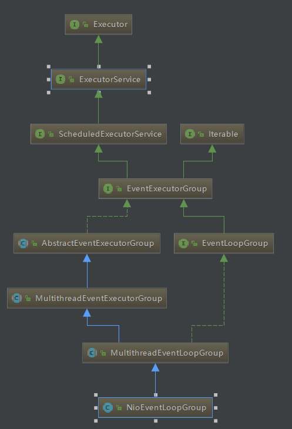

<!-- MarkdownTOC -->

- [BIO,NIO和AIO的区别](#bionio和aio的区别)
- [NIO的组成](#nio的组成)
- [Netty的特点](#netty的特点)
- [Netty的线程模型](#netty的线程模型)
- [TCP粘包/拆包的原因及解决方法](#tcp粘包拆包的原因及解决方法)
- [了解哪几种序列化协议](#了解哪几种序列化协议)
    - [概念](#概念)
    - [影响序列化性能的关键因素](#影响序列化性能的关键因素)
    - [Java默认提供的序列化](#java默认提供的序列化)
    - [其他序列化方法](#其他序列化方法)
        - [XML](#xml)
        - [JSON](#json)
        - [Fastjson](#fastjson)
        - [Thrift](#thrift)
        - [Avro](#avro)
        - [Protobuf](#protobuf)
    - [其它](#其它)
- [如何选择序列化协议](#如何选择序列化协议)
- [Netty的零拷贝实现](#netty的零拷贝实现)
- [Netty的高性能表现在哪些方面](#netty的高性能表现在哪些方面)
- [NIOEventLoopGroup源码](#nioeventloopgroup源码)
    - [概念](#概念-1)
    - [NioEventLoopGroup类图](#nioeventloopgroup类图)
    - [构造方法](#构造方法)

<!-- /MarkdownTOC -->


#BIO,NIO和AIO的区别
- BIO:一个连接一个线程,客户端有连接请求时服务器端就需要启动一个线程进行处理。线程开销大。
- 伪异步IO：将请求连接放入线程池，一对多，但线程还是很宝贵的资源。
- NIO：一个请求一个线程，但客户端发送的连接请求都会注册到多路复用器上，多路复用器轮询到连接有I/O请求时才启动一个线程进行处理。
- AIO:一个有效请求一个线程,客户端的I/O请求都是由OS先完成了再通知服务器应用去启动线程进行处理
- BIO是面向流的，NIO是面向缓冲区的；BIO的各种流是阻塞的。而NIO是非阻塞的；BIO的Stream是单向的，而NIO的channel是双向的。
- NIO的特点：事件驱动模型、单线程处理多任务、非阻塞I/O，I/O读写不再阻塞，而是返回0、基于block的传输比基于流的传输更高效、更高级的IO函数zero-copy、IO多路复用大大提高了Java网络应用的可伸缩性和实用性。基于Reactor线程模型。
- 在Reactor模式中，事件分发器等待某个事件或者可应用或个操作的状态发生，事件分发器就把这个事件传给事先注册的事件处理函数或者回调函数，由后者来做实际的读写操作。如在Reactor中实现读：注册读就绪事件和相应的事件处理器、事件分发器等待事件、事件到来，激活分发器，分发器调用事件对应的处理器、事件处理器完成实际的读操作，处理读到的数据，注册新的事件，然后返还控制权。

#NIO的组成
- Buffer：与Channel进行交互，数据是从Channel读入缓冲区，从缓冲区写入Channel中的
    - flip方法：反转此缓冲区，将position给limit，然后将position置为0，其实就是切换读写模式
    - clear方法 ：清除此缓冲区，将position置为0，把capacity的值给limit
    - rewind方法 ： 重绕此缓冲区，将position置为0
- DirectByteBuffer可减少一次系统空间到用户空间的拷贝。但Buffer创建和销毁的成本更高，不可控，通常会用内存池来提高性能。直接缓冲区主要分配给那些易受基础系统的本机I/O 操作影响的大型、持久的缓冲区。如果数据量比较小的中小应用情况下，可以考虑使用heapBuffer，由JVM进行管理。
- Channel：表示 IO 源与目标打开的连接，是双向的，但不能直接访问数据，只能与Buffer进行交互。通过源码可知，FileChannel的read方法和write方法都导致数据复制了两次！
- Selector可使一个单独的线程管理多个Channel，open方法可创建Selector，register方法向多路复用器器注册通道，可以监听的事件类型：读、写、连接、accept。注册事件后会产生一个SelectionKey：它表示SelectableChannel 和Selector 之间的注册关系，wakeup方法：使尚未返回的第一个选择操作立即返回，唤醒的原因是：注册了新的channel或者事件；channel关闭，取消注册；优先级更高的事件触发（如定时器事件），希望及时处理。
- Selector在Linux的实现类是EPollSelectorImpl,委托给EPollArrayWrapper实现,其中三个native方法是对epoll的封装,而EPollSelectorImpl.implRegister方法,通过调用epoll_ctl向epoll实例中注册事件,还将注册的文件描述符（fd）与SelectionKey的对应关系添加到fdToKey中，这个map维护了文件描述符与SelectionKey的映射。
- fdToKey有时会变得非常大，因为注册到Selector上的Channel非常多（百万连接）；过期或失效的Channel没有及时关闭。fdToKey总是串行读取的，而读取是在select方法中进行的，该方法是非线程安全的。
- Pipe：两个线程之间的单向数据连接，数据会被写到sink通道，从source通道读取
- NIO的服务端建立过程：Selector.open()：打开一个Selector；ServerSocketChannel.open()：创建服务端的Channel；bind()：绑定到某个端口上。并配置非阻塞模式；register()：注册Channel和关注的事件到Selector上；select()轮询拿到已经就绪的事件

#Netty的特点
- 一个高性能、异步事件驱动的NIO框架，它提供了对TCP、UDP和文件传输的支持
- 使用更高效的socket底层，对epoll空轮询引起的cpu占用飙升在内部进行了处理，避免了直接使用NIO的陷阱，简化了NIO的处理方式。
- 采用多种decoder/encoder 支持，对TCP粘包/分包进行自动化处理
- 可使用接受/处理线程池，提高连接效率，对重连、心跳检测的简单支持
- 可配置IO线程数、TCP参数，TCP接收和发送缓冲区使用直接内存代替堆内存，通过内存池的方式循环利用ByteBuf
- 通过引用计数器及时申请释放不再引用的对象，降低了GC频率
- 使用单线程串行化的方式，高效的Reactor线程模型
- 大量使用了volitale、使用了CAS和原子类、线程安全类的使用、读写锁的使用

#Netty的线程模型
- Netty通过Reactor模型基于多路复用器接收并处理用户请求，内部实现了两个线程池，boss线程池和work线程池，其中boss线程池的线程负责处理请求的accept事件，当接收到accept事件的请求时，把对应的socket封装到一个NioSocketChannel中，并交给work线程池，其中work线程池负责请求的read和write事件，由对应的Handler处理。
- 单线程模型：所有I/O操作都由一个线程完成，即多路复用、事件分发和处理都是在一个Reactor线程上完成的。既要接收客户端的连接请求,向服务端发起连接，又要发送/读取请求或应答/响应消息。一个NIO 线程同时处理成百上千的链路，性能上无法支撑，速度慢，若线程进入死循环，整个程序不可用，对于高负载、大并发的应用场景不合适。
- 多线程模型：有一个NIO 线程（Acceptor） 只负责监听服务端，接收客户端的TCP连接请求；NIO 线程池负责网络IO的操作，即消息的读取、解码、编码和发送；1个NIO线程可以同时处理N条链路，但是1 个链路只对应1 个NIO线程，这是为了防止发生并发操作问题。但在并发百万客户端连接或需要安全认证时，一个Acceptor 线程可能会存在性能不足问题。
- 主从多线程模型：Acceptor线程用于绑定监听端口，接收客户端连接，将SocketChannel从主线程池的Reactor 线程的多路复用器上移除，重新注册到Sub线程池的线程上，用于处理I\O的读写等操作，从而保证mainReactor只负责接入认证、握手等操作；

#TCP粘包/拆包的原因及解决方法
- TCP是以流的方式来处理数据，一个完整的包可能会被TCP拆分成多个包进行发送，也可能把小的封装成一个大的数据包发送。
- TCP粘包/分包的原因：
    - 应用程序写入的字节大小大于套接字发送缓冲区的大小，会发生拆包现象，而应用程序写入数据小于套接字缓冲区大小，网卡将应用多次写入的数据发送到网络上，这将会发生粘包现象
    - 进行MSS大小的TCP分段，当TCP报文长度-TCP头部长度>MSS的时候将发生拆包
    - 以太网帧的payload（净荷）大于MTU（1500字节）进行ip分片
- 解决方法
    - 消息定长：FixedLengthFrameDecoder类
    - 包尾增加特殊字符分割：行分隔符类：LineBasedFrameDecoder或自定义分隔符类：DelimiterBasedFrameDecoder
    - 将消息分为消息头和消息体：LengthFieldBasedFrameDecoder类。分为有头部的拆包与粘包、长度字段在前且有头部的拆包与粘包、多扩展头部的拆包与粘包。

#了解哪几种序列化协议
##概念
序列化（编码）是将对象序列化为二进制形式（字节数组），主要用于网络传输、数据持久化等；而反序列化（解码）则是将从网络、磁盘等读取的字节数组还原成原始对象，主要用于网络传输对象的解码，以便完成远程调用。
##影响序列化性能的关键因素
- 序列化后的码流大小（网络带宽的占用）
- 序列化的性能（CPU资源占用）
- 是否支持跨语言（异构系统的对接和开发语言切换）

##Java默认提供的序列化
无法跨语言、序列化后的码流太大、序列化的性能差
##其他序列化方法
###XML
优点:人机可读性好，可指定元素或特性的名称。

缺点：序列化数据只包含数据本身以及类的结构，不包括类型标识和程序集信息；只能序列化公共属性和字段；不能序列化方法；文件庞大，文件格式复杂，传输占带宽。适用场景：当做配置文件存储数据，实时数据转换
###JSON
JSON，是一种轻量级的数据交换格式。
优点：兼容性高、数据格式比较简单，易于读写、序列化后数据较小，可扩展性好，兼容性好、与XML相比，其协议比较简单，解析速度比较快。

缺点：数据的描述性比XML差、不适合性能要求为ms级别的情况、额外空间开销比较大。适用场景(可替代ＸＭＬ):跨防火墙访问、可调式性要求高、基于Web browser的Ajax请求、传输数据量相对小，实时性要求相对低（例如秒级别）的服务。
###Fastjson
采用一种“假定有序快速匹配”的算法

优点：接口简单易用、目前java语言中最快的json库。

缺点：过于注重快，而偏离了“标准”及功能性、代码质量不高，文档不全。适用场景：协议交互、Web输出、Android客户端
###Thrift
不仅是序列化协议，还是一个RPC框架

优点：序列化后的体积小, 速度快、支持多种语言和丰富的数据类型、对于数据字段的增删具有较强的兼容性、支持二进制压缩编码。

缺点：使用者较少、跨防火墙访问时，不安全、不具有可读性，调试代码时相对困难、不能与其他传输层协议共同使用（例如HTTP）、无法支持向持久层直接读写数据，即不适合做数据持久化序列化协议。适用场景：分布式系统的RPC解决方案
###Avro
Hadoop的一个子项目，解决了JSON的冗长和没有IDL的问题

优点：支持丰富的数据类型、简单的动态语言结合功能、具有自我描述属性、提高了数据解析速度、快速可压缩的二进制数据形式、可以实现远程过程调用RPC、支持跨编程语言实现。

缺点：对于习惯于静态类型语言的用户不直观。适用场景：在Hadoop中做Hive、Pig和MapReduce的持久化数据格式
###Protobuf
将数据结构以.proto文件进行描述，通过代码生成工具可以生成对应数据结构的POJO对象和Protobuf相关的方法和属性

优点：序列化后码流小，性能高、结构化数据存储格式（XML JSON等）、通过标识字段的顺序，可以实现协议的前向兼容、结构化的文档更容易管理和维护。

缺点：需要依赖于工具生成代码、支持的语言相对较少，官方只支持Java 、C++ 、python。适用场景：对性能要求高的RPC调用、具有良好的跨防火墙的访问属性、适合应用层对象的持久化
##其它
- protostuff 基于protobuf协议，但不需要配置proto文件，直接导包即可
- Jboss marshaling 可以直接序列化java类， 无须实java.io.Serializable接口
- Message pack 一个高效的二进制序列化格式
- Hessian 采用二进制协议的轻量级remoting onhttp工具
- kryo 基于protobuf协议，只支持java语言,需要注册（Registration），然后序列化（Output），反序列化（Input）

#如何选择序列化协议
- 具体场景
    - 对于公司间的系统调用，如果性能要求在100ms以上的服务，基于XML的SOAP协议是一个值得考虑的方案
    - 基于Web browser的Ajax，以及Mobile app与服务端之间的通讯，JSON协议是首选。对于性能要求不太高，或者以动态类型语言为主，或者传输数据载荷很小的的运用场景，JSON也是非常不错的选择
    - 对于调试环境比较恶劣的场景，采用JSON或XML能够极大的提高调试效率，降低系统开发成本
    - 当对性能和简洁性有极高要求的场景，Protobuf，Thrift，Avro之间具有一定的竞争关系
    - 对于T级别的数据的持久化应用场景，Protobuf和Avro是首要选择。如果持久化后的数据存储在hadoop子项目里，Avro会是更好的选择
    - 对于持久层非Hadoop项目，以静态类型语言为主的应用场景，Protobuf会更符合静态类型语言工程师的开发习惯。由于Avro的设计理念偏向于动态类型语言，对于动态语言为主的应用场景，Avro是更好的选择
    - 如果需要提供一个完整的RPC解决方案，Thrift是一个好的选择
    - 如果序列化之后需要支持不同的传输层协议，或者需要跨防火墙访问的高性能场景，Protobuf可以优先考虑
- protobuf的数据类型有多种：bool、double、float、int32、int64、string、bytes、enum、message。protobuf的限定符：required:必须赋值，不能为空、optional:字段可以赋值，也可以不赋值、repeated:该字段可以重复任意次数（包括0次）、枚举；只能用指定的常量集中的一个值作为其值
- protobuf的基本规则：每个消息中必须至少留有一个required类型的字段、包含0个或多个optional类型的字段；repeated表示的字段可以包含0个或多个数据；[1,15]之内的标识号在编码的时候会占用一个字节（常用），[16,2047]之内的标识号则占用2个字节，标识号一定不能重复、使用消息类型，也可以将消息嵌套任意多层，可用嵌套消息类型来代替组
- protobuf的消息升级原则：不要更改任何已有的字段的数值标识；不能移除已经存在的required字段，optional和repeated类型的字段可以被移除，但要保留标号不能被重用。新添加的字段必须是optional或repeated。因为旧版本程序无法读取或写入新增的required限定符的字段
- 编译器为每一个消息类型生成了一个.java文件,以及一个特殊的Builder类(该类是用来创建消息类接口的).如：UserProto.User.Builder builder=UserProto.User.newBuilder();builder.build()；
- Netty中的使用：ProtobufVarint32FrameDecoder是用于处理半包消息的解码类；ProtobufDecoder(UserProto.User.getDefaultInstance())这是创建的UserProto.java文件中的解码类；ProtobufVarint32LengthFieldPrepender 对protobuf协议的消息头上加上一个长度为32的整形字段，用于标志这个消息的长度的类；ProtobufEncoder 是编码类
- 将StringBuilder转换为ByteBuf类型：copiedBuffer()方法

#Netty的零拷贝实现
- Netty的接收和发送ByteBuffer采用DIRECT BUFFERS，使用堆外直接内存进行Socket读写，不需要进行字节缓冲区的二次拷贝。堆内存多了一次内存拷贝，JVM会将堆内存Buffer拷贝一份到直接内存中，然后才写入Socket中。ByteBuffer由ChannelConfig分配，而ChannelConfig创建ByteBufAllocator默认使用Direct Buffer
- CompositeByteBuf 类可以将多个 ByteBuf 合并为一个逻辑上的 ByteBuf,避免了传统通过内存拷贝的方式将几个小Buffer合并成一个大的Buffer。addComponents方法将header与body合并为一个逻辑上的ByteBuf,这两个ByteBuf在CompositeByteBuf内部都是单独存在的,CompositeByteBuf 只是逻辑上是一个整体
- 通过 FileRegion包装的FileChannel.tranferTo方法实现文件传输,可以直接将文件缓冲区的数据发送到目标 Channel，避免了传统通过循环write方式导致的内存拷贝问题
- 通过 wrap方法, 我们可以将 byte[] 数组、ByteBuf、ByteBuffer等包装成一个 Netty ByteBuf 对象, 进而避免了拷贝操作
- Selector BUG：若Selector的轮询结果为空，也没有wakeup或新消息处理，则发生空轮询，CPU使用率100%
- Netty的解决办法：对Selector的select操作周期进行统计，每完成一次空的select操作进行一次计数，若在某个周期内连续发生N次空轮询，则触发了epoll死循环bug。重建Selector，判断是否是其他线程发起的重建请求，若不是则将原SocketChannel从旧的Selector上去除注册，重新注册到新的Selector上，并将原来的Selector关闭

#Netty的高性能表现在哪些方面
- 心跳，对服务端：会定时清除闲置会话inactive(netty5)，对客户端:用来检测会话是否断开，是否重来，检测网络延迟，其中idleStateHandler类 用来检测会话状态
- 串行无锁化设计，即消息的处理尽可能在同一个线程内完成，期间不进行线程切换，这样就避免了多线程竞争和同步锁。表面上看，串行化设计似乎CPU利用率不高，并发程度不够。但是，通过调整NIO线程池的线程参数，可以同时启动多个串行化的线程并行运行，这种局部无锁化的串行线程设计相比一个队列-多个工作线程模型性能更优
- 可靠性，链路有效性检测：链路空闲检测机制，读/写空闲超时机制；内存保护机制：通过内存池重用ByteBuf;ByteBuf的解码保护；优雅停机：不再接收新消息、退出前的预处理操作、资源的释放操作
- Netty安全性：支持的安全协议：SSL V2和V3，TLS，SSL单向认证、双向认证和第三方CA认证
- 高效并发编程的体现：volatile的大量、正确使用；CAS和原子类的广泛使用；线程安全容器的使用；通过读写锁提升并发性能。IO通信性能三原则：传输（AIO）、协议（Http）、线程（主从多线程）
- 流量整型的作用（变压器）：防止由于上下游网元性能不均衡导致下游网元被压垮，业务流中断；防止由于通信模块接受消息过快，后端业务线程处理不及时导致撑死问题
- TCP参数配置：SO_RCVBUF和SO_SNDBUF：通常建议值为128K或者256K；SO_TCPNODELAY：NAGLE算法通过将缓冲区内的小封包自动相连，组成较大的封包，阻止大量小封包的发送阻塞网络，从而提高网络应用效率。但是对于时延敏感的应用场景需要关闭该优化算法

#NIOEventLoopGroup源码
##概念
NioEventLoopGroup可以理解为一个线程池，内部维护了一组线程，每个线程负责处理多个Channel上的事件，而一个Channel只对应于一个线程，这样可以回避多线程下的数据同步问题
##NioEventLoopGroup类图

##构造方法
new NioEventLoopGroup()方法会调用到MultithreadEventLoopGroup的构造方法
```java
private static final int DEFAULT_EVENT_LOOP_THREADS;

    static {
        DEFAULT_EVENT_LOOP_THREADS = Math.max(1, SystemPropertyUtil.getInt(
                "io.netty.eventLoopThreads", NettyRuntime.availableProcessors() * 2));//默认值为系统core数的两倍

        if (logger.isDebugEnabled()) {
            logger.debug("-Dio.netty.eventLoopThreads: {}", DEFAULT_EVENT_LOOP_THREADS);
        }
    }

    /**
     * @see MultithreadEventExecutorGroup#MultithreadEventExecutorGroup(int, Executor, Object...)
     */
    protected MultithreadEventLoopGroup(int nThreads, Executor executor, Object... args) {
        super(nThreads == 0 ? DEFAULT_EVENT_LOOP_THREADS : nThreads, executor, args);//如果采用无参的构造函数，传入的nThreads变量为0，此时线程数会被设置为系统core数*2
    }
```
然后会调用MultithreadEventExecutorGroup的构造方法
```java
/**
     * Create a new instance.
     *
     * @param nThreads          the number of threads that will be used by this instance.
     * @param executor          the Executor to use, or {@code null} if the default should be used.
     * @param chooserFactory    the {@link EventExecutorChooserFactory} to use.
     * @param args              arguments which will passed to each {@link #newChild(Executor, Object...)} call
     */
    protected MultithreadEventExecutorGroup(int nThreads, Executor executor,
                                            EventExecutorChooserFactory chooserFactory, Object... args) {
        if (nThreads <= 0) {
            throw new IllegalArgumentException(String.format("nThreads: %d (expected: > 0)", nThreads));
        }

        if (executor == null) {
            executor = new ThreadPerTaskExecutor(newDefaultThreadFactory());
        }

        children = new EventExecutor[nThreads];//设定线程池大小

        for (int i = 0; i < nThreads; i ++) {
            boolean success = false;
            try {
                children[i] = newChild(executor, args);//新建nThreads个子线程
                success = true;
            } catch (Exception e) {
                // TODO: Think about if this is a good exception type
                throw new IllegalStateException("failed to create a child event loop", e);
            } finally {
                if (!success) {//如果新建子线程的过程中出错，则关闭所有子线程
                    for (int j = 0; j < i; j ++) {
                        children[j].shutdownGracefully();
                    }

                    for (int j = 0; j < i; j ++) {
                        EventExecutor e = children[j];
                        try {
                            while (!e.isTerminated()) {
                                e.awaitTermination(Integer.MAX_VALUE, TimeUnit.SECONDS);
                            }
                        } catch (InterruptedException interrupted) {
                            // Let the caller handle the interruption.
                            Thread.currentThread().interrupt();
                            break;
                        }
                    }
                }
            }
        }

        chooser = chooserFactory.newChooser(children);//设定新任务的分配策略

        final FutureListener<Object> terminationListener = new FutureListener<Object>() {//注册一些回调函数用于清理工作
            @Override
            public void operationComplete(Future<Object> future) throws Exception {
                if (terminatedChildren.incrementAndGet() == children.length) {
                    terminationFuture.setSuccess(null);
                }
            }
        };

        for (EventExecutor e: children) {
            e.terminationFuture().addListener(terminationListener);
        }

        Set<EventExecutor> childrenSet = new LinkedHashSet<EventExecutor>(children.length);
        Collections.addAll(childrenSet, children);
        readonlyChildren = Collections.unmodifiableSet(childrenSet);
    }
```
其中比较重要的地方有两处：调用子类实现的newChild方法设置子线程，以及设置新任务的分配策略

先看一下NioEventLoopGroup中实现的newChild方法:
```java
@Override
    protected EventLoop newChild(Executor executor, Object... args) throws Exception {
        return new NioEventLoop(this, executor, (SelectorProvider) args[0],
            ((SelectStrategyFactory) args[1]).newSelectStrategy(), (RejectedExecutionHandler) args[2]);
    }
```
很简单的新建一个NioEventLoop对象并返回，我们下一节会介绍NioEventLoop

而chooserFactory.newChooser最终会跳转到DefaultEventExecutorChooserFactory里
```java
@SuppressWarnings("unchecked")
    @Override
    public EventExecutorChooser newChooser(EventExecutor[] executors) {
        if (isPowerOfTwo(executors.length)) {
            return new PowerOfTwoEventExecutorChooser(executors);
        } else {
            return new GenericEventExecutorChooser(executors);
        }
    }

    private static boolean isPowerOfTwo(int val) {
        return (val & -val) == val;
    }
```