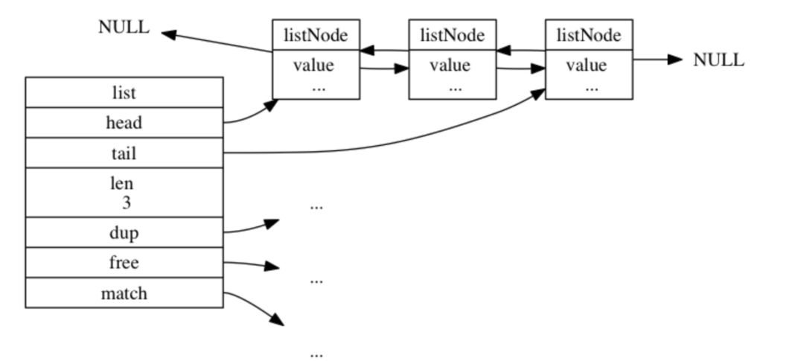
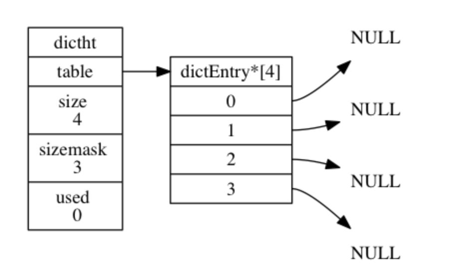
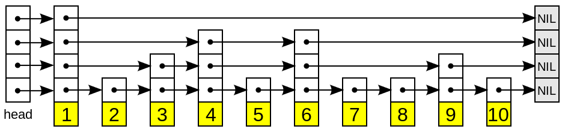
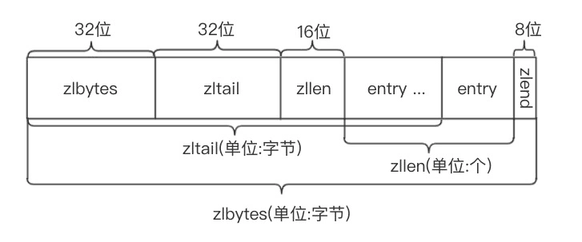
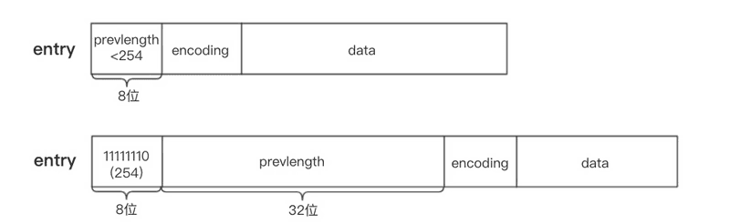

# NoSql
### NoSQL数据库的分类
1. 键值(key-value)存储 redis
2. 列存储
3. 文档数据库 mangoDB
4. 图形数据库 InfiniteGraph

## NoSQL的特点
- 易扩展
- 灵活的数据类型
- 大数据量 高性能
- 高可用

### redis概述
- 字符串类型 String
- 列表类型 list
- 有序集合类型 sorted set
- 散列类型 hash
- 集合类型 set

### redis应用场景
- 缓存
- 任务队列
- 应用排行榜
- 网站访问统计
- 数据过期处理
- 分布式集群架构中的分离

### jedis在java中的使用
```JAVA
/*
单实例模式
1. 导包
2. 打开客户端
3. 设置键值对
4. 取出键值对
5. 关闭客户端
*/
public void jedisDemo(){
    Jedis jedis = new Jedis("192.168.1.1",4379);
    jedis.set("name","周健伟");
    String value = jedis.get("name");
    System.out.println(value);//这里打印"周健伟"
    jedis.close();
}
/*
连接池模式
*/
public void jedisPool(){
    // 1. 获得jedis连接池的配置对象
    JedisPoolConfig config = new JedisPoolConfig();
    // 2. 设置最大连接数
    config.setMaxTotal(30);
    // 3. 设置最大空闲连接数
    config.setMaxIdle(10);
    // 4. 获得连接池
    JedisPool pool = new JedisPool(config,"192.168.1.1",4379);
    Jedis jedis = null;
    try{
        // 5. 通过连接池获得连接
        jedis = pool.getResource();
        // 6. 设置数据
        jedis.set("name","周健伟");
        // 7. 获得数据
        String value = jedis.get("name");
        System.out.println(value);//这里打印"周健伟"
        }catch(Exception e){
            e.printStackTrace();
        }finally{
            if(jedis != null) jedis.close();
            if(pool != null) pool.close();
        }
}
```

# redis持久化
### RDB方式
### AOF方式

# redis分布式锁
说道Redis分布式锁大部分人都会想到：setnx+lua，或者知道set key value px milliseconds nx。后一种方式的核心实现命令如下：
```SHELL
- 获取锁（unique_value可以是UUID等）
SET resource_name unique_value NX PX 30000

- 释放锁（lua脚本中，一定要比较value，防止误解锁）
if redis.call("get",KEYS[1]) == ARGV[1] then
    return redis.call("del",KEYS[1])
else
    return 0
end
```

这种实现方式有3大要点（也是面试概率非常高的地方）：

1. set命令要用set key value px milliseconds nx；
2. value要具有唯一性；
3. 释放锁时要验证value值，不能误解锁；

事实上这类琐最大的缺点就是它加锁时只作用在一个Redis节点上，即使Redis通过sentinel保证高可用，如果这个master节点由于某些原因发生了主从切换，那么就会出现锁丢失的情况：

1. 在Redis的master节点上拿到了锁；
2. 但是这个加锁的key还没有同步到slave节点；
3. master故障，发生故障转移，slave节点升级为master节点;
4. 导致锁丢失。

正因为如此，Redis作者antirez基于分布式环境下提出了一种更高级的分布式锁的实现方式：Redlock。笔者认为，Redlock也是Redis所有分布式锁实现方式中唯一能让面试官高潮的方式。

### Redlock实现
在Redis的分布式环境中，我们假设有N个Redis master。这些节点完全互相独立，不存在主从复制或者其他集群协调机制。我们确保将在N个实例上使用与在Redis单实例下相同方法获取和释放锁。现在我们假设有5个Redis master节点，同时我们需要在5台服务器上面运行这些Redis实例，这样保证他们不会同时都宕掉。

为了取到锁，客户端应该执行以下操作:

1. 获取当前Unix时间，以毫秒为单位
2. 依次尝试从5个实例，使用相同的key和具有唯一性的value（例如UUID）获取锁。当向Redis请求获取锁时，客户端应该设置一个网络连接和响应超时时间，这个超时时间应该小于锁的失效时间。例如你的锁自动失效时间为10秒，则超时时间应该在5-50毫秒之间。这样可以避免服务器端Redis已经挂掉的情况下，客户端还在死死地等待响应结果。如果服务器端没有在规定时间内响应，客户端应该尽快尝试去另外一个Redis实例请求获取锁。
3. 客户端使用当前时间减去开始获取锁时间（步骤1记录的时间）就得到获取锁使用的时间。当且仅当从大多数（N/2+1，这里是3个节点）的Redis节点都取到锁，并且使用的时间小于锁失效时间时，锁才算获取成功。
4. 如果取到了锁，key的真正有效时间等于有效时间减去获取锁所使用的时间（步骤3计算的结果）。
5. 如果因为某些原因，获取锁失败（没有在至少N/2+1个Redis实例取到锁或者取锁时间已经超过了有效时间），客户端应该在所有的Redis实例上进行解锁（即便某些Redis实例根本就没有加锁成功，防止某些节点获取到锁但是客户端没有得到响应而导致接下来的一段时间不能被重新获取锁）。

### Redlock源码
redisson已经有对redlock算法封装，接下来对其用法进行简单介绍，并对核心源码进行分析（假设5个redis实例）。

- POM依赖
```XML
<!-- https://mvnrepository.com/artifact/org.redisson/redisson -->
<dependency>
    <groupId>org.redisson</groupId>
    <artifactId>redisson</artifactId>
    <version>3.3.2</version>
</dependency>
```

- 用法
首先，我们来看一下redission封装的redlock算法实现的分布式锁用法，非常简单，跟重入锁（ReentrantLock）有点类似：
```JAVA
Config config = new Config();
config.useSentinelServers().addSentinelAddress("127.0.0.1:6369","127.0.0.1:6379", "127.0.0.1:6389")
        .setMasterName("masterName")
        .setPassword("password").setDatabase(0);
RedissonClient redissonClient = Redisson.create(config);
// 还可以getFairLock(), getReadWriteLock()
RLock redLock = redissonClient.getLock("REDLOCK_KEY");
boolean isLock;
try {
    isLock = redLock.tryLock();
    // 500ms拿不到锁, 就认为获取锁失败。10000ms即10s是锁失效时间。
    isLock = redLock.tryLock(500, 10000, TimeUnit.MILLISECONDS);
    if (isLock) {
        //TODO if get lock success, do something;
    }
} catch (Exception e) {
} finally {
    // 无论如何, 最后都要解锁
    redLock.unlock();
}
```

- 唯一ID
实现分布式锁的一个非常重要的点就是set的value要具有唯一性，redisson的value是怎样保证value的唯一性呢？答案是UUID+threadId。入口在redissonClient.getLock("REDLOCK_KEY")，源码在Redisson.java和RedissonLock.java中：
```JAVA
protected final UUID id = UUID.randomUUID();
String getLockName(long threadId) {
    return id + ":" + threadId;
}
```

- 获取锁
获取锁的代码为redLock.tryLock()或者redLock.tryLock(500, 10000, TimeUnit.MILLISECONDS)，两者的最终核心源码都是下面这段代码，只不过前者获取锁的默认租约时间（leaseTime）是LOCK_EXPIRATION_INTERVAL_SECONDS，即30s：
```JAVA
<T> RFuture<T> tryLockInnerAsync(long leaseTime, TimeUnit unit, long threadId, RedisStrictCommand<T> command) {
    internalLockLeaseTime = unit.toMillis(leaseTime);
    // 获取锁时向5个redis实例发送的命令
    return commandExecutor.evalWriteAsync(getName(), LongCodec.INSTANCE, command,
              // 首先分布式锁的KEY不能存在，如果确实不存在，那么执行hset命令（hset REDLOCK_KEY uuid+threadId 1），并通过pexpire设置失效时间（也是锁的租约时间）
              "if (redis.call('exists', KEYS[1]) == 0) then " +
                  "redis.call('hset', KEYS[1], ARGV[2], 1); " +
                  "redis.call('pexpire', KEYS[1], ARGV[1]); " +
                  "return nil; " +
              "end; " +
              // 如果分布式锁的KEY已经存在，并且value也匹配，表示是当前线程持有的锁，那么重入次数加1，并且设置失效时间
              "if (redis.call('hexists', KEYS[1], ARGV[2]) == 1) then " +
                  "redis.call('hincrby', KEYS[1], ARGV[2], 1); " +
                  "redis.call('pexpire', KEYS[1], ARGV[1]); " +
                  "return nil; " +
              "end; " +
              // 获取分布式锁的KEY的失效时间毫秒数
              "return redis.call('pttl', KEYS[1]);",
              // 这三个参数分别对应KEYS[1]，ARGV[1]和ARGV[2]
                Collections.<Object>singletonList(getName()), internalLockLeaseTime, getLockName(threadId));
}
```
获取锁的命令中，

1. KEYS[1]就是Collections.singletonList(getName())，表示分布式锁的key，即REDLOCK_KEY；
2. ARGV[1]就是internalLockLeaseTime，即锁的租约时间，默认30s；
3. ARGV[2]就是getLockName(threadId)，是获取锁时set的唯一值，即UUID+threadId：

- 释放锁
释放锁的代码为redLock.unlock()，核心源码如下：
```JAVA
protected RFuture<Boolean> unlockInnerAsync(long threadId) {
    // 向5个redis实例都执行如下命令
    return commandExecutor.evalWriteAsync(getName(), LongCodec.INSTANCE, RedisCommands.EVAL_BOOLEAN,
            // 如果分布式锁KEY不存在，那么向channel发布一条消息
            "if (redis.call('exists', KEYS[1]) == 0) then " +
                "redis.call('publish', KEYS[2], ARGV[1]); " +
                "return 1; " +
            "end;" +
            // 如果分布式锁存在，但是value不匹配，表示锁已经被占用，那么直接返回
            "if (redis.call('hexists', KEYS[1], ARGV[3]) == 0) then " +
                "return nil;" +
            "end; " +
            // 如果就是当前线程占有分布式锁，那么将重入次数减1
            "local counter = redis.call('hincrby', KEYS[1], ARGV[3], -1); " +
            // 重入次数减1后的值如果大于0，表示分布式锁有重入过，那么只设置失效时间，还不能删除
            "if (counter > 0) then " +
                "redis.call('pexpire', KEYS[1], ARGV[2]); " +
                "return 0; " +
            "else " +
                // 重入次数减1后的值如果为0，表示分布式锁只获取过1次，那么删除这个KEY，并发布解锁消息
                "redis.call('del', KEYS[1]); " +
                "redis.call('publish', KEYS[2], ARGV[1]); " +
                "return 1; "+
            "end; " +
            "return nil;",
            // 这5个参数分别对应KEYS[1]，KEYS[2]，ARGV[1]，ARGV[2]和ARGV[3]
            Arrays.<Object>asList(getName(), getChannelName()), LockPubSub.unlockMessage, internalLockLeaseTime, getLockName(threadId));

}
```

# Redis数据结构底层实现吗？
### 字符串处理(string)
我们都知道redis是用C语言写，但是C语言处理字符串和数组的成本是很高的，下面我分别说几个例子

没有数据结构支撑的几个问题

1. 极其容易造成缓冲区溢出问题，比如用strcat()，在用这个函数之前必须要先给目标变量分配足够的空间，否则就会溢出。
2. 如果要获取字符串的长度，没有数据结构的支撑，可能就需要遍历，它的复杂度是O(N)
3. 内存重分配。C字符串的每次变更(曾长或缩短)都会对数组作内存重分配。同样，如果是缩短，没有处理好多余的空间，也会造成内存泄漏。

Redis自己构建了一种名叫Simple dynamic string(SDS)的数据结构，他分别对这几个问题作了处理。我们先来看看它的结构源码：
```C
struct sdshdr{
     //记录buf数组中已使用字节的数量
     //等于 SDS 保存字符串的长度
     int len;
     //记录 buf 数组中未使用字节的数量
     int free;
     //字节数组，用于保存字符串
     char buf[];
}
```

再来说说它的优点：

1. 开发者不用担心字符串变更造成的内存溢出问题。
2. 常数时间复杂度获取字符串长度len字段。
3. 空间预分配free字段，会默认留够一定的空间防止多次重分配内存。

这就是string的底层实现，更是redis对所有字符串数据的处理方式(SDS会被嵌套到别的数据结构里使用)

### 链表
Redis的链表在双向链表上扩展了头、尾节点、元素数等属性。

__源码__
ListNode节点数据结构：
```C
typedef  struct listNode{
       //前置节点
       struct listNode *prev;
       //后置节点
       struct listNode *next;
       //节点的值
       void *value;  
}listNode
```
链表数据结构：
```C
typedef struct list{
     //表头节点
     listNode *head;
     //表尾节点
     listNode *tail;
     //链表所包含的节点数量
     unsigned long len;
     //节点值复制函数
     void (*free) (void *ptr);
     //节点值释放函数
     void (*free) (void *ptr);
     //节点值对比函数
     int (*match) (void *ptr,void *key);
}list;
```

从上面可以看到，Redis的链表有这几个特点：
1. 可以直接获得头、尾节点。
2. 常数时间复杂度得到链表长度。
3. 是双向链表。

### 字典(Hash)
Redis的Hash，就是在数组+链表的基础上，进行了一些rehash优化等。

__数据结构源码__
哈希表：
```C
typedef struct dictht {
    // 哈希表数组
    dictEntry **table;
    // 哈希表大小
    unsigned long size;
    // 哈希表大小掩码，用于计算索引值
    // 总是等于 size - 1
    unsigned long sizemask;
    // 该哈希表已有节点的数量
    unsigned long used;
} dictht;
```
Hash表节点：
```C
typedef struct dictEntry {
    // 键
    void *key;
    // 值
    union {
        void *val;
        uint64_t u64;
        int64_t s64;
    } v;
    // 指向下个哈希表节点，形成链表
    struct dictEntry *next;  // 单链表结构
} dictEntry;
```
字典：
```C
typedef struct dict {
    // 类型特定函数
    dictType *type;
    // 私有数据
    void *privdata;
    // 哈希表
    dictht ht[2];
    // rehash 索引
    // 当 rehash 不在进行时，值为 -1
    int rehashidx; /* rehashing not in progress if rehashidx == -1 */
} dict;
```
可以看出：

1. Reids的Hash采用链地址法来处理冲突，然后它没有使用红黑树优化。
2. 哈希表节点采用单链表结构。
3. rehash优化。

__它的rehash优化。__     
当哈希表的键对太多或者太少，就需要对哈希表的大小进行调整，redis是如何调整的呢?

1. 我们仔细可以看到dict结构里有个字段dictht ht[2]代表有两个dictht数组。第一步就是为ht[1]哈希表分配空间，大小取决于ht[0]当前使用的情况。
2. 将保存在ht[0]中的数据rehash(重新计算哈希值)到ht[1]上。
3. 当ht[0]中所有键值对都迁移到ht[1]后，释放ht[0]，将ht[1]设置为ht[0]，并ht[1]初始化，为下一次rehash做准备。

__渐进式rehash__
redis处理rehash的流程，但是更细一点的讲，它如何进行数据迁的呢？

这就涉及到了渐进式rehash，redis考虑到大量数据迁移带来的cpu繁忙(可能导致一段时间内停止服务)，所以采用了渐进式rehash的方案。步骤如下：

1. 为ht[1]分配空间，同时持有两个哈希表(一个空表、一个有数据)。
2. 维持一个技术器rehashidx，初始值0。
3. 每次对字典增删改查，会顺带将ht[0]中的数据迁移到ht[1],rehashidx++(注意：ht[0]中的数据是只减不增的)。
4. 直到rehash操作完成，rehashidx值设为-1。

它的好处：采用分而治之的思想，将庞大的迁移工作量划分到每一次CURD中，避免了服务繁忙。

### 跳跃表
这个数据结构是我面试中见过最多的，它其实特别简单。学过的人可能都知道，它和平衡树性能很相似，但为什么不用平衡树而用skipList呢?

__skipList & AVL 之间的选择__

1. 从算法实现难度上来比较，skiplist比平衡树要简单得多。
2. 平衡树的插入和删除操作可能引发子树的调整，逻辑复杂，而skiplist的插入和删除只需要修改相邻节点的指针，操作简单又快速。
3. 查找单个key，skiplist和平衡树的时间复杂度都为O(log n)，大体相当。
4. 在做范围查找的时候，平衡树比skiplist操作要复杂。
5. skiplist和各种平衡树（如AVL、红黑树等）的元素是有序排列的。

可以看到，skipList中的元素是有序的，所以跳跃表在redis中用在有序集合键、集群节点内部数据结构

__源码__

跳跃表节点：
```C
typedef struct zskiplistNode {
    // 后退指针
    struct zskiplistNode *backward;
    // 分值
    double score;
    // 成员对象
    robj *obj;
    // 层
    struct zskiplistLevel {
        // 前进指针
        struct zskiplistNode *forward;
        // 跨度
        unsigned int span;
    } level[];
} zskiplistNode;
```

跳跃表：
```C
typedef struct zskiplist {
    // 表头节点和表尾节点
    struct zskiplistNode *header, *tail;
    // 表中节点的数量
    unsigned long length;
    // 表中层数最大的节点的层数
    int level;
} zskiplist;
```

层(level[]):层，也就是level[]字段，层的数量越多，访问节点速度越快。(因为它相当于是索引，层数越多，它索引就越细，就能很快找到索引值)

前进指针(forward):层中有一个forward字段，用于从表头向表尾方向访问。

跨度(span):用于记录两个节点之间的距离

后退指针(backward):用于从表尾向表头方向访问。

__案例__
```
level0    1---------->5
level1    1---->3---->5
level2    1->2->3->4->5->6->7->8
```
比如我要找键为6的元素，在level0中直接定位到5，然后再往后走一个元素就找到了。

### 整数集合(intset)
Reids对整数存储专门作了优化，intset就是redis用于保存整数值的集合数据结构。当一个结合中只包含整数元素，redis就会用这个来存储。
```C
127.0.0.1:6379[2]> sadd number 1 2 3 4 5 6
(integer) 6
127.0.0.1:6379[2]> object encoding number
"intset"
```

__源码__

intset数据结构：
```C
typedef struct intset {
    // 编码方式
    uint32_t encoding;
    // 集合包含的元素数量
    uint32_t length;
    // 保存元素的数组
    int8_t contents[];
} intset;
```
编码方式(encoding)字段是干嘛用的呢？

- 如果 encoding 属性的值为 INTSET_ENC_INT16 ， 那么 contents 就是一个 int16_t 类型的数组， 数组里的每个项都是一个 int16_t 类型的整数值 （最小值为 -32,768 ，最大值为 32,767 ）。
- 如果 encoding 属性的值为 INTSET_ENC_INT32 ， 那么 contents 就是一个 int32_t 类型的数组， 数组里的每个项都是一个 int32_t 类型的整数值 （最小值为 -2,147,483,648 ，最大值为 2,147,483,647 ）。
- 如果 encoding 属性的值为 INTSET_ENC_INT64 ， 那么 contents 就是一个 int64_t 类型的数组， 数组里的每个项都是一个 int64_t 类型的整数值 （最小值为 -9,223,372,036,854,775,808 ，最大值为 9,223,372,036,854,775,807 ）。

说白了就是根据contents字段来判断用哪个int类型更好，也就是对int存储作了优化。

说到优化，那redis如何作的呢？就涉及到了升级。

__encoding升级__

如果我们有个Int16类型的整数集合，现在要将65535(int32)加进这个集合，int16是存储不下的，所以就要对整数集合进行升级。

它是怎么升级的呢(过程)？

假如现在有2个int16的元素:1和2，新加入1个int32位的元素65535。

- 内存重分配，新加入后应该是3个元素，所以分配3*32-1=95位。
- 选择最大的数65535, 放到(95-32+1, 95)位这个内存段中，然后2放到(95-32-32+1+1, 95-32)位...依次类推。

升级的好处是什么呢？

1. 提高了整数集合的灵活性。
2. 尽可能节约内存(能用小的就不用大的)。

不支持降级

按照上面的例子，如果我把65535又删掉，encoding会不会又回到Int16呢，答案是不会的。官方没有给出理由，我觉得应该是降低性能消耗吧，毕竟调整一次是O(N)的时间复杂度。

### 压缩列表(ziplist)
ziplist是redis为了节约内存而开发的顺序型数据结构。它被用在列表键和哈希键中。一般用于小数据存储。



__源码__

ziplist没有明确定义结构体，这里只作大概的演示。
```C
typedef struct entry {
     /*前一个元素长度需要空间和前一个元素长度*/
    unsigned int prevlengh;
     /*元素内容编码*/
    unsigned char encoding;
     /*元素实际内容*/
    unsigned char *data;
}zlentry;

typedef struct ziplist{
     /*ziplist分配的内存大小*/
     uint32_t zlbytes;
     /*达到尾部的偏移量*/
     uint32_t zltail;
     /*存储元素实体个数*/
     uint16_t zllen;
     /*存储内容实体元素*/
     unsigned char* entry[];
     /*尾部标识*/
     unsigned char zlend;
}ziplist;
```

Entry的分析

entry结构体里面有三个重要的字段：

1. previous_entry_length: 这个字段记录了ziplist中前一个节点的长度，什么意思？就是说通过该属性可以进行指针运算达到表尾向表头遍历，这个字段还有一个大问题下面会讲。
2. encoding:记录了数据类型(int16? string?)和长度。
3. data/content: 记录数据。

连锁更新

previous_entry_length字段的分析

上面有说到，previous_entry_length这个字段存放上个节点的长度，那默认长度给分配多少呢?redis是这样分的，如果前节点长度小于254,就分配1字节，大于的话分配5字节，那问题就来了。

如果前一个节点的长度刚开始小于254字节，后来大于254,那不就存放不下了吗？ 这就涉及到previous_entry_length的更新，但是改一个肯定不行阿，后面的节点内存信息都需要改。所以就需要重新分配内存，然后连锁更新包括该受影响节点后面的所有节点。

除了增加新节点会引发连锁更新、删除节点也会触发。

### 快速列表(quicklist)
一个由ziplist组成的双向链表。但是一个quicklist可以有多个quicklist节点，它很像B树的存储方式。是在redis3.2版本中新加的数据结构，用在列表的底层实现。
表头结构：
```C
typedef struct quicklist {
    //指向头部(最左边)quicklist节点的指针
    quicklistNode *head;
    //指向尾部(最右边)quicklist节点的指针
    quicklistNode *tail;
    //ziplist中的entry节点计数器
    unsigned long count;        /* total count of all entries in all ziplists*/
    //quicklist的quicklistNode节点计数器
    unsigned int len;           /* number of quicklistNodes */
    //保存ziplist的大小，配置文件设定，占16bits
    int fill : 16;              /* fill factor for individual nodes */
    //保存压缩程度值，配置文件设定，占16bits，0表示不压缩
    unsigned int compress : 16; /* depth of end nodes not to compress;0=off */
} quicklist;
```
quicklist节点结构
```C
typedef struct quicklistNode {
    struct quicklistNode *prev;     //前驱节点指针
    struct quicklistNode *next;     //后继节点指针
    //不设置压缩数据参数recompress时指向一个ziplist结构
    //设置压缩数据参数recompress指向quicklistLZF结构
    unsigned char *zl;
    //压缩列表ziplist的总长度
    unsigned int sz;                  /* ziplist size in bytes */
    //ziplist中包的节点数，占16 bits长度
    unsigned int count : 16;          /* count of items in ziplist */
    //表示是否采用了LZF压缩算法压缩quicklist节点，1表示压缩过，2表示没压缩，占2 bits长度
    unsigned int encoding : 2;        /* RAW==1 or LZF==2 */
    //表示一个quicklistNode节点是否采用ziplist结构保存数据，2表示压缩了，1表示没压缩，默认是2，占2bits长度
    unsigned int container : 2;       /* NONE==1 or ZIPLIST==2 */
    //标记quicklist节点的ziplist之前是否被解压缩过，占1bit长度
    //如果recompress为1，则等待被再次压缩
    unsigned int recompress : 1; /* was this node previous compressed? */
    //测试时使用
    unsigned int attempted_compress : 1; /* node can't compress; too small */
    //额外扩展位，占10bits长度
    unsigned int extra : 10; /* more bits to steal for future usage */
} quicklistNode;
```

__相关配置__

在redis.conf中的ADVANCED CONFIG部分：
```
list-max-ziplist-size -2
list-compress-depth 0
```

list-max-ziplist-size参数:

我们来详细解释一下list-max-ziplist-size这个参数的含义。它可以取正值，也可以取负值。

当取正值的时候，表示按照数据项个数来限定每个quicklist节点上的ziplist长度。比如，当这个参数配置成5的时候，表示每个quicklist节点的ziplist最多包含5个数据项。

当取负值的时候，表示按照占用字节数来限定每个quicklist节点上的ziplist长度。这时，它只能取-1到-5这五个值，每个值含义如下：

- -5: 每个quicklist节点上的ziplist大小不能超过64 Kb。（注：1kb => 1024 bytes)
- -4: 每个quicklist节点上的ziplist大小不能超过32 Kb。
- -3: 每个quicklist节点上的ziplist大小不能超过16 Kb。
- -2: 每个quicklist节点上的ziplist大小不能超过8 Kb。（-2是Redis给出的默认值）

list-compress-depth参数:

这个参数表示一个quicklist两端不被压缩的节点个数。注：这里的节点个数是指quicklist双向链表的节点个数，而不是指ziplist里面的数据项个数。实际上，一个quicklist节点上的ziplist，如果被压缩，就是整体被压缩的。

参数list-compress-depth的取值含义如下：

- 0: 是个特殊值，表示都不压缩。这是Redis的默认值。 
- 1: 表示quicklist两端各有1个节点不压缩，中间的节点压缩。 
- 2: 表示quicklist两端各有2个节点不压缩，中间的节点压缩。 
- 3: 表示quicklist两端各有3个节点不压缩，中间的节点压缩。 
- 依此类推…
