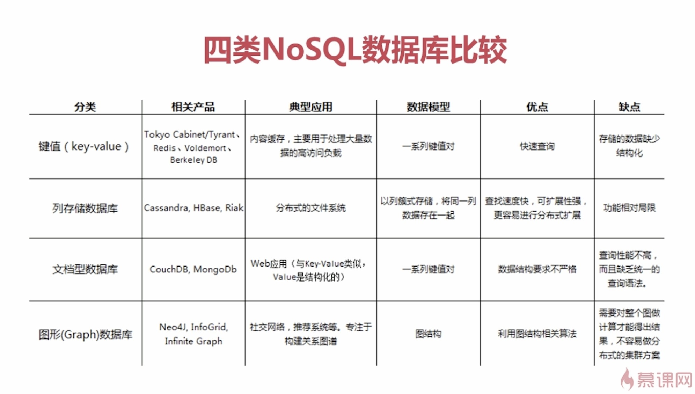

# NoSql
### NoSQL数据库的分类
1. 键值(key-value)存储 redis
2. 列存储
3. 文档数据库 mangoDB
4. 图形数据库 InfiniteGraph

## NoSQL的特点
- 易扩展
- 灵活的数据类型
- 大数据量 高性能
- 高可用

### redis概述
- 字符串类型 String
- 列表类型 list
- 有序集合类型 sorted set
- 散列类型 hash
- 集合类型 set

### redis应用场景
- 缓存
- 任务队列
- 应用排行榜
- 网站访问统计
- 数据过期处理
- 分布式集群架构中的分离

### jedis在java中的使用
```JAVA
/*
单实例模式
1. 导包
2. 打开客户端
3. 设置键值对
4. 取出键值对
5. 关闭客户端
*/
public void jedisDemo(){
    Jedis jedis = new Jedis("192.168.1.1",4379);
    jedis.set("name","周健伟");
    String value = jedis.get("name");
    System.out.println(value);//这里打印"周健伟"
    jedis.close();
}
/*
连接池模式
*/
public void jedisPool(){
    // 1. 获得jedis连接池的配置对象
    JedisPoolConfig config = new JedisPoolConfig();
    // 2. 设置最大连接数
    config.setMaxTotal(30);
    // 3. 设置最大空闲连接数
    config.setMaxIdle(10);
    // 4. 获得连接池
    JedisPool pool = new JedisPool(config,"192.168.1.1",4379);
    Jedis jedis = null;
    try{
        // 5. 通过连接池获得连接
        jedis = pool.getResource();
        // 6. 设置数据
        jedis.set("name","周健伟");
        // 7. 获得数据
        String value = jedis.get("name");
        System.out.println(value);//这里打印"周健伟"
        }catch(Exception e){
            e.printStackTrace();
        }finally{
            if(jedis != null) jedis.close();
            if(pool != null) pool.close();
        }
}
```

# redis持久化
### RDB方式
### AOF方式
